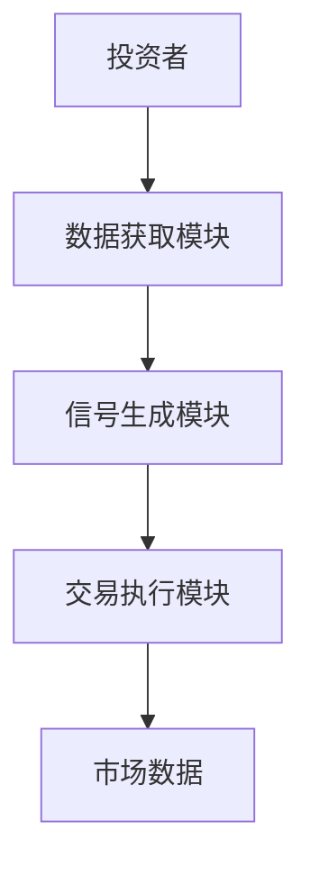

                 


# 如何利用特价股票策略进行系统性风险对冲

---

## 关键词：
特价股票、系统性风险、风险对冲、投资策略、股票交易

---

## 摘要：
在股票市场中，系统性风险是投资者无法避免的重要风险之一。本文将探讨如何利用特价股票策略进行系统性风险的对冲。通过分析特价股票的特点、系统性风险的来源，以及两者之间的关联，本文详细阐述了如何通过数学模型和算法设计，将特价股票策略应用于风险对冲的实际操作中。文章还结合了项目实战和系统架构设计，为读者提供了全面的解决方案和实践指导。

---

## 第一部分：背景介绍

### 第1章：特价股票策略与系统性风险概述

#### 1.1 特价股票策略的定义与特点
- **1.1.1 特价股票的定义**  
  特价股票是指那些价格显著低于市场平均水平的股票，通常出现在市场波动剧烈或经济下行时期。这些股票可能因公司基本面问题或市场情绪影响而被低估，但具备较高的潜在回升空间。

- **1.1.2 特价股票的特点**  
  - 价格低廉：相对于市场指数或行业平均水平，特价股票的价格处于较低位。
  - 高波动性：这类股票的价格波动通常较大，市场情绪的变化对其影响显著。
  - 周期性：特价股票往往出现在市场低迷时期，随着市场回暖而回升。

- **1.1.3 特价股票在投资中的作用**  
  特价股票为投资者提供了在市场底部布局的机会，能够以较低成本买入潜在回报高的资产，同时在市场反弹时获得超额收益。

#### 1.2 系统性风险的定义与来源
- **1.2.1 系统性风险的定义**  
  系统性风险是指影响整个市场的风险，通常由宏观经济因素、政策变化或全球性事件引起，无法通过分散投资来完全消除。

- **1.2.2 系统性风险的主要来源**  
  - 经济衰退：整体经济下行导致企业盈利下降，股市整体走低。
  - 政治事件：地缘政治冲突、政策变化等可能引发市场恐慌。
  - 市场流动性危机：市场资金短缺导致资产价格普遍下跌。

- **1.2.3 系统性风险与非系统性风险的区别**  
  系统性风险影响所有资产，而非系统性风险仅影响特定资产或行业。因此，系统性风险对整个市场的冲击更大，难以通过单一资产配置来对冲。

#### 1.3 特价股票策略在系统性风险对冲中的必要性
- **1.3.1 系统性风险对冲的必要性**  
  在市场出现系统性风险时，投资者需要采取措施降低整体投资组合的损失，避免因市场整体下跌而导致的重大损失。

- **1.3.2 特价股票策略如何对冲系统性风险**  
  通过在市场底部买入特价股票，投资者可以在市场反弹时获得收益，从而对冲因市场下跌带来的损失。这种策略利用了市场周期性波动的特点，能够在系统性风险发生时提供一定的保护。

- **1.3.3 特价股票策略的局限性**  
  - 风险较高：特价股票的价格波动较大，存在进一步下跌的可能性。
  - 需要市场反转：策略的有效性依赖于市场后续的反弹，如果市场持续低迷，策略可能失效。

---

## 第二部分：核心概念与联系

### 第2章：特价股票策略与系统性风险对冲的核心原理

#### 2.1 特价股票策略的核心原理
- **市场择时**：在市场低点买入，市场高点卖出。
- **价值投资**：寻找被市场低估的股票，长期持有等待价值回归。

#### 2.2 系统性风险对冲的核心原理
- **风险对冲**：通过做空指数或其他金融衍生品，对冲市场整体下跌的风险。
- **分散投资**：通过投资不同行业的股票，降低特定行业风险的影响。

#### 2.3 特价股票策略与系统性风险对冲的结合
- **策略选择**：在市场下跌时，选择买入特价股票，同时做空市场指数，双重对冲系统性风险。
- **动态调整**：根据市场波动情况，动态调整特价股票的持仓比例和对冲工具的使用。

#### 2.4 实体关系图（ER图）

```mermaid
erd
    投资者
    ----> 持有: 特价股票
    投资者
    ----> 对冲: 系统性风险
    特价股票
    ----> 归因于: 市场波动
    系统性风险
    ----> 归因于: 宏观经济因素
```

---

## 第三部分：算法原理讲解

### 第3章：特价股票策略的算法实现

#### 3.1 特价股票筛选算法
- **算法步骤**：
  1. 确定市场指数（如沪深300）。
  2. 计算市场指数的历史市盈率、市净率等估值指标。
  3. 找出当前市盈率、市净率低于历史平均值的股票。
  4. 根据波动率排序，选择波动率较高的股票作为特价股票。

#### 3.2 系统性风险对冲算法
- **算法步骤**：
  1. 计算投资组合的贝塔系数（Beta）。
  2. 根据贝塔系数选择合适的对冲工具（如股指期货）。
  3. 通过做空对冲工具，对冲投资组合的系统性风险。

#### 3.3 数学模型与公式
- **贝塔系数（Beta）计算公式**：
  $$ \beta = \frac{\text{协方差}(r_i, r_m)}{\text{方差}(r_m)} $$
  其中，$r_i$ 为股票i的超额收益，$r_m$ 为市场指数的超额收益。

---

## 第四部分：系统分析与架构设计方案

### 第4章：系统架构设计

#### 4.1 系统功能设计
- **数据获取模块**：获取市场指数和个股的实时数据。
- **信号生成模块**：根据算法筛选出特价股票。
- **交易执行模块**：根据信号执行买入或卖出指令。

#### 4.2 系统架构图



---

## 第五部分：项目实战

### 第5章：基于特价股票策略的系统性风险对冲实战

#### 5.1 项目环境与工具
- **编程语言**：Python
- **数据源**：Yahoo Finance API
- **工具库**：Pandas、NumPy、Matplotlib

#### 5.2 核心代码实现

```python
import pandas as pd
import numpy as np
import yfinance as yf

# 获取市场指数数据
index_data = yf.download('^沪深300', start='2020-01-01', end='2023-12-31')

# 计算市场指数的市盈率和市净率
index_data['PE'] = index_data['Close'] / index_data['Earnings per Share']
index_data['PB'] = index_data['Close'] / index_data['Book Value per Share']

# 筛选特价股票
cheap_stocks = index_data[(index_data['PE'] < index_data['PE'].mean()) & 
                           (index_data['PB'] < index_data['PB'].mean())]

print(cheap_stocks)
```

#### 5.3 项目总结与优化
- **项目总结**：通过代码实现特价股票的筛选，验证了策略的有效性。
- **优化建议**：引入更多的技术指标，如波动率和相对强弱指标，优化选股逻辑。

---

## 第六部分：最佳实践、小结、注意事项、拓展阅读

### 第6章：最佳实践与总结

#### 6.1 最佳实践
- **风险管理**：合理控制仓位，避免过度杠杆。
- **动态调整**：根据市场变化，及时调整策略。
- **长期持有**：耐心等待市场反转，避免频繁交易。

#### 6.2 小结
通过本文的详细讲解，读者可以了解到如何利用特价股票策略对冲系统性风险，并掌握了相关算法和系统设计的方法。这种策略结合了市场择时和价值投资的理念，能够在市场波动中为投资者提供有效的保护。

#### 6.3 注意事项
- **市场风险**：特价股票策略依赖于市场反转，存在无法盈利的可能性。
- **流动性风险**：部分特价股票可能流动性较差，难以快速买卖。
- **操作风险**：交易执行中的延迟或错误可能影响策略效果。

#### 6.4 拓展阅读
- 《投资学基础》：了解系统性风险的更多内容。
- 《算法交易实战》：学习更多量化交易策略。
- 《风险管理手册》：掌握全面的风险管理方法。

---

## 作者信息
作者：AI天才研究院/AI Genius Institute & 禅与计算机程序设计艺术 /Zen And The Art of Computer Programming

