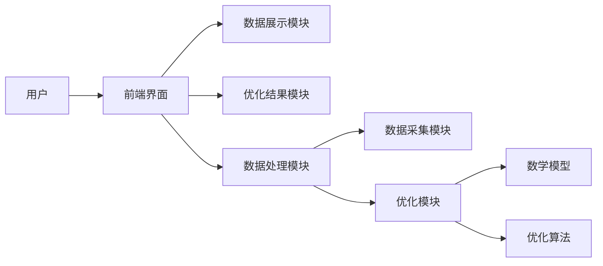
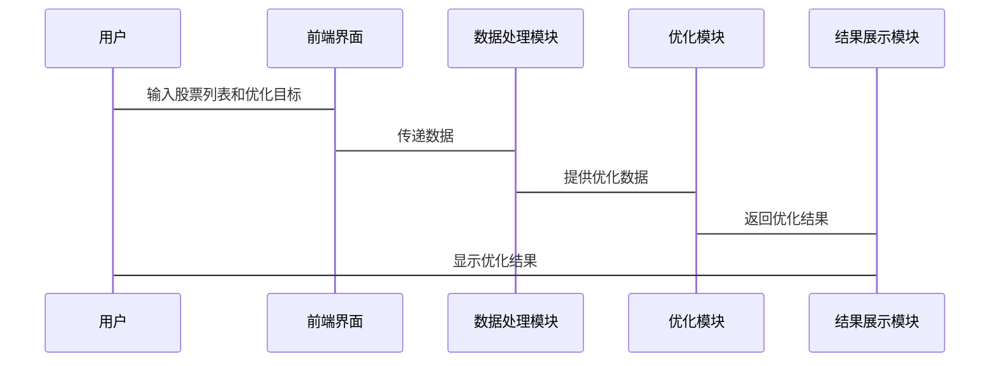

                 


# 如何利用特价股票策略进行组合优化

---

## 关键词：特价股票策略、组合优化、数学模型、投资策略、风险管理

---

## 摘要：  
特价股票策略是一种通过分析市场波动和股票价格波动，利用低价买入、高价卖出的原理，实现投资收益最大化的方法。本文将深入探讨如何利用特价股票策略进行组合优化，从背景介绍、核心概念、数学模型、系统设计到项目实战，全面解析特价股票策略的优化方法。文章还将结合实际案例，分析如何在复杂市场环境中应用特价股票策略，并提供最佳实践建议。

---

## 第一部分：特价股票策略的背景与基础

### 第1章：特价股票策略的背景介绍

#### 1.1 股票市场的基本运作机制  
股票市场是投资者进行股票买卖的场所，其价格受多种因素影响，包括宏观经济环境、公司业绩、市场情绪等。股票价格的波动为投资者提供了套利和投资的机会。  

#### 1.2 特价股票策略的定义与特点  
特价股票策略是指在市场中寻找被低估的股票，以低于其内在价值的价格买入，并在价格回升时卖出。其特点包括：  
- **低买高卖**：利用价格波动，寻找低估股票。  
- **风险可控**：通过组合优化降低单一股票的风险。  
- **长期收益**：通过多次买卖操作，实现长期收益最大化。  

#### 1.3 特价股票策略的应用场景  
- **市场波动**：在市场波动较大的情况下，特价股票策略能够捕捉短期价格回升的机会。  
- **投资者风险偏好**：适合风险偏好较低的投资者，通过组合优化降低风险。  
- **市场周期**：在经济周期的低谷期，寻找被低估的股票，能够在市场复苏时获得超额收益。  

#### 1.4 本章小结  
本章介绍了股票市场的基本运作机制，定义了特价股票策略，并分析了其应用场景和特点，为后续的组合优化奠定了基础。

---

## 第二部分：股票组合优化的核心概念

### 第2章：股票组合优化的基本原理  

#### 2.1 风险与收益的平衡  
- **风险与收益的关系**：高风险投资通常伴随着高收益，但过高的风险可能导致本金损失。  
- **风险中性组合**：通过调整投资组合中高风险和低风险股票的比例，实现风险与收益的平衡。  
- **有效前沿**：在给定风险水平下，收益最高的投资组合构成的曲线，称为有效前沿。  

#### 2.2 股票组合优化的数学模型  
- **均值-方差优化模型**：通过优化股票组合的期望收益和方差，找到最优投资组合。  
- **马科维茨投资组合理论**：通过数学模型优化投资组合的收益与风险平衡。  
- **约束条件下的优化问题**：考虑资金限制、交易成本等约束条件，优化投资组合。  

#### 2.3 特价股票策略的优化目标  
- **最大化收益**：通过优化组合，实现收益的最大化。  
- **最小化风险**：通过分散投资，降低投资组合的整体风险。  
- **流动性与交易成本**：考虑股票的流动性，降低交易成本。  

#### 2.4 本章小结  
本章详细介绍了股票组合优化的核心概念，包括风险与收益的平衡、数学模型和优化目标，为后续的特价股票策略优化提供了理论基础。

---

## 第三部分：特价股票策略的数学模型与算法

### 第3章：特价股票策略的数学模型  

#### 3.1 股票组合优化的数学公式  
- **均值-方差优化模型**：  
  $$ \text{目标函数} = \lambda \cdot \text{收益} - \frac{1}{2} \cdot \text{风险} $$  
  其中，$\lambda$ 是风险偏好系数，$\text{收益}$ 和 $\text{风险}$ 分别是投资组合的期望收益和方差。  

- **风险中性组合**：  
  $$ \sum_{i=1}^{n} w_i \cdot r_i = \mu $$  
  其中，$w_i$ 是第 $i$ 只股票的权重，$r_i$ 是其收益率，$\mu$ 是市场无风险收益率。  

- **约束条件**：  
  $$ \sum_{i=1}^{n} w_i = 1 $$  
  $$ w_i \geq 0 \quad \forall i $$  

#### 3.2 优化算法的选择与实现  
- **拉格朗日乘数法**：用于解决带约束的优化问题。  
- **遗传算法**：通过模拟自然选择和遗传变异，寻找最优解。  
- **深度学习方法**：利用神经网络模型预测股票价格波动，优化投资组合。  

#### 3.3 特价股票策略的优化流程  
1. **数据收集**：收集目标股票的历史价格数据。  
2. **数据预处理**：计算股票收益率、波动率等指标。  
3. **构建模型**：选择合适的优化模型和算法。  
4. **优化过程**：通过算法求解最优投资组合。  
5. **结果分析**：评估优化结果的收益和风险。  

#### 3.4 本章小结  
本章详细介绍了特价股票策略的数学模型和优化算法，并通过流程图展示了优化过程。

---

## 第四部分：系统分析与架构设计

### 第4章：系统分析与架构设计  

#### 4.1 系统功能设计  
- **数据采集模块**：从数据源获取股票价格数据。  
- **数据处理模块**：计算股票收益率、波动率等指标。  
- **优化模块**：实现投资组合的优化算法。  
- **结果展示模块**：以可视化方式展示优化结果。  

#### 4.2 系统架构设计  


#### 4.3 系统接口设计  
- **输入接口**：接收用户输入的股票列表和优化目标。  
- **输出接口**：展示优化后的投资组合及其收益和风险指标。  

#### 4.4 系统交互流程  


#### 4.5 本章小结  
本章通过系统架构设计和交互流程图，详细介绍了如何构建一个基于特价股票策略的优化系统。

---

## 第五部分：项目实战

### 第5章：项目实战  

#### 5.1 环境安装与配置  
- **Python环境**：安装Python 3.8+。  
- **库的安装**：使用 `pip` 安装 `pandas`, `numpy`, `scipy`, `matplotlib` 等库。  

#### 5.2 核心代码实现  
```python
import numpy as np
import pandas as pd
from scipy.optimize import minimize

# 示例数据：股票收益率矩阵
returns = pd.DataFrame({
    '股票A': [0.1, 0.05, 0.02, 0.15],
    '股票B': [0.08, 0.12, 0.07, 0.1],
    '股票C': [0.05, 0.09, 0.12, 0.08]
})

# 定义优化函数
def portfolio Optimization(weights, returns):
    weights = weights / np.sum(weights)
    variance = np.dot(weights.T, np.dot(returns.cov(), weights))
    return variance

# 定义约束条件
constraints = [
    ('sum(weights) == 1', {'type': 'eq', 'args': None}),
    ('weights >= 0', {'type': 'ineq', 'args': None})
]

# 初始化权重
initial_weights = np.array([1/3, 1/3, 1/3])

# 求解优化问题
result = minimize(portfolio_optimization, initial_weights, constraints=constraints)

# 输出结果
print("最优权重:", result.x)
print("最小方差:", result.fun)
```

#### 5.3 案例分析与结果解读  
- **案例分析**：假设我们有三只股票，分别计算它们的收益率和波动率，构建投资组合。  
- **结果解读**：优化后的权重和最小方差，说明最优投资组合的风险和收益。  

#### 5.4 本章小结  
本章通过实际案例，详细讲解了如何使用Python代码实现特价股票策略的组合优化，并对结果进行了分析和解读。

---

## 第六部分：最佳实践与总结

### 第6章：最佳实践与总结  

#### 6.1 投资策略的建议  
- **分散投资**：通过组合优化降低风险。  
- **定期调整**：根据市场变化，及时调整投资组合。  
- **风险管理**：设置止损点，避免重大损失。  

#### 6.2 注意事项  
- **数据质量**：确保数据来源可靠，避免错误数据影响优化结果。  
- **模型选择**：根据实际情况选择合适的优化算法。  
- **市场风险**：市场波动可能会影响优化结果的实现。  

#### 6.3 拓展阅读  
- **《投资学》**：深入理解股票投资的基本理论。  
- **《算法优化》**：学习更多优化算法及其应用。  

#### 6.4 本章小结  
本章总结了特价股票策略的最佳实践，提供了投资策略的建议和注意事项，并推荐了拓展阅读的资源。

---

## 附录  

### 附录A：数据来源与工具安装  
- 数据来源：可以从Yahoo Finance、Google Finance等平台获取股票数据。  
- 工具安装：安装Python和相关库，如 `pandas`, `numpy`, `scipy`, `matplotlib`。  

### 附录B：术语表  
- **有效前沿**：在给定风险水平下，收益最高的投资组合构成的曲线。  
- **拉格朗日乘数法**：用于解决带约束的优化问题。  
- **遗传算法**：一种基于自然选择和遗传变异的优化算法。  

---

## 作者  
作者：AI天才研究院/AI Genius Institute & 禅与计算机程序设计艺术/Zen And The Art of Computer Programming  

---

**注意**：本文内容为理论分析与技术实现的示例，实际投资需谨慎，建议结合市场环境和自身风险偏好进行决策。

