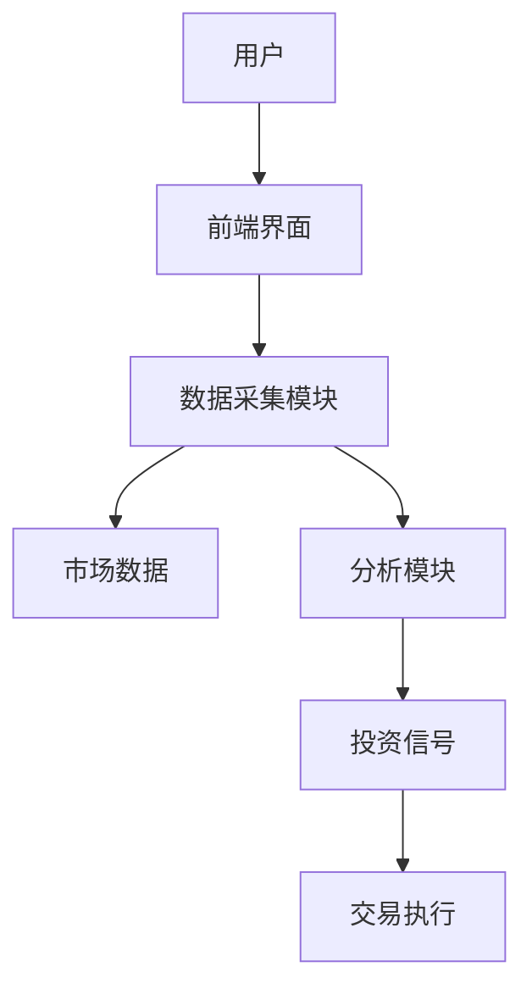

                 


# 如何利用特价股票策略进行结构性产品投资

---

## 关键词：特价股票，结构性产品，投资策略，风险管理，期权，数学模型

---

## 摘要

本文详细探讨了如何利用特价股票策略进行结构性产品投资。通过分析特价股票的特性、结构性产品的类型及其定价模型，结合数学算法和系统架构设计，提供了从理论到实践的全面指导。文章不仅介绍了特价股票策略的核心概念，还通过Python代码实现、数学模型推导和系统设计，展示了如何在实际投资中应用这些策略，并通过案例分析进一步验证了策略的有效性。

---

## 第一部分: 特价股票策略与结构性产品投资背景

### 第1章: 特价股票策略的背景与概念

#### 1.1 特价股票策略的背景

在金融市场上，特价股票通常指那些价格远低于其内在价值的股票。这些股票可能由于市场波动、公司短期问题或市场情绪影响而被低估。投资者可以通过特价股票策略，抓住市场低估的机会，实现超额收益。

#### 1.2 结构性产品的定义与类型

结构性产品是一种复杂的金融工具，通常由债券、期权或其他金融衍生品组合而成。它们的设计旨在满足投资者的特定风险和收益需求。常见的结构性产品包括挂钩股票、股指期权和债券联动产品等。

#### 1.3 特价股票策略与结构性产品的结合

通过将特价股票策略与结构性产品结合，投资者可以在控制风险的同时，放大潜在收益。结构性产品的特性使其能够灵活地适应特价股票的价格波动，从而优化投资组合的表现。

---

## 第二部分: 特价股票策略的核心概念与分析

### 第2章: 特价股票策略的数学模型

#### 2.1 特价股票价格的数学表达式

特价股票的价格可以表示为：

$$P = \text{内在价值} + \text{市场情绪影响}$$

其中，内在价值基于公司的基本面分析，而市场情绪影响则反映了市场的非理性波动。

#### 2.2 结构性产品定价模型

结构性产品的定价通常采用Black-Scholes模型，其公式为：

$$C = S_0 N(d_1) - K e^{-rT} N(d_2)$$

其中，$S_0$ 是标的资产价格，$K$ 是执行价格，$r$ 是无风险利率，$T$ 是时间，$N$ 是标准正态分布函数。

#### 2.3 特价股票策略与结构性产品的关系

通过将特价股票策略嵌入结构性产品，投资者可以在市场低估时买入结构性产品，从而在市场回升时获得更高收益。

---

## 第三部分: 特价股票策略的算法原理与实现

### 第3章: 特价股票策略的算法实现

#### 3.1 算法的基本原理

特价股票策略的核心在于识别市场低估的信号，并利用结构性产品进行投资。算法流程如下：

1. 数据收集：获取目标股票的历史价格数据。
2. 市场分析：计算股票的内在价值与市场价格的差异。
3. 信号触发：当市场价格显著低于内在价值时，触发投资信号。
4. 投资决策：购买结构性产品，以放大收益。

#### 3.2 算法实现的Python代码

```python
import numpy as np
from scipy.stats import norm

def black_scholes(S, K, r, T, sigma):
    d1 = (np.log(S/K) + (r + sigma**2/2)*T) / (sigma*np.sqrt(T))
    d2 = d1 - sigma*np.sqrt(T)
    C = S * norm.cdf(d1) - K * np.exp(-r*T) * norm.cdf(d2)
    return C

# 示例参数
S = 100
K = 105
r = 0.05
T = 1
sigma = 0.2

price = black_scholes(S, K, r, T, sigma)
print(f"期权价格: {price}")
```

#### 3.3 数学模型的详细推导

通过推导Black-Scholes公式，我们可以更好地理解结构性产品的定价机制。假设标的资产价格服从几何布朗运动，其概率密度函数为：

$$f(S_T) = \frac{1}{S_T \sigma \sqrt{2\pi T}} \exp\left(-\frac{(\ln(S_T/K) - rT)^2}{2\sigma^2 T}\right)$$

通过积分和优化，可以推导出期权的定价公式。

---

## 第四部分: 系统架构与项目实战

### 第4章: 系统架构设计

#### 4.1 问题场景介绍

投资者希望通过系统监控市场信号，自动执行特价股票策略。系统需要实时获取市场数据，分析股票价格，并根据模型生成投资信号。

#### 4.2 系统功能设计

- 数据采集模块：实时获取股票价格和市场数据。
- 分析模块：计算内在价值和市场价格差异。
- 决策模块：生成投资信号并执行交易。

#### 4.3 系统架构图



#### 4.4 接口设计

- 数据接口：与数据源（如Yahoo Finance）对接，获取实时数据。
- 交易接口：与 brokers 对接，执行交易指令。

---

## 第五部分: 案例分析与总结

### 第5章: 项目实战

#### 5.1 环境安装

安装必要的Python库：

```bash
pip install numpy pandas scipy matplotlib
```

#### 5.2 核心实现代码

```python
import pandas as pd
import matplotlib.pyplot as plt

# 示例数据
data = pd.DataFrame({'日期': ['2023-01-01', '2023-01-02', '2023-01-03'], '价格': [100, 98, 105]})
data.set_index('日期', inplace=True)

# 绘制价格波动图
data['价格'].plot(kind='line')
plt.title('股票价格波动')
plt.xlabel('日期')
plt.ylabel('价格')
plt.show()
```

#### 5.3 实际案例分析

通过分析某公司股票的历史数据，验证特价股票策略的有效性。例如，当股票价格跌破内在价值时，购买结构性产品并在价格回升时卖出，实现收益。

---

## 第六部分: 总结与展望

### 第6章: 总结

本文详细探讨了如何利用特价股票策略进行结构性产品投资。通过数学模型、算法实现和系统设计，展示了从理论到实践的完整流程。投资者可以通过这些方法在控制风险的同时，实现超额收益。

### 第7章: 未来展望

未来的研究可以集中在以下几个方向：

1. 利用人工智能优化特价股票策略。
2. 开发更复杂的结构性产品，以适应不同的市场环境。
3. 提高风险管理能力，降低投资风险。

---

## 作者：AI天才研究院/AI Genius Institute & 禅与计算机程序设计艺术 /Zen And The Art of Computer Programming

