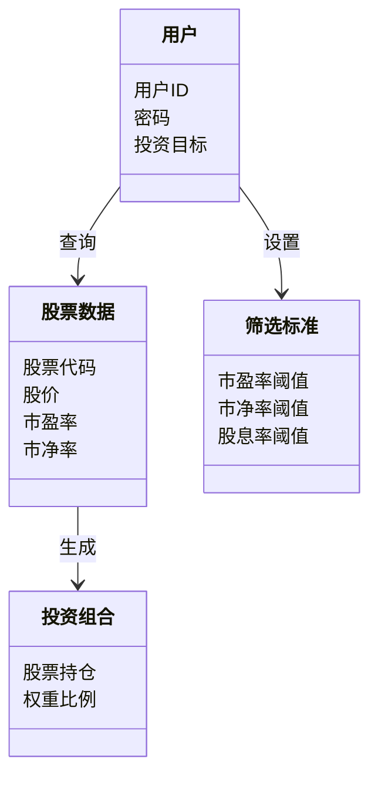
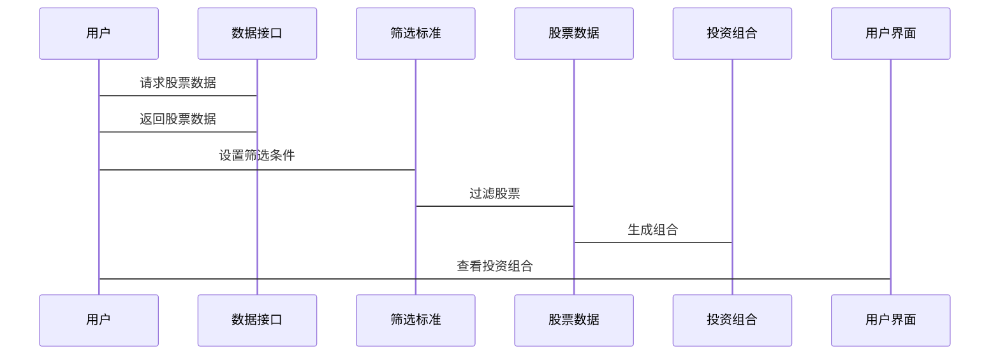

                 


# 如何利用特价股票策略进行资产配置

> 关键词：特价股票，资产配置，风险管理，投资策略，股票筛选，系统设计

> 摘要：本文将详细介绍如何利用特价股票策略进行资产配置，从特价股票的基本概念到策略在资产配置中的应用，结合数学模型、系统架构和实际案例，帮助读者优化投资组合，降低风险，实现财富增长。

---

# 第1章: 特价股票策略的概述

## 1.1 特价股票的基本概念

### 1.1.1 什么是特价股票
特价股票是指在特定时期内，股票价格低于其内在价值或市场平均水平的股票。这些股票通常具有较高的投资潜力，但可能因为市场波动、公司短期问题或其他因素而被低估。

### 1.1.2 特价股票的特点
- **低估值**：市盈率、市净率等指标低于行业平均水平。
- **高股息率**：部分特价股票提供较高的股息回报。
- **风险较高**：通常涉及较高的市场波动和不确定性。

### 1.1.3 特价股票与普通股票的区别
- **风险**：特价股票风险较高，但潜在回报也更大。
- **投资策略**：普通股票适合长期投资，特价股票适合短期或中短期策略。

## 1.2 特价股票策略的背景与重要性

### 1.2.1 当前股票市场的现状
当前市场波动加剧，投资者寻求高回报的同时，也面临着更大的风险。特价股票策略为投资者提供了在市场低谷期寻找价值的机会。

### 1.2.2 特价股票策略的兴起
随着市场效率的提高，发现特价股票的机会减少，但通过技术分析和基本面研究，投资者仍能寻找到潜在的机会。

### 1.2.3 特价股票策略在资产配置中的作用
通过配置特价股票，投资者可以在资产组合中引入高回报潜力的资产，同时分散投资风险。

## 1.3 本书的核心目标

### 1.3.1 帮助读者理解特价股票策略
通过详细讲解策略的背景、原理和应用，读者能够掌握特价股票的基本知识。

### 1.3.2 提供有效的资产配置方法
结合特价股票策略，指导读者如何优化资产配置，实现稳健投资。

### 1.3.3 实现财富的稳健增长
通过合理配置特价股票和其他资产，帮助读者在市场波动中保持资产的稳健增长。

---

# 第2章: 特价股票的分类与筛选方法

## 2.1 特价股票的分类

### 2.1.1 按行业分类
不同行业的特价股票具有不同的风险和回报特征，例如科技行业可能风险较高，而公用事业行业可能风险较低。

### 2.1.2 按市值分类
大、中、小盘股的特价股票在风险和流动性上有所不同，投资者需根据自身情况选择。

### 2.1.3 按股息率分类
高股息率的特价股票适合追求稳定收益的投资者，而低股息率的股票可能具有更高的增长潜力。

## 2.2 特价股票的筛选标准

### 2.2.1 基本面分析
- **市盈率（P/E）**：低于行业平均水平。
- **市净率（P/B）**：低于1。
- **股息率**：高于行业平均水平。

### 2.2.2 技术指标分析
- **相对强弱指数（RSI）**：低于30，表示超卖。
- **移动平均线（MA）**：股价在短期均线下方，长期均线上方。

### 2.2.3 市场情绪分析
通过市场情绪指标（如恐慌指数）判断市场是否处于低潮，寻找被市场忽视的股票。

## 2.3 筛选工具与方法

### 2.3.1 股票筛选工具介绍
- **金融数据平台**：如FactSet、Morningstar。
- **股票筛选器**：如Screener工具。

### 2.3.2 数据分析方法
- **量化分析**：通过算法筛选符合条件的股票。
- **人工审核**：结合行业分析和公司财报进行深度评估。

### 2.3.3 筛选流程优化
- **自动化筛选**：利用程序自动筛选符合标准的股票。
- **定期更新**：根据市场变化及时更新筛选标准。

---

# 第3章: 资产配置的基本原理

## 3.1 资产配置的重要性

### 3.1.1 投资组合的风险与收益
- **风险分散**：通过多样化投资降低风险。
- **收益增强**：通过配置不同类型的资产提高整体收益。

## 3.2 风险承受能力评估

### 3.2.1 风险承受能力的定义
投资者在面对市场波动时，能够承受的最大损失比例。

### 3.2.2 如何评估个人风险承受能力
- **财务状况**：净资产、收入稳定性。
- **投资目标**：短期或长期目标。
- **心理承受能力**：对风险的容忍度。

## 3.3 资产配置的多样化原则

### 3.3.1 多元化投资的意义
通过投资不同资产类别、行业和地域，降低整体投资组合的风险。

### 3.3.2 不同资产类别的特点
- **股票**：高风险，高回报。
- **债券**：低风险，稳定收益。
- **现金**：流动性高，低风险。

### 3.3.3 资产配置的动态调整
根据市场变化和个人情况，定期调整资产配置比例。

---

# 第4章: 特价股票策略在资产配置中的应用

## 4.1 确定投资目标与策略

### 4.1.1 投资目标的设定
明确投资目标，如资本增值、收入稳定等。

### 4.1.2 确定投资策略
根据目标选择合适的策略，如价值投资、成长投资等。

### 4.1.3 策略的可行性分析
评估策略在当前市场环境下的可行性，考虑市场趋势、行业前景等因素。

## 4.2 构建投资组合

### 4.2.1 确定投资比例
根据风险承受能力和目标，确定特价股票在投资组合中的比例。

### 4.2.2 选择合适的特价股票
根据筛选标准和市场分析，选择具有潜力的特价股票。

### 4.2.3 组合优化
通过调整资产比例和股票选择，优化投资组合的风险收益比。

## 4.3 动态调整与风险管理

### 4.3.1 定期评估
定期评估投资组合的表现，及时发现潜在风险。

### 4.3.2 重新配置
根据市场变化和个人情况，调整资产配置比例和股票选择。

### 4.3.3 风险控制
设置止损点，避免重大损失，确保投资组合的稳健性。

---

# 第5章: 特价股票策略的风险管理

## 5.1 风险评估与控制方法

### 5.1.1 风险来源
- **市场风险**：市场波动导致股票价格下跌。
- **公司风险**：公司基本面变化影响股价。
- **流动性风险**：难以快速变现。

### 5.1.2 风险评估方法
- **VaR（在险价值）**：衡量潜在损失。
- **压力测试**：评估极端市场情况下的表现。

## 5.2 风险控制工具与策略

### 5.2.1 期权与保险
利用期权对冲风险，购买保险保护投资组合。

### 5.2.2 多样化投资
通过投资不同类型的资产和股票，分散风险。

### 5.2.3 定期再平衡
定期调整投资组合，确保风险控制在可接受范围内。

---

# 第6章: 系统分析与架构设计方案

## 6.1 系统设计概述

### 6.1.1 问题场景介绍
投资者需要一个高效系统来筛选特价股票，优化资产配置。

### 6.1.2 项目介绍
开发一个基于特价股票策略的资产配置系统，帮助投资者进行决策。

## 6.2 系统功能设计

### 6.2.1 领域模型
- **用户模块**：用户管理、投资目标设定。
- **股票筛选模块**：数据收集、筛选标准设置。
- **资产配置模块**：策略制定、组合优化。
- **风险管理模块**：风险评估、控制措施。

### 6.2.2 领域模型类图


## 6.3 系统架构设计

### 6.3.1 系统架构图


## 6.4 系统接口设计

### 6.4.1 接口描述
- **数据接口**：从金融数据源获取股票信息。
- **用户接口**：用户设置筛选标准和投资目标。
- **输出接口**：生成优化的投资组合。

## 6.5 系统交互设计

### 6.5.1 交互流程


---

# 第7章: 项目实战

## 7.1 环境安装

### 7.1.1 安装Python
```bash
python --version
pip install numpy pandas matplotlib
```

## 7.2 核心实现

### 7.2.1 数据收集
```python
import pandas as pd
import requests

url = "https://api.example.com/stocks"
response = requests.get(url)
data = response.json()
df = pd.DataFrame(data)
```

### 7.2.2 筛选标准
```python
selected = df[df['市盈率'] < 15]
```

### 7.2.3 投资组合优化
```python
import numpy as np

def optimize_portfolio(weights):
    # 计算夏普比率
    return -夏普比率(weights)
```

## 7.3 案例分析

### 7.3.1 案例背景
假设市场低迷，某投资者希望通过特价股票策略优化投资组合。

### 7.3.2 数据分析
使用Python分析历史数据，筛选出符合条件的特价股票。

### 7.3.3 策略实施
根据分析结果，配置一定比例的特价股票，并定期调整组合。

## 7.4 项目小结

### 7.4.1 实战总结
通过实战项目，验证特价股票策略的有效性，优化投资组合。

### 7.4.2 经验分享
分享在项目中遇到的问题和解决方案，为读者提供参考。

---

# 第8章: 总结与展望

## 8.1 本书总结

### 8.1.1 核心内容回顾
从特价股票的基本概念到策略应用，系统讲解了如何进行资产配置。

## 8.2 未来展望

### 8.2.1 研究方向
未来可以进一步研究人工智能在特价股票筛选中的应用。

### 8.2.2 技术发展
随着技术进步，资产配置系统将更加智能化和个性化。

## 8.3 最佳实践 Tips

### 8.3.1 投资者建议
根据市场环境和个人情况，灵活调整投资策略。

### 8.3.2 风险提示
高度重视风险管理，避免重大损失。

### 8.3.3 长期投资
坚持长期投资理念，耐心持有优质资产。

## 8.4 书籍推荐

### 8.4.1 进一步阅读
推荐相关书籍和资源，帮助读者深入学习。

---

# 作者：AI天才研究院/AI Genius Institute & 禅与计算机程序设计艺术 /Zen And The Art of Computer Programming

