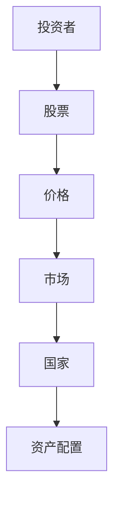
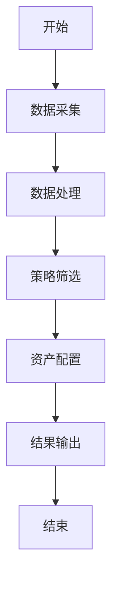

                 


# 如何利用特价股票策略进行跨境资产配置

> 关键词：特价股票策略，跨境资产配置，投资组合优化，风险管理，量化分析

> 摘要：本文深入探讨了如何利用特价股票策略进行跨境资产配置，从策略背景、核心概念、算法原理到系统架构、项目实战及最佳实践，全面分析了实现跨境资产配置的有效方法。

---

## 第一部分: 特价股票策略与跨境资产配置基础

### 第1章: 特价股票策略与跨境资产配置的背景介绍

#### 1.1 问题背景
##### 1.1.1 投资者对资产配置的需求
在全球经济一体化的背景下，投资者越来越倾向于通过多元化投资来分散风险，实现资产的保值与增值。特价股票因其价格优势，为投资者提供了低买高卖的机会，而跨境资产配置则通过在全球范围内分散投资，进一步降低风险。

##### 1.1.2 特价股票策略的定义与特点
特价股票策略是指在特定市场环境下，以低于内在价值的价格买入股票并长期持有的投资策略。其特点包括高性价比、低估值和较高的潜在回报率。

##### 1.1.3 跨境资产配置的必要性
全球经济波动、区域风险、货币政策差异等因素使得单一市场的投资风险较高。通过跨境配置，投资者可以分散风险，捕捉全球市场的机会。

#### 1.2 问题描述
##### 1.2.1 投资者面临的市场不确定性
股市波动、经济周期变化、政策调整等都可能导致投资收益的不确定性。

##### 1.2.2 特价股票策略的适用场景
在市场低迷或经济衰退时期，特价股票往往被低估，为投资者提供了买入的机会。

##### 1.2.3 跨境资产配置的风险与机会
全球经济的不确定性带来了风险，但也提供了多元化的投资机会。

#### 1.3 问题解决
##### 1.3.1 特价股票策略的核心思想
通过识别被低估的股票，以合理价格买入，长期持有，获得超额收益。

##### 1.3.2 跨境资产配置的实现路径
通过分析不同国家的市场环境，选择具有增长潜力的地区进行投资。

##### 1.3.3 策略实施的可行性分析
考虑市场流动性、政策风险、汇率波动等因素，评估策略的可行性。

#### 1.4 边界与外延
##### 1.4.1 特价股票策略的适用边界
适用于市场估值较低的时期，但需避免市场崩盘或公司基本面恶化的情况。

##### 1.4.2 跨境资产配置的地域选择
根据经济发展阶段、政策稳定性、市场流动性等因素选择投资区域。

##### 1.4.3 策略实施的外部环境影响
全球经济形势、地缘政治风险、货币政策变化等都可能影响策略的实施效果。

#### 1.5 概念结构与核心要素组成
##### 1.5.1 特价股票策略的核心要素
- 市场分析：识别低估区域。
- 股票筛选：选择具有潜力的股票。
- 风险控制：设定止损点和仓位分配。

##### 1.5.2 跨境资产配置的关键因素
- 资产类别：股票、债券、房地产等。
- 地域分布：发达国家与发展中国家。
- 汇率风险：考虑货币波动对资产价值的影响。

##### 1.5.3 策略实施的系统架构
- 数据采集：收集全球市场的股票信息。
- 模型构建：建立量化分析模型。
- 投资决策：根据模型结果制定投资策略。

---

### 第2章: 特价股票策略的核心概念与联系

#### 2.1 核心概念原理
##### 2.1.1 特价股票的定义与特征
特价股票通常是指价格低于其内在价值的股票，具有较高的投资潜力。

##### 2.1.2 跨境资产配置的理论基础
现代投资组合理论（MPT）强调通过多元化投资降低风险。

##### 2.1.3 策略实施的逻辑框架
从市场分析、股票筛选、投资组合构建到风险控制，形成完整的投资流程。

#### 2.2 概念属性特征对比表格
| 概念 | 特价股票 | 跨境资产配置 |
|------|----------|-------------|
| 定义 | 价格低于价值的股票 | 在全球市场分散投资 |
| 特征 | 低估、高潜力 | 多元化、分散风险 |
| 优势 | 高回报潜力 | 降低风险 |
| 劣势 | 市场波动风险 | 汇率风险、政策风险 |

#### 2.3 ER实体关系图



---

### 第3章: 特价股票策略的算法原理讲解

#### 3.1 算法原理
##### 3.1.1 特价股票筛选算法
通过量化指标（如市盈率、市净率）筛选出低估股票。

##### 3.1.2 跨境资产配置算法
根据市场风险、收益预期，构建最优投资组合。

##### 3.1.3 策略优化算法
通过动态调整投资组合，降低风险并提高收益。

#### 3.2 算法流程图



#### 3.3 算法实现代码
```python
def stock_screener(stocks):
    # 筛选低于市盈率中位数的股票
    median_pe = np.median([stock.pe for stock in stocks])
    selected_stocks = [stock for stock in stocks if stock.pe < median_pe]
    return selected_stocks
```

---

## 第四部分: 项目实战与总结

### 第7章: 总结与展望

#### 7.1 项目总结
通过特价股票策略与跨境资产配置的结合，投资者可以有效分散风险，捕捉全球市场的机会。

#### 7.2 经验分享
- 系统性分析是关键。
- 动态调整策略以应对市场变化。
- 量化分析提供科学依据。

#### 7.3 注意事项
- 风险控制是首要任务。
- 深入了解目标市场环境。
- 定期评估策略的有效性。

#### 7.4 未来展望
随着全球化深入，量化分析和人工智能将为跨境资产配置提供更多的可能性。

---

## 作者

作者：AI天才研究院/AI Genius Institute & 禅与计算机程序设计艺术 /Zen And The Art of Computer Programming

---

以上是完整的技术博客文章，涵盖特价股票策略与跨境资产配置的各个方面，从基础理论到实战应用，为投资者提供了全面的指导。

