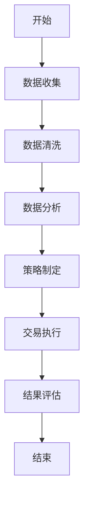
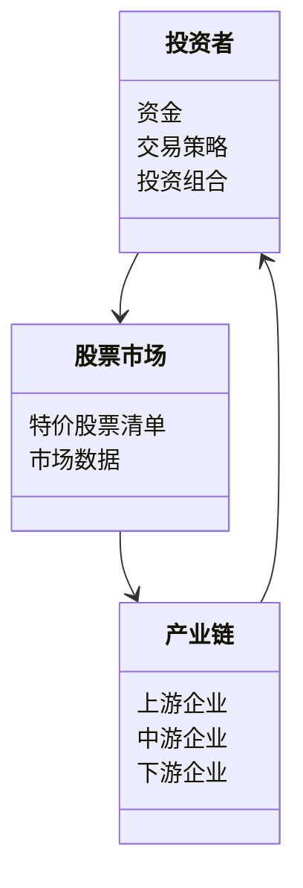
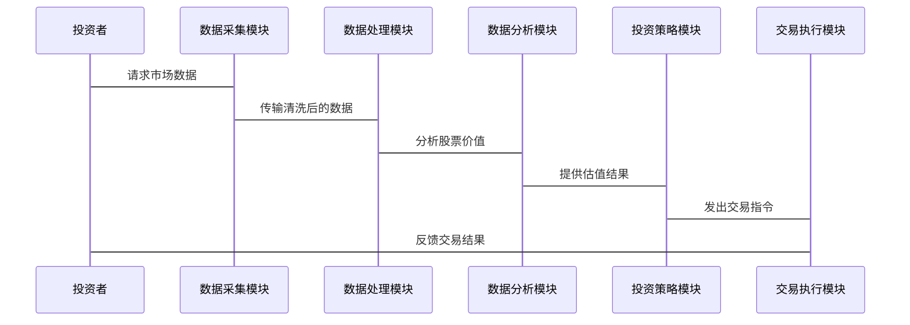

                 


# 如何利用特价股票策略进行逆向产业链投资

## 关键词
逆向投资、特价股票、产业链、投资策略、股票分析、风险管理

## 摘要
逆向投资是一种在市场低迷时期寻找低估资产的投资策略，而特价股票则是这种策略中的重要工具。本文将详细探讨如何利用特价股票策略进行逆向产业链投资，涵盖从基础概念到算法原理，再到系统架构的全面解析。通过具体案例分析和实战指导，帮助读者掌握逆向投资的精髓，并在实际操作中规避风险，实现稳健收益。

---

# 第1章：逆向投资与特价股票策略基础

## 1.1 逆向投资的基本概念
逆向投资是一种在市场恐慌或低估时买入，在市场狂热或高估时卖出的投资策略。其核心理念是“别人恐惧时我贪婪，别人贪婪时我恐惧”，强调在市场非理性波动中寻找投资机会。

### 1.1.1 特价股票的定义与特点
特价股票是指市场价格低于其内在价值的股票。这类股票通常被市场忽视或低估，但具备长期增值潜力。

- **定义**：特价股票是市场价格显著低于行业平均市盈率或历史市盈率的股票。
- **特点**：
  - 市场流动性低。
  - 股价波动较大。
  - 具备长期增长潜力。

### 1.1.2 逆向投资与特价股票的关联
逆向投资的核心是寻找市场低估的资产，而特价股票正是这种低估资产的典型代表。通过分析特价股票，投资者可以在产业链的不同环节找到潜在的高回报机会。

## 1.2 逆向投资的核心概念与联系
### 1.2.1 核心概念原理
逆向投资的逻辑在于市场的非理性。当市场恐慌时，投资者情绪低落，导致某些优质资产价格被低估。通过分析产业链的上下游关系，投资者可以找到那些因市场波动而被低估的公司。

### 1.2.2 核心概念属性特征对比表格
| 概念       | 属性       | 特征描述                                   |
|------------|------------|------------------------------------------|
| 逆向投资   | 投资策略   | 利用市场非理性波动寻找低估机会           |
| 特价股票   | 股票类型   | 价格低于内在价值，具有投资潜力           |

### 1.2.3 ER实体关系图


---

# 第2章：特价股票策略的算法原理

## 2.1 算法原理概述
### 2.1.1 算法目标
通过分析市场数据，识别出价格低于内在价值的特价股票，为逆向投资提供目标。

### 2.1.2 算法输入
- 市场数据：包括股票价格、成交量、行业指数等。
- 财务数据：包括公司利润、资产负债表等。

### 2.1.3 算法输出
- 特价股票清单：符合特定低估标准的股票列表。
- 投资建议：包括买入信号、卖出信号等。

## 2.2 算法流程图


## 2.3 算法实现代码
```python
def 清洗数据(数据):
    清洗后的数据 = 数据.dropna().astype(float)
    return 清洗后的数据

def 分析数据(数据):
    估值 = 数据.rolling(10).mean()
    return 估值

def 制定策略(分析结果):
    策略信号 = []
    for 价格 in 分析结果:
        if 价格 < 分析结果.mean():
            策略信号.append(1)
        else:
            策略信号.append(0)
    return 策略信号

def 特价股票策略(数据):
    清洗后的数据 = 清洗数据(数据)
    分析结果 = 分析数据(清洗后的数据)
    策略信号 = 制定策略(分析结果)
    return 策略信号
```

## 2.4 数学模型与公式
### 2.4.1 价值评估公式
$$价值 = \frac{未来现金流的现值}{折现率}$$

### 2.4.2 低估股票筛选公式
$$低估股票 = \left\{ \begin{array}{l}
是, \quad \text{如果当前价格} < \text{内在价值} \\
否, \quad \text{其他情况}
\end{array} \right. $$

---

# 第3章：逆向产业链投资的系统架构

## 3.1 系统功能设计
### 3.1.1 领域模型类图


### 3.1.2 系统架构图


### 3.1.3 系统接口设计
- 数据接口：从数据源获取市场数据。
- 分析接口：计算股票的内在价值。
- 交易接口：执行买入或卖出指令。

### 3.1.4 系统交互序列图


---

# 第4章：项目实战与案例分析

## 4.1 项目实战
### 4.1.1 环境安装
- 数据库：MySQL 或 MongoDB。
- 开发工具：Python、Jupyter Notebook。
- 库：Pandas、NumPy、Matplotlib。

### 4.1.2 核心实现代码
```python
import pandas as pd
import numpy as np

def 筛选特价股票(数据):
    平均值 = 数据.rolling(50).mean()
    特价股票 = 数据[数据['价格'] < 平均值]
    return 特价股票

数据 = pd.read_csv('市场数据.csv')
结果 = 筛选特价股票(数据)
print(结果)
```

### 4.1.3 代码解读
- 数据读取：从CSV文件中读取市场数据。
- 数据筛选：计算平均价格，筛选出价格低于平均值的股票。
- 结果输出：输出符合条件的特价股票列表。

## 4.2 案例分析
### 4.2.1 案例背景
假设当前市场某行业指数下跌，但某公司基本面良好，股价被低估。

### 4.2.2 分析过程
1. 收集市场数据。
2. 清洗数据。
3. 计算内在价值。
4. 筛选出特价股票。
5. 制定投资策略。

### 4.2.3 实战小结
通过分析，投资者可以找到那些因市场波动而被低估的股票，进行逆向投资。

---

# 第5章：投资策略与风险管理

## 5.1 投资策略
### 5.1.1 选股策略
- 选择基本面良好、股价低估的股票。
- 分散投资，降低风险。

### 5.1.2 仓位管理
- 根据市场情况调整仓位。
- 设置止损点，避免重大损失。

## 5.2 风险管理
### 5.2.1 市场风险
- 市场波动可能导致股价短期下跌。
- 解决方法：分散投资，避免过度集中。

### 5.2.2 个股风险
- 某些股票可能因公司内部问题导致股价继续下跌。
- 解决方法：严格筛选，避免投资垃圾股。

---

# 第6章：总结与展望

## 6.1 全文总结
本文详细介绍了如何利用特价股票策略进行逆向产业链投资，从概念解析到算法实现，再到系统架构和实战案例，为投资者提供了全面的指导。

## 6.2 未来展望
随着市场的发展，逆向投资策略将不断优化。未来，投资者可以利用更多的数据分析工具和人工智能技术，提升投资效率和精准度。

---

# 作者：AI天才研究院/AI Genius Institute & 禅与计算机程序设计艺术 /Zen And The Art of Computer Programming

