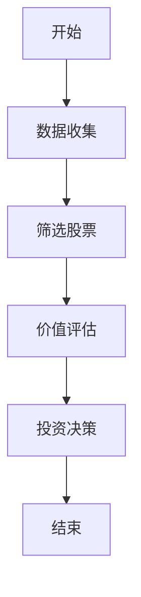
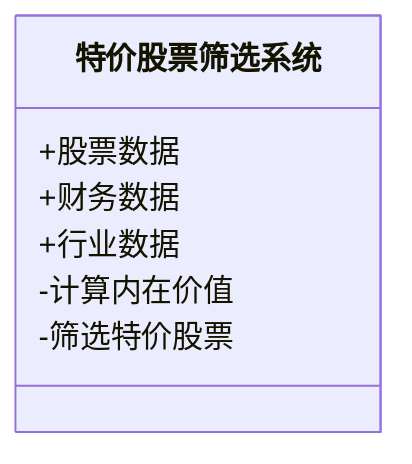

                 


# 如何利用特价股票策略进行逆向数字产业链整合投资

**关键词**：逆向投资、特价股票策略、数字产业链整合、系统架构设计、项目实战

**摘要**：本文深入探讨了如何利用特价股票策略进行逆向数字产业链整合投资。通过分析特价股票策略的核心原理、数学模型和算法流程，结合数字产业链整合的系统设计和项目实战，展示了如何在数字时代通过逆向投资实现产业链整合的策略和方法。

---

# 第一部分: 引言

## 第1章: 逆向投资与特价股票策略概述

### 1.1 逆向投资的基本概念

#### 1.1.1 逆向投资的定义
逆向投资是一种投资策略，强调在市场恐慌或低估时买入，在市场狂热时卖出。其核心理念是“别人恐惧时我贪婪，别人贪婪时我恐惧”。

#### 1.1.2 逆向投资的核心理念
- 市场情绪的非理性：市场参与者往往受情绪驱动，导致价格偏离内在价值。
- 价值发现：逆向投资的核心在于发现市场忽视的低估资产。
- 时间窗口：逆向投资需要耐心等待市场回归理性。

#### 1.1.3 逆向投资与传统投资的区别
| 方面 | 逆向投资 | 传统投资 |
|------|----------|-----------|
| 时机 | 市场低估时买入 | 市场上涨时买入 |
| 风险 | 低风险区域 | 高风险区域 |
| 理念 | 买入被忽视的价值 | 追踪市场趋势 |

### 1.2 特价股票策略的定义与特点

#### 1.2.1 特价股票的定义
特价股票是指市场价格显著低于其内在价值的股票，通常在市场恐慌或行业低谷时出现。

#### 1.2.2 特价股票的核心特点
- 价格低估：市场价格远低于内在价值。
- 行业周期性：通常出现在行业低谷或经济衰退期。
- 高股息率：部分特价股票提供较高的股息收益。

#### 1.2.3 特价股票与普通股票的区别
| 方面 | 特价股票 | 普通股票 |
|------|----------|-----------|
| 价格 | 低于内在价值 | 接近或高于内在价值 |
| 风险 | 较高 | 较低 |
| 收益 | 高 | 中等 |

### 1.3 数字产业链整合的背景与意义

#### 1.3.1 数字化转型对企业的影响
数字化转型使得企业能够通过数据和技术实现更高效的生产和管理，从而在竞争中占据优势。

#### 1.3.2 数字产业链整合的必要性
- 提高效率：通过整合产业链资源，优化生产和供应链管理。
- 降低成本：通过数字化手段减少中间环节，降低运营成本。
- 增强竞争力：通过数据共享和协同，提升整体竞争力。

#### 1.3.3 逆向投资在数字产业链整合中的作用
逆向投资可以帮助投资者在数字产业链整合中发现被低估的企业，通过长期持有实现收益。

---

# 第二部分: 特价股票策略的核心原理

## 第2章: 特价股票策略的数学模型与算法原理

### 2.1 特价股票策略的数学模型

#### 2.1.1 股价波动的数学模型
股票价格的波动可以用随机游走模型或均值回归模型来描述。均值回归模型更适合逆向投资，因为它假设价格会回归其内在价值。

#### 2.1.2 安全边际的计算公式
安全边际是股票价格与内在价值之间的差距，表示为：
$$
\text{安全边际} = \text{内在价值} - \text{市场价格}
$$

#### 2.1.3 市盈率与市净率的比较
市盈率（P/E）和市净率（P/B）是衡量股票价值的重要指标：
$$
\text{市盈率} = \frac{\text{股价}}{\text{每股收益}}
$$
$$
\text{市净率} = \frac{\text{股价}}{\text{每股净资产}}
$$

### 2.2 算法原理

#### 2.2.1 算法步骤
1. 数据收集：收集目标行业的历史股价、财务数据和行业信息。
2. 筛选股票：通过市盈率和市净率筛选出价格低于内在价值的股票。
3. 价值评估：计算每只股票的内在价值，确定安全边际。
4. 投资决策：根据安全边际和市场情绪决定买入或卖出。

#### 2.2.2 算法流程图


### 2.3 特价股票策略的代码实现

#### 2.3.1 环境安装
- Python 3.8+
- Pandas、NumPy、Matplotlib

#### 2.3.2 核心代码实现
```python
import pandas as pd
import numpy as np

# 示例数据：假设我们有以下股票数据
data = {
    '股票代码': ['A', 'B', 'C', 'D'],
    '股价': [10, 15, 20, 25],
    '每股收益': [2, 3, 4, 5],
    '每股净资产': [5, 6, 7, 8]
}

df = pd.DataFrame(data)

# 计算市盈率和市净率
df['市盈率'] = df['股价'] / df['每股收益']
df['市净率'] = df['股价'] / df['每股净资产']

# 计算内在价值（简单假设：市盈率为15，市净率为2）
df['内在价值'] = df[['市盈率', '每股收益']].apply(lambda x: x[0] * x[1], axis=1)
df['内在价值2'] = df[['市净率', '每股净资产']].apply(lambda x: x[0] * x[1], axis=1)

# 计算平均内在价值
df['平均内在价值'] = (df['内在价值'] + df['内在价值2']) / 2

# 计算安全边际
df['安全边际'] = df['平均内在价值'] - df['股价']

print(df)
```

#### 2.3.3 代码应用解读与分析
上述代码展示了如何通过Python计算市盈率、市净率和内在价值，进而计算安全边际。安全边际为正的股票可能是特价股票。

---

# 第三部分: 数字产业链整合的系统分析与架构设计

## 第3章: 数字产业链整合的系统分析

### 3.1 问题场景介绍

#### 3.1.1 逆向投资的典型场景
在经济衰退期间，许多企业股价被低估，但具有强大的基本面。通过逆向投资，可以在低位买入优质股票，等待市场复苏。

#### 3.1.2 数字产业链整合的挑战与机遇
- 挑战：数据孤岛、信息不对称、技术整合难度大。
- 机遇：通过数字化手段优化供应链、提高效率。

### 3.2 系统功能设计

#### 3.2.1 领域模型


### 3.3 系统架构设计

#### 3.3.1 系统架构图
```mermaid
client --> API Gateway: 请求API
API Gateway --> 负载均衡: 分发请求
负载均衡 --> 特价股票筛选系统: 处理请求
特价股票筛选系统 --> 数据库: 查询数据
数据库 --> 特价股票筛选系统: 返回数据
特价股票筛选系统 --> API Gateway: 返回结果
API Gateway --> 客户端: 返回结果
```

### 3.4 系统接口设计

#### 3.4.1 接口描述
- GET /api/stocks?sector=technology：获取指定行业的股票列表。
- POST /api/value：提交股票数据，返回内在价值和安全边际。

#### 3.4.2 接口交互流程
```mermaid
sequenceDiagram
    客户端 -> API Gateway: GET /api/stocks?sector=technology
    API Gateway -> 负载均衡: 请求分发
    负载均衡 -> 特价股票筛选系统: 处理请求
    特价股票筛选系统 -> 数据库: 查询数据
    特价股票筛选系统 <-- 数据库: 返回数据
    特价股票筛选系统 -> API Gateway: 返回股票列表
    API Gateway -> 客户端: 返回股票列表
```

---

# 第四部分: 项目实战

## 第4章: 特价股票策略的项目实战

### 4.1 案例分析

#### 4.1.1 案例背景
假设我们关注科技行业，市场处于低谷期，许多科技股被低估。

#### 4.1.2 数据预处理
- 收集过去5年的股价、财务数据和行业信息。
- 清洗数据，处理缺失值和异常值。

#### 4.1.3 模型训练
使用历史数据训练模型，计算每只股票的内在价值和安全边际。

#### 4.1.4 结果分析
筛选出安全边际为正的股票，作为潜在的特价股票。

### 4.2 代码实现

#### 4.2.1 环境安装
- Python 3.8+
- Pandas、NumPy、Matplotlib

#### 4.2.2 核心代码实现
```python
import pandas as pd
import numpy as np

# 模拟数据：科技行业股票
data = {
    '股票代码': ['AAPL', 'MSFT', 'GOOGL', 'AMZN'],
    '股价': [300, 350, 1500, 1000],
    '每股收益': [10, 15, 20, 25],
    '每股净资产': [50, 60, 70, 80]
}

df = pd.DataFrame(data)

# 计算市盈率和市净率
df['市盈率'] = df['股价'] / df['每股收益']
df['市净率'] = df['股价'] / df['每股净资产']

# 计算内在价值
df['内在价值'] = df['市盈率'] * df['每股收益']
df['内在价值2'] = df['市净率'] * df['每股净资产']
df['平均内在价值'] = (df['内在价值'] + df['内在价值2']) / 2

# 计算安全边际
df['安全边际'] = df['平均内在价值'] - df['股价']

print(df)
```

#### 4.2.3 代码应用解读与分析
上述代码展示了如何通过历史数据计算科技行业的内在价值和安全边际，筛选出具有安全边际的股票。

---

## 第5章: 总结与展望

### 5.1 最佳实践 tips
- 风险管理：逆向投资需要严格控制仓位，避免过度集中。
- 数据隐私：在进行数字产业链整合时，需注意数据隐私和合规性。

### 5.2 小结
通过特价股票策略和数字产业链整合的结合，投资者可以在逆向投资中发现价值，实现长期收益。

### 5.3 注意事项
- 避免情绪化投资：逆向投资需要理性判断，避免被市场情绪左右。
- 数据质量：确保数据的准确性和完整性。

### 5.4 拓展阅读
- 书籍推荐：《逆向思考的艺术》
- 在线课程：Coursera上的“逆向投资策略”

---

**作者：AI天才研究院/AI Genius Institute & 禅与计算机程序设计艺术 /Zen And The Art of Computer Programming**

