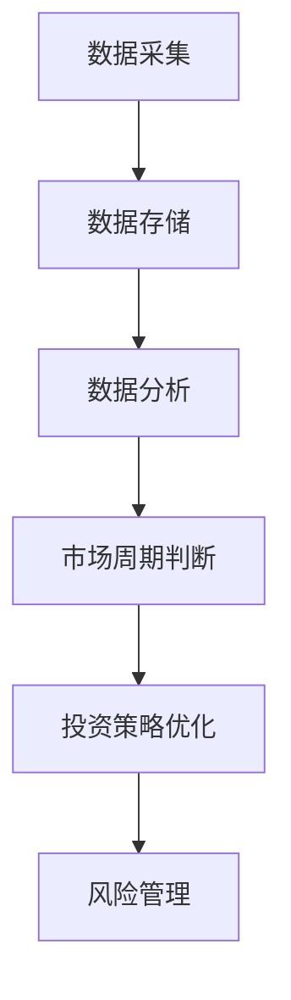

                 


# 如何利用特价股票策略进行逆周期资产配置

> 关键词：特价股票策略、逆周期资产配置、投资组合优化、市场周期分析、风险管理、数学模型

> 摘要：本文详细探讨了如何利用特价股票策略进行逆周期资产配置，从核心概念、算法原理到系统设计与项目实战，层层剖析，结合具体案例，帮助投资者在市场低谷中抓住投资机遇，实现资产的长期稳健增长。

---

## 第一部分: 特价股票策略与逆周期资产配置背景介绍

### 第1章: 特价股票策略的基本概念

#### 1.1 什么是特价股票
##### 1.1.1 特价股票的定义
特价股票是指在特定市场环境下，由于市场波动、公司基本面变化或其他外部因素影响，股票价格被暂时低估的股票。这些股票通常具有较高的安全边际，适合在市场低谷期进行投资。

##### 1.1.2 特价股票的特点
- **低估值**：市盈率（P/E）、市净率（P/B）等估值指标低于行业平均水平。
- **高股息率**：部分特价股票公司会派发较高的股息，吸引价值投资者。
- **行业龙头**：通常集中在金融、能源、制造等周期性较强的行业。

##### 1.1.3 特价股票的分类
- **周期性股票**：如能源、材料、工业等行业的股票，价格波动较大，适合逆周期投资。
- **防御性股票**：如公用事业、医疗保健等行业的股票，波动较小，适合稳健型投资者。
- **成长型股票**：虽然估值较低，但具有较高的成长潜力。

#### 1.2 逆周期资产配置的基本概念
##### 1.2.1 逆周期投资的定义
逆周期投资是指在市场低迷或经济衰退期间，投资于价格被低估的资产，以期在市场复苏时获得超额收益。

##### 1.2.2 逆周期投资的特征
- **低估值**：投资标的通常具有较高的安全边际。
- **长期视角**：逆周期投资需要耐心，等待市场反转。
- **风险管理**：注重分散投资，控制回撤风险。

##### 1.2.3 逆周期投资的意义
逆周期投资的核心在于“买便宜货”，通过在市场低点布局，降低投资成本，提高长期收益。

### 第2章: 特价股票策略与逆周期资产配置的联系

#### 2.1 特价股票策略在逆周期投资中的作用
##### 2.1.1 特价股票策略如何帮助投资者在市场低谷中获利
通过识别和投资于被市场低估的股票，投资者可以在市场复苏时获得超额收益。

##### 2.1.2 逆周期投资中特价股票策略的优势
- **低估值**：特价股票通常价格被低估，具有较大的上涨空间。
- **抗跌性**：在市场下跌时，特价股票的表现可能相对稳定，甚至跑赢市场。

##### 2.1.3 特价股票策略与逆周期投资的结合点
逆周期投资的核心是寻找市场低估的资产，而特价股票策略正是实现这一目标的有效工具。

#### 2.2 特价股票策略的市场周期分析
##### 2.2.1 市场周期的基本概念
市场周期通常分为四个阶段：复苏、上升、衰退和低谷。逆周期投资的核心是在市场低谷时布局，在市场复苏时获利。

##### 2.2.2 特价股票策略在不同市场周期的表现
- **复苏期**：特价股票开始逐步回升，适合逐步加仓。
- **上升期**：市场整体上涨，特价股票的表现可能相对平淡。
- **衰退期**：市场恐慌，特价股票价格可能被进一步低估，适合抄底。
- **低谷期**：市场底部，特价股票价格达到最低点，适合大规模布局。

##### 2.2.3 逆周期投资中的市场周期判断
准确判断市场周期是逆周期投资的关键，投资者需要结合技术分析和基本面分析，综合判断市场所处的阶段。

---

## 第二部分: 特价股票策略的核心概念与联系

### 第3章: 特价股票策略的核心原理

#### 3.1 特价股票的识别方法
##### 3.1.1 市盈率（P/E）分析
市盈率是衡量股票估值的重要指标，P/E低于行业平均水平的股票可能具有投资价值。

##### 3.1.2 市净率（P/B）分析
市净率是股价与每股净资产的比率，P/B低于1的股票通常被视为低估。

##### 3.1.3 市销率（P/S）分析
市销率是股价与每股销售额的比率，P/S低于行业平均水平的股票可能具有投资价值。

#### 3.2 逆周期资产配置的数学模型
##### 3.2.1 投资组合优化的基本原理
投资组合优化的目标是在风险可控的前提下，最大化收益。常用的方法包括均值-方差优化和风险平配模型。

##### 3.2.2 市场周期对投资组合的影响
市场周期波动会影响资产价格，逆周期投资需要根据市场周期调整资产配置。

##### 3.2.3 逆周期投资中的资产配置策略
- **动态调整**：根据市场周期变化，动态调整股票、债券等资产的比例。
- **分散投资**：通过分散投资降低单一资产的风险。

### 第4章: 特价股票策略与逆周期投资的联系

#### 4.1 特价股票策略在逆周期投资中的应用
##### 4.1.1 逆周期投资中的特价股票选择
投资者需要结合市场周期、公司基本面等因素，选择具有长期投资价值的特价股票。

##### 4.1.2 逆周期投资中的风险控制
通过分散投资、设置止损等方法，控制投资风险。

##### 4.1.3 逆周期投资中的收益最大化
通过长期持有、逐步加仓等策略，最大化投资收益。

#### 4.2 特价股票策略与逆周期投资的对比分析
##### 4.2.1 特价股票策略与普通股票投资的对比
- 特价股票策略注重低估值，而普通股票投资更关注成长性。
- 特价股票策略适合逆周期投资，而普通股票投资更注重市场趋势。

##### 4.2.2 逆周期投资与周期性投资的对比
- 逆周期投资在市场低谷时布局，周期性投资则在市场高峰期布局。
- 逆周期投资注重风险控制，周期性投资更注重趋势判断。

##### 4.2.3 特价股票策略与逆周期投资的结合
通过结合特价股票策略和逆周期投资，投资者可以在市场低谷时布局，市场复苏时获利。

---

## 第三部分: 特价股票策略的算法原理

### 第5章: 特价股票识别的算法原理

#### 5.1 特价股票识别的基本算法
##### 5.1.1 基于市盈率的识别算法
计算股票的市盈率，与行业平均水平进行比较，市盈率低于行业平均水平的股票可能具有投资价值。

##### 5.1.2 基于市净率的识别算法
计算股票的市净率，与行业平均水平进行比较，市净率低于行业平均水平的股票可能具有投资价值。

##### 5.1.3 基于市销率的识别算法
计算股票的市销率，与行业平均水平进行比较，市销率低于行业平均水平的股票可能具有投资价值。

#### 5.2 逆周期资产配置的算法实现
##### 5.2.1 投资组合优化的数学模型
$$ \text{收益} = \sum_{i=1}^{n} w_i r_i $$
$$ \text{风险} = \sqrt{\sum_{i=1}^{n} w_i^2 \sigma_i^2} $$
其中，\( w_i \) 是资产 \( i \) 的权重，\( r_i \) 是资产 \( i \) 的预期收益，\( \sigma_i \) 是资产 \( i \) 的收益波动率。

##### 5.2.2 市场周期判断的算法流程
1. 收集历史数据，包括股票价格、估值指标等。
2. 计算市场周期指标，如市盈率、市净率等。
3. 根据指标判断市场所处的周期阶段。

##### 5.2.3 投资策略的优化与调整
通过动态调整资产配置比例，优化投资组合的收益与风险比。

### 第6章: 系统分析与架构设计

#### 6.1 系统功能设计
##### 6.1.1 系统功能模块
- 数据采集模块：收集股票价格、估值指标等数据。
- 市场周期判断模块：根据数据判断市场周期。
- 投资策略优化模块：优化投资组合。
- 风险管理模块：控制投资风险。

##### 6.1.2 系统功能流程
1. 数据采集：从数据库或API获取股票数据。
2. 数据分析：计算估值指标，判断市场周期。
3. 投资策略优化：根据市场周期调整资产配置。
4. 风险管理：设置止损点，控制回撤。

#### 6.2 系统架构设计
##### 6.2.1 系统架构图


#### 6.3 系统接口设计
##### 6.3.1 数据接口
- 输入：股票代码、时间范围。
- 输出：股票价格、估值指标。

##### 6.3.2 算法接口
- 输入：市场周期判断结果。
- 输出：优化后的投资组合。

### 第7章: 项目实战

#### 7.1 环境安装
- 安装Python、Pandas、NumPy等工具。

#### 7.2 核心代码实现
##### 7.2.1 数据采集
```python
import pandas as pd
import requests

def get_stock_data(ticker):
    url = f"https://api.example.com/stock/{ticker}"
    response = requests.get(url)
    data = response.json()
    return pd.DataFrame(data)
```

##### 7.2.2 市场周期判断
```python
def calculate_pe(ticker):
    df = get_stock_data(ticker)
    pe = df['price'] / df['eps']
    return pe.mean()
```

##### 7.2.3 投资策略优化
```python
def optimize_portfolio(pe_ratio):
    if pe_ratio < 15:
        return '买入'
    else:
        return '卖出'
```

#### 7.3 案例分析
##### 7.3.1 案例背景
假设当前市场周期为衰退期，投资者需要寻找被低估的股票。

##### 7.3.2 数据分析
通过计算市盈率、市净率等指标，筛选出低估的股票。

##### 7.3.3 投资决策
根据市场周期和估值指标，决定买入或卖出。

#### 7.4 结果解读
通过实际案例分析，验证算法的有效性。

---

## 第四部分: 总结与展望

### 第8章: 最佳实践与小结

#### 8.1 投资策略小结
- 特价股票策略适合逆周期投资，投资者需要根据市场周期调整策略。
- 风险管理是投资成功的关键，设置止损点和分散投资是必要的。

#### 8.2 投资者注意事项
- 特价股票策略需要长期持有，耐心等待市场反转。
- 投资者需要关注公司基本面，而不仅仅是估值指标。

#### 8.3 拓展阅读
- 建议投资者阅读《投资学》、《价值投资》等相关书籍，深入了解逆周期投资的理论与实践。

---

## 作者：AI天才研究院/AI Genius Institute & 禅与计算机程序设计艺术 /Zen And The Art of Computer Programming

