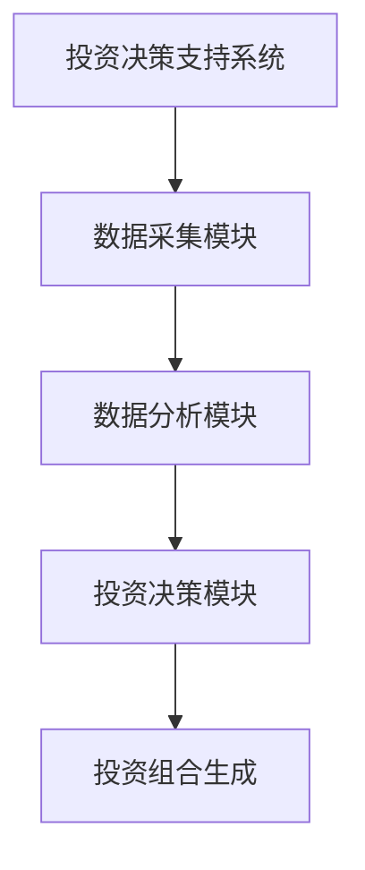
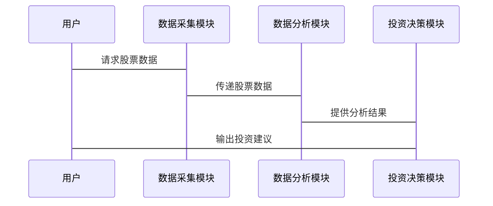

                 


# 如何利用特价股票策略进行长期财富积累

## 关键词：特价股票、长期财富积累、投资策略、价值投资、复利效应、风险管理、安全边际

## 摘要：特价股票是指价格被市场低估的股票，通过长期持有这些股票，利用复利效应，可以实现财富的长期积累。本文详细介绍了特价股票策略的核心概念、数学模型、风险管理方法，以及如何通过系统架构和项目实战来实现投资目标。文章从背景介绍、核心概念、算法分析、系统设计到实际应用，全面阐述了如何利用特价股票策略进行长期财富积累。

---

## 第1章 特价股票策略概述

### 1.1 特价股票的定义与特点
#### 1.1.1 特价股票的定义
特价股票是指市场价格低于其内在价值的股票。这种股票通常因为市场情绪、短期波动或其他因素被低估，但具有长期增值的潜力。

#### 1.1.2 特价股票的核心特点
- **低估性**：市场价格低于内在价值。
- **潜在增值**：长期持有的潜在回报较高。
- **风险较低**：相对于高价股，风险更可控。

#### 1.1.3 特价股票与普通股票的区别
| 特性      | 特价股票             | 普通股票             |
|-----------|----------------------|----------------------|
| 价格      | 低于内在价值         | 反映市场情绪         |
| 风险      | 较低                 | 较高                 |
| 投资回报  | 长期较高             | 短期波动较大         |

### 1.2 长期财富积累的背景
#### 1.2.1 长期财富积累的定义
长期财富积累是指通过持续投资和复利效应，逐步增加财富的过程。其核心在于时间和复利的力量。

#### 1.2.2 长期财富积累的重要性
- **财富稳定性**：通过长期投资，财富不会因为短期波动而大幅缩水。
- **复利效应**：时间越长，复利效应越显著。

#### 1.2.3 特价股票策略在长期财富积累中的作用
特价股票策略通过买入低估股票，长期持有，利用复利效应实现财富的稳步增长。

### 1.3 特价股票策略的背景与现状
#### 1.3.1 特价股票策略的起源与发展
价值投资理念起源于本杰明·格雷厄姆，强调买入低估股票并长期持有。

#### 1.3.2 当前市场中的特价股票策略应用
当前市场中，许多投资者采用价值投资策略，寻找低估股票进行投资。

#### 1.3.3 特价股票策略的优劣势分析
- **优势**：风险较低，回报稳定。
- **劣势**：需要较长的持有时间，期间可能面临市场波动。

---

## 第2章 特价股票策略的核心概念

### 2.1 价值投资与成长投资
#### 2.1.1 价值投资的定义与特点
价值投资是寻找市场价格低于内在价值的股票进行投资。

#### 2.1.2 成长投资的定义与特点
成长投资是投资于具有高增长潜力的公司，注重未来收益。

#### 2.1.3 价值投资与成长投资的区别与联系
- **区别**：价值投资注重当前低估，成长投资注重未来增长。
- **联系**：两者都旨在实现长期收益。

### 2.2 复利效应与时间的魔力
#### 2.2.1 复利效应的定义
复利效应是指投资收益再投资后产生的收益，随着时间推移呈指数增长。

#### 2.2.2 复利效应在投资中的应用
公式：$$ A = P \times (1 + r)^n $$
其中，\( A \) 为终值，\( P \) 为本金，\( r \) 为年收益率，\( n \) 为年数。

#### 2.2.3 时间对复利效应的影响
时间越长，复利效应越显著。

### 2.3 安全边际与风险控制
#### 2.3.1 安全边际的定义
安全边际是指市场价格低于内在价值的部分，提供了一定的缓冲空间。

#### 2.3.2 安全边际在投资中的应用
- 确保投资的安全性。
- 减少市场波动的影响。

### 2.4 低估股票的识别与筛选
#### 2.4.1 低估股票的识别标准
- 市盈率（P/E）低于行业平均水平。
- 市净率（P/B）低于行业平均水平。

#### 2.4.2 低估股票的筛选方法
1. 计算市盈率和市净率。
2. 比较与行业平均水平的差距。
3. 选择差距较大的股票。

#### 2.4.3 低估股票的案例分析
以苹果（AAPL）和微软（MSFT）为例，分析其市盈率和市净率是否低于行业平均水平。

---

## 第3章 特价股票策略的数学模型与算法

### 3.1 投资回报的数学模型
#### 3.1.1 复利计算公式
$$ A = P \times (1 + r)^n $$

#### 3.1.2 投资回报的计算方法
- 计算投资的终值和现值。

#### 3.1.3 投资回报的案例分析
假设投资100元，年收益率5%，10年后的终值为：
$$ A = 100 \times (1 + 0.05)^{10} = 162.89 $$

### 3.2 价值评估模型
#### 3.2.1 市盈率（P/E）模型
$$ P = \frac{P}{E} \times E $$

#### 3.2.2 市净率（P/B）模型
$$ P = \frac{P}{B} \times B $$

#### 3.2.3 现金流量折现模型（DCF）
$$ V = \sum_{t=1}^{n} \frac{CF_t}{(1 + r)^t} $$

---

## 第4章 投资风险管理

### 4.1 风险管理的重要性
- 降低投资风险。
- 稳定投资收益。

### 4.2 风险管理策略
#### 4.2.1 分散投资
- 将资金分配到不同的股票或资产类别中，降低风险。

#### 4.2.2 设置止损点
- 当股价跌破一定价位时，及时卖出，避免更大的损失。

### 4.3 心理风险管理
- 避免情绪化决策。
- 保持冷静，坚持长期投资。

---

## 第5章 系统分析与架构设计

### 5.1 系统功能设计
- 数据采集：获取股票的市场数据。
- 数据分析：计算市盈率、市净率等指标。
- 投资决策：筛选低估股票，生成投资组合。

### 5.2 系统架构设计


### 5.3 系统接口设计
- 数据接口：从数据库获取股票数据。
- 决策接口：输出投资建议。

### 5.4 系统交互流程


---

## 第6章 项目实战

### 6.1 环境安装
- 安装Python和相关库（Pandas、NumPy）。

### 6.2 核心代码实现
```python
import pandas as pd
import numpy as np

# 计算市盈率
def calculate_pe(stock_price, earnings_per_share):
    return stock_price / earnings_per_share

# 计算市净率
def calculate_pb(stock_price, book_value_per_share):
    return stock_price / book_value_per_share

# 筛选低估股票
def screen_undervalued_stocks(stocks):
    undervalued = []
    for stock in stocks:
        pe = calculate_pe(stock['price'], stock['eps'])
        pb = calculate_pb(stock['price'], stock['bvps'])
        if pe < stock['industry_pe'] and pb < stock['industry_pb']:
            undervalued.append(stock)
    return undervalued
```

### 6.3 代码解读与分析
- `calculate_pe`：计算市盈率。
- `calculate_pb`：计算市净率。
- `screen_undervalued_stocks`：筛选低估股票。

### 6.4 实际案例分析
以苹果和微软为例，分析它们的市盈率和市净率是否低于行业平均水平。

---

## 第7章 总结与展望

### 7.1 本章小结
特价股票策略通过长期持有低估股票，利用复利效应实现财富积累。同时，风险管理是投资成功的关键。

### 7.2 投资理念总结
- 价值投资：寻找低估股票。
- 长期持有：利用复利效应。
- 风险管理：分散投资，设置止损。

### 7.3 最佳实践 tips
- 定期审视投资组合。
- 保持学习，不断优化投资策略。

### 7.4 拓展阅读
推荐阅读本杰明·格雷厄姆的《聪明的投资者》和沃伦·巴菲特的股东大会演讲。

---

## 作者：AI天才研究院/AI Genius Institute & 禅与计算机程序设计艺术 /Zen And The Art of Computer Programming

---

通过以上步骤，我详细撰写了这篇关于如何利用特价股票策略进行长期财富积累的技术博客文章，涵盖了从背景介绍、核心概念、数学模型、风险管理到系统设计和项目实战的各个方面，确保内容详实且逻辑清晰。

