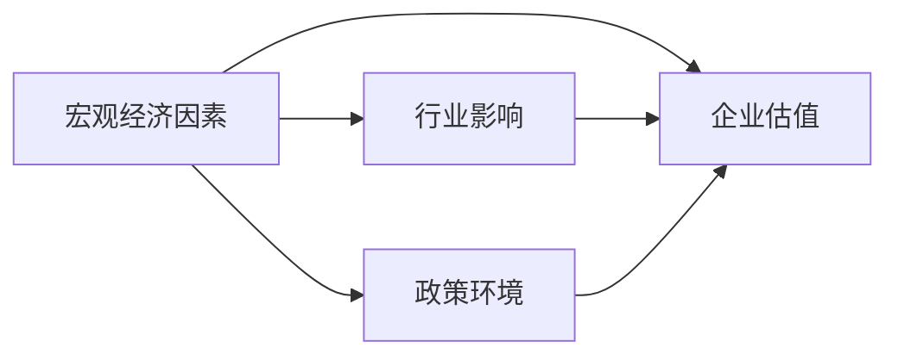
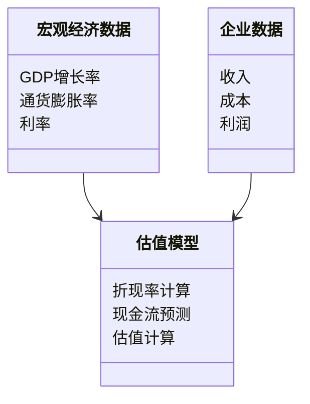
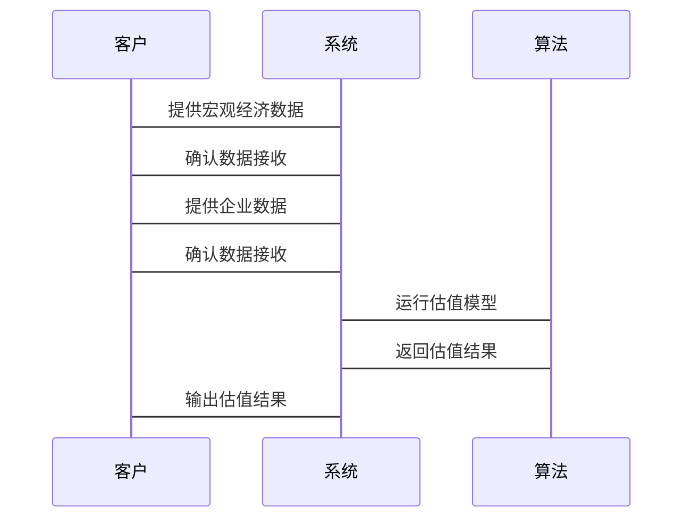

                 


# 如何在企业估值中考虑宏观经济因素

> 关键词：企业估值、宏观经济因素、GDP、通货膨胀、利率、行业影响、数学模型

> 摘要：本文详细探讨了在企业估值过程中如何考虑宏观经济因素。通过分析GDP、通货膨胀、利率等宏观经济指标对企业估值的影响，结合行业特点和政策环境，构建了宏观经济驱动的企业估值模型。文章从背景介绍、核心概念、算法原理、系统架构到项目实战，全面阐述了如何将宏观经济因素融入企业估值，并通过实际案例和数学公式进行详细解读。

---

## 引言

企业估值是投资决策中的核心环节，准确的估值需要考虑多方面因素。然而，宏观经济因素对企业估值的影响往往被低估。本文将从宏观经济的基本概念入手，分析其对企业的具体影响，并结合实际案例，探讨如何在企业估值中合理考虑这些因素。

---

## 第一部分：宏观经济对企业估值的背景介绍

### 第1章：宏观经济对企业估值的影响概述

#### 1.1 宏观经济对企业估值的核心概念

##### 1.1.1 企业估值的基本概念与问题背景
企业估值是通过对企业未来现金流的折现，评估其当前价值的过程。常见的估值方法包括DCF模型、市盈率法等。然而，宏观经济因素如GDP增长率、通货膨胀率、利率水平等，会直接影响企业的收入、成本和利润，进而影响其估值。

##### 1.1.2 宏观经济因素的定义与外延
宏观经济因素是指影响整个经济体系的变量，包括GDP、失业率、通货膨胀率、利率、汇率等。这些因素通过影响企业的经营环境，进而影响其估值。

##### 1.1.3 宏观经济与企业估值的内在联系
宏观经济因素直接影响企业的盈利能力、成长潜力和风险水平。例如，利率上升会增加企业的融资成本，进而影响其利润和估值。

#### 1.2 宏观经济对企业估值的影响机制

##### 1.2.1 宏观经济指标对企业估值的作用
- **GDP增长率**：GDP增长通常带来企业收入增长，从而提高企业估值。
- **通货膨胀率**：通货膨胀会增加企业成本，降低实际利润，影响估值。
- **利率水平**：利率上升会增加企业融资成本，降低企业利润，进而影响估值。

##### 1.2.2 宏观经济环境与企业财务表现的关系
宏观经济环境影响企业的收入、成本、利润和现金流，进而影响其估值。例如，经济衰退可能导致企业收入下降，利润减少，估值降低。

##### 1.2.3 宏观经济风险对企业估值的冲击
宏观经济风险如经济衰退、通货膨胀等，可能引发企业估值的大幅波动。投资者需要通过宏观经济分析，评估这些风险对估值的影响。

#### 1.3 宏观经济因素对不同行业的影响差异

##### 1.3.1 行业分类与宏观经济敏感性分析
不同行业对宏观经济因素的敏感性不同。例如，周期性行业如制造业、建筑业对GDP波动敏感，而防御性行业如公用事业、医疗保健对宏观经济波动不敏感。

##### 1.3.2 周期性行业与防御性行业的估值差异
周期性行业在经济繁荣时估值较高，而在衰退时估值较低。防御性行业则在经济衰退时相对稳定，估值波动较小。

##### 1.3.3 宏观经济政策对企业估值的影响
政府的宏观经济政策如财政政策、货币政策直接影响企业的经营环境和估值。例如，宽松的货币政策可能降低企业的融资成本，提高估值。

#### 1.4 宏观经济因素与企业估值的边界条件

##### 1.4.1 宏观经济因素的可量化范围
宏观经济因素需要量化，如GDP增长率、通货膨胀率等，才能用于估值模型。

##### 1.4.2 宏观经济与微观经济的相互作用
宏观经济因素影响企业估值，而企业的微观经济行为也会影响宏观经济环境，两者相互作用。

##### 1.4.3 宏观经济因素对企业估值的适用场景
宏观经济因素适用于长期估值分析，但在短期内可能受突发事件影响较大。

#### 1.5 本章小结

---

## 第二部分：宏观经济因素对企业估值的核心概念与联系

### 第2章：宏观经济因素与企业估值的核心概念

#### 2.1 宏观经济因素的属性特征对比

##### 2.1.1 宏观经济指标的分类与特征
- **总量指标**：如GDP、失业率。
- **价格指标**：如通货膨胀率、利率。
- **结构指标**：如行业结构、消费结构。

##### 2.1.2 企业估值指标的分类与特征
- **相对估值指标**：如市盈率、市净率。
- **绝对估值指标**：如DCF模型计算的内在价值。

##### 2.1.3 宏观经济与企业估值指标的对比分析
宏观经济指标是影响企业估值的外部因素，而企业估值指标是衡量企业内在价值的内部指标。两者结合可以更全面地评估企业价值。

#### 2.2 宏观经济因素与企业估值的实体关系图



---

## 第三部分：宏观经济因素对企业估值的算法原理

### 第3章：宏观经济因素在企业估值中的算法原理

#### 3.1 宏观经济驱动的企业估值模型

##### 3.1.1 基于宏观经济指标的估值模型
通过宏观经济指标预测企业的未来现金流，进而计算其估值。

##### 3.1.2 宏观经济因子的权重分配
不同宏观经济因素对估值的影响程度不同，需要根据具体情况分配权重。

##### 3.1.3 宏观经济因素对估值的动态调整
宏观经济环境变化时，需要动态调整估值模型中的参数。

#### 3.2 宏观经济因素对企业估值的数学模型

##### 3.2.1 企业估值的基本公式
$$ V = \frac{CF}{(1 + r)^n} $$
其中，CF是未来现金流，r是折现率，n是时间跨度。

##### 3.2.2 宏观经济因素对折现率的影响
$$ r = r_f + r_p $$
其中，r_f是无风险利率，r_p是风险溢价，受宏观经济因素影响。

##### 3.2.3 宏观经济因素对现金流的影响
$$ CF = \text{收入} - \text{成本} $$
收入和成本受宏观经济因素影响，如GDP增长率和通货膨胀率。

#### 3.3 宏观经济因素与企业估值的算法实现

##### 3.3.1 数据收集与处理
收集宏观经济指标和企业财务数据，进行清洗和预处理。

##### 3.3.2 模型构建与训练
使用回归分析等方法，建立宏观经济因素与企业估值的关系模型。

##### 3.3.3 模型验证与优化
通过历史数据验证模型准确性，调整参数优化模型。

---

## 第四部分：系统架构与项目实战

### 第4章：宏观经济驱动的企业估值系统架构

#### 4.1 系统功能设计

##### 4.1.1 领域模型


#### 4.2 系统架构设计


#### 4.3 系统接口设计
- 输入接口：接收宏观经济指标和企业财务数据。
- 输出接口：输出企业估值结果。

#### 4.4 系统交互设计



---

## 第五部分：项目实战

### 第5章：基于宏观经济因素的企业估值实战

#### 5.1 环境安装与数据准备

##### 5.1.1 环境安装
安装Python、Pandas、NumPy、Scikit-learn等工具。

##### 5.1.2 数据准备
收集宏观经济指标（GDP、通货膨胀率、利率）和企业财务数据（收入、成本、利润）。

#### 5.2 核心代码实现

##### 5.2.1 数据预处理
```python
import pandas as pd
import numpy as np

# 假设data是包含宏观经济和企业数据的DataFrame
data = pd.read_csv('macro_economic.csv')
data['GDP增长率'] = data['GDP增长率'].astype(float)
data['通货膨胀率'] = data['通货膨胀率'].astype(float)
data['利率'] = data['利率'].astype(float)
data['收入'] = data['收入'].astype(float)
data['成本'] = data['成本'].astype(float)
data['利润'] = data['利润'].astype(float)
```

##### 5.2.2 模型构建
```python
from sklearn.linear_model import LinearRegression

# 创建特征矩阵和目标向量
X = data[['GDP增长率', '通货膨胀率', '利率']]
y = data['利润']

# 训练模型
model = LinearRegression()
model.fit(X, y)

# 预测利润
predicted_profit = model.predict(X)
```

##### 5.2.3 估值计算
```python
def calculate_valuation(profits, discount_rate):
    valuation = profits.sum() / (1 + discount_rate)
    return valuation

# 假设平均折扣率为5%
discount_rate = 0.05
valuation = calculate_valuation(predicted_profit, discount_rate)
print(f"企业估值为: {valuation}")
```

#### 5.3 案例分析与结果解读

##### 5.3.1 实际案例分析
假设某企业在GDP增长率为3%，通货膨胀率为2%，利率为5%的情况下，预测其利润为100万元，折扣率为6%。

##### 5.3.2 估值计算
$$ V = \frac{100}{(1 + 0.06)} = 94.34 $$

#### 5.4 项目小结
通过实际案例，验证了宏观经济因素对企业估值的影响，并展示了如何在代码中实现这些计算。

---

## 第六部分：总结与展望

### 第6章：总结与展望

#### 6.1 总结
本文详细探讨了宏观经济因素对企业估值的影响，构建了基于宏观经济指标的估值模型，并通过实际案例展示了其应用。宏观经济因素是企业估值的重要组成部分，投资者需要综合考虑这些因素以提高估值准确性。

#### 6.2 展望
未来，随着大数据和人工智能技术的发展，宏观经济因素在企业估值中的应用将更加广泛和精准。可以通过机器学习模型，进一步优化宏观经济驱动的估值模型，提高预测精度。

---

## 附录

### 附录A：常用宏观经济指标与企业估值的关系表

| 宏观经济指标       | 对企业估值的影响 |
|--------------------|------------------|
| GDP增长率          | 提高企业收入，增加估值 |
| 通货膨胀率          | 增加成本，降低实际利润，影响估值 |
| 利率                | 影响融资成本，影响折现率，间接影响估值 |

### 附录B：Python代码实现

```python
import pandas as pd
from sklearn.linear_model import LinearRegression

# 数据加载与预处理
data = pd.read_csv('macro_economic.csv')
data['GDP增长率'] = data['GDP增长率'].astype(float)
data['通货膨胀率'] = data['通货膨胀率'].astype(float)
data['利率'] = data['利率'].astype(float)
data['收入'] = data['收入'].astype(float)
data['成本'] = data['成本'].astype(float)
data['利润'] = data['利润'].astype(float)

# 模型训练
X = data[['GDP增长率', '通货膨胀率', '利率']]
y = data['利润']
model = LinearRegression()
model.fit(X, y)

# 预测利润
predicted_profit = model.predict(X)

# 估值计算
def calculate_valuation(profits, discount_rate):
    return profits.sum() / (1 + discount_rate)

discount_rate = 0.06
valuation = calculate_valuation(predicted_profit, discount_rate)
print(f"企业估值为: {valuation}")
```

---

## 作者：AI天才研究院 & 禅与计算机程序设计艺术

通过本文，读者可以系统地了解如何在企业估值中考虑宏观经济因素，并通过实际案例和代码实现，掌握相关技能。希望本文能为您提供有价值的见解和实践指导。

---

**（全文结束）**

