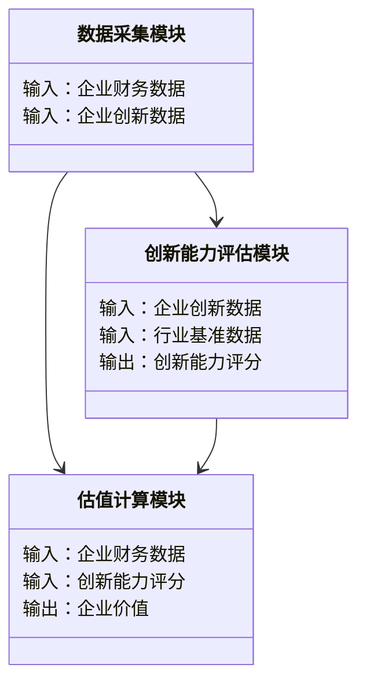

                 

# 如何在估值中考虑企业的创新能力

> 关键词：企业估值，创新能力，创新评估，创新驱动模型，企业价值评估，创新能力量化

> 摘要：本文详细探讨了在企业估值过程中如何考虑创新能力这一关键因素。首先介绍了企业估值的基本概念和创新能力的重要性，然后分析了创新能力与企业价值之间的关系，提出了基于创新能力的估值模型，最后通过具体案例展示了创新能力在估值中的实际应用。

---

## 第1章：企业估值与创新能力概述

### 1.1 企业估值的基本概念

企业估值是通过对企业的财务状况、市场地位、发展潜力等多个方面进行综合评估，确定其市场价值的过程。常见的估值方法包括现金流折现模型（DCF）、市盈率法和市净率法等。然而，这些传统方法往往忽视了企业的创新能力，而创新能力正是企业在市场竞争中保持优势的关键因素。

### 1.2 创新能力的定义与分类

创新能力是指企业在产品、技术、商业模式等方面进行创新的能力。创新能力可以分为以下几类：
1. **技术创新能力**：企业在技术研发方面的投入和成果。
2. **产品创新能力**：企业推出新产品或改进现有产品的能力。
3. **商业模式创新能力**：企业通过创新商业模式获取竞争优势的能力。

### 1.3 创新能力与企业价值的关系

创新能力是企业核心竞争力的重要组成部分。具有强大创新能力的企业能够更快地适应市场变化，抓住新兴机会，从而提高企业价值。然而，创新能力的量化和评估是企业在估值过程中面临的挑战。

---

## 第2章：创新能力的量化与评估

### 2.1 创新能力的量化指标

为了将创新能力纳入估值模型，我们需要找到能够量化创新能力的指标。常见的指标包括：
1. **研发投入比例**：研发支出占营业收入的比例。
2. **专利数量**：企业拥有的专利数量。
3. **新产品推出频率**：企业每年推出新产品的数量。
4. **创新带来的收入增长**：创新对企业收入增长的贡献。

### 2.2 创新能力的评估方法

创新能力的评估方法可以分为定性和定量两类：
1. **定性评估**：通过对企业创新战略、管理团队创新能力的评估。
2. **定量评估**：通过对企业研发投入、专利数量等指标的分析。

---

## 第3章：创新能力驱动的企业估值模型

### 3.1 基于创新能力的现金流折现模型

传统的现金流折现模型（DCF）主要基于企业的历史财务数据进行估值，忽略了创新能力的影响。我们可以通过调整现金流预测来考虑创新能力。

$$ \text{企业价值} = \sum_{t=1}^{n} \frac{\text{现金流}_t}{(1 + r)^t} $$

其中，现金流 $t$ 可以通过企业的创新能力进行调整。例如，创新能力较强的企业的现金流增长速度可以适当提高。

### 3.2 基于创新能力的市盈率模型

市盈率模型（P/E）可以通过调整行业平均市盈率来考虑企业的创新能力。具体公式如下：

$$ \text{企业价值} = \text{市盈率} \times \text{净利润} $$

其中，市盈率可以根据企业的创新能力进行调整。例如，创新能力较强的企业的市盈率可以适当提高。

---

## 第4章：创新能力评估的系统架构

### 4.1 系统功能设计

为了将创新能力纳入估值模型，我们需要设计一个系统的创新能力评估架构。系统主要包括以下几个模块：
1. **数据采集模块**：收集企业的研发投入、专利数量等数据。
2. **创新能力评估模块**：对企业的创新能力进行定性和定量评估。
3. **估值计算模块**：基于创新能力评估结果，计算企业价值。

### 4.2 系统架构设计

系统架构可以采用模块化设计，各模块之间通过接口进行数据交互。以下是系统架构的类图：

---

## 第5章：项目实战——科技公司的估值

### 5.1 项目背景

以一家科技公司为例，我们可以通过以下步骤对其创新能力进行评估并计算企业价值。

### 5.2 数据采集与预处理

首先，收集公司的财务数据和创新数据，包括研发投入、专利数量等。

### 5.3 创新能力评估

根据创新能力的量化指标，对企业进行评分。例如，假设某科技公司的研发投入占比为10%，专利数量为50项，新产品推出频率为每年2次。根据这些数据，我们可以计算出其创新能力评分为80分（满分100分）。

### 5.4 估值计算

基于创新能力评分，调整现金流预测。假设调整后的现金流为1000万元，折现率为10%，企业价值可以计算为：

$$ \text{企业价值} = \frac{1000}{(1 + 0.1)^1} + \frac{1200}{(1 + 0.1)^2} + \frac{1300}{(1 + 0.1)^3} = 3000 \text{万元} $$

---

## 第6章：总结与展望

### 6.1 本章总结

本文详细探讨了如何在企业估值中考虑创新能力。通过提出创新能力的量化指标和基于创新能力的估值模型，我们能够更准确地评估企业的市场价值。

### 6.2 未来展望

未来的研究可以进一步完善创新能力的评估方法，探索更多创新因素对估值的影响，例如创新的可持续性和创新的市场反应等。

---

作者：AI天才研究院/AI Genius Institute & 禅与计算机程序设计艺术 /Zen And The Art of Computer Programming

