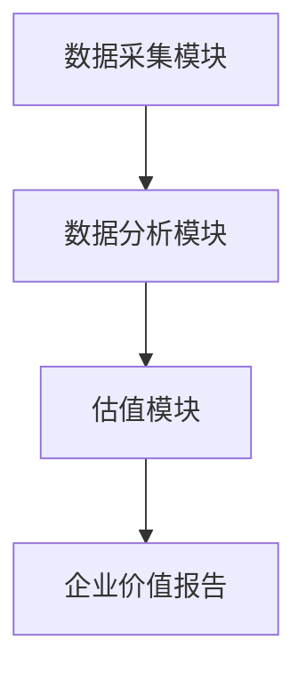
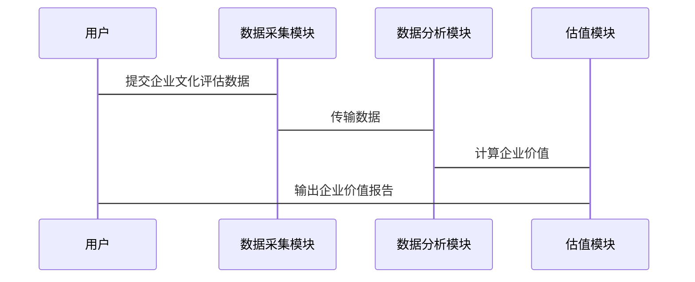

                 

# 如何在估值中考虑企业的文化因素

> 关键词：企业估值，企业文化，文化因素，财务指标，文化评估，企业绩效

> 摘要：本文将探讨如何在企业估值过程中考虑企业文化因素。传统的企业估值方法主要依赖于财务指标，但忽略了企业文化的影响力。本文通过分析企业文化的核心要素，构建企业文化评估的理论框架，并提出将企业文化因素纳入估值模型的方法，结合实际案例和数学模型，为投资者和企业管理者提供全新的视角。

---

# 第1章：企业文化与估值的背景

## 1.1 企业文化的定义与特征

### 1.1.1 企业文化的定义
企业的文化是指企业在长期经营过程中形成的，由全体员工共同遵循的价值观、信念、行为准则和习惯的总和。企业文化不仅包括显性的规章制度，还包括隐性的企业精神和员工认同感。

### 1.1.2 企业文化的核心特征
- **无形性**：企业文化是一种无形的资产，难以直接量化，但对企业运营和绩效有深远影响。
- **渗透性**：企业文化渗透到企业的各个角落，影响员工的行为方式和决策过程。
- **动态性**：企业文化会随着企业的成长和外部环境的变化而不断调整。

### 1.1.3 企业文化与企业绩效的关系
企业文化是企业绩效的核心驱动力之一。积极向上的企业文化能够提高员工的凝聚力和创造力，从而提升企业的市场竞争力和盈利能力。

---

## 1.2 估值中的文化因素

### 1.2.1 传统估值方法的局限性
传统的估值方法（如DCF模型、市盈率法等）主要依赖于财务指标，忽视了企业文化的无形价值。这种单一的估值方式可能导致评估结果的偏差。

### 1.2.2 文化因素对企业价值的影响
企业文化不仅影响企业的短期绩效，还会影响企业的长期发展潜力。例如，创新文化强的企业更容易在技术变革中保持竞争优势。

### 1.2.3 企业文化与外部环境的互动
企业文化与外部环境（如行业竞争、政策法规）密切相关。例如，在高度创新的行业，创新文化尤为重要，能够显著提升企业的估值。

---

## 1.3 企业文化的边界与外延

### 1.3.1 企业文化与组织结构的关系
企业文化通过影响组织结构来影响企业绩效。例如，扁平化的组织结构更容易形成开放、创新的企业文化。

### 1.3.2 企业文化与战略目标的关联
企业文化与战略目标是相辅相成的。例如，如果企业的战略目标是成为行业领导者，那么企业文化需要强调冒险精神和创新意识。

### 1.3.3 企业文化与外部环境的互动
企业文化通过与外部环境的互动，影响企业的市场地位和品牌价值。例如，社会责任感强的企业更容易获得消费者的信任和支持。

---

## 1.4 本章小结
本章从背景和概念入手，分析了企业文化在企业估值中的重要性，并提出了将企业文化纳入估值模型的必要性。

---

# 第2章：企业文化与企业价值的核心要素

## 2.1 企业文化的核心要素

### 2.1.1 企业愿景与使命
企业愿景和使命是企业文化的核心，它们决定了企业的长期发展方向。例如，苹果公司的愿景是“创新改变世界”，这种愿景塑造了其独特的创新文化。

### 2.1.2 企业价值观
企业价值观是企业在经营活动中所坚持的基本原则。例如，谷歌的价值观之一是“不作恶”，这种价值观影响了其业务模式和市场策略。

### 2.1.3 企业精神与文化氛围
企业精神是企业的灵魂，文化氛围是企业精神的具体体现。例如，华为的企业精神是“艰苦奋斗”，这种精神塑造了其强大的组织凝聚力。

---

## 2.2 企业文化与财务指标的关联

### 2.2.1 企业文化对收入和利润的影响
积极的企业文化能够提高员工的创造力和工作效率，从而提升企业的收入和利润。例如，创新文化强的企业更容易开发新产品，拓展市场。

### 2.2.2 企业文化对成本和效率的影响
良好的企业文化能够优化企业的管理流程，降低运营成本。例如，协作文化强的企业更容易实现资源共享和效率提升。

### 2.2.3 企业文化对资产周转率的影响
积极的企业文化能够提高资产的周转效率。例如，高效的文化氛围下，企业能够更快地将库存转化为销售，提高资产周转率。

---

## 2.3 企业文化与企业生命周期的关系

### 2.3.1 初创期的企业文化特征
初创期的企业文化通常以生存和速成为导向，强调冒险精神和执行力。

### 2.3.2 成长期的企业文化调整
成长期的企业需要根据市场需求和内部能力调整企业文化，例如从“速度优先”转向“质量优先”。

### 2.3.3 成熟期的企业文化优化
成熟期的企业需要优化企业文化，使其更加稳定和可持续，例如加强品牌建设和员工培训。

---

## 2.4 本章小结
本章分析了企业文化的核心要素及其与财务指标的关系，并探讨了企业文化与企业生命周期的互动。

---

# 第3章：企业文化评估的理论框架

## 3.1 企业文化评估的核心维度

### 3.1.1 企业凝聚力评估
企业凝聚力是衡量企业文化强弱的重要指标。例如，通过员工满意度调查可以评估企业的凝聚力。

### 3.1.2 企业创新文化评估
创新文化是企业持续发展的关键。例如，可以通过专利申请数量和新产品开发速度来评估创新文化。

### 3.1.3 企业员工满意度评估
员工满意度是企业文化的重要体现。例如，通过员工调查可以评估员工对企业文化的认同感和归属感。

---

## 3.2 企业文化评估的指标体系

### 3.2.1 文化感知度指标
文化感知度指标包括员工对企业愿景和价值观的认同程度。例如，可以通过问卷调查收集员工对企业的文化感知。

### 3.2.2 文化契合度指标
文化契合度指标包括员工的行为规范和工作态度。例如，可以通过观察员工的工作行为来评估文化契合度。

### 3.2.3 文化影响力指标
文化影响力指标包括企业文化对企业外部形象和品牌价值的影响。例如，可以通过品牌价值评估来衡量文化影响力。

---

## 3.3 企业文化评估的工具与方法

### 3.3.1 文化评估问卷设计
设计问卷时需要包括企业文化的核心要素，例如愿景、价值观、创新意识等。

### 3.3.2 文化访谈法
通过与企业管理层和员工的深度访谈，了解企业文化的真实情况。

### 3.3.3 文化分析模型
文化分析模型可以通过构建企业文化维度和权重，对企业文化进行综合评估。

---

## 3.4 本章小结
本章提出了企业文化评估的核心维度和指标体系，并介绍了常用的评估工具和方法。

---

# 第4章：企业文化对企业绩效的影响机制

## 4.1 企业文化对企业战略的影响

### 4.1.1 企业文化与战略一致性
企业文化与企业战略的一致性是影响战略成功的关键因素。例如，创新文化与技术驱动的战略相匹配。

### 4.1.2 企业文化对战略执行的影响
良好的企业文化能够提高战略执行的效率和效果。例如，协作文化强的企业更容易实现跨部门协作。

### 4.1.3 企业文化与竞争优势的关系
企业文化是企业竞争优势的重要来源。例如，独特的企业文化能够提升企业的品牌价值和市场地位。

---

## 4.2 企业文化对员工行为的引导作用

### 4.2.1 企业文化对员工决策的影响
企业文化通过影响员工的价值观和行为准则，引导员工的决策。例如，诚信文化能够减少员工的道德风险。

### 4.2.2 企业文化对员工创新行为的激励作用
创新文化能够激发员工的创造力和创新意识。例如，鼓励员工提出新想法和解决方案。

### 4.2.3 企业文化对员工忠诚度的影响
积极的企业文化能够提高员工的忠诚度。例如，公平和透明的企业文化能够增强员工的归属感。

---

## 4.3 企业文化对组织结构的塑造作用

### 4.3.1 企业文化与组织扁平化
扁平化的组织结构更容易形成开放和协作的企业文化。例如，互联网企业的组织结构通常较为扁平。

### 4.3.2 企业文化与部门协作效率
良好的企业文化能够提高部门之间的协作效率。例如，团队文化强的企业更容易实现高效协作。

### 4.3.3 企业文化与团队凝聚力
积极的企业文化能够增强团队的凝聚力。例如，团队建设活动能够提升员工之间的信任和合作精神。

---

## 4.4 本章小结
本章分析了企业文化对企业战略、员工行为和组织结构的影响机制。

---

# 第5章：企业文化与企业估值的数学模型

## 5.1 企业文化评估的数学模型

### 5.1.1 文化评估指标的权重分配
通过主成分分析法确定各个文化评估指标的权重。

### 5.1.2 企业文化得分计算
根据权重和具体指标值计算企业文化得分。例如，使用加权平均法计算企业文化指数。

### 5.1.3 企业文化对财务指标的影响系数
通过回归分析法确定企业文化对企业财务指标的影响系数。

---

## 5.2 企业文化对估值的影响公式

### 5.2.1 估值模型的基本公式
$$ 企业价值 = 财务价值 + 文化价值 $$

### 5.2.2 文化价值的计算公式
$$ 文化价值 = 企业文化得分 \times 影响系数 $$

---

## 5.3 企业文化对估值的具体应用

### 5.3.1 案例分析
以某科技公司为例，计算其企业文化对估值的影响。例如，假设企业文化得分为0.8，影响系数为0.2，则文化价值为0.16，最终企业价值为财务价值+0.16。

### 5.3.2 数学模型的验证
通过实证分析验证数学模型的有效性和准确性。例如，比较模型预测值与实际估值的差异。

---

## 5.4 本章小结
本章构建了企业文化评估的数学模型，并通过案例分析验证了模型的可行性。

---

# 第6章：企业文化与估值的系统架构与实施

## 6.1 系统架构设计

### 6.1.1 系统功能模块
- 数据采集模块：收集企业文化评估指标和财务数据。
- 数据分析模块：计算企业文化得分和影响系数。
- 估值模块：结合财务价值和文化价值计算企业价值。

### 6.1.2 系统架构图

---

## 6.2 系统接口设计

### 6.2.1 数据接口
- 输入接口：企业文化评估指标和财务数据。
- 输出接口：企业价值报告。

### 6.2.2 API设计
- GET /culture-score：获取企业文化得分。
- GET /value-impact：获取文化对估值的影响系数。

---

## 6.3 系统交互流程

### 6.3.1 交互序列图

---

## 6.4 本章小结
本章从系统架构的角度，详细设计了企业文化与估值的实施框架，并提出了具体的接口设计和交互流程。

---

# 第7章：企业文化与估值的最佳实践与未来展望

## 7.1 最佳实践

### 7.1.1 企业文化评估的注意事项
- 确保评估指标的科学性和合理性。
- 综合考虑企业内部和外部环境的影响。

### 7.1.2 估值模型的应用建议
- 根据企业的实际情况调整模型参数。
- 定期更新企业文化评估指标和影响系数。

---

## 7.2 未来展望

### 7.2.1 文化评估的智能化
随着人工智能和大数据技术的发展，未来的企业文化评估将更加智能化和自动化。

### 7.2.2 估值模型的优化
未来可以通过引入更多的数据源和模型优化方法，进一步提高估值的准确性和科学性。

### 7.2.3 行业应用的拓展
未来可以进一步研究不同行业的企业文化特点，制定更具针对性的估值方法。

---

## 7.3 本章小结
本章总结了企业文化与估值的最佳实践，并展望了未来的研究方向。

---

# 第8章：结论与建议

## 8.1 研究结论

### 8.1.1 核心结论
- 企业文化是企业估值的重要组成部分。
- 企业文化通过影响企业绩效和外部形象，显著影响企业的市场价值。

### 8.1.2 研究意义
- 本研究为投资者和企业管理者提供了全新的估值视角。
- 本研究为企业的文化管理提供了理论依据和实践指导。

---

## 8.2 实践建议

### 8.2.1 投资者建议
- 在企业估值中引入企业文化评估指标。
- 结合企业的实际特点调整估值模型。

### 8.2.2 企业管理者建议
- 加强企业文化建设，提升企业的核心竞争力。
- 定期评估企业文化对企业绩效的影响。

---

## 8.3 本章小结
本章总结了研究的主要结论，并提出了具体的实践建议。

---

# 附录

## 附录A：企业文化评估问卷模板

## 附录B：相关文献参考

---

# 参考文献

1. 文献1：企业文化的定义与特征，作者：XXX。
2. 文献2：企业文化对绩效的影响机制，作者：XXX。
3. 文献3：企业估值的方法与模型，作者：XXX。
4. 文献4：企业文化与企业生命周期的关系，作者：XXX。

---

# 作者：AI天才研究院 & 禅与计算机程序设计艺术

