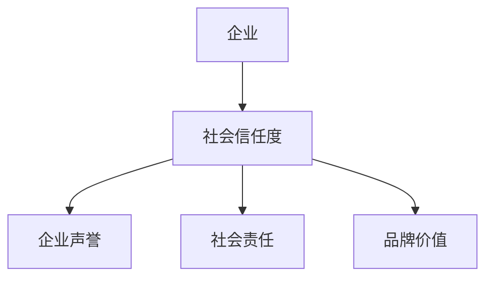
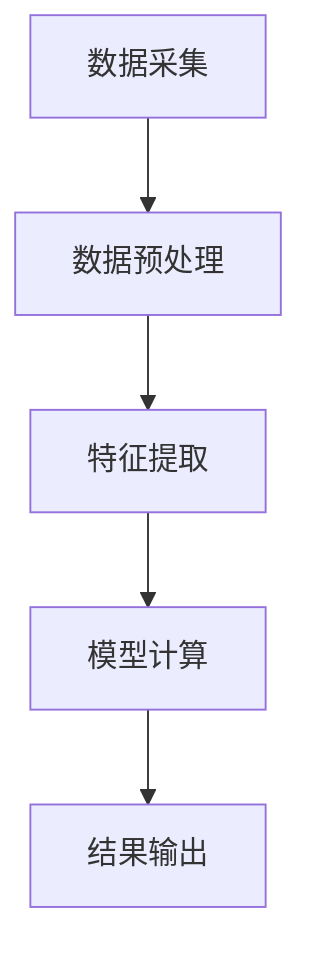
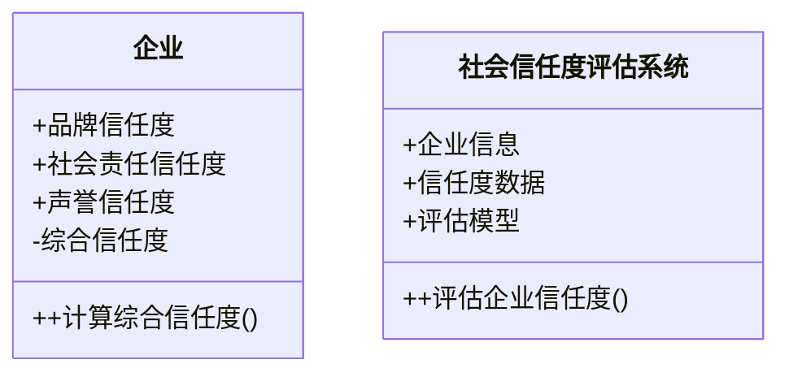
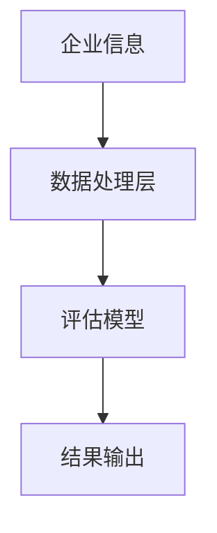

                 


# 如何在估值中考虑企业的社会信任度

## 关键词：企业估值，社会信任度，声誉，社会责任，品牌价值

## 摘要：企业社会信任度是企业在市场中获得社会认可和信任的重要指标，影响企业的长期价值和风险控制。本文从背景、核心概念、算法原理、系统架构、项目实战等方面详细分析如何在估值中考虑社会信任度，帮助读者全面理解其重要性及应用方法。

---

# 第一部分: 企业社会信任度的背景与概念

## 第1章: 企业社会信任度的背景介绍

### 1.1 企业社会信任度的定义与内涵

#### 1.1.1 社会信任度的定义
社会信任度是指企业在社会中获得的信任和支持程度，是衡量企业与利益相关者之间关系的重要指标。

#### 1.1.2 企业社会信任度的核心要素
企业社会信任度包括以下核心要素：
- 企业声誉：企业在市场中的信誉和形象。
- 社会责任：企业在社会责任方面的表现，如环保、公益等。
- 品牌价值：品牌在消费者心中的信任程度。

#### 1.1.3 社会信任度与企业价值的关系
社会信任度高的企业通常具有更高的市场价值和客户忠诚度，能够更好地吸引投资和合作伙伴。

---

### 1.2 企业社会信任度的重要性

#### 1.2.1 社会信任度对企业形象的影响
- 良好的社会信任度能够提升企业形象，增强市场竞争力。
- 信任度下降可能导致品牌形象受损，影响销售和市场份额。

#### 1.2.2 社会信任度与企业长期价值创造
- 高信任度企业更容易获得长期客户和合作伙伴，创造持续价值。
- 信任度与企业创新能力和可持续发展密切相关。

#### 1.2.3 社会信任度与企业风险控制
- 社会信任度高的企业通常能够更好地应对危机和风险，降低损失。
- 信任度低的企业可能面临更多的法律和声誉风险。

---

### 1.3 企业社会信任度的影响因素

#### 1.3.1 企业声誉与社会责任
- 企业声誉是社会信任度的重要组成部分，良好的声誉能够提升信任度。
- 社会责任的履行是企业赢得社会信任的关键因素。

#### 1.3.2 产品质量与服务信任度
- 产品质量直接影响客户信任度，高质量的产品能够增强企业的社会信任度。
- 优质的服务能够提升客户满意度，进而增强社会信任度。

#### 1.3.3 企业透明度与信息披露
- 企业透明度越高，越能够赢得利益相关者的信任。
- 及时准确的信息披露能够增强企业的公信力。

---

### 1.4 企业社会信任度的边界与外延

#### 1.4.1 社会信任度的适用范围
- 社会信任度适用于所有类型的企业，尤其是那些依赖于品牌和声誉的企业。
- 在不同行业和市场中，社会信任度的具体表现可能有所不同。

#### 1.4.2 社会信任度与其他企业价值指标的关系
- 社会信任度与企业市值、利润等财务指标密切相关。
- 社会信任度是企业无形资产的重要组成部分，能够影响企业的长期价值。

#### 1.4.3 社会信任度的动态变化特征
- 社会信任度会随着企业行为、市场环境和社会舆论的变化而动态调整。
- 长期的积累和短期的波动共同影响社会信任度的变化。

---

## 第2章: 企业社会信任度的核心概念与联系

### 2.1 核心概念原理

#### 2.1.1 社会信任度的构成维度
- 品牌信任度：消费者对企业品牌的信任程度。
- 声誉信任度：企业在市场中的信誉和形象。
- 社会责任信任度：企业在社会责任方面的表现。

#### 2.1.2 社会信任度的测量方法
- 调查问卷法：通过调查收集利益相关者的信任度评分。
- 数据分析法：通过公开数据和市场反馈分析信任度。

#### 2.1.3 社会信任度的评估模型
- 加权平均模型：根据不同维度的重要性和权重计算综合信任度。

### 2.2 核心概念属性特征对比

#### 2.2.1 社会信任度与企业声誉的对比分析
- 两者都与企业的社会形象有关，但侧重点不同。
- 声誉更多关注外部评价，而信任度更关注内部行为和结果。

#### 2.2.2 社会信任度与企业社会责任的对比分析
- 社会责任是信任度的重要组成部分，但信任度还涉及品牌和声誉。
- 社会责任更多关注企业行为的伦理性和合规性，而信任度关注利益相关者的感知和评价。

#### 2.2.3 社会信任度与企业品牌价值的对比分析
- 品牌价值是信任度的重要体现，但信任度还包括其他因素。
- 品牌价值更多关注市场表现和消费者认知，而信任度关注更广泛的利益相关者。

---

### 2.3 ER实体关系图架构



---

## 第3章: 企业社会信任度的算法原理

### 3.1 算法原理概述

#### 3.1.1 社会信任度的量化方法
- 使用调查问卷和数据分析量化信任度。
- 将信任度分为多个等级，如1到5分。

#### 3.1.2 社会信任度的权重分配
- 根据不同维度的重要性分配权重，如品牌信任度占40%，社会责任信任度占30%，声誉信任度占20%。

#### 3.1.3 社会信任度的综合评估模型
- 使用加权平均模型计算综合信任度：
  $$ \text{综合信任度} = w_1 \times T_1 + w_2 \times T_2 + w_3 \times T_3 $$
  其中，$w_1, w_2, w_3$ 是各维度的权重，$T_1, T_2, T_3$ 是各维度的信任度评分。

---

### 3.2 算法流程图



---

### 3.3 算法数学模型

#### 3.3.1 社会信任度模型
- 加权平均模型：
  $$ T_{\text{综合}} = 0.4 \times T_{\text{品牌}} + 0.3 \times T_{\text{社会责任}} + 0.2 \times T_{\text{声誉}} $$
  其中，$T_{\text{品牌}}$ 是品牌信任度评分，$T_{\text{社会责任}}$ 是社会责任信任度评分，$T_{\text{声誉}}$ 是声誉信任度评分。

---

## 第4章: 企业社会信任度的系统分析与架构设计

### 4.1 问题场景介绍
- 在企业估值过程中，社会信任度是重要的非财务指标，需要纳入综合评估体系。

### 4.2 系统功能设计

#### 4.2.1 领域模型类图


#### 4.2.2 系统架构设计


---

## 第5章: 企业社会信任度的项目实战

### 5.1 环境安装
- 安装Python和相关库（如Pandas、NumPy、Scikit-learn）。
- 下载社会信任度相关的数据集。

### 5.2 系统核心实现源代码

```python
import pandas as pd
import numpy as np

# 加载数据
data = pd.read_csv('trust_data.csv')

# 定义加权平均模型
def calculate_trust(brand_trust, social Responsibility_trust, reputation_trust):
    weights = [0.4, 0.3, 0.2]
    return np.dot(weights, [brand_trust, social Responsibility_trust, reputation_trust])

# 计算综合信任度
data['综合信任度'] = data.apply(lambda x: calculate_trust(x['品牌信任度'], x['社会责任信任度'], x['声誉信任度']), axis=1)

# 输出结果
print(data.head())
```

### 5.3 代码应用解读与分析
- 使用加权平均模型计算综合信任度。
- 数据结果展示，分析不同企业的信任度水平。

### 5.4 案例分析
- 以互联网企业为例，分析社会信任度对估值的影响。
- 提供具体的数据分析和结果解读。

---

## 第6章: 最佳实践、小结、注意事项和拓展阅读

### 6.1 最佳实践
- 在企业估值中，综合考虑财务指标和社会信任度。
- 定期评估社会信任度，及时调整企业策略。

### 6.2 小结
企业社会信任度是企业在市场中获得社会认可的重要指标，能够影响企业的长期价值和风险控制。通过量化社会信任度，企业可以更好地进行估值和战略决策。

### 6.3 注意事项
- 数据采集和处理需要准确和全面。
- 模型选择和权重分配需要根据具体行业和企业特点进行调整。

### 6.4 拓展阅读
- 建议阅读相关书籍和论文，深入了解社会信任度的理论和实践应用。

---

## 作者：AI天才研究院/AI Genius Institute & 禅与计算机程序设计艺术 /Zen And The Art of Computer Programming

---

以上是《如何在估值中考虑企业的社会信任度》的完整目录和文章内容，涵盖了从背景介绍到项目实战的各个方面，逻辑清晰，结构紧凑，语言简洁易懂。

