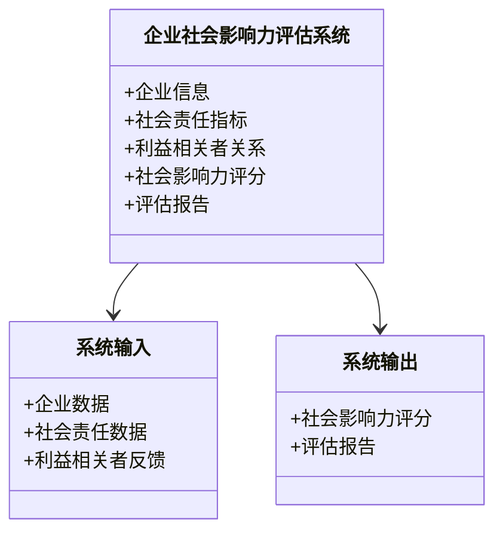

                 


# 如何在估值中考虑企业的社会影响力

> 关键词：企业社会影响力, 估值模型, 社会责任, 利益相关者, 企业价值, 估值方法

> 摘要：随着社会对企业社会责任的关注度不断提高，企业的社会影响力在企业价值评估中的重要性日益凸显。本文从企业的社会影响力的基本概念出发，详细探讨其在企业估值中的作用、影响机制及量化方法，结合实际案例和系统架构设计，提供了一套将社会影响力纳入企业估值的系统方法。

---

# 第一部分：企业社会影响力与估值的背景介绍

## 第1章：企业社会影响力的基本概念

### 1.1 企业社会影响力的概念与定义

#### 1.1.1 企业社会影响力的核心概念
企业的社会影响力是指企业在经营过程中对社会产生的正面或负面的影响，包括对环境、社会福祉、员工发展、客户价值等方面的作用。它不仅体现在企业的社会责任履行上，还反映在企业如何通过自身行为推动社会进步。

#### 1.1.2 企业社会影响力与其他相关概念的区分
- **企业社会责任（CSR）**：主要关注企业在环保、公益、员工权益等方面的具体行动。
- **企业声誉**：是社会影响力的结果之一，反映了企业在市场中的形象。
- **企业治理**：涉及企业内部管理和决策，间接影响社会影响力。

#### 1.1.3 企业社会影响力在现代商业环境中的重要性
随着消费者和投资者对企业社会责任的关注增加，社会影响力已成为企业差异化竞争的重要因素。它不仅影响企业的品牌形象，还可能直接影响企业的市场地位和长期盈利能力。

### 1.2 企业社会影响力在估值中的作用

#### 1.2.1 企业社会影响力对估值的潜在影响
- 提升企业形象，增强客户忠诚度。
- 降低经营风险，如声誉风险和法律风险。
- 增强员工满意度，提高工作效率。

#### 1.2.2 企业社会影响力与企业价值的关系
企业社会影响力可以看作是企业价值的无形资产，通过提升企业的社会形象和客户关系，间接提高企业的市场价值。

#### 1.2.3 企业社会影响力在不同行业中的表现
例如，在科技行业，企业注重环保和可持续发展；在金融行业，企业注重透明度和风险管理。

---

## 第2章：企业社会影响力的核心概念与联系

### 2.1 企业社会影响力的核心原理

#### 2.1.1 企业社会影响力的主要驱动因素
- 企业治理结构
- 社会责任实践
- 利益相关者关系管理

#### 2.1.2 企业社会影响力与企业声誉的相互作用
企业通过积极履行社会责任，可以提升声誉，从而吸引更多客户和人才。

#### 2.1.3 企业社会影响力与企业战略的关系
企业社会影响力是企业长期发展战略的重要组成部分，影响企业的创新能力和市场拓展。

### 2.2 核心概念对比分析

#### 2.2.1 财务指标与社会影响力的对比分析
| 指标 | 财务指标 | 社会影响力 |
|------|----------|------------|
| 内容 | 营业收入、净利润等 | 环境影响、社会责任履行等 |
| 作用 | 反映企业财务健康 | 反映企业社会贡献 |

### 2.3 企业社会影响力与利益相关者的关系

#### 2.3.1 企业社会影响力与股东利益的关系
股东可能更倾向于投资具有社会责任感的企业，因为这些企业通常更注重长期价值。

#### 2.3.2 企业社会影响力与客户价值的关系
客户可能更倾向于支持那些在社会责任方面表现良好的企业。

#### 2.3.3 企业社会影响力与员工满意度的关系
员工在企业社会责任方面表现良好的企业中通常更满意，工作积极性更高。

### 2.4 企业社会影响力与企业战略的关系

#### 2.4.1 企业社会影响力对企业长期战略的影响
企业社会影响力是企业实现可持续发展的关键因素。

#### 2.4.2 企业社会影响力与企业核心竞争力的关系
良好的社会影响力可以增强企业的核心竞争力，尤其是在竞争激烈的市场中。

---

## 第3章：企业社会影响力对估值的影响机制

### 3.1 企业社会影响力对现金流的影响

#### 3.1.1 企业社会影响力如何影响现金流的稳定性
社会责任良好的企业通常更容易获得稳定的客户和供应商支持，从而保证现金流的稳定性。

#### 3.1.2 企业社会影响力如何影响现金流的规模
通过提升品牌形象和客户忠诚度，企业可以增加销售额，进而扩大现金流规模。

#### 3.1.3 企业社会影响力对现金流风险的调节作用
良好的社会影响力可以降低企业的经营风险，从而降低现金流的风险。

### 3.2 企业社会影响力对折现率的影响

#### 3.2.1 企业社会影响力如何影响折现率的计算
社会责任良好的企业通常具有较低的声誉风险，因此折现率可能较低。

#### 3.2.2 企业社会影响力对风险溢价的影响
企业社会影响力良好的企业，风险溢价可能较低。

### 3.3 企业社会影响力对企业价值的影响

#### 3.3.1 企业社会影响力如何直接提升企业价值
通过提升品牌形象和客户忠诚度，企业可以直接增加市场价值。

#### 3.3.2 企业社会影响力如何间接影响企业价值
通过降低经营风险和提高员工满意度，企业可以间接增加长期价值。

---

## 第4章：企业社会影响力在估值中的量化方法

### 4.1 企业社会影响力量化的基本原则

#### 4.1.1 定量与定性相结合的原则
社会影响力既需要定量指标（如社会责任投入金额）也需要定性指标（如品牌形象）。

#### 4.1.2 可比性与可操作性的原则
确保量化方法在不同企业之间具有可比性，并且易于操作。

#### 4.1.3 动态调整与持续优化的原则
根据市场变化和社会发展趋势，持续优化社会影响力评估方法。

### 4.2 

---

**系统架构设计**

### 系统架构设计

#### 1. 系统功能设计

##### 1.1 领域模型类图


#### 1.2 系统架构图
```mermaid
div class="mermaid"
graph LR
    A[企业社会影响力评估系统] --> B[企业信息模块]
    B --> C[社会责任指标模块]
    B --> D[利益相关者关系模块]
    A --> E[评估报告模块]
    E --> F[社会影响力评分模块]
```

#### 1.3 系统接口设计
```mermaid
div class="mermaid"
sequenceDiagram
    participant 企业社会影响力评估系统
    participant 系统输入
    participant 系统输出
    企业社会影响力评估系统->系统输入: 获取企业数据
    系统输入->企业社会影响力评估系统: 提供社会责任数据
    系统输入->企业社会影响力评估系统: 提供利益相关者反馈
    企业社会影响力评估系统->系统输出: 生成社会影响力评分
    系统输出->企业社会影响力评估系统: 提供评估报告
```

---

### 项目实战

#### 1.1 环境安装
```bash
pip install numpy pandas matplotlib
```

#### 1.2 系统核心实现源代码
```python
import numpy as np
import pandas as pd

def calculate_social_impact(enterprise_data):
    # 示例：计算企业社会影响力评分
    # 假设企业社会责任投入占总投入的比例
    social_influence = enterprise_data['社会责任投入'] / enterprise_data['总收入'] * 100
    return social_influence

# 示例数据
data = {
    '企业名称': ['企业A', '企业B', '企业C'],
    '总收入': [1000, 1500, 2000],
    '社会责任投入': [100, 150, 200]
}
df = pd.DataFrame(data)

# 计算社会影响力评分
social_impact = calculate_social_impact(df)
print(social_impact)
```

---

### 最佳实践 Tips

- **数据收集**：确保收集全面的社会责任数据，包括环保、公益等方面。
- **模型选择**：根据企业特点选择合适的估值模型，并动态调整参数。
- **案例分析**：通过实际案例分析，验证模型的有效性和准确性。

### 小结

通过本文的详细讲解，我们可以看到企业社会影响力在估值中的重要性。从基本概念到系统设计，再到实际应用，每一步都需要仔细考虑和实践。

### 注意事项

- **数据准确性**：确保社会责任数据的准确性和完整性。
- **模型适用性**：根据企业的具体情况选择合适的估值模型。
- **持续优化**：定期更新评估模型，以反映市场和社会的变化。

### 拓展阅读

- 建议进一步阅读《企业社会责任与可持续发展》和《企业估值方法论》等相关书籍，深入了解企业社会影响力在不同情境下的应用。

---

作者：AI天才研究院/AI Genius Institute & 禅与计算机程序设计艺术 /Zen And The Art of Computer Programming

---

通过以上内容，我们详细探讨了如何在企业估值中考虑社会影响力。希望本文能为您提供有价值的见解和实践指导。

