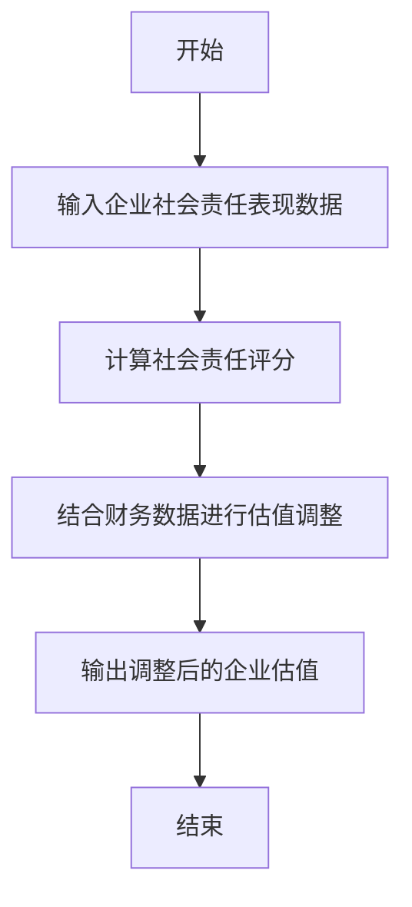
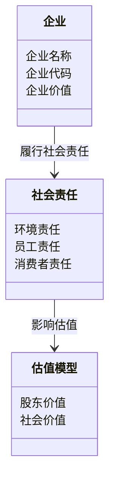
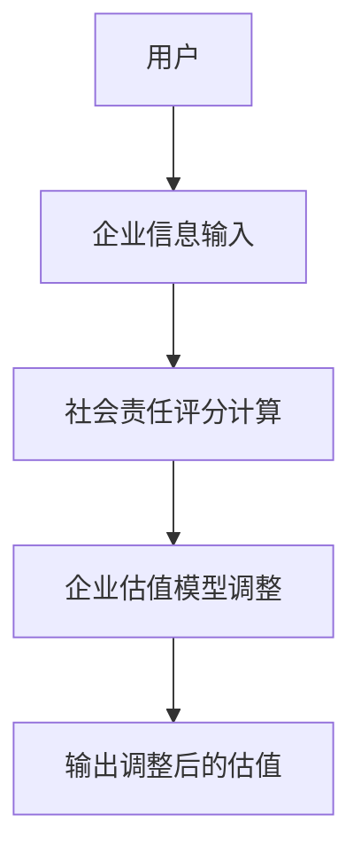

                 


```markdown
# 如何在估值中考虑企业的社会责任

> 关键词：企业社会责任，企业估值，可持续发展，外部性，社会影响

> 摘要：本文系统地探讨了如何在企业估值过程中考虑社会责任这一关键问题。通过分析社会责任对企业价值的影响，提出了一种结合社会责任的多维度企业估值方法，旨在帮助投资者和企业管理者更好地评估企业的真实价值。

---

## 第1章: 企业社会责任的基本概念

### 1.1 企业社会责任的定义与内涵

企业社会责任（Corporate Social Responsibility, CSR）是指企业在追求经济利益的同时，对社会、环境和利益相关者承担的责任。这些责任包括但不限于遵守法律法规、保护环境、促进员工福祉、支持社区发展、维护公平竞争等。

#### 1.1.1 企业社会责任的定义
企业社会责任不仅限于企业的外部行为，还涉及企业的内部管理和决策过程。CSR强调企业在创造经济价值的同时，也要关注其行为对社会和环境的长期影响。

#### 1.1.2 企业社会责任的核心要素
- **环境责任**：减少资源消耗和污染排放。
- **员工责任**：保障员工的合法权益和工作条件。
- **消费者责任**：提供安全、优质的产品和服务。
- **社会公平**：避免不公平竞争，支持弱势群体。
- **透明与诚信**：确保信息披露的准确性和决策的透明性。

#### 1.1.3 企业社会责任的边界与外延
企业社会责任的边界包括企业的内部员工、外部客户、供应商、股东和社会公众。其外延则涉及企业在全球价值链中的行为对全球社会的影响。

---

### 1.2 企业社会责任的历史演变

#### 1.2.1 传统企业观与社会责任的萌芽
传统的企业观认为，企业的唯一目标是为股东创造最大化的经济价值。然而，随着社会问题的加剧，企业社会责任逐渐成为企业治理的重要组成部分。

#### 1.2.2 现代企业社会责任的兴起
20世纪末，随着环境问题、社会不平等等问题的凸显，企业社会责任的概念逐渐被学术界和企业界所重视。越来越多的企业开始将社会责任纳入其战略规划。

#### 1.2.3 全球化背景下的社会责任发展
在全球化背景下，企业社会责任的内涵进一步扩展。企业不仅需要关注本地的社会责任，还需要考虑其全球供应链、生产和消费对全球社会的影响。

---

### 1.3 企业社会责任与企业价值的关系

#### 1.3.1 企业社会责任对企业价值的影响
- **正面影响**：良好的社会责任实践可以提升企业的声誉，增强品牌价值，吸引更多的消费者和投资者。
- **负面影响**：社会责任缺失可能导致企业面临法律风险、声誉损失和消费者抵制。

#### 1.3.2 社会责任缺失对企业价值的潜在风险
- **声誉损失**：社会责任缺失可能导致企业被贴上“不道德”的标签，进而影响其市场地位。
- **法律风险**：违反社会责任可能导致罚款、诉讼和行政处罚，增加企业的财务负担。
- **员工流失**：社会责任缺失可能导致员工不满，进而影响企业的生产力和创新能力。

#### 1.3.3 社会责任履行与企业可持续发展的关联
企业社会责任的履行是实现可持续发展的重要基础。只有在实现经济、社会和环境效益的平衡，企业才能实现长期的可持续发展。

---

## 第2章: 估值中的社会责任问题背景

### 2.1 传统企业估值方法的局限性

#### 2.1.1 财务指标的局限性
传统的财务指标（如净利润、市盈率等）无法全面反映企业的社会责任表现。

#### 2.1.2 忽略外部性的影响
传统估值方法通常忽略企业行为对社会和环境的外部性影响，例如污染排放、员工待遇等。

#### 2.1.3 企业社会责任缺失的潜在风险
社会责任缺失可能导致企业的长期风险增加，进而影响其估值的准确性。

---

### 2.2 社会责任对企业估值的影响

#### 2.2.1 社会责任与企业声誉的关系
良好的社会责任表现可以提升企业的声誉，从而增强其市场竞争力和品牌价值。

#### 2.2.2 社会责任与企业风险的关联
社会责任缺失可能导致企业面临更大的法律和声誉风险，从而影响其估值的稳定性。

#### 2.2.3 社会责任与企业长期价值的联系
企业社会责任的履行是其实现可持续发展的重要基础，而可持续发展能力的强弱直接影响企业的长期价值。

---

### 2.3 本章小结

- **核心问题**：传统估值方法未能充分考虑企业社会责任的影响。
- **解决方向**：需要引入社会责任因素，构建更加全面的企业估值模型。

---

## 第3章: 企业社会责任与估值的核心概念与联系

### 3.1 核心概念的原理分析

#### 3.1.1 企业社会责任的经济学解释
从经济学的角度来看，企业社会责任是企业对其行为所产生外部性的一种内化。企业通过承担社会责任，可以减少其行为对社会和环境的负面影响。

#### 3.1.2 社会责任与企业行为的关系
企业社会责任与企业行为密切相关。企业的决策和行为直接影响其社会责任的表现。

#### 3.1.3 社会责任与企业利益的平衡点
企业需要在社会责任履行和经济利益之间找到平衡点，以实现可持续发展。

---

### 3.2 核心概念的属性特征对比表

| 属性        | 企业社会责任         | 企业利润       |
|-------------|----------------------|---------------|
| 核心目标     | 提升社会福祉         | 最大化经济利益 |
| 关键因素     | 环境保护、员工福利   | 销售收入、成本 |
| 影响范围     | 社会、环境、利益相关者 | 股东、管理层   |
| 时间维度     | 长期                 | 短期           |

---

### 3.3 ER实体关系图

```mermaid
erDiagram
    actor 企业 {
        string 企业名称
        integer 企业代码
    }
    actor 社会责任 {
        boolean 环境责任
        boolean 员工责任
        boolean 消费者责任
        boolean 社会公平
        boolean 透明与诚信
    }
    actor 估值模型 {
        float 企业价值
        float 股东价值
        float 社会价值
    }
    企业 --> 社会责任 : 履行社会责任
    社会责任 --> 估值模型 : 影响企业价值
```

---

### 3.4 算法原理讲解

#### 3.4.1 算法概述
企业社会责任影响企业估值的算法模型如下：

1. **输入**：企业社会责任表现数据。
2. **处理**：将社会责任表现与企业财务数据结合，调整企业估值。
3. **输出**：调整后的企业估值。

#### 3.4.2 算法流程图



#### 3.4.3 算法数学模型

企业社会责任调整后的估值公式：

$$
\text{调整后估值} = \text{传统估值} \times (1 + \text{社会责任评分})
$$

其中，$\text{社会责任评分}$ 是一个介于0和1之间的分数，表示企业在社会责任方面的表现。

---

## 第4章: 系统分析与架构设计方案

### 4.1 问题场景介绍

- **问题背景**：企业社会责任对企业估值的影响需要通过系统化的方法进行分析。
- **项目目标**：构建一个结合社会责任因素的企业估值系统。

### 4.2 系统功能设计

#### 4.2.1 领域模型



#### 4.2.2 系统架构设计



---

## 第5章: 项目实战

### 5.1 环境影响分析

#### 5.1.1 环境影响的计算公式

$$
\text{环境影响评分} = \frac{\text{单位产品能耗}}{\text{行业基准能耗}} \times 100
$$

---

## 作者：AI天才研究院/AI Genius Institute & 禅与计算机程序设计艺术 /Zen And The Art of Computer Programming
```

