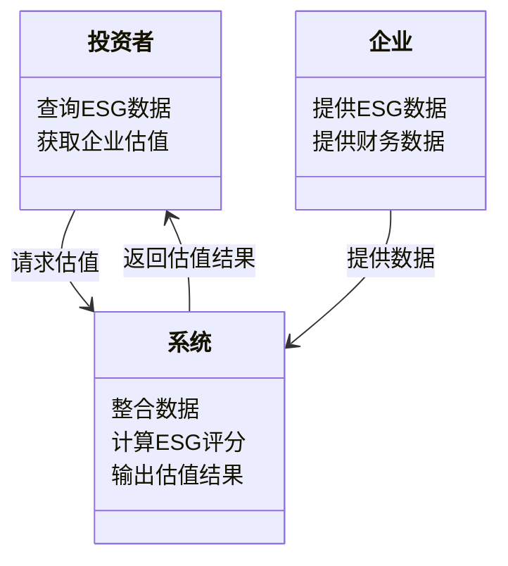

                 


# 如何在估值中考虑企业的社会责任投资

> 关键词：企业社会责任投资，ESG，估值模型，算法，数据处理，案例分析

> 摘要：企业社会责任投资（ESG）已成为现代投资决策中不可或缺的一部分。本文详细探讨了如何在企业估值中纳入社会责任投资因素，通过分析ESG的环境、社会和治理维度，结合数学模型和实际案例，展示如何通过算法优化和系统设计提升企业估值的准确性和可持续性。

---

## 第一部分: 企业社会责任投资与估值基础

### 第1章: 企业社会责任投资概述

#### 1.1 企业社会责任投资的定义与背景

企业社会责任投资（ESG）是指在投资决策过程中，除了考虑传统的财务指标外，还关注企业在环境、社会和治理方面的表现。这种投资策略不仅关注企业的盈利能力，还关注其对社会和环境的积极影响。

**1.1.1 企业社会责任的定义**  
企业社会责任（Corporate Social Responsibility, CSR）是指企业在追求经济效益的同时，还要承担对社会和环境的责任。这包括减少污染、保护员工权益、推动社会公平等方面。

**1.1.2 社会责任投资的兴起与发展趋势**  
随着全球对可持续发展的关注增加，社会责任投资（ESG）逐渐成为投资界的主流趋势。越来越多的投资者意识到，企业对环境和员工的管理不仅影响企业的声誉，还会影响其长期盈利能力。

**1.1.3 企业社会责任与估值的关系**  
企业在社会责任方面的表现直接影响其风险和收益。例如，一家在环境保护方面表现不佳的企业可能面临更高的监管风险和声誉损失，从而影响其估值。

---

#### 1.2 企业社会责任投资的核心概念

**1.2.1 环境（Environmental）维度**  
环境维度关注企业在资源利用、污染排放、气候变化等方面的表现。例如，企业是否采用可再生能源、是否符合环保法规等。

**1.2.2 社会（Social）维度**  
社会维度关注企业在员工权益、社区贡献、产品安全等方面的表现。例如，企业是否保障员工的合法权益、是否积极参与社区公益项目等。

**1.2.3 治理（Governance）维度**  
治理维度关注企业在公司治理结构、董事会构成、透明度等方面的表现。例如，企业是否建立有效的内部控制机制、是否遵循透明的财务报告等。

---

## 第二部分: 企业社会责任投资的核心概念与联系

### 第2章: 企业社会责任投资的核心要素

#### 2.1 企业社会责任投资的属性特征对比

| 维度   | 环境（Environmental） | 社会（Social） | 治理（Governance） |
|--------|----------------------|---------------|--------------------|
| 关注点 | 环境影响、资源利用    | 员工权益、社区 | 公司治理结构、透明度 |
| 例子   | 减少碳排放            | 公平对待员工   | 董事会多样性        |

从上表可以看出，环境、社会和治理三个维度各有侧重，但又相互关联。例如，良好的公司治理可以促进企业更好地履行社会责任，从而降低风险并提高估值。

#### 2.2 企业社会责任投资的ER实体关系图

```mermaid
er
    %% ESG实体关系图
    actor 投资者
    actor 企业
    actor 监管机构
    actor 社会公众

    database ESG数据
    database 企业财务数据
    database 监管报告

    投资者 --> ESG数据: 查询ESG评分
    企业 --> ESG数据: 提供环境数据
    社会公众 --> ESG数据: 提供社会反馈
    监管机构 --> ESG数据: 提供治理数据
    投资者 --> 企业财务数据: 分析财务状况
    投资者 --> 监管报告: 获取合规信息
```

---

## 第三部分: 企业社会责任投资的算法原理与数学模型

### 第3章: 企业社会责任投资的算法原理

#### 3.1 企业社会责任投资的评估算法

**3.1.1 基于ESG指标的权重分配算法**

1. 收集企业的ESG评分数据。
2. 根据行业特点，确定环境、社会和治理三个维度的权重。
3. 计算综合ESG评分：综合评分 = 环境评分 × 权重 + 社会评分 × 权重 + 治理评分 × 权重。

**3.1.2 多因素回归分析算法**

通过回归分析，确定ESG各维度对企业价值的影响程度。

**3.1.3 基于机器学习的预测模型**

使用机器学习算法（如随机森林）预测企业未来的ESG表现。

#### 3.2 企业社会责任投资的数学模型

**3.2.1 ESG评分计算模型**

$$ \text{综合ESG评分} = \sum_{i=1}^{3} (\text{维度权重}_i \times \text{维度评分}_i) $$

**3.2.2 基于ESG的估值调整模型**

$$ \text{调整后的企业价值} = \text{原始企业价值} + \text{ESG贡献价值} $$

**3.2.3 风险调整折现率模型**

$$ \text{调整后的折现率} = \text{基准折现率} - \text{ESG风险溢价} $$

---

## 第四部分: 企业社会责任投资的系统分析与架构设计

### 第4章: 企业社会责任投资的系统架构

#### 4.1 问题场景介绍

企业需要一个系统来整合ESG数据，评估其对估值的影响。

#### 4.2 系统功能设计



---

## 第五部分: 企业社会责任投资的项目实战

### 第5章: 企业社会责任投资的项目实现

#### 5.1 环境安装

安装必要的工具，如Python、Pandas、Scikit-learn等。

#### 5.2 核心实现

```python
import pandas as pd
from sklearn.linear_model import LinearRegression

# 假设我们有一个ESG评分数据集
esg_data = pd.DataFrame({
    '环境评分': [0.8, 0.6, 0.7],
    '社会评分': [0.9, 0.5, 0.8],
    '治理评分': [0.7, 0.6, 0.8]
})

# 定义权重
weights = {'环境': 0.4, '社会': 0.3, '治理': 0.3}

# 计算综合评分
esg_data['综合评分'] = esg_data[list(weights.keys())].apply(lambda x: sum(x[i] * weights[i] for i in weights), axis=1)

# 使用线性回归模型预测企业价值
model = LinearRegression()
model.fit(esg_data[['综合评分']], [100, 80, 90])
predicted_value = model.predict(esg_data[['综合评分']])
```

---

## 第六部分: 最佳实践与总结

### 第6章: 最佳实践与总结

#### 6.1 小结

通过本文的分析，我们了解了如何在企业估值中考虑社会责任投资，并通过算法和系统设计实现了这一目标。

#### 6.2 注意事项

- 数据的准确性和完整性至关重要。
- 权重的设定需要根据行业特点进行调整。

#### 6.3 拓展阅读

建议进一步阅读相关书籍，如《可持续投资：理论与实践》。

---

## 作者

作者：AI天才研究院/AI Genius Institute & 禅与计算机程序设计艺术 /Zen And The Art of Computer Programming

---

通过本文的详细分析，读者可以系统地了解如何在企业估值中考虑社会责任投资，并通过实际案例和代码示例掌握具体的实现方法。希望本文能为投资者和企业提供有价值的参考。

