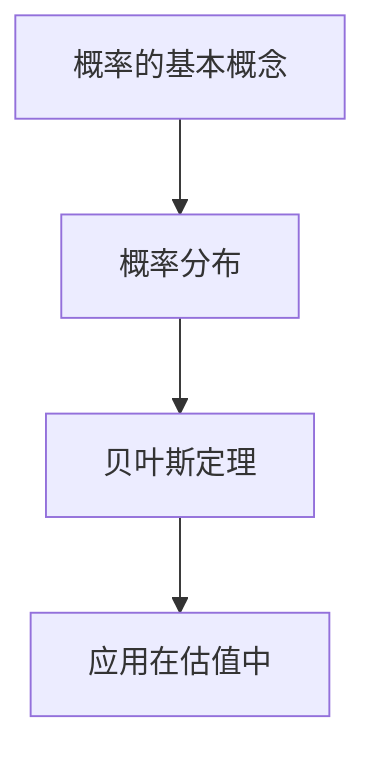
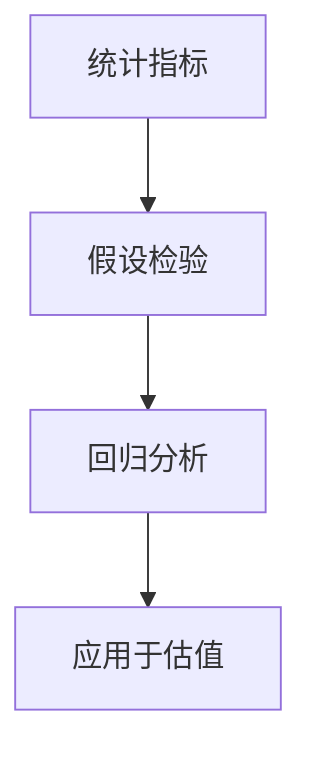
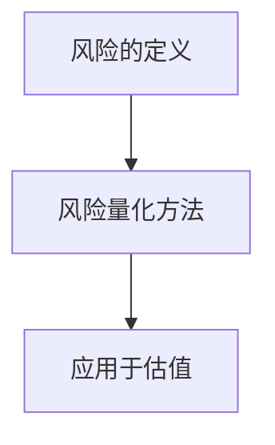
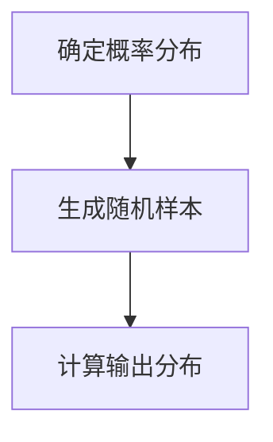
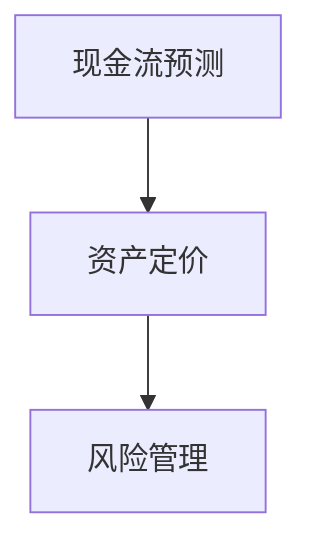
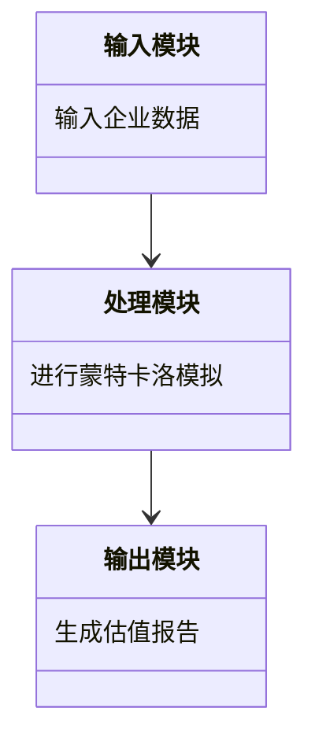
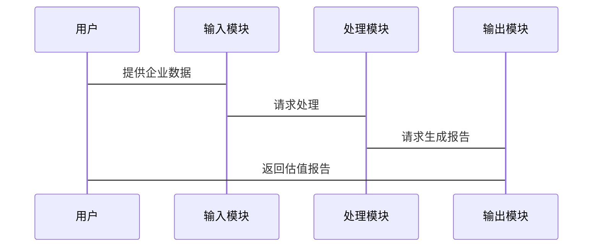

                 


# 如何处理企业估值中的不确定性

> 关键词：企业估值，不确定性，风险管理，概率论，统计学，蒙特卡洛模拟

> 摘要：在企业估值过程中，不确定性是无法回避的挑战。本文从不确定性在企业估值中的重要性入手，结合概率论和统计学的基本原理，详细介绍了如何通过蒙特卡洛模拟等方法量化和建模不确定性，构建企业估值系统，并通过实际案例分析展示如何将这些理论应用于实践。文章最后总结了最佳实践和注意事项，为读者提供了系统性的解决方案。

---

## 第一部分: 企业估值中的不确定性概述

### 第1章: 不确定性在企业估值中的重要性

#### 1.1 不确定性的定义与分类

##### 1.1.1 不确定性的基本定义
不确定性是指在企业估值过程中，由于信息不完全、未来事件的不可预测性或模型假设的局限性，导致的结果具有多种可能的情况。不确定性可以是主观的（基于个人判断）或客观的（基于外部环境）。

##### 1.1.2 不确定性的主要分类
不确定性可以分为以下几种类型：
1. **结构性不确定性**：源于模型假设和方法的局限性。
2. **参数不确定性**：源于输入参数的估计误差。
3. **情景不确定性**：源于未来可能出现的不同情景。
4. **模型不确定性**：源于模型本身的选择和假设。

##### 1.1.3 不确定性在企业估值中的特殊性
在企业估值中，不确定性主要体现在以下几个方面：
- **现金流预测的不确定性**：未来现金流的预测受到市场环境、政策变化等因素的影响。
- **贴现率的选择**：折现率的高低直接影响企业价值的评估。
- **资产寿命的不确定性**：资产的使用寿命会影响其价值评估。

#### 1.2 企业估值中的不确定性来源

##### 1.2.1 市场风险与波动性
市场风险是企业估值中最大的不确定性来源之一，包括市场波动、行业周期性变化等。

##### 1.2.2 企业内部因素
企业内部的管理能力、成本控制、技术创新等因素也会影响估值结果。

##### 1.2.3 宏观经济环境的影响
宏观经济环境的变化，如利率、通货膨胀、政策变化等，都会对企业估值产生重大影响。

#### 1.3 不确定性对企业估值的影响

##### 1.3.1 不确定性如何影响企业价值
不确定性会导致企业价值的波动，可能低估或高估企业的实际价值。

##### 1.3.2 不确定性对估值模型的选择和应用的影响
不同类型的不确定性需要采用不同的估值模型和方法，如概率模型、情景分析等。

##### 1.3.3 不确定性对企业投资决策的影响
不确定性会影响投资者的决策，可能导致过度保守或冒险的投资行为。

#### 1.4 本章小结
不确定性在企业估值中无处不在，正确理解和处理不确定性是提高估值准确性的关键。下一章将从概率论和统计学的角度，深入探讨如何量化和建模这些不确定性。

---

## 第二部分: 处理不确定性的核心概念与方法

### 第2章: 概率论与统计学基础

#### 2.1 概率论在不确定性处理中的作用

##### 2.1.1 概率的基本概念
概率是衡量某件事情发生的可能性大小，是不确定性量化的核心工具。

##### 2.1.2 概率分布的类型
- **离散型分布**：如二项分布、泊松分布。
- **连续型分布**：如正态分布、均匀分布。

##### 2.1.3 贝叶斯定理在估值中的应用
贝叶斯定理可以通过已知数据更新先验概率，从而提高估值的准确性。例如，可以通过市场数据更新企业未来现金流的概率分布。

##### 概率论与统计学的基本原理（Mermaid流程图）



#### 2.2 统计学方法在不确定性分析中的应用

##### 2.2.1 常见统计指标与方法
- **均值**：用于描述数据的中心位置。
- **方差**：用于描述数据的离散程度。
- **回归分析**：用于分析变量之间的关系。

##### 2.2.2 假设检验与置信区间
假设检验用于验证假设的显著性，置信区间则用于估计参数的范围。

##### 2.2.3 回归分析在估值中的应用
回归分析可以用来预测企业的未来现金流，从而帮助企业进行估值。

##### 统计学方法在不确定性分析中的应用（Mermaid流程图）



#### 2.3 风险管理与不确定性量化

##### 2.3.1 风险的定义与分类
风险是指未来实际结果与预期结果之间的差异，可以分为系统性风险和非系统性风险。

##### 2.3.2 风险量化的方法
- **标准差**：衡量数据的波动性。
- **VaR（在险价值）**：衡量潜在损失。

##### 2.3.3 风险调整的估值方法
在估值时，可以通过调整贴现率或现金流来反映风险的影响。

##### 风险管理与不确定性量化（Mermaid流程图）



#### 2.4 本章小结
概率论和统计学为企业估值中的不确定性提供了理论基础和方法工具。下一章将介绍如何通过蒙特卡洛模拟等方法量化和建模不确定性。

---

## 第三部分: 不确定性量化与建模

### 第3章: 蒙特卡洛模拟方法

#### 3.1 蒙特卡洛模拟的基本原理

##### 3.1.1 蒙特卡洛模拟的定义与特点
蒙特卡洛模拟是一种通过随机采样来估计系统行为的方法，具有高效性和灵活性。

##### 3.1.2 蒙特卡洛模拟的数学基础
蒙特卡洛模拟基于概率分布和随机数生成。

##### 3.1.3 蒙特卡洛模拟的步骤
1. 确定输入变量的概率分布。
2. 生成随机样本。
3. 计算输出变量的分布。

##### 蒙特卡洛模拟的基本原理（Mermaid流程图）



#### 3.2 蒙特卡洛模拟在企业估值中的应用

##### 3.2.1 蒙特卡洛模拟在现金流预测中的应用
通过模拟未来现金流的分布，评估企业价值的可能范围。

##### 3.2.2 蒙特卡洛模拟在资产定价中的应用
用于估计资产价格的波动性。

##### 3.2.3 蒙特卡洛模拟在风险管理中的应用
用于评估极端市场情况下的潜在损失。

##### 蒙特卡洛模拟在企业估值中的应用（Mermaid流程图）



#### 3.3 本章小结
蒙特卡洛模拟是一种强大的工具，能够帮助企业量化和建模不确定性，提高估值的准确性。

---

## 第四部分: 系统分析与架构设计

### 第4章: 企业估值系统设计

#### 4.1 系统功能设计

##### 4.1.1 系统功能模块
- **输入模块**：接收企业财务数据和市场数据。
- **处理模块**：进行概率分析和蒙特卡洛模拟。
- **输出模块**：生成估值报告和风险分析结果。

##### 系统功能设计（Mermaid类图）



#### 4.2 系统架构设计

##### 4.2.1 系统架构设计（Mermaid架构图）


#### 4.3 系统接口设计

##### 4.3.1 输入接口
接收企业的财务数据和市场数据。

##### 4.3.2 输出接口
生成估值报告和风险分析结果。

#### 4.4 系统交互设计

##### 4.4.1 系统交互（Mermaid序列图）



#### 4.5 本章小结
系统架构设计为企业的估值提供了高效的解决方案，确保了数据处理和结果输出的高效性。

---

## 第五部分: 项目实战

### 第5章: 企业估值实战案例

#### 5.1 环境配置

##### 5.1.1 Python环境配置
安装必要的库，如NumPy、Pandas、Matplotlib等。

##### 5.1.2 数据获取
收集企业的财务数据和市场数据。

#### 5.2 核心代码实现

##### 5.2.1 蒙特卡洛模拟代码

```python
import numpy as np
import matplotlib.pyplot as plt

# 定义参数
mu = 0.05  # 均值
sigma = 0.2  # 标准差
n_simulations = 1000  # 模拟次数

# 生成随机数
np.random.seed(42)
simulated_returns = np.random.normal(mu, sigma, n_simulations)

# 计算累积收益
cumulative_returns = np.cumsum(simulated_returns)

# 绘制图表
plt.figure(figsize=(10, 6))
plt.plot(cumulative_returns)
plt.title('蒙特卡洛模拟累积收益')
plt.xlabel('时间')
plt.ylabel('累积收益')
plt.show()
```

##### 5.2.2 风险调整代码

```python
import pandas as pd
from sklearn.metrics import mean_squared_error

# 数据准备
data = pd.DataFrame({'现金流': [100, 150, 200, 250, 300]})

# 计算均值和方差
mean = data['现金流'].mean()
variance = data['现金流'].var()

# 计算标准差
std_dev = np.sqrt(variance)

print(f'均值: {mean}, 标准差: {std_dev}')
```

#### 5.3 案例分析与结果解读

##### 5.3.1 案例分析
以某科技企业为例，通过蒙特卡洛模拟预测其未来三年的现金流。

##### 5.3.2 结果解读
模拟结果表明，企业现金流具有较高的波动性，因此在估值时需要考虑较高的风险溢价。

#### 5.4 本章小结
通过实际案例分析，展示了如何将蒙特卡洛模拟应用于企业估值，提高了估值的准确性和可靠性。

---

## 第六部分: 最佳实践与总结

### 第6章: 最佳实践与总结

#### 6.1 关键点总结

##### 6.1.1 数据质量的重要性
高质量的数据是准确估值的基础。

##### 6.1.2 模型选择的注意事项
根据具体情况选择合适的估值模型和方法。

##### 6.1.3 持续监控与调整
定期更新模型和数据，以反映市场变化和企业实际情况。

#### 6.2 小结
处理企业估值中的不确定性需要综合运用概率论、统计学和蒙特卡洛模拟等方法，构建高效的系统架构，并通过实际案例验证和优化模型。

#### 6.3 注意事项

##### 6.3.1 数据偏差的风险
避免数据偏差对估值结果的影响。

##### 6.3.2 模型局限性
认识到模型的局限性，避免过度依赖模型。

##### 6.3.3 持续学习与更新
及时更新知识和技能，以应对不断变化的市场环境。

#### 6.4 拓展阅读
推荐阅读相关书籍和文献，进一步深入学习不确定性量化和风险管理的方法。

---

## 作者信息

作者：AI天才研究院/AI Genius Institute & 禅与计算机程序设计艺术/Zen And The Art of Computer Programming

---

**附录：相关工具与资源**

- **Python库**：NumPy、Pandas、Matplotlib、Scipy。
- **在线资源**：Kaggle、Towards Data Science、Coursera上的相关课程。
- **书籍推荐**：《蒙特卡洛方法在金融中的应用》、《风险管理与不确定性分析》。

---

以上是完整的技术博客文章的详细目录大纲和内容，按照逻辑清晰、结构紧凑、简单易懂的原则，结合理论和实践，详细阐述了如何处理企业估值中的不确定性。

