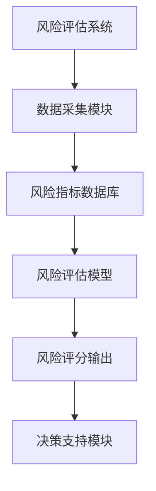

                 

# 如何处理企业估值中的地缘政治风险

---

## 关键词：地缘政治风险，企业估值，风险管理，地缘政治经济学，风险量化，风险对冲，系统架构设计

---

## 摘要：  
地缘政治风险是影响企业估值的重要因素，尤其是在全球化和多极化的今天。本文从地缘政治风险的定义、分类、影响因素入手，详细分析其对企业估值的具体影响，探讨如何通过风险识别、量化、对冲等方法，构建有效的风险管理策略，帮助企业在复杂多变的地缘政治环境中实现稳健的估值。文章结合实际案例和工具技术，提供可操作的解决方案。

---

## 第1章: 地缘政治风险的定义与分类

### 1.1 地缘政治风险的定义  
地缘政治风险是指因政治、经济、文化和社会等因素的变动，导致某一地区或国家的稳定性下降，进而对企业经营和投资价值产生负面影响的可能性。  

### 1.2 地缘政治风险的分类  
地缘政治风险可以分为以下几类：  
1. **政治风险**：包括政策变动、政权更迭、战争冲突等。  
2. **经济风险**：涉及贸易壁垒、汇率波动、资源短缺等问题。  
3. **社会风险**：如社会动荡、民族矛盾、恐怖主义等。  
4. **文化风险**：文化差异导致的市场进入障碍或消费者偏好变化。  

### 1.3 地缘政治风险对企业估值的影响  
地缘政治风险会影响企业的收入、成本和资产价值，进而影响其市场估值。例如，政策收紧可能导致企业利润下降，而地区冲突可能影响企业的供应链稳定性。

---

## 第2章: 地缘政治风险的背景与现状

### 2.1 当前国际地缘政治格局分析  
近年来，国际地缘政治格局呈现多极化趋势，贸易保护主义抬头，地缘政治冲突频发。例如，中美贸易摩擦、俄乌冲突等地缘政治事件对企业估值产生了深远影响。  

### 2.2 经济全球化与地缘政治风险的交织  
经济全球化使得企业在全球范围内配置资源，但也使得企业更容易受到地缘政治风险的影响。例如，供应链的全球化布局可能因地区冲突而中断。  

### 2.3 地缘政治风险对企业经营的影响  
地缘政治风险可能引发以下问题：  
1. **市场准入受限**：贸易壁垒或政策限制可能导致企业无法进入新市场。  
2. **成本增加**：因地缘政治冲突导致的原材料价格上涨或物流成本增加。  
3. **资产减值**：因地缘政治风险导致的资产贬值或无法回收。  

---

## 第3章: 企业估值的基本概念与方法

### 3.1 企业估值的基本原理  
企业估值是通过对企业的财务状况、市场地位、盈利能力等多方面进行分析，确定其市场价值的过程。  

### 3.2 常用企业估值方法概述  
1. **DCF模型**：通过现金流折现法评估企业价值。  
2. **市盈率法**：基于企业的市盈率和行业平均值进行估值。  
3. **资产重置法**：基于企业资产的重置成本进行估值。  

### 3.3 地缘政治风险对估值模型的挑战  
地缘政治风险可能影响企业的未来现金流、资产价值和市场稳定性，从而对估值模型的假设和参数产生影响。  

---

## 第4章: 地缘政治风险的识别与评估

### 4.1 风险识别的定义与步骤  
风险识别是通过分析可能影响企业经营的各种因素，确定潜在的地缘政治风险。  

### 4.2 地缘政治风险的关键指标  
1. **政治稳定性指数**：衡量一个国家或地区的政治稳定性。  
2. **贸易政策变化**：分析贸易壁垒和关税政策的变化。  
3. **地区冲突概率**：评估某一地区发生冲突的可能性。  

### 4.3 地缘政治风险的系统架构设计  
以下是地缘政治风险评估系统的架构设计：  

---

## 第5章: 地缘政治风险的影响因素分析

### 5.1 政治因素  
政治不稳定、政策变化、政府干预等政治因素对企业估值的影响尤为显著。  

### 5.2 经济因素  
经济制裁、汇率波动、通货膨胀等经济因素可能影响企业的经营环境。  

### 5.3 社会文化因素  
社会动荡、文化差异、消费者偏好变化等社会文化因素可能影响企业的市场地位。  

### 5.4 技术与环境因素  
技术封锁、环境政策变化等也可能对企业估值产生影响。  

---

## 第6章: 地缘政治风险的量化与模型构建

### 6.1 风险量化的基本原理  
风险量化是通过数学模型和统计方法，将地缘政治风险转化为可量化的指标。  

### 6.2 地缘政治风险的数学模型  
以下是一个简单的地缘政治风险量化模型：  

$$ \text{风险评分} = \sum_{i=1}^{n} w_i \cdot r_i $$  

其中，\( w_i \) 是第 \( i \) 个风险因素的权重，\( r_i \) 是第 \( i \) 个风险因素的评分（0-10分）。  

### 6.3 风险评估的系统架构设计  
以下是风险评估系统的架构设计：  

---

## 第7章: 地缘政治风险下的企业战略选择

### 7.1 风险管理的基本策略  
企业可以通过以下策略应对地缘政治风险：  
1. **风险规避**：避免进入高风险地区。  
2. **风险降低**：通过多元化供应链降低风险。  
3. **风险转移**：利用保险或金融衍生工具转移风险。  
4. **风险接受**：在可控范围内接受风险。  

### 7.2 地缘政治风险下的市场进入策略  
企业在进入新市场时，应充分评估地缘政治风险，并制定相应的风险管理计划。  

### 7.3 企业供应链的优化与风险管理  
企业可以通过多元化供应链、本地化采购等方式，降低地缘政治风险对企业供应链的影响。  

---

## 第8章: 风险对冲与金融工具的应用

### 8.1 金融衍生工具在风险管理中的应用  
1. **远期合约**：锁定汇率或利率，减少波动影响。  
2. **期权**：通过期权对冲价格波动风险。  
3. **互换**：通过资产互换分散风险。  

### 8.2 保险机制在地缘政治风险中的作用  
企业可以购买政治风险保险，覆盖因政治事件导致的损失。  

### 8.3 投资组合优化与风险分散  
通过多元化投资组合，分散地缘政治风险的影响。  

---

## 第9章: 案例分析与实践

### 9.1 地缘政治风险下的企业估值案例  
以某跨国企业为例，分析地缘政治风险对企业估值的具体影响。  

### 9.2 风险管理工具与技术的应用  
通过实际案例，展示如何利用风险管理工具和技术，降低地缘政治风险对企业估值的影响。  

---

## 第10章: 未来展望与最佳实践

### 10.1 未来展望  
随着全球化深入发展，地缘政治风险对企业估值的影响将更加复杂。企业需要不断优化风险管理策略，应对新的挑战。  

### 10.2 最佳实践 tips  
1. **定期评估风险**：企业应定期评估地缘政治风险，并根据变化调整风险管理策略。  
2. **加强风险管理团队**：组建专业的风险管理团队，提升风险应对能力。  
3. **利用技术工具**：通过大数据和人工智能技术，提高风险识别和量化能力。  

---

## 作者：AI天才研究院 & 禅与计算机程序设计艺术

