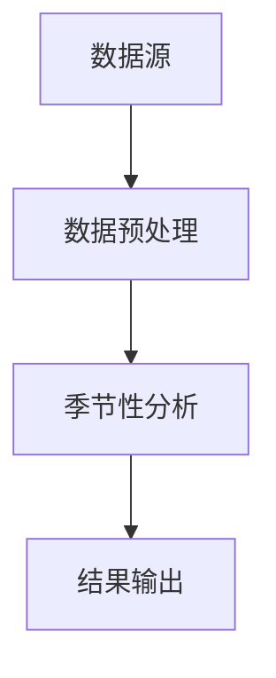
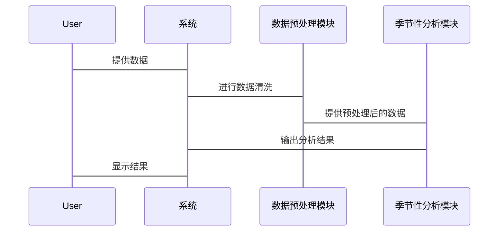

                 


# 如何处理企业估值中的季节性影响

> 关键词：企业估值，季节性影响，时间序列分析，ARIMA模型，指数平滑法

> 摘要：在企业估值过程中，季节性影响是一个不容忽视的因素。本文详细探讨了季节性影响的识别、量化和调整方法，结合数学模型和实际案例，系统地分析了如何有效处理季节性影响，提升企业估值的准确性。

---

# 第一部分: 企业估值中的季节性影响概述

## 第1章: 季节性影响的背景与重要性

### 1.1 企业估值中的季节性影响概述

#### 1.1.1 季节性影响的定义
季节性影响是指企业在不同时间段内（如季度、月份或特定事件周期）收入、成本或利润的波动，这些波动通常与企业的业务周期或外部环境变化相关。例如，零售企业在节假日销售额通常会显著增加。

#### 1.1.2 季节性影响在企业估值中的重要性
季节性影响直接影响企业的财务表现，如果不加以调整，可能导致估值偏差。例如，季节性波动较大的企业可能会在特定季度出现异常高的收入或利润，而其他季度则相对较低。忽视这些波动会导致企业估值不准确。

#### 1.1.3 季节性影响的边界与外延
季节性影响通常与企业的业务周期相关，但需区分季节性波动和周期性波动。季节性波动是短期、可预测的，而周期性波动是长期趋势中的波动。

### 1.2 季节性影响的核心概念

#### 1.2.1 季节性波动的特征
- **周期性**：季节性波动通常在固定的时间周期内重复出现。
- **可预测性**：通过历史数据分析，可以预测未来可能的季节性波动。

#### 1.2.2 季节性影响与其他因素的联系
- **行业差异**：不同行业受季节性影响的程度不同。例如，农业企业受季节性影响较大，而科技企业受季节性影响相对较小。
- **外部因素**：如节假日、天气变化等外部因素也会影响季节性波动。

#### 1.2.3 季节性影响的分类与对比
- **收入波动**：如零售业的节假日销售高峰。
- **成本波动**：如能源行业的季节性需求变化。
- **利润波动**：如制造企业的季节性生产调整。

---

## 第2章: 季节性影响的数学模型与分析

### 2.1 季节性影响的识别与量化

#### 2.1.1 时间序列分析方法
时间序列分析是识别季节性影响的重要工具。通过对历史数据的分析，可以提取出季节性成分。

#### 2.1.2 季节性指数的计算公式
季节性指数（Seasonal Index）用于衡量某一时期内数据的季节性波动程度。计算公式如下：
$$
S_t = \frac{y_t}{\overline{y}}
$$
其中，$y_t$ 是第 $t$ 期的实际观测值，$\overline{y}$ 是所有时期的平均观测值。

### 2.2 季节性调整模型

#### 2.2.1 加法模型
加法模型假设季节性波动是数据的组成部分，其公式为：
$$
Y_t = T_t + S_t + R_t
$$
其中，$T_t$ 是趋势成分，$S_t$ 是季节性成分，$R_t$ 是随机成分。

#### 2.2.2 乘法模型
乘法模型假设季节性波动影响数据的幅度，其公式为：
$$
Y_t = T_t \times S_t \times R_t
$$

### 2.3 季节性影响的预测与调整

#### 2.3.1 ARIMA模型在季节性预测中的应用
ARIMA（自回归积分滑动平均）模型是一种常用的时间序列分析工具，可以用于预测季节性波动。例如，预测企业的季度收入波动。

#### 2.3.2 指数平滑法在季节性调整中的应用
指数平滑法（Exponential Smoothing）通过加权平均历史数据，预测未来趋势。例如，预测企业的月度销售波动。

#### 2.3.3 季节性调整的数学公式
调整后的数据可以通过以下公式计算：
$$
\hat{Y}_t = \frac{Y_t}{S_t}
$$
其中，$\hat{Y}_t$ 是调整后的数据，$Y_t$ 是原始数据，$S_t$ 是季节性指数。

---

## 第3章: 季节性影响对企业估值的具体影响

### 3.1 季节性影响对收入与利润的影响

#### 3.1.1 季节性收入波动的特征
许多企业在特定季度（如节假日）收入显著增加，而在其他季度收入相对平稳。

#### 3.1.2 季节性利润波动的特征
利润波动与收入波动密切相关，但还需考虑成本和费用的变化。

#### 3.1.3 季节性收入与利润的对比分析
通过对比分析，可以发现季节性收入波动对利润的影响程度。例如，某些行业的成本相对固定，收入波动对利润影响较大。

### 3.2 季节性影响对资产与负债的影响

#### 3.2.1 季节性资产波动的特征
例如，零售企业在节假日前增加库存，导致资产波动。

#### 3.2.2 季节性负债波动的特征
例如，季节性销售高峰可能导致应付账款增加。

#### 3.2.3 季节性资产与负债的对比分析
资产和负债的波动通常与收入和利润的季节性变化密切相关。

### 3.3 季节性影响对现金流的影响

#### 3.3.1 季节性现金流波动的特征
例如，某些企业在特定季度收到大量应收账款，导致现金流波动。

#### 3.3.2 季节性现金流与收入的对比分析
现金流波动与收入波动密切相关，但还需考虑企业的收付款政策。

#### 3.3.3 季节性现金流调整的数学公式
$$
\hat{CF}_t = CF_t - S_t
$$
其中，$\hat{CF}_t$ 是调整后的现金流，$CF_t$ 是原始现金流，$S_t$ 是季节性指数。

---

## 第4章: 季节性影响的系统分析与架构设计

### 4.1 季节性影响分析系统的需求分析

#### 4.1.1 系统目标
开发一个能够识别、量化和调整季节性影响的系统，提升企业估值的准确性。

#### 4.1.2 系统功能需求
- 数据采集：从企业财务系统中获取历史数据。
- 数据预处理：清洗和标准化数据。
- 季节性分析：使用时间序列分析工具识别季节性波动。
- 调整与预测：根据季节性指数调整数据，并预测未来波动。

#### 4.1.3 系统性能需求
- 处理速度：快速处理大量数据。
- 精度要求：确保分析结果的准确性。

### 4.2 季节性影响分析系统的架构设计

#### 4.2.1 数据流图


#### 4.2.2 系统架构设计


#### 4.2.3 系统交互设计


---

## 第5章: 项目实战

### 5.1 环境安装与配置

#### 5.1.1 安装Python环境
使用Anaconda安装Python 3.8及以上版本。

#### 5.1.2 安装相关库
安装`pandas`、`numpy`、`statsmodels`等库。

### 5.2 系统核心实现源代码

#### 5.2.1 数据预处理代码
```python
import pandas as pd
import numpy as np

# 读取数据
data = pd.read_csv('financial_data.csv')

# 删除缺失值
data.dropna(inplace=True)

# 标准化处理
data['revenue'] = (data['revenue'] - data['revenue'].mean()) / data['revenue'].std()
```

#### 5.2.2 季节性分析代码
```python
from statsmodels.tsa.arima_model import ARIMA

# 拟合ARIMA模型
model = ARIMA(data['revenue'], order=(1, 1, 1))
model_fit = model.fit()

# 预测未来值
forecast = model_fit.forecast(steps=4)
print(forecast)
```

### 5.3 代码应用解读与分析

#### 5.3.1 数据预处理
数据预处理包括清洗和标准化，确保数据质量。

#### 5.3.2 季节性分析
使用ARIMA模型预测未来收入波动，调整企业估值。

### 5.4 实际案例分析

#### 5.4.1 案例背景
某零售企业节假日销售额显著增加，需要调整季节性影响。

#### 5.4.2 数据分析
通过时间序列分析，发现销售额在特定季度有显著增加。

#### 5.4.3 结果解读
调整后的收入数据更加准确，提升了企业估值的准确性。

### 5.5 项目小结

#### 5.5.1 核心实现
通过时间序列分析工具，识别和调整季节性波动。

#### 5.5.2 经验总结
季节性影响的处理需要结合行业特点和企业实际情况。

#### 5.5.3 注意事项
确保数据质量，合理选择分析模型。

---

## 第6章: 总结与展望

### 6.1 本文总结

#### 6.1.1 核心内容回顾
本文详细探讨了季节性影响的识别、量化和调整方法，结合数学模型和实际案例，系统地分析了如何有效处理季节性影响，提升企业估值的准确性。

#### 6.1.2 研究成果
提出了基于时间序列分析的季节性影响处理方法，为企业估值提供参考。

### 6.2 未来展望

#### 6.2.1 研究方向
进一步研究多变量时间序列分析，考虑更多影响因素。

#### 6.2.2 应用前景
季节性影响处理方法将在更多行业和领域得到广泛应用。

### 6.3 最佳实践 Tips

#### 6.3.1 数据处理
确保数据质量，合理选择分析模型。

#### 6.3.2 模型选择
根据企业特点选择合适的分析工具，如ARIMA模型或指数平滑法。

#### 6.3.3 结果验证
通过实际案例验证模型的准确性和有效性。

---

# 作者

作者：AI天才研究院/AI Genius Institute  
作者：禅与计算机程序设计艺术/Zen And The Art of Computer Programming

