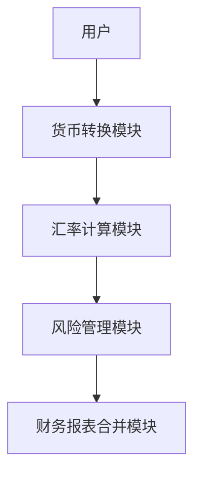
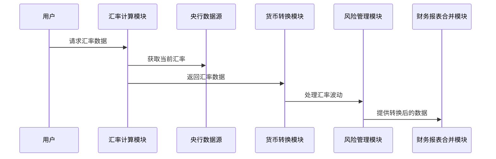

                 


# 如何处理企业估值中的货币转换问题

## 关键词：企业估值、货币转换、汇率、财务报表、跨国企业、风险管理、系统设计

## 摘要：  
在企业估值过程中，货币转换是一个复杂但至关重要的问题。随着全球化的发展，跨国企业和国际业务日益增多，货币转换的正确处理直接影响企业的财务健康和价值评估。本文将从货币转换的基本概念出发，分析其在企业估值中的影响，探讨货币转换的算法原理，结合系统设计与项目实战，为企业提供一套完整的解决方案。文章最后还将总结货币转换的最佳实践，为企业在跨国经营中提供有益的参考。

---

## 第1章: 货币转换的基本概念

### 1.1 货币转换的定义与背景

#### 1.1.1 货币转换的定义  
货币转换是指将一种货币的价值转换为另一种货币的过程，通常涉及汇率的计算和应用。在企业估值中，货币转换主要用于跨国企业将不同货币的财务数据统一为一个基准货币，以便进行比较和分析。

#### 1.1.2 货币转换的背景与重要性  
随着全球经济一体化，企业在全球范围内开展业务，涉及多种货币的交易和财务报表合并。货币转换是企业进行跨国经营和财务分析的基础，直接关系到企业的财务健康和价值评估。

#### 1.1.3 货币转换的法律与税务影响  
不同国家的货币政策、汇率制度和税务政策会影响货币转换的方式和结果。企业需要遵守相关法律法规，并考虑税务优化策略。

---

## 第2章: 企业估值中的货币转换问题

### 2.1 企业估值的基本概念

#### 2.1.1 企业估值的定义  
企业估值是通过对企业的财务数据、市场表现和行业地位等多方面分析，确定企业价值的过程。

#### 2.1.2 企业估值的方法与模型  
企业估值常用的方法包括DCF模型、市盈率法、市净率法等。这些方法需要将不同货币的财务数据统一为一个基准货币，以便进行比较。

#### 2.1.3 货币转换在企业估值中的作用  
货币转换是企业估值的基础，尤其是在跨国企业中，不同货币的财务数据需要统一，才能准确评估企业价值。

---

### 2.2 货币转换对企业估值的影响

#### 2.2.1 汇率波动对企业估值的影响  
汇率的波动会导致企业财务数据的变化，进而影响企业估值的结果。例如，如果一家企业在美元贬值的情况下将欧元资产转换为美元，可能会低估企业的价值。

#### 2.2.2 不同货币之间的转换风险  
不同货币之间的转换可能存在流动性风险、信用风险和市场风险，这些风险会影响企业的财务健康和估值结果。

#### 2.2.3 货币转换对企业财务报表的影响  
货币转换会直接影响企业的资产负债表、利润表和现金流量表。例如，外币资产的公允价值变动会影响企业的净利润。

---

## 第3章: 货币转换的核心概念与联系

### 3.1 货币转换的核心原理

#### 3.1.1 汇率的计算与应用  
汇率是货币转换的核心，常用的汇率计算方法包括直接汇率和间接汇率。例如，将欧元转换为美元时，需要使用欧元兑美元的汇率。

#### 3.1.2 货币转换的直接与间接方法  
直接转换是指将一种货币直接转换为另一种货币，而间接转换则是通过中间货币进行。间接转换通常用于处理多种货币的转换问题。

#### 3.1.3 货币转换的市场机制  
货币转换的市场机制包括外汇市场交易、银行间交易和央行干预等。这些机制会影响汇率的波动和货币转换的结果。

---

### 3.2 货币转换与企业估值的关系

#### 3.2.1 货币转换对企业价值的影响  
货币转换直接影响企业的财务数据，进而影响企业估值的结果。例如，将高波动性的货币转换为低波动性的货币可以降低企业估值的风险。

#### 3.2.2 货币转换与企业资产、负债的关系  
货币转换会影响企业的资产和负债的公允价值，进而影响企业的财务健康和估值结果。例如，外币负债的汇率变动会影响企业的财务杠杆。

#### 3.2.3 货币转换与企业收益的关系  
货币转换会影响企业的净利润，尤其是在汇率波动较大的情况下。例如，出口型企业需要将外币收入转换为本币，汇率波动可能影响企业的利润。

---

## 第4章: 货币转换的算法原理

### 4.1 货币转换算法概述

#### 4.1.1 货币转换算法的基本原理  
货币转换算法通常基于汇率的计算和应用，包括直接转换和间接转换两种方法。直接转换适用于两种货币之间的转换，而间接转换适用于多种货币之间的转换。

#### 4.1.2 货币转换算法的分类  
货币转换算法可以分为基于汇率的直接转换算法和基于套期保值的间接转换算法。套期保值算法用于管理汇率风险，确保货币转换的稳定性。

#### 4.1.3 货币转换算法的优缺点  
直接转换算法简单易行，但可能存在汇率波动风险；套期保值算法能够有效管理汇率风险，但操作复杂且成本较高。

---

### 4.2 货币转换的具体算法实现

#### 4.2.1 基于汇率的直接转换算法  
直接转换算法的核心是使用当前汇率将一种货币转换为另一种货币。例如，将欧元转换为美元时，使用欧元兑美元的当前汇率。

#### 4.2.2 基于套期保值的间接转换算法  
间接转换算法通过中间货币进行转换，例如将欧元转换为人民币时，先将欧元转换为美元，再将美元转换为人民币。

#### 4.2.3 货币转换算法的数学模型与公式  
货币转换的数学模型通常包括汇率计算、汇率波动和套期保值策略。例如，汇率计算公式为：  
$$ \text{目标货币金额} = \text{源货币金额} \times \text{汇率} $$

---

## 第5章: 货币转换的系统分析与架构设计

### 5.1 系统需求分析

#### 5.1.1 问题场景介绍  
跨国企业在进行财务报表合并时，需要将不同货币的财务数据统一为一个基准货币，以准确评估企业价值。

#### 5.1.2 项目目标与范围  
本项目的目标是设计一个货币转换系统，能够支持多种货币的转换和汇率风险管理，确保企业估值的准确性。

#### 5.1.3 系统功能需求  
系统需要实现货币转换功能、汇率风险管理功能和财务报表合并功能。

---

### 5.2 系统架构设计

#### 5.2.1 系统架构的模块划分  
货币转换系统可以划分为汇率计算模块、货币转换模块和风险管理模块。

#### 5.2.2 系统架构的Mermaid图  


#### 5.2.3 系统接口设计  
系统需要与外部数据源（如央行汇率数据）和企业财务系统进行交互。

#### 5.2.4 系统交互的Mermaid序列图  


---

## 第6章: 货币转换的项目实战

### 6.1 环境安装

#### 6.1.1 开发环境配置  
需要安装Python编程语言和相关库（如pandas、numpy）。

#### 6.1.2 依赖库安装  
使用pip安装所需的库：  
```
pip install pandas numpy
```

---

### 6.2 系统核心实现源代码

#### 6.2.1 货币转换函数实现  
```python
import pandas as pd

def convert_currency(amount, from_currency, to_currency, rate):
    return amount * rate
```

#### 6.2.2 汇率数据获取与处理  
```python
def get_exchange_rate(from_currency, to_currency):
    # 假设我们从央行数据源获取汇率
    return 1.1  # 示例汇率
```

---

### 6.3 代码应用解读与分析

#### 6.3.1 货币转换函数的应用  
将欧元转换为美元：  
```python
amount_eur = 100
from_currency = "EUR"
to_currency = "USD"
rate = get_exchange_rate(from_currency, to_currency)
amount_usd = convert_currency(amount_eur, from_currency, to_currency, rate)
print(amount_usd)
```

#### 6.3.2 汇率数据的处理与分析  
使用pandas处理汇率数据，分析汇率波动趋势。

---

### 6.4 实际案例分析

#### 6.4.1 案例背景  
一家跨国企业需要将欧元、美元和人民币的财务数据统一为美元，以进行企业估值。

#### 6.4.2 数据准备  
- 欧元金额：100,000欧元
- 美元金额：20,000美元
- 人民币金额：1,000,000人民币

#### 6.4.3 汇率数据  
- 欧元兑美元汇率：1.1
- 人民币兑美元汇率：0.15

#### 6.4.4 货币转换与合并  
将所有金额转换为美元：  
- 欧元转换为美元：100,000 × 1.1 = 110,000美元  
- 人民币转换为美元：1,000,000 × 0.15 = 150,000美元  

总金额为：110,000 + 20,000 + 150,000 = 280,000美元

---

## 第7章: 最佳实践、小结与注意事项

### 7.1 最佳实践

#### 7.1.1 汇率风险管理  
企业应建立汇率风险管理机制，例如使用套期保值工具和多元化货币策略。

#### 7.1.2 系统设计优化  
系统设计应考虑高可用性和可扩展性，以支持多种货币和复杂汇率环境。

### 7.2 小结

本文详细介绍了货币转换在企业估值中的重要性，分析了货币转换的核心原理和算法，结合系统设计和项目实战，为企业提供了一套完整的解决方案。货币转换是跨国企业财务管理的关键，企业需要高度重视货币转换的正确处理。

### 7.3 注意事项

- 汇率波动是货币转换的主要风险，企业应制定有效的风险管理策略。
- 系统设计应考虑货币转换的复杂性和多样性，确保系统的稳定性和可扩展性。
- 在实际操作中，企业应结合自身特点和行业特点，选择适合的货币转换方法和策略。

---

## 作者：AI天才研究院/AI Genius Institute & 禅与计算机程序设计艺术 /Zen And The Art of Computer Programming

