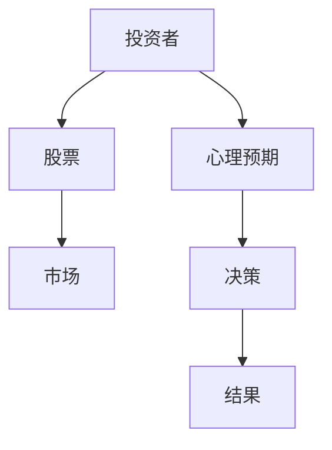
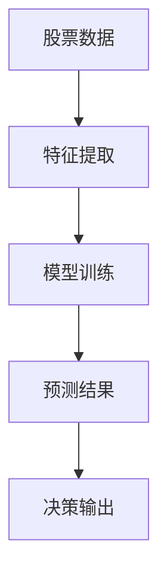
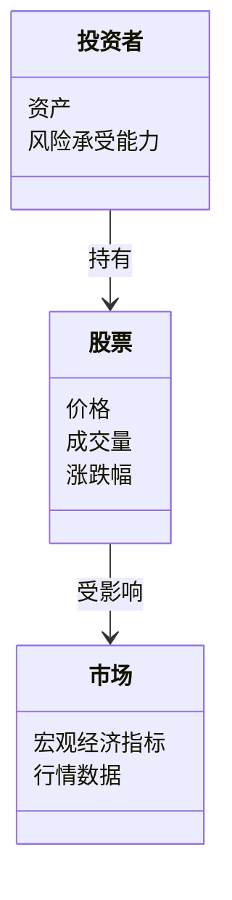
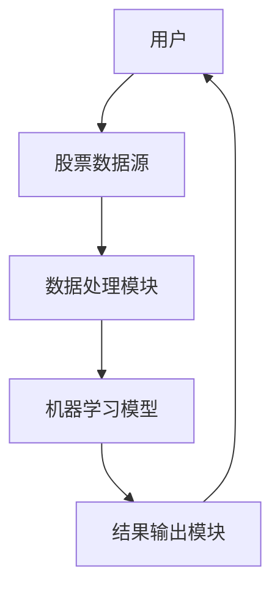
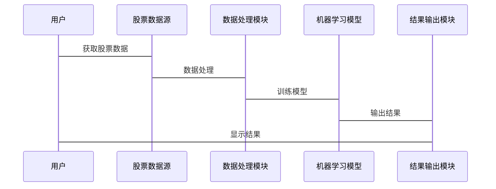

                 


# 如何处理特价股票投资中的亏损

> 关键词：特价股票，亏损处理，风险管理，投资心理，股票分析

> 摘要：本文深入探讨了如何在特价股票投资中有效处理亏损问题。通过分析亏损的成因，结合数学模型和算法，提出了科学的亏损处理策略。文章从背景介绍、核心概念、算法原理、系统架构到项目实战，全面阐述了如何在特价股票投资中实现风险控制和收益最大化。

---

## 第一部分: 特价股票投资中的亏损处理背景介绍

### 第1章: 特价股票投资概述

#### 1.1 特价股票的定义与特点

##### 1.1.1 特价股票的定义  
特价股票是指价格显著低于市场平均价格水平的股票，通常由于公司基本面问题、市场情绪波动或短期流动性不足等原因导致价格被低估。特价股票的特性包括高波动性、高风险性和潜在的高回报。

##### 1.1.2 特价股票的核心特点  
- **高波动性**：特价股票的价格受市场情绪影响较大，波动剧烈。  
- **高风险性**：由于公司基本面较差，投资风险较高。  
- **高回报潜力**：若公司基本面改善，股价可能迅速回升，带来高额收益。

##### 1.1.3 特价股票与传统股票的区别  
- **价格差异**：特价股票价格远低于市场平均水平，而传统股票价格较为稳定。  
- **风险差异**：特价股票风险较高，传统股票风险相对较低。  
- **投资者差异**：特价股票通常吸引风险偏好较高的投资者，而传统股票更受保守投资者青睐。

#### 1.2 投资者的心理与行为

##### 1.2.1 投资者的心理预期  
投资者在面对特价股票时，通常会基于市场情绪和短期价格波动做出决策。例如，看到股价大幅下跌，投资者可能会产生恐慌性抛售，导致进一步亏损。

##### 1.2.2 特价股票投资中的常见心理偏差  
- **过度自信**：认为自己能够准确预测市场走势。  
- **从众心理**：跟随市场 majority 进行投资，忽视独立分析。  
- **损失厌恶**：对已亏损的股票不愿割肉，导致进一步损失。

##### 1.2.3 心理因素对投资决策的影响  
心理因素是导致亏损的重要原因。例如，投资者在面对亏损时，容易产生情绪化决策，如盲目追涨杀跌，忽视基本面分析。

### 第2章: 特价股票投资中的亏损问题

#### 2.1 亏损的定义与分类

##### 2.1.1 亏损的定义  
亏损是指投资标的的价值低于初始投资成本，导致投资者账面或实际损失。

##### 2.1.2 亏损的分类与特征  
- **短期亏损**：由于市场波动导致的短期价格下跌。  
- **长期亏损**：由于公司基本面持续恶化导致的长期价值下降。  
- **部分亏损**：仅部分投资标的出现亏损。  
- **全面亏损**：所有投资标的均出现亏损。

##### 2.1.3 亏损的边界与外延  
亏损的边界在于投资标的的价值是否低于成本价。外延则包括市场波动、公司基本面、投资者行为等多个方面。

#### 2.2 亏损的原因分析

##### 2.2.1 市场风险因素  
市场整体波动、宏观经济政策变化等都可能导致特价股票价格下跌，进而引发亏损。

##### 2.2.2 个股基本面因素  
公司财务状况不佳、盈利能力下降、管理问题等都会影响股价，导致亏损。

##### 2.2.3 投资者行为因素  
投资者的决策失误、情绪化投资、信息不对称等也是导致亏损的重要原因。

#### 2.3 亏损处理的核心要素

##### 2.3.1 投资目标与策略  
明确投资目标，制定合理的投资策略，避免盲目跟风。

##### 2.3.2 风险管理与控制  
通过设置止损位、分散投资、合理配置资产等方式，控制亏损风险。

##### 2.3.3 心理调节与决策优化  
保持冷静，避免情绪化决策，及时止损，优化投资策略。

---

## 第二部分: 特价股票亏损处理的核心概念与联系

### 第3章: 特价股票亏损处理的原理

#### 3.1 核心概念原理

##### 3.1.1 特价股票亏损的识别机制  
通过技术分析和基本面分析，识别潜在的亏损风险。

##### 3.1.2 亏损处理的逻辑框架  
- **识别亏损**：发现投资标的出现亏损。  
- **分析原因**：判断亏损的成因。  
- **制定策略**：采取止损、减仓等措施。  
- **优化决策**：调整投资策略，避免类似亏损。

##### 3.1.3 亏损处理的数学模型  
使用回归分析、概率论等数学工具，建立亏损预测模型。

#### 3.2 核心概念属性特征对比

##### 3.2.1 特价股票与普通股票的对比分析  
| 特性       | 特价股票       | 普通股票       |
|------------|----------------|----------------|
| 价格       | 远低于市场价    | 接近市场价      |
| 风险       | 高             | 中等           |
| 回报潜力   | 高             | 中等           |

##### 3.2.2 亏损与盈利的特征对比  
| 特性       | 亏损           | 盈利           |
|------------|----------------|----------------|
| 账面价值   | 低于成本价     | 高于成本价     |
| 投资心态   | 焦虑、恐慌      | 乐观、自信      |

##### 3.2.3 不同亏损处理策略的对比  
| 策略       | 优点           | 缺点           |
|------------|----------------|----------------|
| 止损策略   | 风险控制       | 可能错过反弹   |
| 减仓策略   | 减少损失       | 剩余仓位仍可能亏损 |
| 持股待涨   | 有机会扭亏为盈 | 亏损可能扩大   |

#### 3.3 ER实体关系图  


### 第4章: 特价股票亏损处理的算法原理

#### 4.1 算法原理概述

##### 4.1.1 亏损识别的机器学习模型  
使用随机森林等算法，通过历史数据训练模型，识别潜在亏损股票。

##### 4.1.2 亏损预测的数学模型  
基于时间序列分析，预测股票价格走势，判断是否会出现亏损。

##### 4.1.3 亏损处理的优化算法  
通过遗传算法优化投资组合，降低整体亏损风险。

#### 4.2 算法流程图  


#### 4.3 算法实现代码

##### 4.3.1 特价股票数据加载与特征提取
```python
import pandas as pd

data = pd.read_csv('special_stock.csv')
features = data[['price', 'volume', 'change']]
labels = data['loss']
```

##### 4.3.2 亏损预测模型训练
```python
from sklearn.ensemble import RandomForestClassifier

model = RandomForestClassifier(n_estimators=100, random_state=42)
model.fit(features, labels)
```

##### 4.3.3 模型预测与决策
```python
import numpy as np

new_stock = np.array([[20, 500, -3]])
predicted_loss = model.predict(new_stock)
print(predicted_loss)  # 输出：[1] 表示预测会亏损
```

---

## 第三部分: 系统分析与架构设计方案

### 第5章: 系统分析与架构设计

#### 5.1 问题场景介绍  
投资者需要一个实时监控系统，帮助其识别潜在亏损股票，并制定相应的投资策略。

#### 5.2 系统功能设计

##### 5.2.1 领域模型  


#### 5.3 系统架构设计

##### 5.3.1 系统架构图  


#### 5.4 系统接口设计  
- 用户输入：股票代码、价格、成交量等。  
- 系统输出：亏损预测结果、投资建议。

#### 5.5 系统交互流程图  


---

## 第四部分: 项目实战

### 第6章: 项目实战

#### 6.1 环境安装与配置

##### 6.1.1 安装Python与相关库  
```bash
pip install pandas scikit-learn mermaid4jupyter jupyterlab
```

#### 6.2 系统核心实现

##### 6.2.1 数据收集与预处理  
```python
import pandas as pd

# 数据加载
data = pd.read_csv('special_stock.csv')

# 数据清洗
data = data.dropna()
data = pd.get_dummies(data)
```

##### 6.2.2 特征提取与模型训练  
```python
from sklearn.ensemble import RandomForestClassifier

# 特征提取
features = data[['price', 'volume', 'change']]
labels = data['loss']

# 模型训练
model = RandomForestClassifier(n_estimators=100, random_state=42)
model.fit(features, labels)
```

##### 6.2.3 模型预测与结果输出  
```python
import numpy as np

# 预测新股票
new_stock = np.array([[20, 500, -3]])
predicted_loss = model.predict(new_stock)
print(predicted_loss)
```

#### 6.3 项目总结

##### 6.3.1 项目成果  
通过构建实时监控系统，投资者可以有效识别潜在亏损股票，制定科学的投资策略。

##### 6.3.2 项目经验  
- 数据清洗和特征工程对模型性能影响较大。  
- 机器学习模型需要不断优化和更新，以适应市场变化。  
- 投资者行为分析对投资决策优化至关重要。

---

## 第五部分: 总结与展望

### 第7章: 总结与展望

#### 7.1 总结  
本文从背景介绍、核心概念、算法原理、系统架构到项目实战，全面阐述了如何在特价股票投资中有效处理亏损问题。通过科学的方法和工具，投资者可以实现风险控制和收益最大化。

#### 7.2 最佳实践 Tips  
- 设置止损位，避免情绪化决策。  
- 分散投资，降低整体风险。  
- 定期复盘，优化投资策略。

#### 7.3 展望  
未来，随着人工智能和大数据技术的发展，亏损处理方法将更加智能化和精准化。投资者可以通过更先进的工具和技术，实现更高效的投资决策。

---

## 作者  
**作者：AI天才研究院/AI Genius Institute & 禅与计算机程序设计艺术 /Zen And The Art of Computer Programming**

