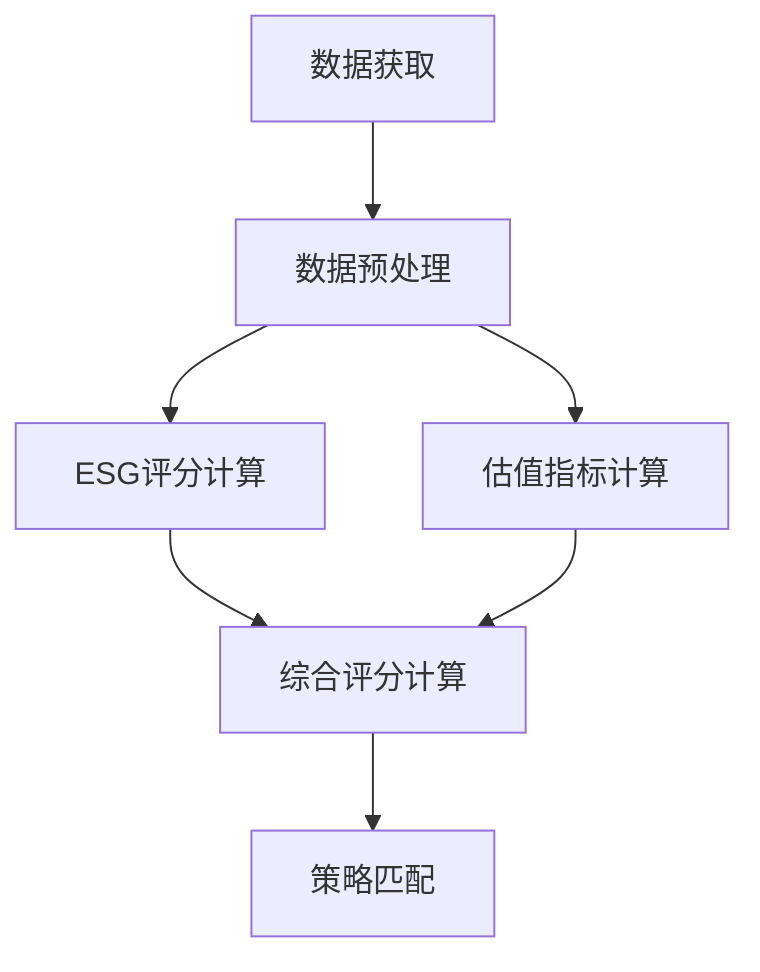
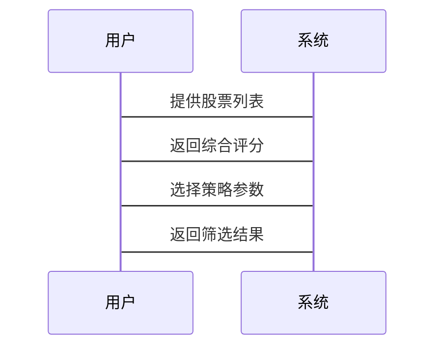

                 


```markdown
# 如何将特价股票策略与ESG投资理念结合

> 关键词：特价股票，ESG投资，投资策略，股票筛选，可持续投资

> 摘要：本文将详细介绍如何将特价股票策略与ESG投资理念结合，从理论基础到实际操作，全面分析两者的结合方式及其优势。通过系统化的分析和算法设计，本文将为投资者提供一种既能追求短期收益，又能实现长期可持续发展的投资策略。

---

# 第一部分: 特价股票策略与ESG投资理念结合的背景与基础

# 第1章: 特价股票策略与ESG投资概述

## 1.1 特价股票策略的基本概念

### 1.1.1 特价股票的定义与特征
特价股票指的是市场价格低于其内在价值的股票。其主要特征包括：
- 低市盈率（P/E）：市盈率低于行业平均水平。
- 低市净率（P/B）：市净率低于行业平均水平。
- 高股息率：股息收益率较高。

### 1.1.2 特价股票策略的核心思想
- 买入低估资产，等待市场价值回归。
- 重视基本面分析，寻找具有长期竞争优势的公司。

### 1.1.3 特价股票策略的适用场景
- 市场处于低潮期或熊市。
- 投资者希望以较低的价格买入优质资产。

## 1.2 ESG投资理念的内涵

### 1.2.1 ESG的定义与组成部分
- **环境（E）**：关注公司的环保表现，如碳排放、能源使用效率等。
- **社会（S）**：关注公司在社会责任、员工福利、供应链管理等方面的表现。
- **治理（G）**：关注公司治理结构、管理层透明度、股东权益保护等。

### 1.2.2 ESG投资的核心理念
- 将环境、社会和治理因素纳入投资决策，追求长期可持续的回报。
- 通过ESG评分筛选出具有社会责任感和良好治理结构的公司。

### 1.2.3 ESG投资的全球发展趋势
- 越来越多的机构投资者开始重视ESG因素。
- 全球监管机构推动ESG信息披露。

## 1.3 特价股票策略与ESG投资的结合背景

### 1.3.1 传统投资策略的局限性
- 传统价值投资可能忽视公司治理和社会责任，导致长期风险。
- 仅关注价格低估，可能选择到治理不善或社会责任缺失的公司。

### 1.3.2 ESG投资的兴起与优势
- ESG投资注重长期可持续性，符合全球投资者的共同目标。
- 通过ESG筛选可以降低投资风险，提升投资组合的稳定性。

### 1.3.3 两者的结合对投资的影响
- 结合特价股票策略和ESG投资，可以在追求短期收益的同时，确保投资的长期可持续性。
- 通过ESG筛选，避免选择到治理不善或社会责任缺失的公司，降低投资风险。

## 1.4 本章小结
本章介绍了特价股票策略和ESG投资的基本概念，并探讨了两者结合的背景和意义。通过结合两者，投资者可以在追求短期收益的同时，确保投资的长期可持续性。

---

# 第二部分: 特价股票策略与ESG投资的核心概念与联系

# 第2章: 特价股票策略的核心原理

## 2.1 特价股票的筛选标准

### 2.1.1 市净率（P/B）的计算与应用
- 市净率 = 股票价格 / 每股净资产。
- 理想的市净率应低于1或接近1。

### 2.1.2 市盈率（P/E）的计算与应用
- 市盈率 = 股票价格 / 每股收益。
- 理想的市盈率应低于行业平均水平。

### 2.1.3 其他估值指标的分析
- 市销率（P/S）：股票价格 / 每股销售额。
- 股息率：股息收益率。

## 2.2 特价股票策略的实施步骤

### 2.2.1 确定投资目标与范围
- 明确投资目标：收益目标、风险承受能力。
- 确定投资范围：行业、地域、市场流动性等。

### 2.2.2 数据收集与初步筛选
- 收集历史价格、财务数据、行业信息。
- 计算估值指标，初步筛选出符合标准的股票。

### 2.2.3 深入分析与最终决策
- 通过基本面分析，评估公司的竞争优势。
- 结合市场趋势和行业前景，最终选择合适的股票。

## 2.3 特价股票策略的优缺点

### 2.3.1 优点：低估值带来的安全边际
- 投资成本低，潜在回报高。
- 市场波动时，具有较高的防御性。

### 2.3.2 缺点：短期波动与市场认知偏差
- 市场对低估股票的认知可能不足，导致流动性差。
- 需要较长的时间来实现价值回归。

---

# 第3章: ESG投资的核心原理

## 3.1 ESG评分的计算方法

### 3.1.1 环境（E）指标的计算
- 碳排放量：公司每单位产品或服务的碳排放。
- 能源使用效率：单位能源消耗产出的价值。

### 3.1.2 社会（S）指标的计算
- 员工福利：薪酬水平、工作条件、员工培训等。
- 供应链管理：供应商的社会责任表现。

### 3.1.3 治理（G）指标的计算
- 董事会结构：独立董事比例、董事会职责。
- 股东权益：股东权利保护、股东大会透明度。

## 3.2 ESG投资的实施步骤

### 3.2.1 数据收集与初步筛选
- 收集公司的ESG评级、行业报告、社会责任实践。
- 筛选出符合ESG标准的公司。

### 3.2.2 深入分析与最终决策
- 结合公司基本面和行业前景，评估公司的长期发展潜力。
- 构建多元化投资组合，分散风险。

## 3.3 ESG投资的优缺点

### 3.3.1 优点：长期可持续性与社会责任
- 通过ESG筛选，选择具有社会责任感和良好治理结构的公司。
- 降低投资风险，提升投资组合的稳定性。

### 3.3.2 缺点：短期表现可能不如传统投资
- ESG评分高的公司，其股价短期内可能表现平平。
- 需要较长的时间来实现ESG投资的潜在回报。

---

# 第四部分: 特价股票策略与ESG投资的结合分析

# 第4章: 结合策略的数学模型与算法设计

## 4.1 结合策略的核心思想
- 通过ESG评分筛选出具有社会责任感的公司。
- 在这些公司中，寻找价格低于其内在价值的股票。

## 4.2 结合策略的数学模型
$$ S = \alpha \cdot ESG + \beta \cdot Valuation $$
其中：
- $S$ 是综合评分。
- $ESG$ 是公司的ESG评分。
- $Valuation$ 是公司的估值指标（如市净率、市盈率）。
- $\alpha$ 和 $\beta$ 是权重系数，根据投资目标调整。

## 4.3 算法设计
### 4.3.1 数据收集
- 收集股票的历史价格、财务数据、ESG评级。

### 4.3.2 计算估值指标
- 计算市净率、市盈率、股息率等。

### 4.3.3 计算综合评分
- 根据公式计算综合评分。

### 4.3.4 筛选股票
- 根据综合评分，筛选出符合条件的股票。

---

# 第五章: 结合策略的系统分析与架构设计

## 5.1 系统功能设计
- 数据获取模块：获取股票数据和ESG评级。
- ESG评分计算模块：计算公司的ESG评分。
- 估值指标计算模块：计算市净率、市盈率等。
- 综合评分计算模块：计算综合评分。
- 策略匹配模块：筛选出符合条件的股票。

## 5.2 系统架构设计


## 5.3 系统接口设计
- 数据接口：提供股票数据和ESG评级的接口。
- 计算接口：提供ESG评分和估值指标的计算接口。
- 策略匹配接口：提供股票筛选的接口。

## 5.4 系统交互设计


---

# 第六章: 实际案例分析与项目实战

## 6.1 环境安装
```bash
pip install pandas numpy scikit-learn
```

## 6.2 核心代码实现
```python
import pandas as pd
import numpy as np

# 示例数据
data = pd.DataFrame({
    '股票代码': ['A', 'B', 'C'],
    '市净率': [1.5, 2.0, 1.2],
    'ESG评分': [80, 60, 70]
})

# 计算综合评分
alpha = 0.5
beta = 0.5
data['综合评分'] = alpha * data['ESG评分'] + beta * data['市净率']

# 筛选股票
筛选条件：综合评分 > 70 且 市净率 < 1.5
符合条件的股票：C
```

## 6.3 案例分析
- 数据来源：假设数据来自某金融平台。
- 数据分析：计算ESG评分和估值指标。
- 策略匹配：筛选出符合条件的股票。

## 6.4 项目小结
- 通过代码实现，可以快速筛选出符合条件的股票。
- 实际操作中，需要结合更多数据和复杂算法。

---

# 第七章: 结合策略的总结与展望

## 7.1 总结
- 将特价股票策略与ESG投资结合，可以在追求短期收益的同时，确保投资的长期可持续性。
- 通过系统化的分析和算法设计，投资者可以更好地实现投资目标。

## 7.2 最佳实践 tips
- 选择可靠的ESG评分来源。
- 定期调整投资组合，以应对市场变化。
- 结合多因素模型，进一步优化投资策略。

## 7.3 未来展望
- 研究更多ESG评分指标，丰富综合评分模型。
- 结合人工智能技术，提高筛选效率和准确性。
- 探索更多结合策略的应用场景。

---

作者：AI天才研究院/AI Genius Institute & 禅与计算机程序设计艺术 /Zen And The Art of Computer Programming
```

