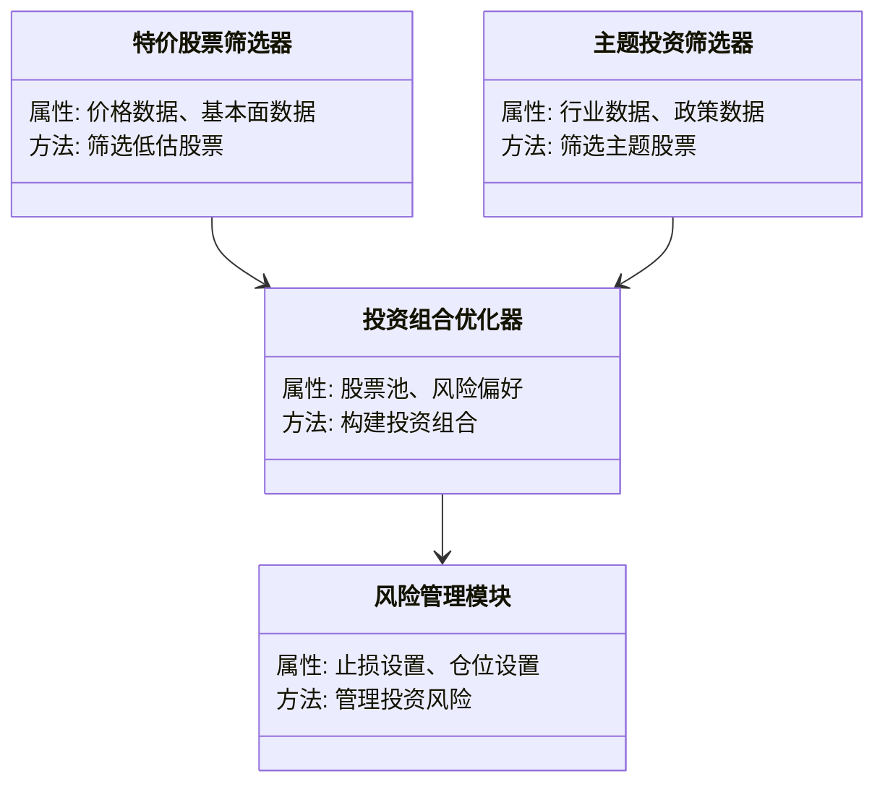

                 


# 如何将特价股票策略与主题投资相结合

> 关键词：特价股票策略、主题投资、股票市场分析、投资组合优化、风险管理

> 摘要：本文详细探讨了如何将特价股票策略与主题投资相结合，分析了两者的结合优势，探讨了市场趋势、投资策略实施方法，提供了系统设计和项目实战案例，帮助投资者优化投资组合，降低风险，实现长期收益。

---

## 第一部分：特价股票策略与主题投资的结合概述

### 第1章：特价股票与主题投资的定义与特点

#### 1.1 特价股票的定义与特点
- **1.1.1 特价股票的定义**  
  特价股票是指在特定市场条件下，价格被低估的股票。这些股票通常具有较高的潜在上涨空间，但当前市场价格低于其内在价值。

- **1.1.2 特价股票的核心特点**  
  - 价格低于内在价值  
  - 高潜在回报  
  - 高风险（市场波动较大）  
  - 投资周期较长  

- **1.1.3 特价股票与普通股票的区别**  
  - 投资逻辑：普通股票基于公司基本面，特价股票基于价格低估。  
  - 风险收益比：特价股票风险较高，但潜在收益更大。  

#### 1.2 主题投资的定义与特点
- **1.2.1 主题投资的定义**  
  主题投资是指根据特定主题（如科技、医疗、绿色能源等）选择股票的投资策略。这些股票通常与某一行业或趋势密切相关。

- **1.2.2 特价股票与主题投资的结合背景**  
  - 市场波动为特价股票提供机会。  
  - 主题投资聚焦于行业趋势，捕捉结构性增长。  
  - 结合两者可实现风险可控下的高收益。

---

## 第二部分：特价股票策略与主题投资的核心概念

### 第2章：特价股票策略的理论基础

#### 2.1 特价股票策略的背景
- 特价股票策略源于“价值投资”理念，强调购买低于市场价值的股票。  
- 适用于市场低迷或个股基本面改善的阶段。

#### 2.2 特价股票策略的核心原理
- **低估识别**：通过市盈率（P/E）、市净率（P/B）等指标判断股票是否低估。  
- **安全边际**：买入价格与内在价值的差距作为安全边际，降低投资风险。

#### 2.3 特价股票策略的关键要素
- **筛选标准**：低市盈率、低市净率、高股息率。  
- **投资组合**：分散投资，避免单一股票风险。  
- **风险管理**：设置止损点，控制最大回撤。

### 第3章：主题投资的理论基础

#### 3.1 主题投资的背景
- 主题投资基于长期行业趋势，如科技革命、消费升级等。  
- 适用于经济结构转型或新兴产业崛起的阶段。

#### 3.2 主题投资的核心原理
- **趋势判断**：选择与未来增长趋势相关的行业或主题。  
- **集中投资**：聚焦于特定行业，提高投资收益。

#### 3.3 主题投资的关键要素
- **主题筛选**：选择具有持续增长潜力的主题。  
- **行业龙头**：选择行业内具有竞争优势的公司。  
- **风险控制**：关注行业政策和市场变化。

---

## 第三部分：特价股票策略与主题投资的市场分析

### 第4章：当前市场中的特价股票机会

#### 4.1 特价股票的市场现状
- **现状分析**：市场低迷或行业调整时，许多股票价格被低估。  
- **市场趋势**：长期来看，市场会回归理性，低估股票有上涨潜力。  
- **市场风险**：短期波动可能带来较大的价格波动。

#### 4.2 当前市场中的主题投资热点
- **科技主题**：人工智能、大数据等行业的增长潜力。  
- **绿色能源**：全球碳中和目标下的新能源投资机会。  
- **消费升级**：居民收入增长带动的消费行业增长。

#### 4.3 特价股票与主题投资的结合机会
- **结合定义**：在特定主题下，选择价格被低估的股票。  
- **市场分析**：通过行业趋势和股票估值双重筛选。  
- **实现路径**：结合主题筛选和股票估值指标，构建投资组合。

---

## 第四部分：特价股票策略与主题投资的结合策略

### 第5章：特价股票策略的实施方法

#### 5.1 特价股票的筛选标准
- **市盈率（P/E）**：低于行业平均水平。  
- **市净率（P/B）**：低于历史平均水平。  
- **股息率**：高于行业平均水平。

#### 5.2 投资组合构建
- **分散投资**：选择多个低估股票，降低单一股票风险。  
- **动态调整**：定期评估股票估值，及时调整持仓。  

#### 5.3 风险管理
- **止损策略**：设定最大回撤比例，如10%。  
- **仓位控制**：根据市场环境调整持仓比例。

### 第6章：主题投资的实施方法

#### 6.1 主题筛选
- **行业趋势**：选择具有长期增长潜力的行业。  
- **政策支持**：关注政府政策鼓励的行业。  

#### 6.2 投资组合构建
- **行业龙头**：选择行业内具有竞争优势的公司。  
- **分散投资**：在多个相关行业中分散投资。  

#### 6.3 风险管理
- **行业风险**：关注行业政策变化和市场波动。  
- **分散风险**：避免过度集中于单一行业。

---

## 第五部分：系统分析与架构设计

### 第7章：系统功能设计

#### 7.1 问题场景
- 投资者需要一个系统来自动筛选特价股票和主题投资机会。  
- 系统需要提供数据收集、分析和投资建议功能。

#### 7.2 领域模型（mermaid 类图）


---

## 第六部分：项目实战

### 第8章：项目实战案例

#### 8.1 环境安装
- 数据库：MySQL  
- 开发工具：Python（pandas、numpy）  
- 可视化工具：Matplotlib

#### 8.2 核心代码实现
```python
import pandas as pd
import numpy as np

# 数据收集：假设数据为股票信息，包括市盈率（P/E）、市净率（P/B）、股息率
df = pd.read_csv('stock_data.csv')

# 筛选特价股票：P/E < 行业平均，P/B < 行业平均
industry_avg_pe = df.groupby('行业')['P/E'].mean()
industry_avg_pb = df.groupby('行业')['P/B'].mean()

# 筛选主题投资：选择绿色能源行业
green_energy_stocks = df[df['行业'] == '绿色能源']

# 组合策略：在绿色能源行业中筛选低估股票
combined_strategy = green_energy_stocks[(green_energy_stocks['P/E'] < industry_avg_pe[green_energy_stocks['行业'].values[0]]) & 
                                          (green_energy_stocks['P/B'] < industry_avg_pb[green_energy_stocks['行业'].values[0]])
                                      ]
```

#### 8.3 结果分析
- **绿色能源行业**：假设行业平均P/E为15，P/B为2。  
- 筛选出P/E < 15且P/B < 2的股票，作为投资组合。  
- 定期跟踪股票价格变化，调整持仓比例。

---

## 第七部分：总结与展望

### 第9章：总结与展望

#### 9.1 总结
- 特价股票策略与主题投资的结合，能够在风险可控的前提下，实现较高的投资收益。  
- 通过系统设计和数据驱动的方法，投资者可以更好地捕捉市场机会，优化投资组合。

#### 9.2 展望
- **动态调整策略**：根据市场变化，动态调整投资组合。  
- **结合其他策略**：未来可以尝试将量化交易策略与主题投资结合，进一步优化投资效果。  

---

## 作者信息

作者：AI天才研究院/AI Genius Institute & 禅与计算机程序设计艺术 /Zen And The Art of Computer Programming

