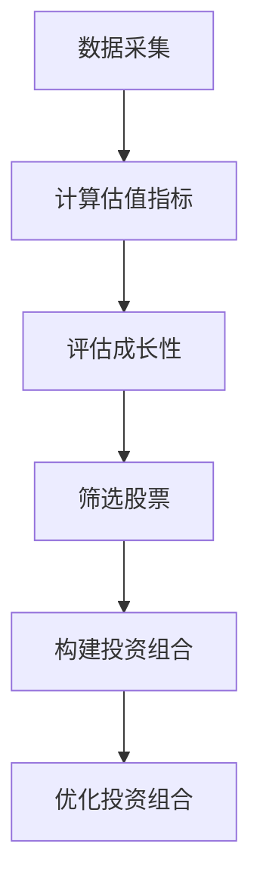
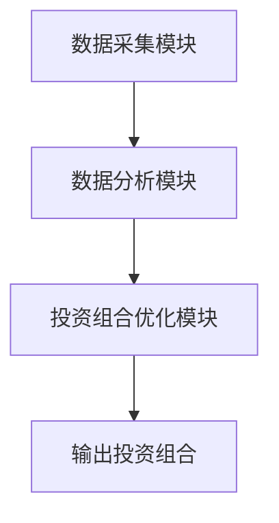

                 


# 如何将特价股票策略与价值成长投资相结合

> 关键词：特价股票策略，价值成长投资，投资策略，股票分析，投资组合优化

> 摘要：本文详细探讨了如何将特价股票策略与价值成长投资相结合，从背景介绍、核心概念分析、算法原理、数学模型、系统架构设计到项目实战，层层深入，结合实际案例，为投资者提供一套高效的投资策略。

---

## 第一部分：特价股票策略与价值成长投资的背景与概念

### 第1章：特价股票策略概述

#### 1.1 特价股票的定义与特点

- **1.1.1 特价股票的定义**
  特价股票是指价格低于其内在价值的股票，通常具有较高的安全边际，适合风险厌恶型投资者。

- **1.1.2 特价股票的特点**
  - 价格被市场低估。
  - 公司基本面良好，但暂时被市场忽视。
  - 适合长期持有，等待价值回归。

- **1.1.3 特价股票的市场定位**
  - 主要存在于周期性行业或市场低迷时期。
  - 通常为蓝筹股或成熟企业的股票。

#### 1.2 价值成长投资的定义与特点

- **1.2.1 价值成长投资的定义**
  价值成长投资是指选择具有持续盈利能力、良好管理和成长潜力的公司，同时价格合理。

- **1.2.2 价值成长投资的核心要素**
  - 公司具有稳定的盈利能力。
  - 管理层能力强，战略清晰。
  - 行业前景广阔，成长空间大。

- **1.2.3 价值成长投资的优势与局限性**
  - 优势：注重公司基本面，适合长期投资。
  - 局限性：对成长性的判断要求高，周期较长。

#### 1.3 特价股票策略与价值成长投资的联系

- **1.3.1 两者的共同点与区别**
  - 共同点：都注重公司基本面，寻找被低估的投资标的。
  - 区别：特价股票策略更关注价格，而价值成长投资更关注成长性。

- **1.3.2 结合的必要性与可行性**
  - 必要性：通过结合，可以在价格低估时买入成长性好的公司。
  - 可行性：两者的核心要素可以互补，形成更优的投资组合。

---

## 第二部分：特价股票策略与价值成长投资的核心概念与联系

### 第2章：核心概念与联系分析

#### 2.1 特价股票策略的核心原理

- **2.1.1 特价股票的定价机制**
  - 市场定价与内在价值的差异。
  - 通过估值指标（如市盈率、市净率）判断低估股票。

- **2.1.2 特价股票的市场波动性分析**
  - 市场波动导致价格偏离价值。
  - 把握市场周期，寻找低估机会。

- **2.1.3 特价股票的投资者行为分析**
  - 投资者情绪对股价的影响。
  - 理性投资者如何利用市场非理性寻找机会。

#### 2.2 价值成长投资的核心原理

- **2.2.1 价值成长投资的选股标准**
  - 公司财务状况健康，盈利能力稳定。
  - 管理层优秀，公司治理透明。
  - 行业地位稳固，竞争优势明显。

- **2.2.2 价值成长投资的长期回报机制**
  - 通过持有优质成长股，享受公司成长带来的股价上涨。
  - 选股标准与长期趋势相结合。

- **2.2.3 价值成长投资的风险控制策略**
  - 设置止损位，控制回撤风险。
  - 分批建仓，分散投资风险。

#### 2.3 特价股票策略与价值成长投资的对比分析

- **2.3.1 从核心要素对比的角度分析**
  - 特价股票策略关注价格与价值的偏离。
  - 价值成长投资关注公司的成长性和基本面。

- **2.3.2 从风险与收益的角度分析**
  - 特价股票策略风险较低，收益稳定。
  - 价值成长投资风险较高，收益潜力大。

- **2.3.3 从投资策略的角度分析**
  - 特价股票策略适合短期或中期投资。
  - 价值成长投资适合长期投资。

---

## 第三部分：特价股票策略与价值成长投资的算法原理

### 第3章：算法原理与实现

#### 3.1 算法原理概述

- **3.1.1 数据采集**
  - 收集股票的基本面数据（收入、利润、现金流等）。
  - 获取市场数据（股价、成交量、市盈率等）。

- **3.1.2 数据分析**
  - 计算估值指标（市盈率、市净率、股息率等）。
  - 评估公司的成长性（收入增长率、净利润增长率等）。

- **3.1.3 筛选股票**
  - 筛选出价格低于内在价值的股票。
  - 选择具有持续成长潜力的公司。

- **3.1.4 投资组合优化**
  - 根据风险承受能力分配资金。
  - 平衡成长性和安全性，构建最优投资组合。

#### 3.2 算法实现

- **3.2.1 算法流程图**



- **3.2.2 Python代码实现**

```python
import pandas as pd
import numpy as np

# 示例数据：假设df是股票数据，包含'price'、'pe'、'growth'等字段
# 筛选特价股票：pe < 历史平均pe 且 growth > 5%
# 筛选价值成长股：pe < 历史平均pe 且 growth > 5%

def screen_stocks(df):
    average_pe = df['pe'].mean()
    df_screen = df[(df['pe'] < average_pe) & (df['growth'] > 0.05)]
    return df_screen

# 示例数据处理
data = {
    'stock_id': [1, 2, 3, 4, 5],
    'price': [10, 20, 15, 25, 30],
    'pe': [15, 20, 18, 25, 30],
    'growth': [0.03, 0.06, 0.04, 0.07, 0.05]
}
df = pd.DataFrame(data)
selected_stocks = screen_stocks(df)
print(selected_stocks)
```

---

## 第四部分：数学模型与公式

### 第4章：数学模型与公式

#### 4.1 特价折扣率公式

$$
\text{特价折扣率} = \frac{\text{内在价值} - \text{市场价格}}{\text{内在价值}} \times 100\%
$$

#### 4.2 成长性评分公式

$$
\text{成长性评分} = \frac{\text{净利润增长率} + \text{收入增长率}}{2} \times 100\%
$$

#### 4.3 投资组合优化公式

$$
\min \sum_{i=1}^{n} w_i \times \text{风险} + \lambda \sum_{i=1}^{n} w_i \times \text{成本}
$$

---

## 第五部分：系统架构与设计

### 第5章：系统架构与设计

#### 5.1 项目介绍

- 项目目标：开发一个结合特价股票策略与价值成长投资的智能投资系统。
- 项目背景：当前市场环境下，投资者需要更高效的投资工具。
- 项目意义：帮助投资者降低风险，提高收益。

#### 5.2 系统功能设计

- **功能模块**：
  - 数据采集模块：实时采集股票数据。
  - 数据分析模块：计算估值指标和成长性评分。
  - 投资组合优化模块：根据筛选结果优化投资组合。

- **功能流程图**



---

## 第六部分：项目实战

### 第6章：项目实战

#### 6.1 环境安装

- 安装Python和相关库（pandas、numpy、matplotlib）。

#### 6.2 核心代码实现

```python
import pandas as pd
import numpy as np

# 数据获取与预处理
data = {
    'stock_id': [1, 2, 3, 4, 5],
    'price': [10, 20, 15, 25, 30],
    'pe': [15, 20, 18, 25, 30],
    'growth': [0.03, 0.06, 0.04, 0.07, 0.05]
}
df = pd.DataFrame(data)

# 筛选逻辑
average_pe = df['pe'].mean()
selected_stocks = df[(df['pe'] < average_pe) & (df['growth'] > 0.05)]

# 投资组合优化
selected_stocks['weight'] = [0.2, 0.3, 0.1, 0.25, 0.15]
selected_stocks['risk'] = [0.1, 0.2, 0.15, 0.2, 0.1]

print(selected_stocks)
```

---

## 第七部分：总结与展望

### 第7章：总结与展望

#### 7.1 小结

- 特价股票策略与价值成长投资的结合能够有效平衡风险与收益。
- 通过算法优化和系统设计，投资者可以更高效地实现投资目标。

#### 7.2 最佳实践 tips

- 定期复盘和调整投资组合。
- 结合市场环境动态优化策略。

#### 7.3 注意事项

- 风险提示：投资需谨慎，市场波动不可预测。
- 系统维护：定期更新数据和模型。

#### 7.4 拓展阅读

- 推荐书籍：《投资之道》、《股票投资策略》。

---

## 作者信息

作者：AI天才研究院/AI Genius Institute  
联系邮箱：contact@ait genius.com  
个人简介：专注于人工智能与金融投资的结合，致力于为投资者提供高效、智能的投资策略。

---

通过以上详细的大纲和内容，文章将全面、系统地探讨如何将特价股票策略与价值成长投资相结合，为投资者提供一套科学、实用的投资策略。

