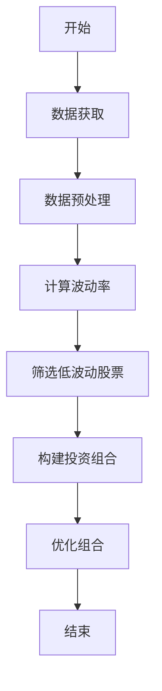
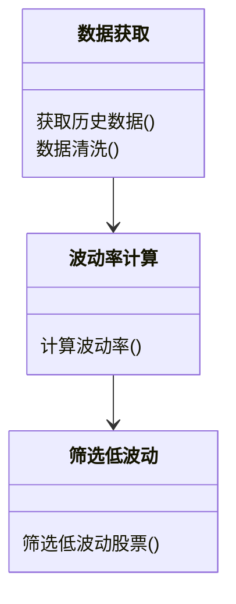

                 


# 如何将特价股票策略与低波动因子投资相结合

> 关键词：特价股票策略、低波动因子、投资组合优化、量化投资、因子模型

> 摘要：本文探讨了如何将特价股票策略与低波动因子投资相结合，通过量化分析和数学模型优化投资组合。文章首先介绍背景与概念，然后分析低波动因子的数学模型，接着详细讲解算法实现，最后通过项目实战验证策略的有效性。

---

## 第一部分：特价股票策略与低波动因子投资的背景与概念

### 第1章：特价股票策略概述

#### 1.1 特价股票策略的定义与特点

**1.1.1 特价股票的定义**

特价股票指的是价格相对历史高点或市场平均水平出现显著折扣的股票。这些股票通常被认为具有较高的投资价值，可能因为市场波动、公司特定事件或行业周期性调整导致价格下跌。

**1.1.2 特价股票策略的核心特点**

- **低估性**：股票价格低于其内在价值。
- **周期性**：通常在市场低迷或特定行业周期中出现。
- **风险性**：低价可能反映公司的基本面问题，需谨慎评估。

**1.1.3 特价股票策略的应用场景**

- **价值投资**：寻找被市场低估的优质公司。
- **短期套利**：利用市场短期波动捕捉价格反弹机会。

#### 1.2 低波动因子投资的定义与特点

**1.2.1 低波动因子的定义**

低波动因子是指那些波动率低的股票组合，通常表现出稳定的价格走势。低波动因子通过衡量股票的波动率，筛选出波动性较低的股票，以降低投资组合的风险。

**1.2.2 低波动因子的核心属性**

- **波动率低**：股票价格波动小，风险较低。
- **稳定性高**：表现较为平稳，受市场波动影响较小。
- **收益稳定**：通常在长期投资中表现较好，尤其是在市场波动剧烈时。

**1.2.3 低波动因子与高波动因子的对比**

下表对比了低波动因子和高波动因子的主要区别：

| 属性       | 低波动因子        | 高波动因子        |
|------------|-------------------|-------------------|
| 波动率     | 低                | 高                |
| 风险       | 低                | 高                |
| 收益       | 稳定              | 波动大            |
| 适用场景   | 长期稳健投资      | 短期高回报机会    |

#### 1.3 特价股票策略与低波动因子的关联性

**1.3.1 特价股票策略中的低波动因子**

在特价股票策略中，低波动因子用于筛选出那些价格波动小但被低估的股票，从而降低投资风险。

**1.3.2 低波动因子如何优化特价股票策略**

通过引入低波动因子，投资者可以在特价股票中筛选出稳定性更高的标的，减少因市场波动带来的回撤。

**1.3.3 两者的结合对投资组合的影响**

结合低波动因子后，投资组合的风险降低，同时保持一定的收益潜力。这种结合尤其适合风险厌恶型投资者。

---

## 第二部分：低波动因子与特价股票策略的核心原理

### 第2章：低波动因子的数学模型与分析

#### 2.1 低波动因子的数学表达

**2.1.1 波动率的定义与计算公式**

波动率衡量了资产价格的波动程度，常用标准差或方差来表示。标准差的计算公式为：

$$
\sigma = \sqrt{\frac{1}{n}\sum_{i=1}^{n}(x_i - \mu)^2}
$$

其中，$\mu$ 是平均值，$x_i$ 是每个观测值，$n$ 是观测次数。

**2.1.2 低波动因子的量化方法**

低波动因子通常通过计算股票的波动率，并按从低到高排序，选择波动率最低的部分作为投资标的。

---

## 第三部分：低波动因子投资策略的算法实现

### 第3章：低波动因子投资的算法原理

#### 3.1 算法原理概述

**3.1.1 基于低波动因子的投资组合优化**

通过量化低波动因子，构建一个低波动的投资组合，以降低整体波动率。

**3.1.2 多因子模型的构建与应用**

结合多个因子（如价值因子、动量因子）进行综合评估，其中低波动因子用于控制风险。

#### 3.2 算法实现步骤

**3.2.1 数据获取与预处理**

- 获取历史股价数据。
- 数据清洗，处理缺失值和异常值。

**3.2.2 低波动因子的计算与筛选**

- 计算每只股票的波动率。
- 按波动率排序，筛选出波动率最低的股票。

**3.2.3 投资组合的构建与优化**

- 根据筛选结果构建投资组合。
- 调整权重，优化风险与收益比。

#### 3.3 算法流程图

使用 Mermaid 绘制算法流程图：



---

## 第四部分：系统分析与架构设计方案

### 第4章：系统功能设计

#### 4.1 领域模型类图

使用 Mermaid 绘制领域模型类图：



---

## 第五部分：项目实战

### 第5章：项目实战

#### 5.1 环境安装

- 安装Python环境。
- 安装相关库：Pandas、NumPy、Matplotlib、Scikit-learn。

#### 5.2 核心实现源代码

```python
import pandas as pd
import numpy as np
import matplotlib.pyplot as plt

# 获取数据
data = pd.read_csv('stock_data.csv')

# 数据预处理
data.dropna()  # 删除缺失值

# 计算波动率
def calculate_volatility(prices):
    return np.std(prices)

# 筛选低波动股票
volatility = data['收盘价'].apply(calculate_volatility)
low_vol_stocks = volatility.nsmallest(10)

# 可视化
low_vol_stocks.plot(kind='hist')
plt.show()
```

---

## 第六部分：最佳实践

### 第6章：总结与展望

#### 6.1 小结

将特价股票策略与低波动因子相结合，能够有效降低投资风险，同时捕捉市场低估的机会，是一种稳健的投资策略。

#### 6.2 注意事项

- 定期调整投资组合。
- 谨慎处理市场极端情况。

#### 6.3 拓展阅读

- 《投资学基础》
- 《量化投资策略》

---

作者：AI天才研究院 & 禅与计算机程序设计艺术

