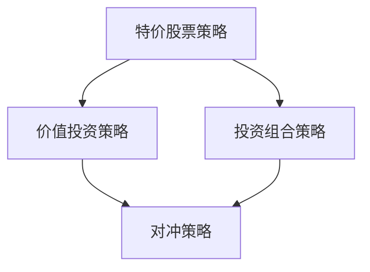
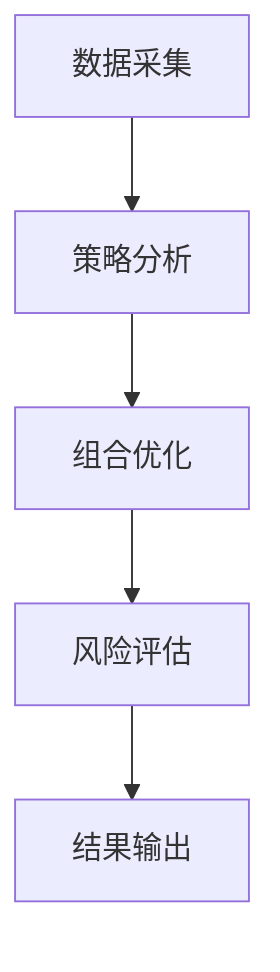
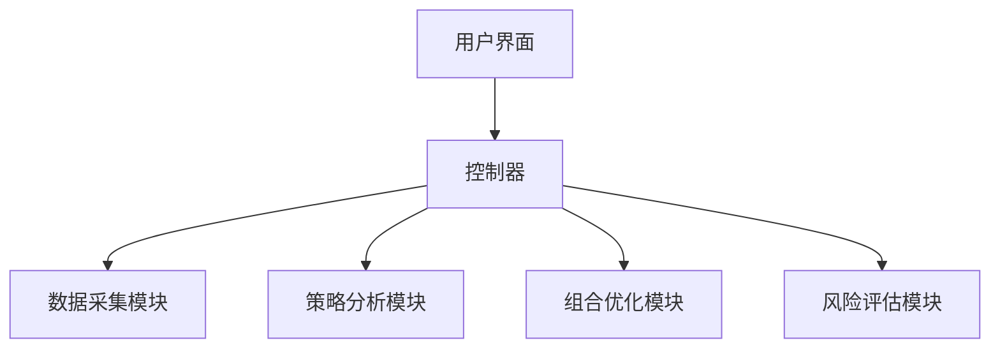
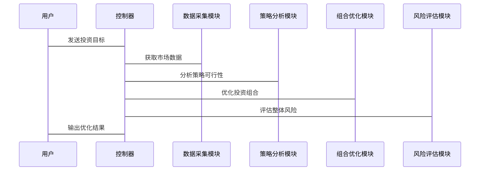

                 


```markdown
# 如何将特价股票策略与其他投资策略结合

> 关键词：特价股票策略，投资策略，股票投资，组合投资，风险管理

> 摘要：本文将详细探讨如何将特价股票策略与其他投资策略相结合，以优化投资组合的表现。通过分析特价股票策略的核心原理、其他主要投资策略的特点，以及它们之间的联系，本文旨在为投资者提供一种系统化的投资方法。结合数学模型、算法实现和实际案例分析，本文将深入讲解如何将特价股票策略与其他策略（如价值投资、投资组合优化、对冲策略等）结合起来，以实现风险可控、收益最大化的目标。

---

# 第一部分: 特价股票策略与其他投资策略结合概述

# 第1章: 特价股票策略与其他投资策略概述

## 1.1 特价股票策略的定义与特点

### 1.1.1 特价股票的定义

特价股票是指在特定市场条件下，价格低于其内在价值或行业平均水平的股票。这些股票通常具有较高的投资潜力，因为它们的价格波动为投资者提供了套利或短期获利的机会。

### 1.1.2 特价股票策略的核心特点

- **短期性**：特价股票策略通常基于短期价格波动，适合短期投资者。
- **套利机会**：利用市场价差或错误定价进行套利。
- **高风险**：价格波动大，风险较高，需要快速决策。

### 1.1.3 特价股票策略与其他投资策略的区别

| 策略类型 | 核心目标 | 时间周期 | 风险特征 |
|----------|----------|----------|----------|
| 特价股票策略 | 利用价格波动获利 | 短期 | 高风险 |
| 价值投资策略 | 买入低估股票，长期持有 | 长期 | 中低风险 |
| 投资组合策略 | 分散投资风险，优化收益 | 中长期 | 低风险 |
| 对冲策略 | 利用市场中性策略降低风险 | 中短期 | 低风险 |

## 1.2 其他主要投资策略简介

### 1.2.1 价值投资策略

- **核心思想**：买入市场价格低于内在价值的股票，长期持有，等待价值回归。
- **代表人物**：沃伦·巴菲特。

### 1.2.2 投资组合策略

- **核心思想**：通过分散投资降低风险，优化收益。
- **代表模型**：现代投资组合理论（MPT）。

### 1.2.3 对冲策略

- **核心思想**：通过做多和做空相结合，降低市场风险。
- **代表人物**：詹姆斯·西蒙斯。

### 1.2.4 技术分析策略

- **核心思想**：通过分析历史价格和成交量数据，预测未来价格走势。

## 1.3 特价股票策略与其他投资策略的结合意义

### 1.3.1 组合投资的优势

- **风险分散**：结合不同策略可以降低单一策略的风险。
- **收益增强**：通过策略互补，提升整体收益。

### 1.3.2 风险分散的重要性

- **降低市场风险**：避免因单一市场波动带来的重大损失。
- **优化投资组合**：通过多样化策略，降低整体波动性。

### 1.3.3 提高投资收益的潜力

- **套利机会**：利用特价股票的短期价格波动获利。
- **长期增长**：结合价值投资策略，抓住长期增长潜力。

## 1.4 本章小结

本章介绍了特价股票策略的定义、特点和其他主要投资策略的核心思想，并分析了它们之间的联系和结合的意义。通过结合不同策略，投资者可以实现风险可控、收益最大化的目标。

---

# 第2章: 特价股票策略与其他投资策略的核心概念与联系

## 2.1 特价股票策略的核心原理

### 2.1.1 市场套利机会的识别

- **定义**：利用市场价差进行套利。
- **方法**：分析不同市场、时间和交易条件下的价格差异。

### 2.1.2 价格波动的预测

- **技术分析**：通过K线图、均线、成交量等技术指标预测价格走势。
- **量化分析**：利用算法和大数据分析预测价格波动。

### 2.1.3 特价股票的买卖时机

- **买入时机**：价格低于内在价值，且短期有上涨潜力。
- **卖出时机**：价格接近市场价，或波动风险加大时。

## 2.2 其他投资策略的核心原理

### 2.2.1 价值投资策略的核心原理

- **内在价值计算**：通过基本面分析（如市盈率、市净率、ROE等）确定股票的内在价值。
- **安全边际**：买入价格低于内在价值，以降低风险。

### 2.2.2 投资组合策略的核心原理

- **资产分配**：根据风险承受能力和收益目标，分配不同资产的比例。
- **风险优化**：通过协方差矩阵优化投资组合的风险和收益。

### 2.2.3 对冲策略的核心原理

- **做多和做空结合**：通过同时买入和卖出相关资产，降低市场风险。
- **对冲基金**：利用市场中性策略，降低整体波动性。

## 2.3 特价股票策略与其他投资策略的联系

### 2.3.1 策略间的协同效应

- **套利与价值投资**：套利策略可以在短期内获利，而价值投资策略可以在长期内实现收益。
- **投资组合优化**：将特价股票策略与其他策略结合，可以优化投资组合的风险和收益。

### 2.3.2 策略间的互补性

- **短期与长期结合**：特价股票策略适合短期投资，而价值投资策略适合长期投资。
- **风险与收益平衡**：通过结合不同策略，可以在风险与收益之间找到平衡点。

### 2.3.3 策略间的相互影响

- **市场环境变化**：不同策略的表现会受到市场环境的影响，需要动态调整。
- **策略间的相互作用**：例如，对冲策略可以降低特价股票策略的风险，而投资组合策略可以优化整体收益。

## 2.4 概念对比与ER实体关系图



## 2.5 本章小结

本章详细讲解了特价股票策略和其他投资策略的核心原理，并通过对比分析和ER图展示了它们之间的联系。通过理解这些联系，投资者可以更好地将不同策略结合起来，优化投资组合的表现。

---

# 第3章: 特价股票策略与其他投资策略的数学模型与公式

## 3.1 特价股票策略的数学模型

### 3.1.1 价格波动模型

$$ P(t) = P(t-1) + \epsilon $$

其中，$P(t)$ 表示时间 $t$ 的股票价格，$\epsilon$ 表示随机波动。

### 3.1.2 市场套利机会的计算公式

$$ \text{套利收益} = \max(P_{\text{buy}}, P_{\text{sell}}) - \min(P_{\text{buy}}, P_{\text{sell}}) $$

其中，$P_{\text{buy}}$ 和 $P_{\text{sell}}$ 分别表示买入和卖出价格。

## 3.2 其他投资策略的数学模型

### 3.2.1 价值投资的内在价值计算

$$ V = \frac{E}{k} $$

其中，$E$ 表示预期收益，$k$ 表示折现率。

### 3.2.2 投资组合优化的数学模型

$$ \text{收益最大化} = \sum_{i=1}^{n} w_i R_i $$
$$ \text{风险最小化} = \sum_{i=1}^{n} \sum_{j=1}^{n} w_i w_j \sigma_{ij} $$

其中，$w_i$ 表示第 $i$ 个资产的权重，$R_i$ 表示第 $i$ 个资产的预期收益，$\sigma_{ij}$ 表示第 $i$ 和 $j$ 个资产的风险协方差。

### 3.2.3 对冲策略的数学模型

$$ \text{对冲收益} = \alpha \cdot \beta + \beta \cdot \gamma $$

其中，$\alpha$ 表示做多收益，$\beta$ 表示对冲比例，$\gamma$ 表示做空收益。

---

# 第4章: 系统分析与架构设计

## 4.1 系统功能设计

### 4.1.1 系统功能模块

- **数据采集模块**：从多个数据源采集股票价格、市场数据等。
- **策略分析模块**：分析特价股票策略和其他策略的可行性。
- **组合优化模块**：优化投资组合的风险和收益。
- **风险评估模块**：评估投资组合的整体风险。

### 4.1.2 系统功能流程



## 4.2 系统架构设计

### 4.2.1 系统架构图



### 4.2.2 系统接口设计

- **数据接口**：从外部数据源获取股票价格、市场数据等。
- **算法接口**：实现不同投资策略的算法。
- **结果接口**：输出投资组合优化的结果。

### 4.2.3 系统交互序列图



---

# 第5章: 项目实战

## 5.1 环境安装

- **工具安装**：安装Python、Pandas、NumPy、Matplotlib等工具。
- **数据源获取**：从Yahoo Finance或东方财富网获取股票数据。

## 5.2 核心实现

### 5.2.1 特价股票策略的实现

```python
import pandas as pd
import numpy as np

def is_special_stock(price, value):
    return price < value * 0.9  # 假设特价股票价格低于内在价值的90%
```

### 5.2.2 价值投资策略的实现

```python
def calculate_intrinsic_value(revenue, expenses, interest, tax):
    EBIT = revenue - expenses
    EBT = EBIT - interest
    EAT = EBT - tax
    return EAT / (1 - tax_rate)
```

### 5.2.3 投资组合优化的实现

```python
import numpy as np

def optimize_portfolio(returns, cov_matrix):
    n = len(returns)
    inv_cov = np.linalg.inv(cov_matrix)
    weights = inv_cov.dot(np.ones(n)) / np.sum(inv_cov.dot(np.ones(n)))
    return weights
```

## 5.3 案例分析

### 5.3.1 数据分析

- **数据来源**：选取某段时间内的股票价格数据。
- **数据预处理**：清洗数据，处理缺失值和异常值。

### 5.3.2 策略实现

- **特价股票筛选**：根据价格波动和内在价值筛选特价股票。
- **投资组合优化**：结合价值投资策略优化投资组合。

## 5.4 实际案例分析

### 5.4.1 案例背景

- **市场环境**：假设当前市场中存在多个特价股票和低估股票。
- **投资目标**：实现风险可控、收益最大化的目标。

### 5.4.2 投资组合优化

- **资产分配**：将资金分配到不同策略中，如30%特价股票策略，40%价值投资策略，30%对冲策略。
- **风险评估**：通过协方差矩阵计算投资组合的风险和收益。

---

# 第6章: 总结

## 6.1 本章总结

通过本文的详细讲解，读者可以了解如何将特价股票策略与其他投资策略结合起来，优化投资组合的表现。通过数学模型、算法实现和实际案例分析，本文为投资者提供了一种系统化的投资方法。

## 6.2 最佳实践 tips

- **策略结合**：根据市场环境和自身风险承受能力，选择合适的策略结合方式。
- **动态调整**：定期评估投资组合的表现，并根据市场变化进行动态调整。
- **风险管理**：通过多样化策略和对冲手段，降低投资风险。

## 6.3 注意事项

- **市场风险**：特价股票策略具有较高的市场风险，需要谨慎操作。
- **数据质量**：数据的准确性和完整性对策略分析至关重要。
- **模型局限性**：数学模型和算法有一定的局限性，需要结合实际情况进行调整。

## 6.4 拓展阅读

- **《投资学》**：了解投资学的基本理论和方法。
- **《算法交易》**：学习算法交易的核心思想和实现方法。
- **《风险管理》**：掌握风险管理的基本原则和技巧。

---

# 作者：AI天才研究院/AI Genius Institute & 禅与计算机程序设计艺术 /Zen And The Art of Computer Programming
```

