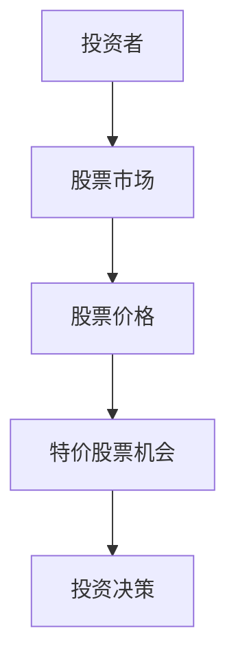
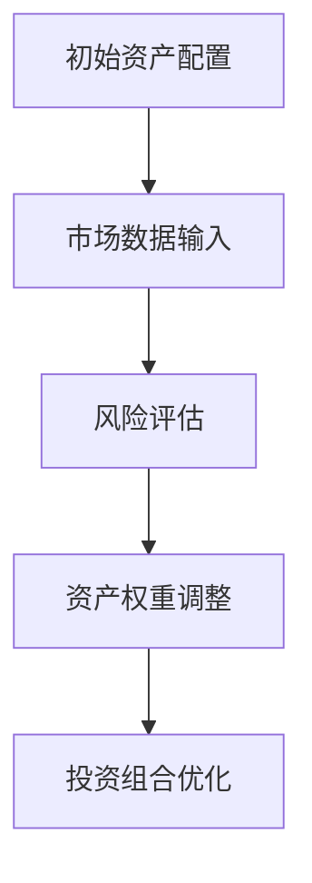
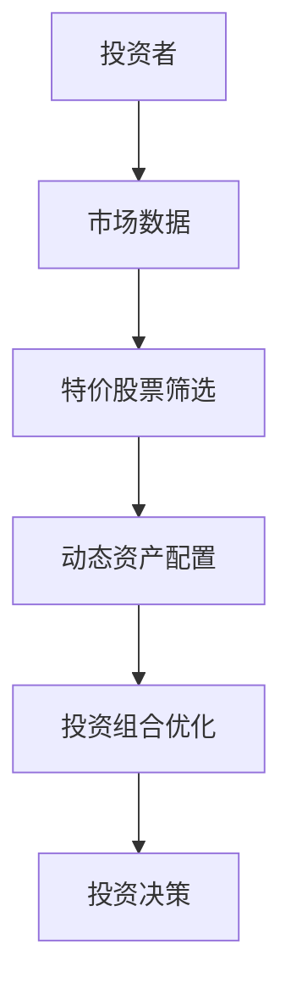
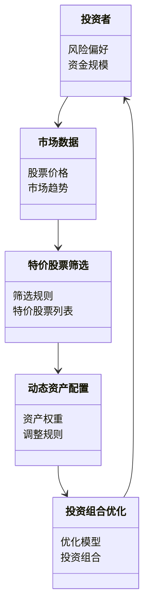
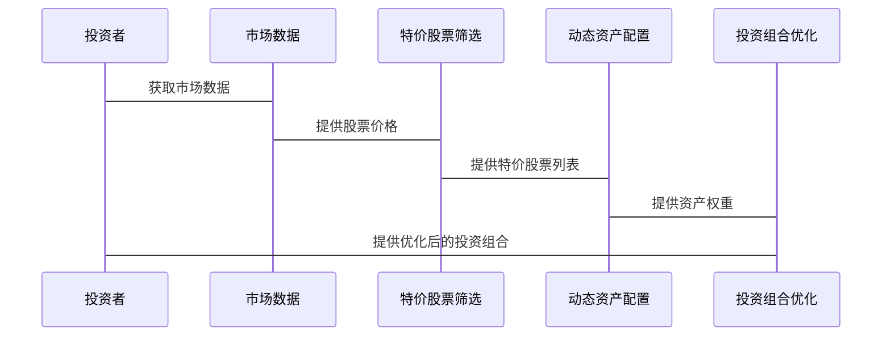

                 


# 如何将特价股票策略与动态资产配置相结合

## 关键词：特价股票策略、动态资产配置、投资组合优化、数学模型、量化交易

## 摘要：本文详细探讨了如何将特价股票策略与动态资产配置相结合，通过理论分析、算法设计和系统实现，展示了如何优化投资组合。文章从背景介绍、核心原理、系统设计、实战分析到优化与展望，全面阐述了结合策略的方法，并提供了具体的实现方案和案例分析。

---

## 第一章：背景介绍

### 1.1 特价股票策略的核心概念
#### 1.1.1 问题背景与问题描述
在股票市场中，特价股票策略是指在特定市场条件下，以低于市场价买入股票的投资策略。这种策略的核心在于捕捉市场低估的机会，通过低位买入、高位卖出的方式实现收益。然而，市场波动性和不确定性使得特价股票策略的实施充满挑战。

#### 1.1.2 特价股票策略的目标与解决方法
特价股票策略的目标是在市场低估时买入优质股票，避免在市场高估时承担过高的风险。解决方法包括基本面分析、技术分析和量化模型的应用，以识别潜在的投资机会。

#### 1.1.3 特价股票策略的边界与外延
特价股票策略的边界在于市场波动、公司基本面和投资者风险承受能力。外延则涉及多种策略类型，如短期特价策略和长期特价策略。

#### 1.1.4 特价股票策略的核心要素与组成
特价股票策略的核心要素包括市场分析、股票筛选、风险控制和投资执行。

### 1.2 动态资产配置的定义与特点
#### 1.2.1 动态资产配置的定义
动态资产配置是指根据市场变化和投资者目标，实时调整资产在不同类别之间的分配比例。其特点在于灵活性和适应性。

#### 1.2.2 动态资产配置的核心特点
动态资产配置的核心特点在于其灵活性和实时性，能够根据市场变化快速调整投资组合。

#### 1.2.3 动态资产配置与静态资产配置的区别
动态资产配置与静态资产配置的区别在于其调整频率和适应性。动态资产配置更具灵活性，而静态资产配置则较为固定。

### 1.3 本章小结
本章介绍了特价股票策略和动态资产配置的核心概念及其结合的重要性。

---

## 第二章：特价股票策略的核心原理

### 2.1 特价股票策略的原理分析
#### 2.1.1 市场波动与投资机会
市场波动为特价股票策略提供了投资机会，投资者可以通过市场低估时买入股票来实现收益。

#### 2.1.2 基本面分析与技术分析的结合
基本面分析用于评估公司的内在价值，技术分析用于识别市场趋势和买卖信号。

#### 2.1.3 特价股票策略的数学模型
特价股票策略的数学模型包括股票价格预测模型和投资组合优化模型。

### 2.2 特价股票策略的类型与对比
#### 2.2.1 短期特价策略与长期特价策略
短期特价策略适用于市场短期波动，长期特价策略则关注长期价值。

#### 2.2.2 高风险特价策略与低风险特价策略
高风险策略追求高收益，低风险策略注重稳定性。

#### 2.2.3 特价股票策略的对比分析（概念属性特征对比表格）

| 策略类型       | 投资期限 | 风险水平 | 目标收益 |
|----------------|----------|----------|----------|
| 短期特价策略   | 短期     | 高       | 高       |
| 长期特价策略   | 长期     | 中       | 中       |
| 高风险策略     | 短期     | 高       | 高       |
| 低风险策略     | 长期     | 低       | 稳定      |

### 2.3 特价股票策略的ER实体关系图（Mermaid流程图）



### 2.4 本章小结
本章详细分析了特价股票策略的核心原理及其不同类型。

---

## 第三章：动态资产配置的理论与方法

### 3.1 动态资产配置的理论基础
#### 3.1.1 现代投资组合理论（MPT）
现代投资组合理论（MPT）是动态资产配置的理论基础，强调通过分散投资降低风险。

#### 3.1.2 马科维茨均值-方差模型
马科维茨均值-方差模型用于优化投资组合，最小化风险并最大化收益。

#### 3.1.3 动态资产配置的数学模型

$$\text{目标：} \min \sigma^2 \text{（方差）}$$
$$\text{约束：} \sum w_i = 1$$
$$w_i \geq 0 \text{（权重）}$$

### 3.2 动态资产配置的核心方法
#### 3.2.1 基于市场趋势的动态调整
根据市场趋势调整资产配置比例。

#### 3.2.2 基于风险承受能力的动态调整
根据投资者的风险承受能力调整资产配置。

#### 3.2.3 基于资产类别轮动的动态调整
通过资产类别轮动优化投资组合。

### 3.3 动态资产配置的算法实现（Mermaid流程图）



### 3.4 本章小结
本章介绍了动态资产配置的理论基础及其核心方法。

---

## 第四章：特价股票策略与动态资产配置的结合

### 4.1 结合策略的选择与优化
#### 4.1.1 特价股票策略的选择
选择适合市场环境的特价股票策略。

#### 4.1.2 动态资产配置的优化方法
通过优化模型调整资产配置比例。

#### 4.1.3 结合策略的优化方法
将特价股票策略与动态资产配置结合，优化投资组合。

### 4.2 系统设计与实现
#### 4.2.1 系统架构设计（Mermaid架构图）



#### 4.2.2 系统功能设计（领域模型Mermaid类图）



#### 4.2.3 系统接口设计与交互（Mermaid序列图）



### 4.3 本章小结
本章详细探讨了如何将特价股票策略与动态资产配置结合，并给出了系统设计和实现方案。

---

## 第五章：系统实现与实战分析

### 5.1 环境与工具配置
#### 5.1.1 开发环境
Python、Jupyter Notebook、数据库。

#### 5.1.2 工具安装
安装必要的库，如Pandas、NumPy、Scikit-learn、Plotly。

### 5.2 核心算法实现
#### 5.2.1 特价股票筛选算法（Python代码）

```python
import pandas as pd
import numpy as np

def screen_penny_stocks(data, threshold):
    return data[data['price'] < threshold]
```

#### 5.2.2 动态资产配置算法（Python代码）

```python
def dynamic_asset Allocation(data, risk_level):
    # 根据风险水平调整资产权重
    return allocation
```

### 5.3 实战案例分析
#### 5.3.1 数据收集与预处理
从数据源获取市场数据并进行清洗。

#### 5.3.2 特价股票筛选与分析
根据筛选规则识别特价股票。

#### 5.3.3 动态资产配置与优化
根据市场变化调整资产配置比例。

#### 5.3.4 投资组合表现分析
评估投资组合的收益与风险。

### 5.4 本章小结
本章通过实战案例展示了如何将特价股票策略与动态资产配置结合，并给出了具体的实现方案。

---

## 第六章：优化与展望

### 6.1 系统优化
#### 6.1.1 性能优化
优化算法和数据处理效率。

#### 6.1.2 风险控制优化
改进风险控制模型，降低投资风险。

#### 6.1.3 系统架构优化
优化系统架构，提高系统的扩展性和可维护性。

### 6.2 未来展望
#### 6.2.1 新的特价股票策略
研究新的特价股票策略，如人工智能驱动的策略。

#### 6.2.2 动态资产配置的创新
探索新的动态资产配置方法，如基于机器学习的配置模型。

### 6.3 本章小结
本章讨论了系统的优化方法，并展望了未来的研究方向。

---

## 作者信息
作者：AI天才研究院/AI Genius Institute  
联系方式：[email protected]  
个人简介：专注于人工智能与金融领域的交叉研究，致力于将先进技术应用于投资策略优化和资产配置。

---

通过本文的系统分析与详细讲解，读者可以全面理解如何将特价股票策略与动态资产配置相结合，并能够在实际投资中应用这些方法。

