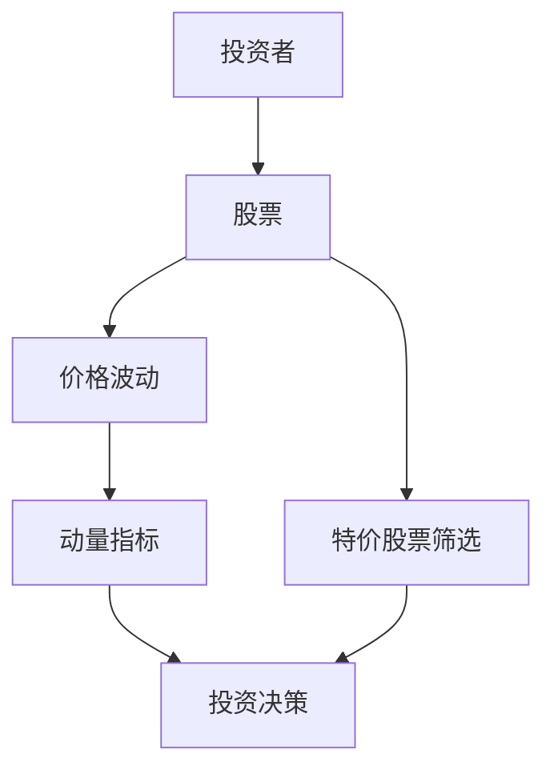
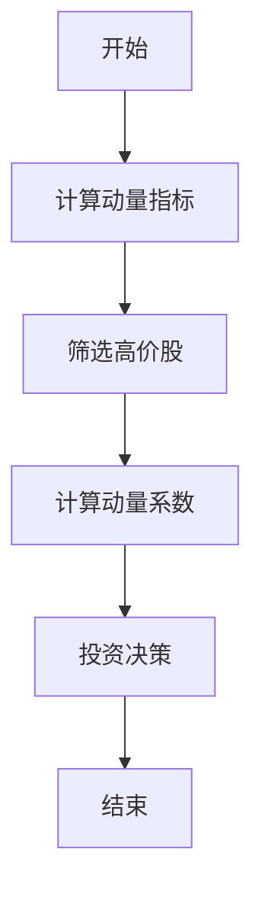
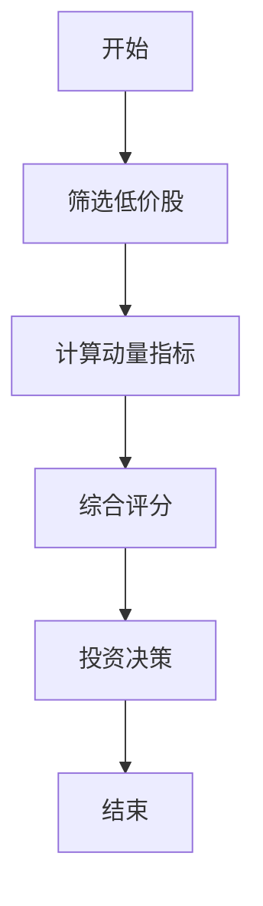
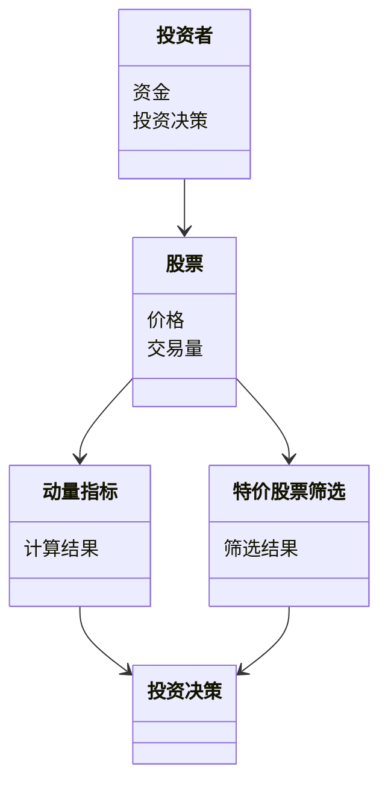
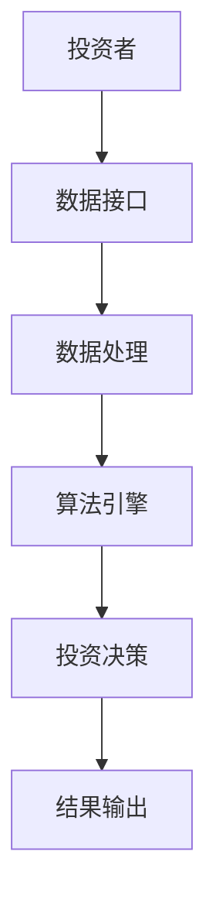
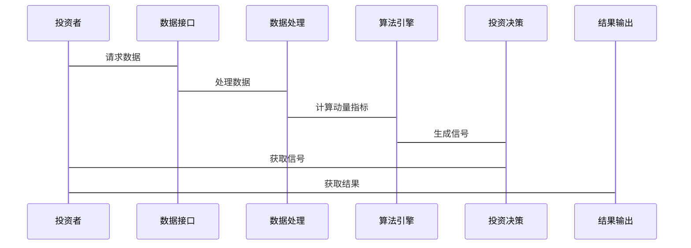

                 


# 如何将特价股票策略与动量投资相结合

> 关键词：动量投资，特价股票，投资策略，算法优化，股票筛选

> 摘要：本文深入探讨了如何将特价股票策略与动量投资相结合，通过分析两种策略的核心原理、算法实现和系统架构，提出了一种创新的组合投资方法。文章从背景介绍、核心概念、算法原理、系统设计、项目实战到最佳实践，全面阐述了如何在实际投资中应用这一策略。

---

# 第1章: 特价股票策略与动量投资的背景介绍

## 1.1 特价股票策略的核心概念

### 1.1.1 问题背景与问题描述
在股票市场中，投资者常常面临如何选择最优股票的挑战。特价股票策略关注的是以低于内在价值的价格购买股票，寻找市场中的“便宜货”。然而，仅依靠价格因素往往无法捕捉到股票的长期上涨趋势。因此，如何结合其他因素（如动量效应）来优化投资决策成为关键。

### 1.1.2 问题解决思路与方法
动量投资策略基于“趋势会延续”的假设，即过去表现良好的股票未来仍会有较好表现。通过将动量效应与特价股票策略结合，可以在低价买入的基础上，进一步捕捉趋势性收益。

### 1.1.3 问题的边界与外延
- **边界**：适用于成熟市场，避免短期波动干扰。
- **外延**：可扩展至其他资产类别，如指数基金。

### 1.1.4 核心概念结构与核心要素组成
- **核心概念结构**：动量效应与价值因子的结合。
- **核心要素**：股票价格、交易量、市场趋势。

## 1.2 动量投资的核心概念

### 1.2.1 动量投资的定义与特点
动量投资通过计算动量指标（如相对强弱指数RSI）来判断股票的强弱趋势，通常选择动量指标高的股票进行投资。

### 1.2.2 动量投资的理论基础
基于行为金融学，投资者的延迟反应导致趋势延续。动量效应在短期（1-3个月）表现尤为明显。

### 1.2.3 动量投资的实践应用
- 策略类型：短期动量、中期动量。
- 风险控制：通过止损限制回撤。

## 1.3 两者的联系与区别

### 1.3.1 对比分析
| **维度** | **动量投资** | **特价股票策略** |
|----------|--------------|-------------------|
| **核心思想** | 趋势为王 | 价格低估优先 |
| **适用场景** | 短期趋势捕捉 | 长期价值投资 |
| **风险** | 高波动性 | 低估风险 |

### 1.3.2 联系
- 动量效应可以作为特价股票的补充筛选条件，帮助选择具有上升潜力的低价股票。

### 1.3.3 ER实体关系图架构


---

# 第2章: 动量投资与特价股票策略的算法原理

## 2.1 算法原理讲解

### 2.1.1 动量投资算法流程


### 2.1.2 特价股票筛选算法


### 2.1.3 数学模型与公式

#### 2.1.3.1 动量指标计算公式
$$
\text{动量指标} = \frac{\text{当前价格}}{\text{过去n天平均价格}}
$$

#### 2.1.3.2 特价股票筛选标准
$$
\text{价值因子} = \frac{\text{当前价格}}{\text{市盈率}}
$$

---

## 2.2 算法实现代码

### 2.2.1 动量投资算法实现
```python
def momentum_strategy(prices, window=10):
    # 计算动量指标
    momentum = prices / prices.rolling(window).mean()
    return momentum
```

### 2.2.2 特价股票筛选算法实现
```python
def value_strategy(prices, volumes):
    # 计算价值指标
    value_score = prices / volumes
    return value_score
```

### 2.2.3 算法优化与改进
- 动量窗口的选择：通常选择20天或50天。
- 结合多因子模型：引入其他因子如市值、流动性等。

---

# 第3章: 动量投资与特价股票策略的系统分析与架构设计

## 3.1 系统功能设计

### 3.1.1 领域模型设计


### 3.1.2 系统架构设计


### 3.1.3 系统接口设计
- 输入接口：股票数据、参数设置。
- 输出接口：投资信号、风险提示。

### 3.1.4 系统交互流程


---

# 第4章: 动量投资与特价股票策略的项目实战

## 4.1 项目实战

### 4.1.1 环境安装
- 数据获取：使用Yahoo Finance API。
- 工具安装：Python、Pandas、Matplotlib。

### 4.1.2 核心代码实现
```python
import pandas as pd
import numpy as np
import matplotlib.pyplot as plt

def get_data(tickers, start_date, end_date):
    data = pd.DataFrame()
    for ticker in tickers:
        df = pd.read_csv(f'data/{ticker}.csv', parse_dates=['Date'], index_col='Date')
        data[ticker] = df['Close']
    return data

def compute_momentum(data, window=10):
    momentum = data.rolling(window).mean().shift(1)
    return momentum

def value_stock_screen(data, threshold=0.5):
    value_score = data / data.quantile(0.5)
    selected = data[value_score > threshold]
    return selected

# 示例代码
tickers = ['AAPL', 'MSFT', 'GOOGL']
data = get_data(tickers, '2020-01-01', '2023-12-31')
momentum = compute_momentum(data)
value_selected = value_stock_screen(data)
combined = momentum * value_selected
combined.plot()
plt.show()
```

### 4.1.3 代码功能解读
- `get_data`：获取股票数据。
- `compute_momentum`：计算动量指标。
- `value_stock_screen`：筛选特价股票。
- `combined`：综合动量与价值的信号。

### 4.1.4 实际案例分析
以苹果（AAPL）为例，通过代码计算其动量指标和价值评分，生成投资信号。

---

# 第5章: 动量投资与特价股票策略的最佳实践

## 5.1 小结
- 动量投资与特价股票策略的结合可以有效捕捉趋势性收益，同时降低投资成本。
- 代码实现简洁高效，适用于实际投资操作。

## 5.2 注意事项
- 短线交易风险较高，需设置止损。
- 数据质量影响结果，确保数据来源可靠。

## 5.3 拓展阅读
- 动量投资与多因子模型的结合。
- 特价股票策略在不同类型市场中的表现。

---

# 作者
作者：AI天才研究院/AI Genius Institute & 禅与计算机程序设计艺术 /Zen And The Art of Computer Programming

