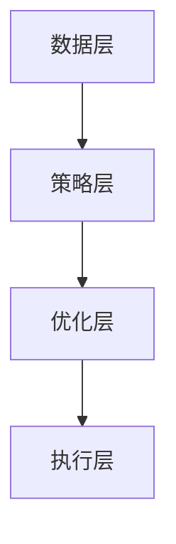

                 


# 如何将特价股票策略与动量投资结合

## 关键词

- 特价股票策略
- 动量投资
- 投资策略
- 股票筛选
- 动量指标
- 投资组合优化

## 摘要

本文探讨如何将特价股票策略与动量投资相结合，以构建一种新的投资策略。特价股票策略关注低估值的股票，而动量投资则关注价格动量效应。通过结合两者的优点，可以实现收益增强和风险降低。文章首先介绍特价股票和动量投资的基本概念，然后分析它们的联系和潜在优势，接着详细讲解结合的算法原理、数学模型和系统架构，最后通过实际案例进行分析和优化。本文适合对投资策略和技术方法感兴趣的读者。

---

## 第1章：特价股票策略与动量投资概述

### 1.1 特价股票策略的核心概念

#### 1.1.1 特价股票的定义与特征

- 特价股票是指市场价格低于其内在价值的股票。
- 特点：低估、高分红、低估值指标（市盈率、市净率等）。

#### 1.1.2 特价股票策略的背景与意义

- 背景：价值投资理论（如格雷厄姆的廉价股投资）。
- 意义：通过买入低估股票，长期获得超额收益。

#### 1.1.3 特价股票策略的优缺点分析

| 优点 | 缺点 |
|------|------|
| 高收益潜力 | 低流动性 |
| 低估值 | 长期持有风险 |
| 分红稳定 | 行业集中风险 |

### 1.2 动量投资的核心概念

#### 1.2.1 动量投资的定义与特征

- 动量投资：买入近期价格表现强劲的股票，卖出表现疲软的股票。
- 特点：短期动量效应、交易频繁。

#### 1.2.2 动量投资的背景与意义

- 背景：动量效应的实证研究（如Jegadeesh和Titman的研究）。
- 意义：利用短期价格动量效应捕捉市场趋势。

#### 1.2.3 动量投资的优缺点分析

| 优点 | 缺点 |
|------|------|
| 短期收益高 | 动量反转风险 |
| 适应市场趋势 | 交易成本高 |
| 易于量化 | 无法预测黑天鹅事件 |

### 1.3 特价股票策略与动量投资的结合

#### 1.3.1 结合的背景与动机

- 背景：价值投资与动量投资的结合。
- 动机：平衡价值与动量策略的风险收益。

#### 1.3.2 结合的理论基础与逻辑

- 理论基础：价格与价值的动态均衡。
- 逻辑：选择低估且动量强劲的股票。

#### 1.3.3 结合的潜在优势与挑战

| 优势 | 挑战 |
|------|------|
| 优化收益 | 数据选择困难 |
| 降低风险 | 交易执行问题 |
| 提高胜率 | 动量反转风险 |

---

## 第2章：特价股票策略与动量投资的核心概念与联系

### 2.1 特价股票策略与动量投资的核心概念对比

#### 2.1.1 投资目标对比

| 战略 | 投资目标 |
|------|----------|
| 特价策略 | 买入低估股票，长期持有 |
| 动量策略 | 买入动量强劲股票，短期持有 |

#### 2.1.2 投资策略对比

| 战略 | 策略特点 |
|------|----------|
| 特价策略 | 低估值、高分红、长期持有 |
| 动量策略 | 高动量、短期交易、频繁换手 |

#### 2.1.3 风险收益对比

| 战略 | 风险 | 收益 |
|------|------|------|
| 特价策略 | 长期持有风险、行业集中风险 | 高收益潜力 |
| 动量策略 | 动量反转风险、交易成本高 | 短期收益高 |

### 2.2 特价股票策略与动量投资的联系

#### 2.2.1 理论上的互补性

- 动量效应与价值回归：短期价格波动与长期价值的结合。

#### 2.2.2 实践中的协同效应

- 动量强劲的低估股票：同时满足价值与动量条件。

#### 2.2.3 市场环境的适应性

- 牛市：动量策略表现优异。
- 熊市：价值策略更具防御性。

### 2.3 特价股票策略与动量投资的ER实体关系图

```mermaid
erDiagram
    customer[投资者] {
        <属性>
        资金: 整数
        风险偏好: 文本
    }
    strategy[策略] {
        <属性>
        特价筛选条件: 文本
        动量筛选条件: 文本
    }
    stock[股票] {
        <属性>
        代码: 文本
        当前价格: 数字
        市盈率: 数字
        市净率: 数字
        动量指标: 数字
    }
    portfolio[投资组合] {
        <属性>
        股票代码: 文本
        持股比例: 数字
        预期收益: 数字
        风险水平: 数字
    }
    customer --> strategy: 选择策略
    strategy --> stock: 筛选股票
    stock --> portfolio: 构建组合
    portfolio --> customer: 实现收益
```

---

## 第3章：动量投资的算法原理

### 3.1 动量投资的算法流程

#### 3.1.1 数据收集与预处理

```python
import pandas as pd
import numpy as np

# 数据来源：股票数据库
# 数据清洗：处理缺失值、异常值
def data_cleaning(df):
    df.dropna(inplace=True)
    df = df[df['volume'] > 0]
    return df
```

#### 3.1.2 动量指标的计算

- 计算动量指标：相对强弱指数（RSI）、动量指数（MOM）、平均趋向指数（ADX）。

#### 3.1.3 投资组合的构建与优化

- 优化目标：最大化收益，最小化风险。
- 使用优化算法：均值-方差优化。

### 3.2 动量投资的数学模型

#### 动量因子的回归模型

```latex
$$ R_i = \beta_0 + \beta_1 M_i + \epsilon_i $$
```

其中，$R_i$ 是股票 i 的收益，$M_i$ 是动量因子，$\epsilon_i$ 是误差项。

#### 投资组合优化问题

```latex
$$ \min_{w} \sum_{i=1}^n w_i^2 $$
$$ \text{subject to } \sum_{i=1}^n w_i = 1 $$
```

---

## 第4章：特价股票策略与动量投资的结合

### 4.1 结合的背景与动机

#### 动量效应与价值回归

- 动量效应：短期价格动量。
- 价值回归：长期价格趋向于价值。

### 4.2 结合的理论基础与逻辑

#### 动量与价值的结合

- 选择低估且动量强劲的股票。

### 4.3 结合的潜在优势与挑战

#### 潜在优势

- 收益增强：同时利用价值和动量优势。
- 风险降低：分散风险，平衡短期和长期收益。

#### 挑战

- 数据选择困难：如何筛选同时满足价值和动量条件的股票。
- 交易执行问题：高换手率可能增加交易成本。

---

## 第5章：系统架构与实现

### 5.1 系统架构设计

#### 系统架构图



#### 功能模块

- 数据层：数据采集、清洗、存储。
- 策略层：策略选择、数据筛选。
- 优化层：组合优化、风险控制。
- 执行层：交易执行、结果反馈。

---

## 第6章：项目实战

### 6.1 环境安装

- 安装Python库：Pandas、NumPy、Scipy、Matplotlib。

### 6.2 核心实现

#### 数据预处理

```python
import pandas as pd
import numpy as np

def preprocess_data(df):
    # 删除缺失值
    df.dropna(inplace=True)
    # 标准化数据
    df = (df - df.mean()) / df.std()
    return df
```

#### 动量指标计算

```python
def calculate_momentum(df, window=10):
    return df['close'].rolling(window).mean()
```

#### 策略实现

```python
def momentum_strategy(df, window=10):
    df['momentum'] = calculate_momentum(df, window)
    # 筛选低估且动量强劲的股票
    selected_stocks = df[df['momentum'] > df['momentum'].mean()]
    return selected_stocks
```

---

## 第7章：最佳实践与总结

### 7.1 最佳实践

- 定期再平衡：定期调整投资组合。
- 风险管理：设置止损和止盈。
- 成本控制：选择低佣金交易平台。

### 7.2 小结

本文详细探讨了如何将特价股票策略与动量投资结合，提出了一个基于价值和动量的多因子投资策略，并通过系统架构和项目实战展示了实现方法。

---

## 作者

作者：AI天才研究院/AI Genius Institute  
& 禅与计算机程序设计艺术 /Zen And The Art of Computer Programming

