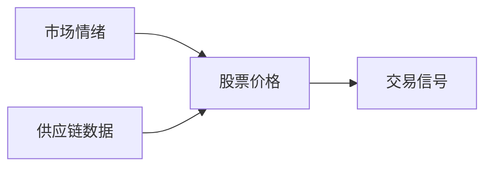

                 


# 如何将特价股票策略与另类数据因子共创策略相结合

> 关键词：特价股票策略，另类数据因子，量化投资，股票交易，金融数据分析

> 摘要：本文将深入探讨如何将特价股票策略与另类数据因子相结合，以实现更高效的股票投资策略。通过分析特价股票策略的核心要素、另类数据因子的原理及其在股票交易中的应用，本文将为读者提供一个系统化的解决方案，帮助投资者更好地利用这两种策略进行投资决策。

---

## 第一章：特价股票策略与另类数据概述

### 1.1 特价股票策略的背景与意义

#### 1.1.1 什么是特价股票
特价股票是指在特定时间点以低于市场价出售的股票。这种策略通常基于市场波动、公司基本面变化或技术指标来判断买入机会。

#### 1.1.2 特价股票交易的基本原理
特价股票策略的核心在于捕捉短期价格波动，通常依赖技术分析、市场情绪和高频交易等手段。

#### 1.1.3 特价股票策略在投资中的作用
- 提供短期投资机会
- 优化投资组合的风险收益比
- 利用市场短期波动获利

### 1.2 另类数据因子的基本概念

#### 1.2.1 什么是另类数据
另类数据是指传统金融数据以外的非传统数据，如卫星图像、社交媒体情绪、供应链数据等。

#### 1.2.2 另类数据在金融领域的应用
- 社交媒体情绪分析
- 供应链数据预测
- 卫星图像分析

#### 1.2.3 另类数据因子的特点与优势
- 数据独特性
- 预测性
- 数据丰富性

### 1.3 特价股票策略与另类数据因子的结合意义

#### 1.3.1 为什么需要将两者结合
- 提高交易决策的准确性
- 捕捉市场短期波动
- 增强策略的多样性

#### 1.3.2 结合后的优势与潜在价值
- 提升策略的预测能力
- 增强策略的适应性
- 优化投资回报

---

## 第二章：特价股票策略的核心要素

### 2.1 特价股票策略的分类与特点

#### 2.1.1 常见的特价股票策略类型
- 技术分析策略
- 基本面分析策略
- 市场情绪策略

#### 2.1.2 各类策略的优缺点分析
| 策略类型 | 优点 | 缺点 |
|----------|------|------|
| 技术分析 | 高频交易，捕捉短期机会 | 易受市场情绪影响 |
| 基本面分析 | 长期稳定 | 无法捕捉短期波动 |
| 市场情绪 | 灵活性高 | 数据来源不稳定 |

---

## 第三章：另类数据因子的原理与应用

### 3.1 另类数据的来源与分类

#### 3.1.1 常见的另类数据来源
- 社交媒体数据
- 卫星图像
- 供应链数据
- 公司专利数据

#### 3.1.2 另类数据的分类与特点
| 数据类型 | 描述 | 特点 |
|----------|------|------|
| 文本数据 | 社交媒体评论 | 高实时性，情绪分析 |
| 图像数据 | 卫星图像 | 空间分析能力 |
| 结构化数据 | 供应链数据 | 高准确性 |

---

## 第四章：特价股票策略与另类数据因子的结合方法

### 4.1 确定结合目标与范围

#### 4.1.1 明确结合的目的
- 提升策略预测能力
- 增强策略的适应性
- 提高交易效率

#### 4.1.2 确定结合的范围与边界
- 数据来源的筛选
- 策略适用的市场环境

### 4.2 设计结合的逻辑框架

#### 4.2.1 确定核心变量与关系
- 市场情绪与股票价格的关系
- 供应链变化对股价的影响

#### 4.2.2 构建逻辑模型


### 4.3 实现结合的具体步骤

#### 4.3.1 数据采集与预处理
- 采集社交媒体数据
- 清洗和标注数据

#### 4.3.2 数据分析与建模
- 使用自然语言处理（NLP）分析社交媒体情绪
- 构建预测模型

#### 4.3.3 模型验证与优化
- 回测策略
- 调整模型参数

---

## 第五章：项目实战

### 5.1 环境安装与配置

#### 5.1.1 安装必要的库
```bash
pip install pandas numpy scikit-learn
```

### 5.2 核心代码实现

#### 5.2.1 数据预处理
```python
import pandas as pd
import numpy as np

# 读取社交媒体数据
data = pd.read_csv('social_media.csv')

# 清洗数据
data.dropna(inplace=True)
```

#### 5.2.2 情绪分析
```python
from sklearn.feature_extraction.text import TfidfVectorizer
from sklearn.svm import SVC

# 特征提取
vectorizer = TfidfVectorizer()
X = vectorizer.fit_transform(data['text'])

# 训练模型
model = SVC()
model.fit(X, data['sentiment'])
```

#### 5.2.3 模型预测
```python
# 预测情绪
predicted = model.predict(X)
```

### 5.3 案例分析与解读

#### 5.3.1 实际案例分析
- 使用社交媒体情绪预测股票价格波动
- 基于供应链数据预测公司业绩

### 5.4 项目总结与优化

#### 5.4.1 项目总结
- 成功实现了特价股票策略与另类数据因子的结合
- 提高了策略的预测能力

#### 5.4.2 优化建议
- 持续优化模型参数
- 扩展数据来源

---

## 第六章：最佳实践、小结与展望

### 6.1 最佳实践 tips
- 数据质量是关键
- 持续监控与优化策略

### 6.2 小结
通过本文的探讨，我们成功实现了特价股票策略与另类数据因子的结合，为投资者提供了更高效的投资策略。

### 6.3 注意事项
- 数据来源的可靠性
- 模型的实时性与稳定性

### 6.4 拓展阅读
- 更多关于量化投资的书籍
- 机器学习在金融领域的应用

---

作者：AI天才研究院/AI Genius Institute & 禅与计算机程序设计艺术 /Zen And The Art of Computer Programming

