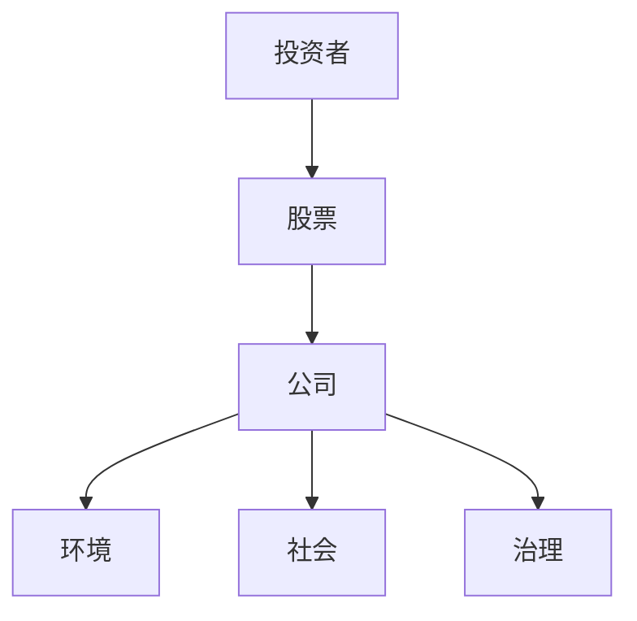
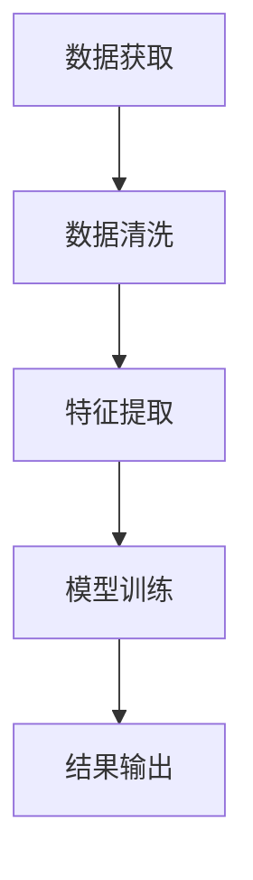
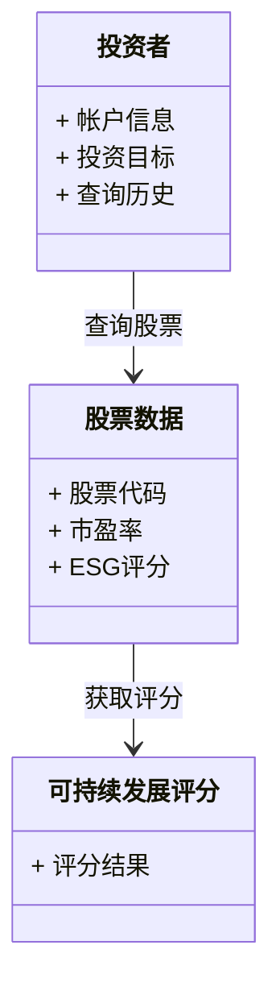
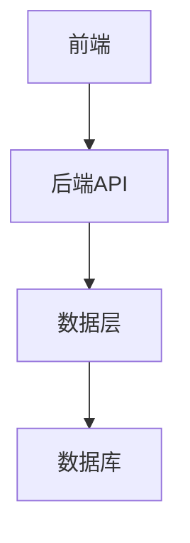

                 


```markdown
# 如何将特价股票策略与可持续发展目标投资结合

## 关键词：特价股票、可持续发展、投资策略、系统架构、项目实战

## 摘要：  
本文详细探讨了如何将特价股票策略与可持续发展目标投资相结合，通过分析两者的背景、核心概念、算法原理、系统架构以及项目实战，为投资者提供了一种创新的投资策略。文章从理论到实践，结合实际案例和代码实现，帮助读者理解并应用这一策略，实现经济效益与社会责任的双重目标。

---

## 第一部分：特价股票策略与可持续发展目标投资概述

### 第1章：背景介绍

#### 1.1 特价股票策略的基本概念
- 1.1.1 特价股票的定义：低价股票是指在特定市场条件下，股票价格低于其内在价值或行业平均水平的股票。
- 1.1.2 特价股票的市场定位：通常出现在市场低迷、公司短期困境或被市场低估的情况下。
- 1.1.3 特价股票的市场参与者：包括个人投资者、机构投资者和投资顾问。

#### 1.2 可持续发展目标投资的基本概念
- 1.2.1 可持续发展目标投资的定义：投资于在环境、社会和公司治理（ESG）方面表现良好的公司，以实现长期的经济效益和社会价值。
- 1.2.2 可持续发展目标投资的核心要素：环境（Environmental）、社会（Social）、治理（Governance）。
- 1.2.3 可持续发展目标投资的市场现状：全球范围内越来越多的投资者关注ESG表现，相关基金和投资产品不断增加。

#### 1.3 特价股票策略与可持续发展目标投资的结合意义
- 1.3.1 结合的背景分析：市场波动和经济不确定性使得投资者寻求既具备价格优势又具备社会责任的股票。
- 1.3.2 结合的必要性与可行性：通过筛选具备可持续发展属性的特价股票，投资者可以在追求收益的同时支持社会和环境的改善。
- 1.3.3 结合的潜在价值与挑战：尽管具有潜在的高回报，但需要克服数据获取困难、模型复杂性和市场波动等挑战。

---

## 第2章：核心概念与联系

### 2.1 核心概念的原理
- 2.1.1 特价股票策略的原理：通过分析市场数据，识别被低估的股票，抓住短期价格波动带来的收益。
- 2.1.2 可持续发展目标投资的原理：通过评估公司的ESG表现，选择具有长期发展潜力和社会责任感的公司。
- 2.1.3 两者结合的原理：将价格因素与可持续发展指标相结合，筛选出具备双重优势的股票。

### 2.2 核心概念的属性特征对比
| 属性 | 特价股票策略 | 可持续发展目标投资 |
|------|--------------|------------------|
| 目标 | 短期价格波动 | 长期可持续发展 |
| 数据驱动 | 市场价格、财务指标 | ESG评分、社会影响力 |
| 风险 | 市场波动风险 | 社会责任风险、长期风险 |

### 2.3 ER实体关系图


---

## 第3章：算法原理

### 3.1 算法原理概述
- 3.1.1 数据预处理：清洗和标准化股票数据，提取相关特征（如市盈率、市净率、ESG评分）。
- 3.1.2 特征选择：使用统计方法或机器学习模型筛选对目标变量影响最大的特征。
- 3.1.3 模型训练：构建分类或回归模型，预测股票的可持续发展评分和价格走势。

### 3.2 算法流程图


### 3.3 算法实现代码
```python
import pandas as pd
from sklearn.ensemble import RandomForestClassifier

# 数据预处理
data = pd.read_csv('stock_data.csv')
data = data.dropna()
data = (data - data.mean()) / data.std()  # 标准化

# 特征选择
features = ['市盈率', '市净率', 'ESG评分']
target = '是否符合可持续发展目标'

model = RandomForestClassifier()
model.fit(data[features], data[target])
```

---

## 第4章：系统分析与架构设计

### 4.1 问题场景介绍
- 问题场景：投资者希望利用特价股票策略和可持续发展目标投资的结合，构建一个高效的股票筛选系统。

### 4.2 系统功能设计


### 4.3 系统架构设计


---

## 第5章：项目实战

### 5.1 环境安装
- 安装Python和相关库（如Pandas、Scikit-learn、Flask）。

### 5.2 核心代码实现
```python
from flask import Flask, request, jsonify
import pandas as pd

app = Flask(__name__)

@app.route('/筛选股票', methods=['POST'])
def 筛选股票():
    data = request.json
    df = pd.DataFrame(data)
    # 数据处理和筛选逻辑
    result = df[df['市盈率'] < 15].sort_values('ESG评分', ascending=False)
    return jsonify(result.to_dict())

if __name__ == '__main__':
    app.run()
```

### 5.3 案例分析
- 案例背景：假设市场出现经济衰退，多只股票价格被低估。
- 数据来源：从金融数据库获取股票的市盈率、市净率和ESG评分。
- 筛选过程：使用上述代码筛选出市盈率低于15且ESG评分高于行业平均水平的股票。
- 结果分析：选出的股票既具备价格优势，又具备可持续发展潜力。

### 5.4 项目小结
通过项目实战，读者可以掌握如何将特价股票策略与可持续发展目标投资结合，并实际应用于投资决策中。

---

## 第6章：最佳实践

### 6.1 小结
- 结合特价股票策略和可持续发展目标投资，可以在追求收益的同时支持社会和环境的改善。
- 通过数据驱动的方法和系统化的架构设计，可以提高投资决策的效率和准确性。

### 6.2 注意事项
- 数据来源的可靠性和完整性对投资结果至关重要。
- 模型的准确性和可解释性需要持续优化和验证。

### 6.3 拓展阅读
- 推荐阅读相关书籍：《投资学》、《可持续金融》、《机器学习在金融中的应用》。

---

## 作者：AI天才研究院 & 禅与计算机程序设计艺术
```

