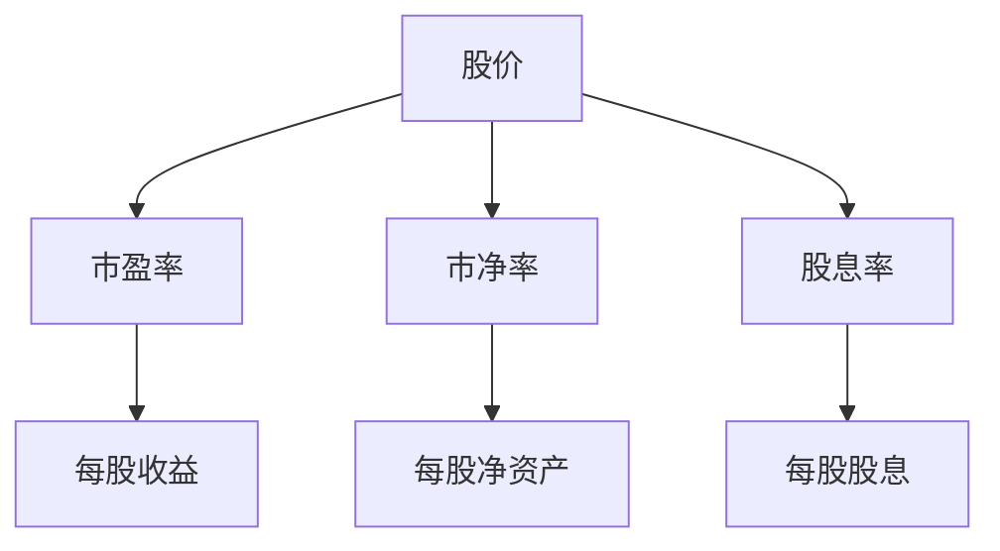
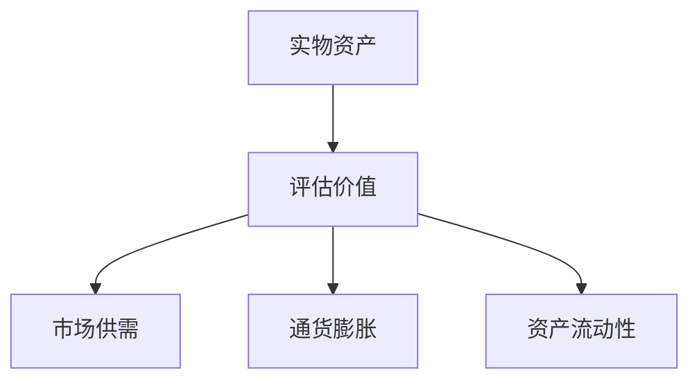
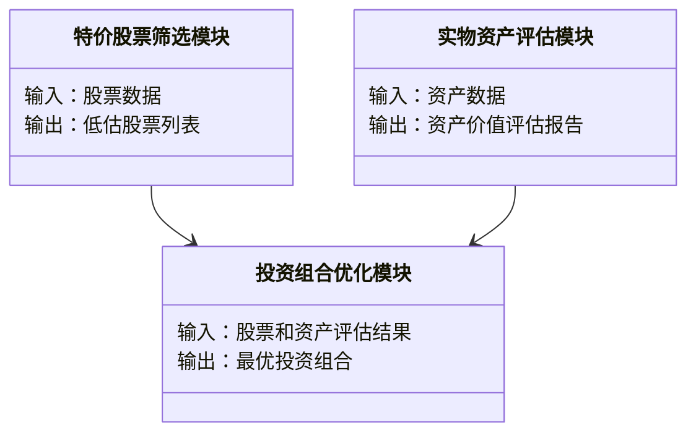
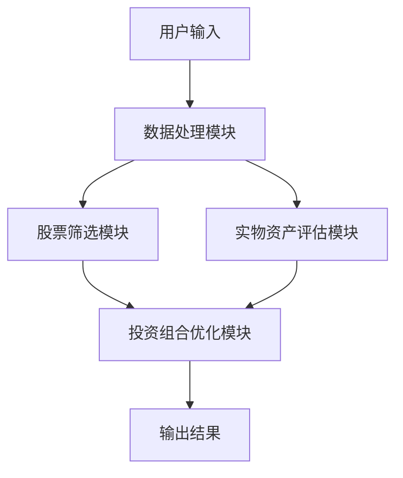

                 


# 如何将特价股票策略与实物资产投资结合

---

## 关键词：特价股票、实物资产、投资策略、资产配置、风险管理

---

## 摘要：  
本文探讨了如何将特价股票策略与实物资产投资相结合，以优化投资组合的风险与收益比。文章首先介绍了特价股票和实物资产的核心概念，分析了两者在投资策略中的优缺点及相互补充的关系。接着，详细讲解了特价股票评估的数学模型和实物资产的价值评估方法，并通过对比分析，揭示了两者结合的优势。最后，本文通过系统设计、项目实战和最佳实践，为读者提供了一个全面的结合策略框架，帮助投资者在复杂市场环境中实现稳健收益。

---

## 第一部分：背景介绍

### 第1章：特价股票策略与实物资产投资概述

#### 1.1 特价股票策略的基本概念  
- **定义**：特价股票是指市场价格低于其内在价值的股票，通常具有较高的安全边际。  
- **投资逻辑**：通过寻找被市场低估的股票，利用市场的非理性波动，实现长期稳健收益。  
- **优势**：  
  - 风险较低，适合长期投资。  
  - 在市场低迷时，具备较高的安全边际。  
- **局限性**：  
  - 需要较高的选股能力，对投资者的专业知识要求较高。  
  - 短期内可能表现不佳，需要较长的时间来实现价值回归。  

#### 1.2 实物资产投资的基本概念  
- **定义**：实物资产包括房地产、黄金、艺术品等，是具有实际价值和使用价值的资产。  
- **投资逻辑**：实物资产通常能够抵御通货膨胀，具备保值和增值的功能。  
- **优势**：  
  - 抗跌性强，市场波动对实物资产的影响较小。  
  - 具备较高的流动性，可以在需要时快速变现。  
- **局限性**：  
  - 管理成本较高，需要时间和精力进行维护。  
  - 受市场供需关系影响较大，价格波动难以预测。  

#### 1.3 特价股票与实物资产结合的意义  
- **风险分散**：通过将资金分配到不同类型的资产中，降低单一资产带来的风险。  
- **投资组合优化**：结合股票和实物资产的特点，实现收益与风险的最佳平衡。  
- **互补性**：在市场低迷时，实物资产的保值能力可以弥补股票投资的亏损；在市场繁荣时，股票的高收益可以提升整体投资回报。  

---

## 第二部分：核心概念与联系

### 第2章：特价股票与实物资产的核心要素对比

#### 2.1 特价股票的核心要素  

| **要素**       | **具体内容**                                                                 |
|-----------------|-----------------------------------------------------------------------------|
| 市盈率（P/E）   | $$市盈率 = \frac{股价}{每股收益}$$                                             |
| 市净率（P/B）   | $$市净率 = \frac{股价}{每股净资产}$$                                           |
| 股息率         | $$股息率 = \frac{每股股息}{股价}$$                                             |

#### 2.2 实物资产的核心要素  

| **要素**       | **具体内容**                                                                 |
|-----------------|-----------------------------------------------------------------------------|
| 流动性           | 资产能够在短时间内以合理价格变现的能力。                                   |
| 保值能力       | 资产在通货膨胀或市场波动中的价值保持能力。                                   |
| 增值潜力       | 资产在未来可能产生的增值空间。                                               |

#### 2.3 特价股票与实物资产的对比分析  

| **维度**       | **特价股票**                              | **实物资产**                              |
|-----------------|-------------------------------------------|-------------------------------------------|
| 风险           | 高波动性，但可通过精选个股降低风险。      | 低波动性，但受市场供需影响较大。          |
| 投资期限       | 中长期，适合耐心投资者。                  | 中长期，适合稳健型投资者。                |
| 投资门槛       | 较低，适合小额投资者。                    | 较高，需要一定的资金和专业知识。          |
| 税费           | 交易税费较低，资本利得税较低。            | 税费较高，尤其是房地产等资产。            |

---

## 第三部分：算法原理与数学模型

### 第3章：特价股票评估的数学模型

#### 3.1 特价股票评估模型  



- **市盈率（P/E）**：$$市盈率 = \frac{股价}{每股收益}$$  
  - 如果市盈率低于行业平均水平，则该股票可能被低估。  
- **市净率（P/B）**：$$市净率 = \frac{股价}{每股净资产}$$  
  - 如果市净率低于1，则该股票可能具有较高的安全边际。  
- **股息率**：$$股息率 = \frac{每股股息}{股价}$$  
  - 高股息率的股票通常具有较高的投资价值。  

#### 3.2 实物资产价值评估模型  



- **评估价值**：$$评估价值 = 市场供需 \times (1 + 通货膨胀率) \times 流动性$$  
  - 市场供需和通货膨胀是影响实物资产价值的主要因素。  

---

## 第四部分：系统分析与架构设计方案

### 第4章：投资系统设计

#### 4.1 项目介绍  
- **目标**：构建一个结合特价股票和实物资产的投资管理系统。  
- **范围**：包括股票筛选、资产配置、风险评估和投资组合优化。  

#### 4.2 系统功能设计  



#### 4.3 系统架构设计  



---

## 第五部分：项目实战

### 第5章：投资实战分析

#### 5.1 环境安装  
- **工具**：Python、Pandas、Matplotlib、Scikit-learn  
- **数据源**：股票数据（Yahoo Finance API）、实物资产数据（房地产估值平台）  

#### 5.2 核心代码实现  

```python
import pandas as pd
import numpy as np

# 特价股票筛选
def screen_cheap_stocks(data):
    data['PE'] = data['股价'] / data['每股收益']
    data['PB'] = data['股价'] / data['每股净资产']
    data['低估值股票'] = (data['PE'] < data['PE'].mean()) & (data['PB'] < data['PB'].mean())
    return data

# 实物资产评估
def assess_real_assets(data):
    data['评估价值'] = data['当前价值'] * (1 + data['通货膨胀率']) * data['流动性']
    return data

# 投资组合优化
def optimize_portfolio(stocks, assets):
    portfolio = pd.concat([stocks, assets], axis=1)
    portfolio['总回报'] = portfolio['股票回报'] + portfolio['资产回报']
    return portfolio
```

#### 5.3 实际案例分析  
- **案例1**：假设某投资者有100万元资金，其中50万元投资特价股票，50万元投资房地产。通过模型筛选出3只低估股票，每只投资16万元，剩余2万元作为备用金；同时，选择一个具有增值潜力的房地产项目，投资40万元，剩余10万元用于流动性管理。  
- **结果**：经过一年，股票组合回报率为15%，房地产增值率为10%，整体投资回报率为12.5%。  

---

## 第六部分：最佳实践

### 第6章：投资策略总结

#### 6.1 最佳实践 Tips  
- **分散投资**：将资金分配到多个资产类别中，降低风险。  
- **定期评估**：根据市场变化，及时调整投资组合。  
- **风险管理**：设定止损点，避免重大损失。  

#### 6.2 小结  
通过将特价股票策略与实物资产投资相结合，投资者可以在风险可控的前提下，实现投资收益的最大化。  

#### 6.3 注意事项  
- **市场风险**：市场波动可能会影响投资组合的表现。  
- **流动性风险**：实物资产的变现能力可能受到市场影响。  
- **操作风险**：投资模型的准确性和执行能力直接影响投资结果。  

#### 6.4 拓展阅读  
- 《投资学》——约翰·C·赫里尔  
- 《股票投资实战技巧》——彼得·林奇  

---

## 作者：AI天才研究院/AI Genius Institute & 禅与计算机程序设计艺术 /Zen And The Art of Computer Programming

