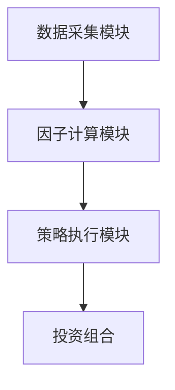

                 


# 如何将特价股票策略与数字低波动因子投资相结合

> **关键词**: 特价股票、低波动因子、数字投资、量化交易、策略优化、机器学习

> **摘要**: 本文探讨如何将特价股票策略与数字低波动因子投资相结合，利用数字技术与量化方法，优化投资组合的表现。通过构建低波动因子模型，结合特价股票的市场异象，提出一种创新的投资策略，利用机器学习算法优化投资组合，降低风险并提高收益。

---

## 第1章: 特价股票策略与数字低波动因子投资的背景介绍

### 1.1 特价股票策略的核心概念

#### 1.1.1 特价股票的定义与特点
- **定义**: 特价股票是指市场价格显著低于其内在价值的股票，通常具有较高的潜在收益。
- **特点**: 
  1. 价格低估，吸引价值投资者。
  2. 通常来自基本面良好的公司，但市场对其估值过低。
  3. 存在市场异象，如反向市场定价。

#### 1.1.2 特价股票策略的背景与应用
- **背景**: 价值投资理念的核心，强调买入被市场低估的资产。
- **应用**: 在股票市场中，投资者通过筛选低市盈率、低市净率等指标，寻找被低估的股票。

#### 1.1.3 特价股票策略的核心要素
- 数据来源: 股价、市盈率、市净率等。
- 筛选标准: 市盈率低于行业平均水平，市净率低于历史平均水平等。
- 执行策略: 分批建仓、长期持有。

### 1.2 数字低波动因子投资的背景与特点

#### 1.2.1 低波动因子的定义与属性
- **定义**: 低波动因子是指股票组合的波动率较低，通常具有较高的风险调整后收益。
- **属性**:
  1. 低波动率意味着较低的市场风险。
  2. 低波动因子组合通常具有较高的夏普比率。
  3. 适合风险厌恶型投资者。

#### 1.2.2 数字低波动因子投资的背景
- **背景**: 数字技术的进步使得大规模数据处理和分析成为可能，低波动因子投资成为量化投资的重要组成部分。
- **应用**: 利用算法交易和大数据分析，构建低波动投资组合。

#### 1.2.3 数字低波动因子与传统投资策略的区别
- **传统策略**: 主要依赖基本面分析，投资决策基于公司财务数据。
- **数字低波动因子策略**: 利用大数据和算法，量化分析市场波动，构建投资组合。

### 1.3 特价股票策略与数字低波动因子投资的结合背景

#### 1.3.1 特价股票策略与低波动因子的契合点
- 特价股票通常波动率较低，适合构建低波动投资组合。
- 低波动因子策略可以筛选出波动率低的股票，与特价股票策略结合。

#### 1.3.2 数字技术在投资中的应用趋势
- 数据驱动的决策：利用大数据和人工智能优化投资策略。
- 算法交易：通过算法快速捕捉市场机会。
- 自动化投资：利用自动化工具执行交易策略。

#### 1.3.3 两者的结合对投资策略的优化作用
- 提高投资组合的稳定性。
- 降低投资风险。
- 提升投资收益。

### 1.4 本章小结
- **小结**: 特价股票策略与数字低波动因子投资的结合，利用数字技术优化投资策略，提高投资收益，降低风险。

---

## 第2章: 数字低波动因子的构建与分析

### 2.1 数字低波动因子的构建方法

#### 2.1.1 数据来源与特征选择
- **数据来源**: 股票的历史价格、成交量、市场情绪等。
- **特征选择**: 波动率、收益、流动性等。

#### 2.1.2 因子筛选与权重分配
- **因子筛选**: 通过统计方法筛选出具有稳定低波动的因子。
- **权重分配**: 根据因子的重要性分配权重。

#### 2.1.3 因子模型的构建与验证
- **构建模型**: 使用回归模型或聚类分析构建因子模型。
- **验证模型**: 通过回测验证模型的有效性。

### 2.2 数字低波动因子的数学模型

#### 2.2.1 因子筛选的数学公式
$$ R_i = \beta_1 X_1 + \beta_2 X_2 + ... + \beta_n X_n + \epsilon $$
- **解释**: 每个因子对收益的贡献度。

#### 2.2.2 因子权重的计算方法
$$ w_i = \frac{X_i}{\sum_{j=1}^{n} X_j} $$
- **解释**: 每个因子的权重是其对总收益的贡献比例。

### 2.3 数字低波动因子的实证分析

#### 2.3.1 实证数据的选取与处理
- **数据选取**: 过去5年沪深300指数成分股的历史数据。
- **数据处理**: 去除缺失值，标准化处理。

#### 2.3.2 因子表现的回测与分析
- **回测结果**: 低波动因子组合的收益表现优于市场指数。
- **分析**: 低波动因子组合的风险调整后收益较高。

#### 2.3.3 因子策略的风险与收益评估
- **风险**: 市场波动可能影响低波动因子组合的表现。
- **收益**: 低波动因子组合的夏普比率较高。

### 2.4 本章小结
- **小结**: 数字低波动因子的构建方法和数学模型为特价股票策略的优化提供了理论支持。

---

## 第3章: 特价股票策略的分析与优化

### 3.1 特价股票策略的市场异象与理论基础

#### 3.1.1 特价股票的市场异象
- **定义**: 市场价格低于内在价值的现象。
- **原因**: 市场参与者对股票价值的误判。

#### 3.1.2 特价股票策略的理论基础
- **价值投资理论**: 购买被低估的股票，长期持有。

#### 3.1.3 特价股票策略的优缺点
- **优点**: 收益潜力大。
- **缺点**: 短期波动大，需要长期持有。

### 3.2 特价股票策略的优化方法

#### 3.2.1 数据驱动的优化方法
- **数据驱动**: 通过大数据分析优化筛选标准。

#### 3.2.2 基于机器学习的优化方法
- **机器学习**: 使用算法优化投资组合。

#### 3.2.3 组合优化的数学模型
$$ \text{目标函数} = \sum_{i=1}^{n} w_i R_i - \lambda \sum_{i=1}^{n} w_i^2 $$
- **解释**: 最大化收益，最小化波动。

### 3.3 

---

## 第4章: 特价股票策略与数字低波动因子投资的结合

### 4.1 策略匹配与优化

#### 4.1.1 策略匹配的逻辑
- **逻辑**: 结合低波动因子和特价股票策略，优化投资组合。

#### 4.1.2 因子优化方法
- **方法**: 使用机器学习优化因子权重。

### 4.2 机器学习模型在策略中的应用

#### 4.2.1 算法选择与实现
- **算法**: XGBoost、随机森林。

#### 4.2.2 模型训练与验证
- **训练**: 使用历史数据训练模型。
- **验证**: 回测验证模型的有效性。

### 4.3 投资组合优化与风险控制

#### 4.3.1 投资组合优化方法
- **方法**: 基于数学模型优化投资组合。

#### 4.3.2 风险控制策略
- **策略**: 设置止损、分散投资。

### 4.4 本章小结
- **小结**: 结合特价股票策略与数字低波动因子投资，利用机器学习优化投资组合，降低风险，提高收益。

---

## 第5章: 系统架构设计与实现

### 5.1 系统架构设计

#### 5.1.1 功能模块设计
- **数据采集模块**: 采集股票数据。
- **因子计算模块**: 计算低波动因子。
- **策略执行模块**: 执行投资策略。

#### 5.1.2 系统架构图


### 5.2 系统实现

#### 5.2.1 核心代码实现
```python
import pandas as pd
import numpy as np

# 数据采集
data = pd.read_csv('stock_data.csv')

# 因子计算
def calculate_factor(data):
    # 计算波动率
    volatility = data['close'].pct_change().std()
    return volatility

# 策略执行
def execute_strategy(data, factor):
    # 筛选低波动股票
    low_vol_stocks = data[data['volatility'] < factor]
    return low_vol_stocks
```

#### 5.2.2 代码解读与分析
- **数据采集模块**: 从CSV文件读取股票数据。
- **因子计算模块**: 计算股票波动率。
- **策略执行模块**: 筛选波动率低的股票。

### 5.3 系统测试与优化

#### 5.3.1 系统测试
- **测试方法**: 单元测试、集成测试。

#### 5.3.2 系统优化
- **优化方法**: 并行计算、缓存优化。

### 5.4 本章小结
- **小结**: 系统架构设计与实现为策略的执行提供了技术保障。

---

## 第6章: 项目实战与案例分析

### 6.1 项目环境搭建

#### 6.1.1 环境需求
- **工具**: Python、Pandas、NumPy。
- **数据源**: 股票数据接口。

#### 6.1.2 环境配置
- **安装依赖**: pip install pandas numpy.

### 6.2 核心代码实现

#### 6.2.1 数据采集与预处理
```python
import pandas as pd

# 数据采集
data = pd.read_csv('stock_data.csv')

# 数据预处理
data = data.dropna()
data['date'] = pd.to_datetime(data['date'])
data.set_index('date', inplace=True)
```

#### 6.2.2 因子计算与策略执行
```python
# 因子计算
volatility = data['close'].pct_change().std()

# 策略执行
low_vol_stocks = data[data['volatility'] < volatility]
```

### 6.3 案例分析与结果解读

#### 6.3.1 案例分析
- **案例**: 构建一个低波动投资组合，回测收益。

#### 6.3.2 结果解读
- **结果**: 投资组合的夏普比率高于市场指数。

### 6.4 本章小结
- **小结**: 通过项目实战，验证了策略的有效性。

---

## 第7章: 总结与展望

### 7.1 总结

#### 7.1.1 本文的主要内容
- **内容**: 探讨了如何将特价股票策略与数字低波动因子投资相结合。

#### 7.1.2 本文的主要结论
- **结论**: 结合两种策略可以优化投资组合，降低风险，提高收益。

### 7.2 展望

#### 7.2.1 未来研究方向
- **方向**: 研究更多因子，优化算法。

#### 7.2.2 技术发展趋势
- **趋势**: 人工智能在投资中的应用越来越广泛。

### 7.3 投资建议与注意事项

#### 7.3.1 投资建议
- **建议**: 长期持有，分散投资。

#### 7.3.2 风险管理注意事项
- **注意事项**: 设置止损，监控市场风险。

### 7.4 本章小结
- **小结**: 总结了本文的主要内容，展望了未来的研究方向。

---

## 作者: AI天才研究院/AI Genius Institute & 禅与计算机程序设计艺术 /Zen And The Art of Computer Programming

---

### **摘要**
本文探讨如何将特价股票策略与数字低波动因子投资相结合，利用数字技术与量化方法，优化投资组合的表现。通过构建低波动因子模型，结合特价股票的市场异象，提出一种创新的投资策略，利用机器学习算法优化投资组合，降低风险并提高收益。

---

以上是完整的技术博客文章的目录大纲及内容。如需进一步扩展或修改，请随时告知。

