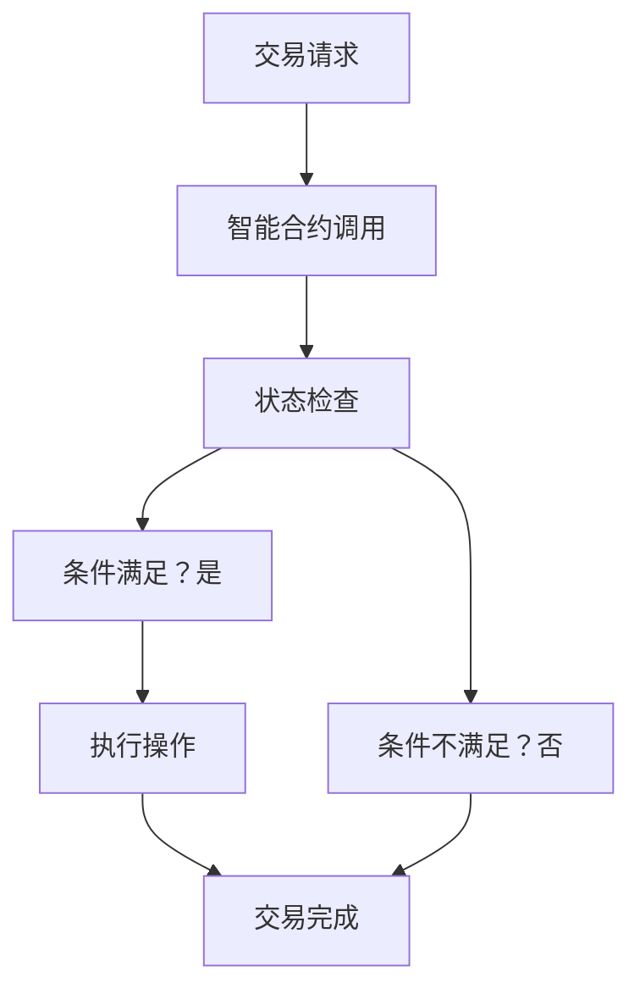
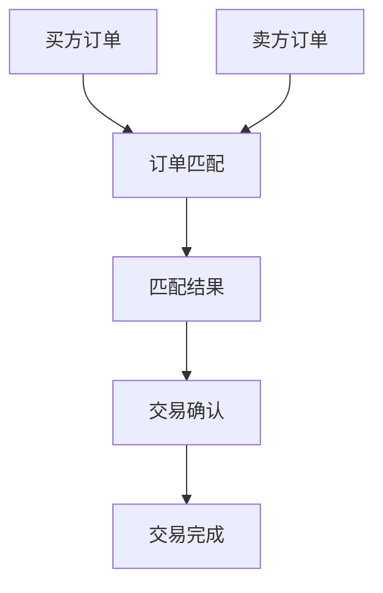
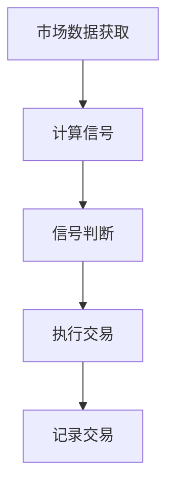
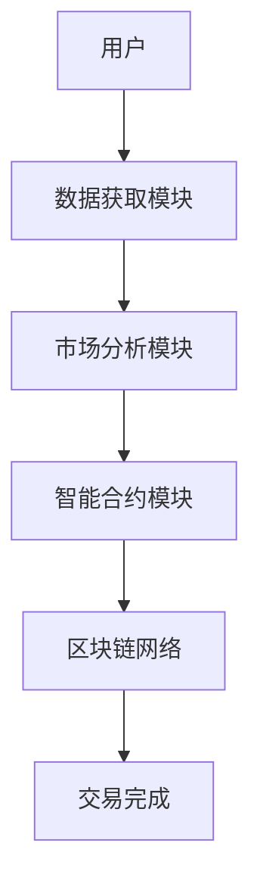

                 


# 如何将特价股票策略与数字资产代币化投资结合

## 关键词：特价股票策略、数字资产、代币化投资、量化交易、区块链技术

## 摘要：本文详细探讨如何将特价股票策略与数字资产代币化投资相结合，分析其核心概念、算法原理、系统架构，并通过项目实战提供具体实现方案，最后总结最佳实践和注意事项。

---

# 第一部分: 特价股票策略与数字资产代币化投资的背景与概念

## 第1章: 特价股票策略与数字资产代币化的概述

### 1.1 特价股票策略的定义与特点

#### 1.1.1 特价股票策略的定义
特价股票策略是一种基于市场波动和价格差异的交易策略，旨在在特定时机以低于市场价买入股票，待价格上涨后卖出获利。

#### 1.1.2 特价股票策略的核心特点
- **价格敏感性**：依赖于价格波动，寻找市场低估机会。
- **时机选择**：精准选择买入和卖出时机。
- **风险控制**：通过止损和止盈机制降低风险。

#### 1.1.3 特价股票策略的应用场景
- **市场波动期**：如经济危机或市场调整期。
- **特定行业股票**：如科技股、金融股等波动较大的行业。

### 1.2 数字资产代币化的定义与特点

#### 1.2.1 数字资产代币化的定义
数字资产代币化是将传统资产（如股票、房地产）转化为数字代币，利用区块链技术进行发行、交易和管理。

#### 1.2.2 数字资产代币化的核心特点
- **去中心化**：通过区块链技术实现资产的去中心化管理。
- **可分割性**：代币可以分割为更小单位，提高流动性。
- **透明性**：交易记录在区块链上公开透明，可追溯。

#### 1.2.3 数字资产代币化与传统金融的区别
| 特性 | 传统金融 | 数字资产代币化 |
|------|----------|----------------|
| 所有权 | 实物或纸质 | 数字化代币 |
| 交易效率 | 较低，需中介 | 高效，去中介化 |
| 成本 | 较高 | 较低 |

### 1.3 特价股票策略与数字资产代币化的联系

#### 1.3.1 特价股票策略在数字资产中的应用潜力
- **快速交易**：数字资产的高流动性使特价策略更容易实现。
- **全球化市场**：数字资产市场无地域限制，扩大了特价策略的应用范围。

#### 1.3.2 数字资产代币化对特价股票策略的优化作用
- **自动化交易**：通过智能合约实现自动化的买入和卖出。
- **透明追踪**：区块链记录交易历史，便于分析和优化策略。

#### 1.3.3 两者的结合对企业投资的影响
- **提升效率**：代币化使特价策略的执行更加高效。
- **扩大市场**：数字资产的全球性使企业能够进入更广泛的市场。

## 1.4 本章小结
本章介绍了特价股票策略和数字资产代币化的基本概念和特点，分析了两者结合的潜力和优势，为后续的深入探讨奠定了基础。

---

# 第二部分: 特价股票策略与数字资产代币化的核心概念与联系

## 第2章: 特价股票策略的核心原理

### 2.1 特价股票策略的基本原理

#### 2.1.1 市场分析与策略制定
- **市场情绪分析**：通过新闻、社交媒体等数据预测市场走势。
- **技术分析**：使用K线图、均线等技术指标寻找买入机会。

#### 2.1.2 交易时机的选择
- **买入时机**：市场低谷期或利空消息后。
- **卖出时机**：价格回升至合理区间或市场利好消息后。

#### 2.1.3 风险控制与收益最大化
- **止损策略**：设定最大亏损比例，避免重大损失。
- **分散投资**：将资金分散投资于多个股票，降低风险。

### 2.2 特价股票策略的关键算法

#### 2.2.1 市场情绪分析算法
- **数据来源**：社交媒体、新闻网站、论坛等。
- **算法实现**：使用自然语言处理技术分析文本，计算市场情绪指数。

#### 2.2.2 价格预测模型
- **模型选择**：使用ARIMA、LSTM等时间序列模型预测股票价格。
- **数据特征**：包括历史价格、成交量、市场情绪等。

#### 2.2.3 自动化交易策略
- **策略实现**：基于价格预测和市场情绪，自动触发买卖指令。
- **交易平台集成**：将算法与交易平台API集成，实现自动化交易。

### 2.3 特价股票策略的数学模型

#### 2.3.1 市场情绪指数计算公式
$$
\text{市场情绪指数} = \frac{\text{积极词汇数} - \text{消极词汇数}}{\text{总词汇数}} \times 100
$$

#### 2.3.2 价格预测模型的数学表达式
$$
P(t) = \alpha P(t-1) + \beta \times \text{市场情绪指数} + \epsilon
$$
其中，$P(t)$ 表示第t时刻的价格预测值，$\alpha$ 和 $\beta$ 是模型参数，$\epsilon$ 是误差项。

## 第3章: 数字资产代币化的核心原理

### 3.1 数字资产代币化的基本原理

#### 3.1.1 区块链技术在数字资产中的应用
- **去中心化 ledger**：区块链作为分布式账本，记录代币的发行和交易。
- **智能合约**：自动执行预设的交易规则和条款。

#### 3.1.2 代币发行机制
- **代币类型**：包括实用型代币（UT）和证券型代币（ST）。
- **发行平台**：如以太坊、波场等公链支持代币发行。

#### 3.1.3 代币的流通与交易
- **交易市场**：如 Coinbase、Binance 等平台支持代币交易。
- **流动性**：代币可以自由买卖，提高资产流动性。

### 3.2 数字资产代币化的关键算法

#### 3.2.1 智能合约的实现原理
- **智能合约语言**：如Solidity用于以太坊平台。
- **合约执行**：部署在区块链上，自动执行交易规则。

#### 3.2.2 代币发行的验证机制
- **共识算法**：如PoW、PoS等确保交易的合法性。
- **验证节点**：分布式节点验证交易，确保网络安全。

#### 3.2.3 代币交易的撮合算法
- **订单匹配**：基于价格和数量匹配买卖订单。
- **交易确认**：通过区块链共识机制确认交易完成。

### 3.3 数字资产代币化的数学模型

#### 3.3.1 智能合约执行流程图


#### 3.3.2 代币交易撮合算法


---

# 第三部分: 算法原理与系统架构设计

## 第4章: 算法原理与数学模型

### 4.1 量化交易算法设计

#### 4.1.1 量化交易算法流程图


#### 4.1.2 量化交易算法实现代码
```python
import pandas as pd
import numpy as np

# 数据获取
data = pd.read_csv('stock_data.csv')

# 市场情绪指数计算
def market_sentiment(data):
    positive = data['positive'].sum()
    negative = data['negative'].sum()
    return (positive - negative) / (positive + negative) * 100

# 价格预测模型
def predict_price(data):
    from sklearn.linear_model import LinearRegression
    model = LinearRegression()
    model.fit(data[['price', 'volume']], data['target'])
    return model.predict(new_data)

# 自动化交易策略
def trading_strategy(data, price_prediction):
    if price_prediction > data['price'].mean():
        return '买入'
    else:
        return '卖出'
```

### 4.2 代币化资产发行机制

#### 4.2.1 智能合约实现
```solidity
// ERC20代币合约
contract MyToken {
    mapping(address => uint) public balances;
    uint public totalSupply;

    function mint(address recipient, uint amount) public {
        balances[recipient] += amount;
        totalSupply += amount;
    }

    function burn(address account, uint amount) public {
        balances[account] -= amount;
        totalSupply -= amount;
    }
}
```

---

# 第四部分: 项目实战与系统架构设计

## 第5章: 项目实战

### 5.1 系统功能设计

#### 5.1.1 系统功能模块
- **数据获取模块**：从股票市场获取实时数据。
- **市场分析模块**：计算市场情绪指数和价格预测。
- **智能合约模块**：实现代币发行和交易的自动化。

#### 5.1.2 系统架构图


### 5.2 系统核心实现源代码

#### 5.2.1 数据获取模块
```python
import requests

def get_stock_data(symbol):
    url = f'https://api.example.com/stock/{symbol}'
    response = requests.get(url)
    return response.json()
```

#### 5.2.2 智能合约模块
```solidity
// 智能合约实现代币发行
contract StockToken {
    mapping(address => uint) public balances;

    function buyToken(uint amount) public payable {
        require(msg.value >= amount * price, "Insufficient funds");
        balances[msg.sender] += amount;
    }

    function sellToken(uint amount) public {
        require(balances[msg.sender] >= amount, "Insufficient balance");
        balances[msg.sender] -= amount;
        msg.sender.transfer(amount * price);
    }
}
```

---

# 第五部分: 总结与展望

## 第6章: 总结与展望

### 6.1 本章总结
本文详细探讨了如何将特价股票策略与数字资产代币化投资结合，分析了两者的原理、算法和系统架构，并通过项目实战展示了具体实现方案。结合区块链技术和量化交易算法，能够显著提升投资效率和透明度。

### 6.2 最佳实践 tips
- **技术选型**：选择适合的区块链平台和智能合约语言。
- **风险管理**：建立完善的风险控制机制，如止损和止盈。
- **合规性**：确保代币发行和交易符合相关法律法规。

### 6.3 展望
随着区块链技术和人工智能的不断发展，特价股票策略与数字资产代币化的结合将更加紧密，未来可能会出现更多创新的交易模式和投资工具。

---

# 作者：AI天才研究院/AI Genius Institute & 禅与计算机程序设计艺术 /Zen And The Art of Computer Programming

---

这篇文章系统地探讨了如何将特价股票策略与数字资产代币化投资结合，通过背景分析、算法设计、系统架构和项目实战，为读者提供了全面的知识和实践指导。

