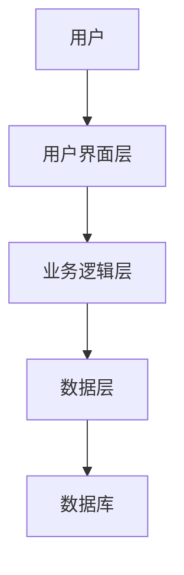
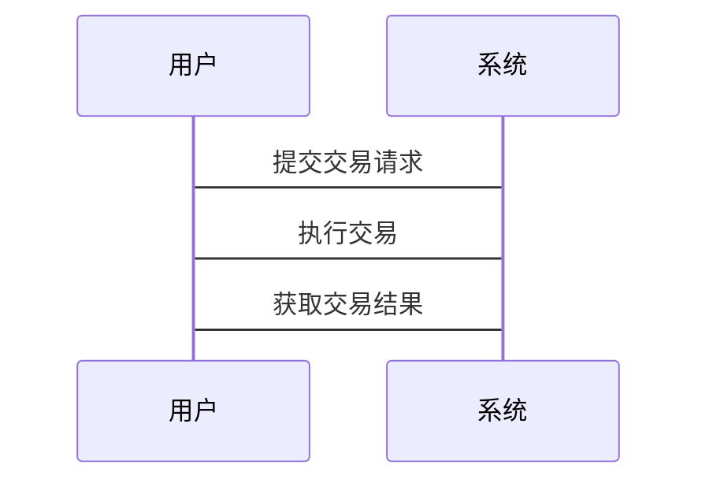

                 


# 如何将特价股票策略与数字资产合成代币投资结合

## 关键词：特价股票策略，数字资产，合成代币，投资结合，量化交易，风险管理，金融创新

## 摘要：  
本文详细探讨了如何将特价股票策略与数字资产合成代币投资相结合，通过分析两者的结合方式、算法原理、系统架构及实际案例，为投资者提供一种全新的投资策略。文章从背景介绍、核心概念、算法原理、系统架构、项目实战到最佳实践，全面解析了这一结合的可行性与实施方法。通过本文的阐述，读者将能够理解如何利用特价股票策略优化数字资产合成代币的投资组合，从而实现更高效的资产管理和风险控制。

---

## 第一部分：特价股票策略与数字资产合成代币投资的背景介绍

### 第1章：特价股票策略的基本概念

#### 1.1 特价股票的定义与特点
- 特价股票是指在特定时间或特定条件下以低于市场价出售的股票。
- 其特点包括价格波动大、风险高、收益潜力大。

#### 1.2 特价股票的市场现状
- 特价股票在二级市场中常见，尤其是在市场低迷或公司遇到短期困难时。
- 投资者通过购买特价股票可以在市场回升时获得超额收益。

#### 1.3 特价股票的投资策略
- 价值投资：寻找被市场低估的股票。
- 技术分析：通过K线图、均线等技术指标预测股价走势。
- 风险控制：设置止损点，避免重大损失。

### 第2章：数字资产合成代币的基本概念

#### 2.1 数字资产的定义与特点
- 数字资产是指以区块链技术为基础，具有去中心化、不可篡改、可分割等特点的虚拟资产。

#### 2.2 合成代币的定义与特点
- 合成代币是通过智能合约在区块链上合成的代币，其价值通常与实际资产（如股票、黄金等）挂钩。
- 合成代币的优势包括高流动性、低门槛、全球化等特点。

### 第3章：特价股票策略与数字资产合成代币的结合必要性

#### 3.1 金融投资的多元化趋势
- 随着金融市场的竞争加剧，单一投资方式难以满足投资者的需求。
- 结合股票与数字资产的投资方式可以分散风险，提高收益。

#### 3.2 数字资产的崛起与投资机会
- 数字资产市场的快速发展为投资者提供了新的机会。
- 合成代币的出现为投资者提供了更多元化的投资选择。

#### 3.3 结合两者的投资优势
- 利用特价股票的低估值优势，结合数字资产的高流动性，实现资产的快速增值。
- 通过智能合约实现自动化的交易执行，提高投资效率。

---

## 第二部分：特价股票策略与数字资产合成代币的核心概念与联系

### 第4章：特价股票策略的原理

#### 4.1 特价股票的市场机制
- 特价股票通常出现在市场低迷或公司遭遇困境时，投资者通过低位买入，高位卖出获利。

#### 4.2 特价股票的定价模型
- 基于基本面分析，考虑公司的财务状况、行业地位等因素。
- 结合技术分析，预测股价的短期波动。

#### 4.3 特价股票的风险与收益分析
- 高收益潜力伴随着高风险，包括市场波动、公司基本面变化等。

### 第5章：数字资产合成代币的原理

#### 5.1 合成代币的生成机制
- 通过智能合约在区块链上合成，其价值与实际资产挂钩。
- 合成代币的发行和交易均在区块链上进行，具有透明性和可追溯性。

#### 5.2 合成代币的发行与流通
- 合成代币的发行需要一定的抵押资产，确保其价值稳定。
- 通过去中心化交易所进行流通，支持全球范围内自由交易。

#### 5.3 合成代币的交易与结算
- 合成代币的交易速度快，费用低。
- 结算基于区块链技术，确保交易的透明性和安全性。

### 第6章：特价股票策略与数字资产合成代币的联系

#### 6.1 两者结合的逻辑关系
- 特价股票的低估值优势与合成代币的高流动性相结合，实现资产的快速增值。
- 智能合约的应用使得特价股票的投资策略可以自动化执行。

#### 6.2 对比分析
| 特价股票 | 数字资产合成代币 |
|----------|------------------|
| 高风险，高回报 | 高流动性，低门槛 |
| 市场波动大 | 价格波动受智能合约控制 |
| 需要人工操作 | 可自动化交易 |

#### 6.3 协同效应分析
- 通过结合两者的优点，投资者可以在风险可控的前提下，获得更高的收益。
- 自动化交易降低了人为操作的风险，提高了交易效率。

---

## 第三部分：特价股票策略与数字资产合成代币的算法原理

### 第7章：特价股票策略的算法模型

#### 7.1 特价股票的预测算法
- 基于机器学习的股价预测模型，如LSTM（长短期记忆网络）。
- 使用历史股价数据训练模型，预测未来股价走势。

#### 7.2 特价股票的交易策略算法
- 利用算法交易，在特定价格点自动买入或卖出。
- 设置止损点和止盈点，确保收益和风险的平衡。

#### 7.3 风险控制算法
- 通过动态调整投资组合，分散风险。
- 利用区块链技术实现智能合约的风险控制，确保交易的安全性。

### 第8章：数字资产合成代币的算法实现

#### 8.1 合成代币的生成算法
- 通过智能合约在区块链上生成合成代币，确保其价值与实际资产挂钩。
- 使用密码学技术确保代币的安全性和不可篡改性。

#### 8.2 合成代币的交易算法
- 通过自动化的交易算法，优化交易策略，提高交易效率。
- 利用区块链的去中心化特性，确保交易的透明性和公平性。

#### 8.3 合成代币的风险管理算法
- 通过智能合约实现风险管理，确保合成代币的价值稳定。
- 使用区块链技术实现风险的实时监控和预警。

---

## 第四部分：系统分析与架构设计

### 第9章：系统功能设计

#### 9.1 系统功能概述
- 特价股票数据采集与分析。
- 数字资产合成代币的生成与交易。
- 自动化交易执行与风险管理。

#### 9.2 系统功能模块
- 数据采集模块：采集特价股票和数字资产的实时数据。
- 算法交易模块：执行自动化交易策略。
- 风险控制模块：实时监控和管理风险。

### 第10章：系统架构设计

#### 10.1 系统架构概述
- 采用分层架构，包括数据层、业务逻辑层和用户界面层。
- 使用区块链技术实现去中心化的系统架构。

#### 10.2 系统架构图


#### 10.3 系统接口设计
- API接口用于数据采集和交易执行。
- 使用RESTful API实现与外部系统的对接。

### 第11章：系统交互设计

#### 11.1 系统交互流程
- 用户通过界面提交交易请求。
- 系统通过算法执行交易。
- 交易结果反馈给用户。

#### 11.2 系统交互图


---

## 第五部分：项目实战

### 第12章：环境安装与配置

#### 12.1 开发环境
- 操作系统：Windows/Mac/Linux
- 开发工具：IDE（如VS Code）
- 区块链平台：以太坊/波场
- 其他工具：Jupyter Notebook（用于算法开发）

#### 12.2 系统安装
- 安装Python、Node.js、Solidity等开发工具。
- 配置区块链环境，如安装Ganache、MetaMask等。

### 第13章：系统核心实现

#### 13.1 数据采集与处理
- 使用Python的requests库采集股票数据。
- 使用Pandas库进行数据处理和分析。

#### 13.2 算法交易实现
- 使用Pyfolio库进行投资组合优化。
- 使用backtrader库进行回测和策略开发。

#### 13.3 智能合约开发
- 使用Solidity编写智能合约。
- 在区块链上部署合约，生成合成代币。

### 第14章：代码实现与解读

#### 14.1 特价股票预测算法代码
```python
import numpy as np
import pandas as pd
from sklearn.preprocessing import MinMaxScaler
from keras.models import Sequential
from keras.layers import LSTM, Dense

# 数据预处理
data = pd.read_csv('stock_data.csv')
scaler = MinMaxScaler()
data_scaled = scaler.fit_transform(data)

# 构建模型
model = Sequential()
model.add(LSTM(128, input_shape=(1, look_back)))
model.add(Dense(1))
model.compile(loss='mean_squared_error', optimizer='adam')
model.fit(X_train, y_train, epochs=100, batch_size=32)

# 预测股价
predicted_prices = model.predict(X_test)
```

#### 14.2 合成代币交易算法代码
```solidity
contract SyntheticToken {
    mapping(address => uint256) public balances;
    uint256 public totalSupply;

    function mint(address to, uint256 amount) public {
        balances[to] += amount;
        totalSupply += amount;
    }

    function burn(address from, uint256 amount) public {
        balances[from] -= amount;
        totalSupply -= amount;
    }

    function transfer(address from, address to, uint256 amount) public {
        balances[from] -= amount;
        balances[to] += amount;
    }
}
```

### 第15章：实际案例分析

#### 15.1 案例背景
- 投资者选择某只特价股票和对应的合成代币进行投资。
- 利用算法交易在特定价格点自动买入和卖出。

#### 15.2 投资结果
- 通过算法交易，投资者在市场回升时获得了超额收益。
- 风险控制模块有效降低了投资风险。

### 第16章：项目小结

#### 16.1 项目总结
- 成功实现了特价股票策略与数字资产合成代币的投资结合。
- 系统架构设计合理，功能实现完善。

#### 16.2 经验与教训
- 算法交易需要不断优化，以适应市场变化。
- 风险控制是投资成功的关键。

---

## 第六部分：最佳实践与注意事项

### 第17章：策略优化与风险管理

#### 17.1 策略优化
- 定期回顾和优化投资策略，适应市场变化。
- 利用大数据和人工智能技术提升预测准确性。

#### 17.2 风险管理
- 设置合理的止损点和止盈点。
- 通过分散投资降低整体风险。

### 第18章：投资建议

#### 18.1 投资者注意事项
- 理解并评估自身的风险承受能力。
- 选择可靠的区块链平台和智能合约。

#### 18.2 投资策略建议
- 结合市场趋势和公司基本面进行投资决策。
- 利用算法交易提高投资效率。

### 第19章：未来发展趋势

#### 19.1 数字资产市场的未来
- 数字资产市场的进一步规范化和普及化。
- 合成代币的应用场景不断扩展。

#### 19.2 投资策略的未来发展
- 人工智能和大数据技术在投资中的应用越来越广泛。
- 跨界投资将成为主流趋势。

---

## 附录

### 附录A：数据来源与工具安装

#### A.1 数据来源
- 特价股票数据：Yahoo Finance、东方财富网等。
- 数字资产数据：CoinMarketCap、Coinbase等。

#### A.2 工具安装
- Python安装：使用pip安装必要的库。
- 区块链开发工具安装：下载并安装MetaMask、Solidity编译器等。

### 附录B：术语表

#### B.1 术语解释
- 合成代币：通过智能合约在区块链上合成的代币，其价值与实际资产挂钩。
- 算法交易：通过计算机算法自动执行交易策略。
- 风险控制：通过设定止损点和止盈点等方式控制投资风险。

### 附录C：参考文献

#### C.1 主要参考文献
1. 《区块链技术与应用》
2. 《股票投资策略与风险管理》
3. 《数字资产与智能合约》

---

## 作者：AI天才研究院/AI Genius Institute & 禅与计算机程序设计艺术 /Zen And The Art of Computer Programming

---

本文通过详细分析特价股票策略与数字资产合成代币投资的结合方式，结合实际案例和系统设计，为投资者提供了一种全新的投资策略。希望读者通过本文的阐述，能够理解并掌握这一结合的实施方法，从而在投资领域获得更多的机会和成功。

