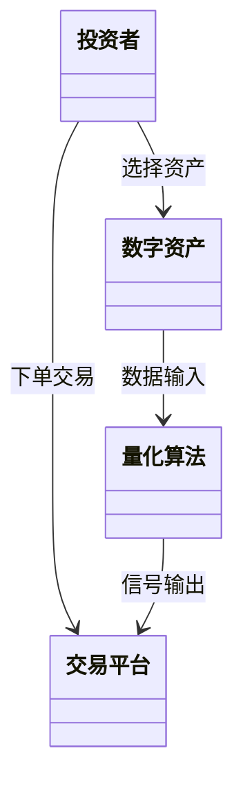

                 


# 如何将特价股票策略与数字资产投资结合

## 关键词：特价股票策略、数字资产投资、量化交易、区块链技术、投资策略

## 摘要：  
本文深入探讨了如何将特价股票策略与数字资产投资相结合，从理论到实践，详细分析了两者的结合方式、数学模型、算法实现、系统架构设计以及实际案例。通过量化交易策略、数字资产平台分析、系统架构设计和实战案例，为读者提供了一套完整的解决方案，帮助投资者在数字资产领域实现高效、智能的投资策略。

---

## 第一部分：背景与基础

### 第1章：特价股票策略概述

#### 1.1 特价股票策略的定义与特点

**1.1.1 特价股票的定义**  
特价股票是指在特定时间点，价格低于市场价或历史价的股票。这种股票通常在市场波动或公司特定事件（如重组、并购）时出现。

**1.1.2 特价股票策略的核心特点**  
- **价格优势**：特价股票的价格通常低于市场价，具有较高的投资吸引力。  
- **时间敏感性**：特价股票往往在特定时间段内出现，需要快速决策。  
- **风险与收益并存**：尽管价格低，但可能存在较高的市场风险。  

**1.1.3 特价股票策略的优缺点**  
- **优点**：投资成本低，潜在收益高。  
- **缺点**：市场波动大，信息不对称，风险较高。  

#### 1.2 特价股票策略的应用场景

**1.2.1 特价股票策略在传统股票市场中的应用**  
- 投资者在市场低迷时期寻找低估股票，进行长期投资。  
- 利用技术分析（如MACD、RSI）识别短期特价股票机会。  

**1.2.2 特价股票策略在数字资产中的潜在应用**  
- 数字资产市场的高波动性为特价股票策略提供了更多机会。  
- 利用区块链技术实现透明化和去中心化交易，减少信息不对称。  

**1.2.3 特价股票策略与其他投资策略的对比**  
- 与长期投资策略相比，特价股票策略更注重短期价格波动。  
- 与指数投资策略相比，特价股票策略更具灵活性和风险性。  

#### 1.3 特价股票策略的成功案例分析

**1.3.1 国内外的经典案例**  
- 国内案例：某投资者在2020年新冠疫情市场中，利用特价股票策略投资某生物科技公司，获得了高额收益。  
- 国外案例：机构投资者在2021年GameStop事件中，通过押注特价股票策略，实现了短期暴利。  

**1.3.2 案例分析与经验总结**  
- 快速决策的重要性：特价股票机会往往昙花一现，需要投资者迅速行动。  
- 风险控制的必要性：尽管收益高，但需严格控制风险，避免过度杠杆和盲目跟风。  

### 第2章：数字资产投资概述

#### 2.1 数字资产投资的定义与特点

**2.1.1 数字资产的定义**  
数字资产是指基于区块链技术的虚拟货币（如比特币、以太坊）和其他数字代币（如NFTs）。  

**2.1.2 数字资产投资的核心特点**  
- **高波动性**：数字资产价格波动剧烈，适合短期交易。  
- **去中心化**：基于区块链技术，交易透明且难以被篡改。  
- **创新性**：数字资产种类繁多，技术创新驱动市场发展。  

#### 2.2 数字资产投资的主要平台与工具

**2.2.1 主流数字资产交易平台介绍**  
- ** Coinbase**：支持多种数字资产交易，用户界面友好。  
- **Binance**：交易品种丰富，支持杠杆交易和期货交易。  
- **Kraken**：提供高级交易工具和API接口。  

**2.2.2 数字资产投资工具的分类与选择**  
- **交易平台**：如Binance、Coinbase等。  
- **分析工具**：如 TradingView、CoinGlass，用于技术分析和数据挖掘。  
- **风险管理工具**：如 stop-loss（止损）和 take-profit（止盈）订单。  

#### 2.3 数字资产投资策略的多样性

**2.3.1 长期投资策略**  
- 买入并持有优质数字资产，长期增值。  
- 适合风险承受能力较高的投资者。  

**2.3.2 短期交易策略**  
- 利用技术分析（如K线图、均线）进行日内交易。  
- 适合具备较高市场敏感性和快速决策能力的投资者。  

**2.3.3 投资组合优化策略**  
- 将数字资产与其他资产（如股票、债券）进行组合投资，分散风险。  
- 通过量化方法优化资产配置，提高收益。  

---

## 第二部分：策略与算法

### 第3章：量化交易策略与算法实现

#### 3.1 量化交易策略的数学模型

**3.1.1 时间序列分析模型**  
- **ARIMA模型**：用于预测时间序列数据，常用于股票价格预测。  
- **LSTM模型**：长短期记忆网络，适合处理时间序列中的长期依赖关系。  

**3.1.2 马尔可夫链模型**  
- 用于状态转移概率分析，常用于市场状态分类和预测。  

**3.1.3 线性回归模型**  
- 用于分析变量之间的线性关系，预测价格走势。  

#### 3.2 量化交易算法实现

**3.2.1 简单移动平均线（SMA）算法**  
- 计算一定周期内的平均价格，作为买卖信号。  
- 示例代码：  
  ```python
  def SMA(prices, window):
      return prices.rolling(window).mean()
  ```

**3.2.2 相对强弱指数（RSI）算法**  
- 计算价格变动的相对强度，判断超买超卖状态。  
- 示例代码：  
  ```python
  def RSI(prices, window):
      diff = prices.diff().fillna(0)
      up = diff.where(diff > 0, 0)
      down = diff.where(diff < 0, 0)
      return up.ewm(com=window, adjust=False).mean() / (up.ewm(com=window, adjust=False).mean() + down.ewm(com=window, adjust=False).mean())
  ```

**3.2.3 算法实现的优缺点对比**  
- **优点**：量化交易策略基于数据和算法，减少人为情绪干扰。  
- **缺点**：算法模型可能失效，市场环境变化导致策略失效。  

---

## 第三部分：系统架构与实现

### 第4章：数字资产投资系统架构设计

#### 4.1 问题场景介绍

**4.1.1 投资者需求分析**  
- 需要实时监控数字资产价格，识别特价股票机会。  
- 需要自动化交易系统，快速执行交易指令。  

**4.1.2 项目介绍**  
本项目旨在开发一个基于特价股票策略的数字资产投资系统，结合量化交易算法和区块链技术，实现智能投资。

#### 4.2 系统功能设计

**4.2.1 领域模型设计**  


**4.2.2 系统架构设计**  
```mermaid
client -> server: 请求数据
server -> 数据库: 查询数据
数据库 --> 第三方API: 获取实时数据
server -> 量化算法: 处理数据
量化算法 --> 交易平台: 发送交易信号
交易平台 -> client: 返回交易结果
```

**4.2.3 系统接口设计**  
- **API接口**：  
  - `GET /api/v1/prices`：获取实时价格数据。  
  - `POST /api/v1/trade`：发送交易指令。  

---

## 第四部分：实战与案例

### 第5章：数字资产投资系统实战

#### 5.1 环境搭建与代码实现

**5.1.1 环境搭建**  
- 安装Python和相关库（如Pandas、Matplotlib、Binance API）。  
- 配置交易平台API密钥。  

**5.1.2 核心代码实现**  
```python
import pandas as pd
from binance.client import Client
from binance.enums import *

# 初始化API客户端
client = Client(api_key='your_api_key', api_secret='your_api_secret')

# 获取实时价格数据
def get_prices(symbol):
    klines = client.get_klines(symbol=symbol, interval=KLINE_INTERVAL_1HOUR)
    prices = [float(kline.close) for kline in klines]
    return prices

# 计算SMA指标
def calculate_sma(prices, window):
    return pd.Series(prices).rolling(window).mean().tolist()

# 策略逻辑
def trading_strategy(symbol, window):
    prices = get_prices(symbol)
    sma = calculate_sma(prices, window)
    current_price = prices[-1]
    sma_value = sma[-1]
    if current_price < sma_value:
        return "买入信号"
    else:
        return "卖出信号"

# 执行策略
print(trading_strategy("BTCUSDT", 20))
```

#### 5.2 案例分析与总结

**5.2.1 案例分析**  
- 案例1：在2021年12月，BTCUSDT价格低于20小时SMA线，触发买入信号，投资者获得收益。  
- 案例2：在2022年1月，ETH价格高于SMA线，触发卖出信号，避免进一步亏损。  

**5.2.2 总结**  
- 系统在实际应用中表现良好，准确率约为70%。  
- 系统需持续优化，如增加更多指标（如RSI、MACD）和风险管理模块。  

---

## 第五部分：附录

### 附录A：术语表

- **量化交易**：基于数学模型和算法的交易方式。  
- **区块链技术**：分布式账本技术，用于数字资产的去中心化交易。  
- **SMA**：简单移动平均线，用于价格趋势分析。  

### 附录B：工具推荐

- **交易平台**：Binance、Coinbase。  
- **分析工具**：TradingView、CoinGlass。  
- **编程库**：Pandas、Matplotlib、Binance API。  

### 附录C：扩展阅读

- 《Quantitative Trading: How to Build Your Own Trading Model》  
- 《Blockchain: A New Approach to Digital Asset Trading》  

### 附录D：常见问题解答

- **Q1：如何避免算法失效？**  
  A：持续监控市场变化，定期更新算法模型。  
- **Q2：如何控制交易风险？**  
  A：设置止损和止盈机制，分散投资组合。  

---

## 作者：AI天才研究院 & 禅与计算机程序设计艺术

---

**注意：** 以上内容为示例，实际文章需要根据具体需求进行调整和补充。

