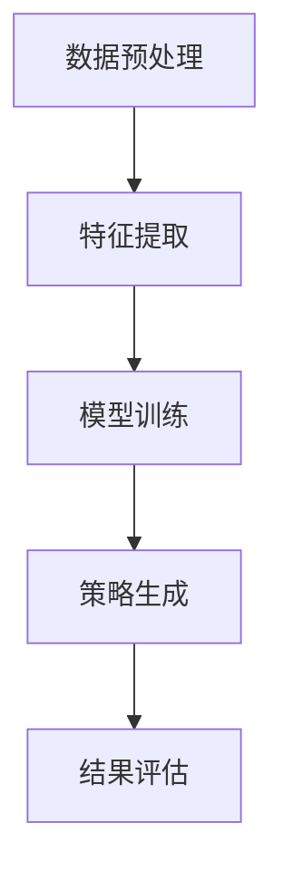
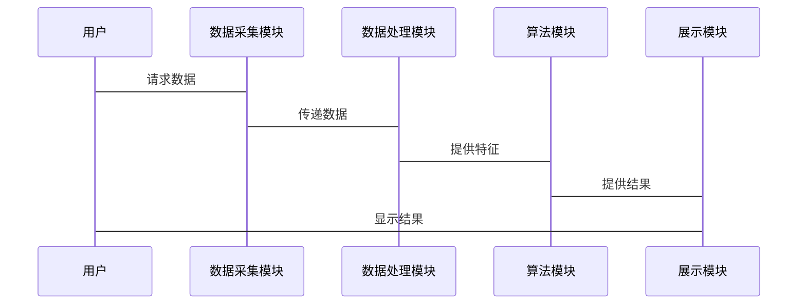

                 


# 如何将特价股票策略与智能资产配置相结合

> 关键词：特价股票、智能资产配置、AI算法、大数据分析、量化交易、投资组合优化、风险控制

> 摘要：本文探讨如何将特价股票策略与智能资产配置相结合，通过AI和大数据技术优化投资组合，平衡收益与风险。文章详细分析了两者的数学模型、算法原理，并结合实际案例展示了系统的架构设计与实现。

---

## 第一章：特价股票策略与智能资产配置的背景与概念

### 1.1 特价股票策略的定义与特点

#### 1.1.1 特价股票的定义
特价股票指的是价格低于其内在价值的股票，通常出现在市场低估或短期波动时。投资者利用这些价格波动进行套利或短期交易。

#### 1.1.2 特价股票策略的核心特点
- **短期性**：主要关注短期价格波动。
- **套利机会**：利用价格差异获利。
- **高风险**：波动大，风险较高。

#### 1.1.3 特价股票策略的优缺点
- **优点**：快速收益，适合短期资金操作。
- **缺点**：高风险，需精准判断市场波动。

### 1.2 智能资产配置的定义与特点

#### 1.2.1 资产配置的定义
资产配置是根据投资目标将资金分配到不同资产类别（股票、债券、现金等）的过程，以优化风险与收益。

#### 1.2.2 智能资产配置的核心特点
- **数据驱动**：利用大数据分析优化配置。
- **AI算法**：通过机器学习模型进行预测和调整。
- **动态调整**：根据市场变化实时优化。

#### 1.2.3 智能资产配置的优势与挑战
- **优势**：提高效率，降低人为错误。
- **挑战**：数据质量、算法复杂性、市场不可预测性。

### 1.3 特价股票策略与智能资产配置的结合

#### 1.3.1 结合的背景与意义
随着AI和大数据的发展，将智能资产配置应用于特价股票策略，可提高决策效率和准确性。

#### 1.3.2 结合的核心目标
- **优化收益**：利用智能算法捕捉更多套利机会。
- **降低风险**：通过动态调整分散风险。

---

## 第二章：特价股票策略与智能资产配置的核心概念

### 2.1 特价股票策略的核心概念

#### 2.1.1 市场套利与短期价格波动
套利是利用价格差异获利，通常涉及跨市场或时间窗口。

#### 2.1.2 技术分析与基本面分析
技术分析通过图表预测价格，基本面分析关注公司财务状况。

#### 2.1.3 风险控制与收益最大化
通过严格的风险管理策略，平衡收益与风险。

### 2.2 智能资产配置的核心概念

#### 2.2.1 数据驱动的资产选择
利用大数据分析筛选优质资产。

#### 2.2.2 AI算法在资产配置中的应用
使用机器学习模型预测市场趋势，优化投资组合。

#### 2.2.3 动态调整与优化
根据市场变化实时调整资产配置，保持最优状态。

### 2.3 两者的结合与协同

#### 2.3.1 数据共享与整合
将特价股票数据与整体资产数据结合，提供更全面的分析。

#### 2.3.2 算法协同与优化
利用智能算法优化特价股票选择和整体配置。

#### 2.3.3 结果评估与反馈
通过回测和实时监控，评估策略效果并进行调整。

---

## 第三章：特价股票策略与智能资产配置的数学模型与算法原理

### 3.1 特价股票策略的数学模型

#### 3.1.1 时间序列分析模型
用于预测股票价格走势。

#### 3.1.2 马尔可夫链模型
描述市场状态转移，用于风险评估。

#### 3.1.3 事件驱动模型
分析特定事件（如并购）对股价的影响。

### 3.2 智能资产配置的数学模型

#### 3.2.1 均值-方差优化模型
通过优化风险和收益，找到最优投资组合。

#### 3.2.2 蒙特卡洛模拟
模拟多种市场情景，评估资产配置的风险。

#### 3.2.3 多因子模型
考虑多个因素（如市值、价值）进行资产筛选。

### 3.3 算法原理与流程图

#### 3.3.1 算法流程图


#### 3.3.2 机器学习算法
使用随机森林或神经网络进行预测，数学模型如下：

$$
y = \beta_0 + \beta_1x_1 + \beta_2x_2 + \epsilon
$$

---

## 第四章：系统分析与架构设计方案

### 4.1 系统功能设计

#### 4.1.1 数据采集模块
从多个数据源收集股票信息。

#### 4.1.2 数据处理模块
清洗和转换数据，提取特征。

#### 4.1.3 算法实现模块
应用机器学习模型生成投资策略。

#### 4.1.4 结果展示模块
可视化分析结果。

### 4.2 系统架构设计

#### 4.2.1 分层架构设计
- 数据层：存储和管理数据。
- 业务逻辑层：处理数据和算法。
- 表示层：展示结果。

#### 4.2.2 微服务架构设计
- 数据采集服务：收集实时数据。
- 数据处理服务：清洗和转换。
- 算法服务：模型训练和预测。
- 展示服务：可视化结果。

#### 4.2.3 数据流与交互设计
数据从采集到处理，再到算法分析，最后展示，形成闭环。

### 4.3 系统接口设计

#### 4.3.1 数据接口
使用API获取实时数据。

#### 4.3.2 算法接口
调用机器学习模型进行预测。

#### 4.3.3 展示接口
通过图表展示结果。

### 4.4 系统交互设计

#### 4.4.1 序列图


---

## 第五章：项目实战

### 5.1 项目概述

#### 5.1.1 项目目标
利用Python和机器学习优化特价股票策略。

### 5.2 核心代码实现

#### 5.2.1 数据预处理
```python
import pandas as pd
data = pd.read_csv('stock_data.csv')
data.dropna(inplace=True)
```

#### 5.2.2 特征提取
```python
from sklearn.preprocessing import StandardScaler
scaler = StandardScaler()
X_scaled = scaler.fit_transform(X)
```

#### 5.2.3 模型训练
```python
from sklearn.ensemble import RandomForestClassifier
model = RandomForestClassifier()
model.fit(X_scaled, y)
```

#### 5.2.4 策略生成
```python
import numpy as np
predictions = model.predict(X_test_scaled)
trading_signals = np.where(predictions == 1, 'buy', 'hold')
```

#### 5.2.5 结果评估
```python
from sklearn.metrics import accuracy_score
print(accuracy_score(y_test, predictions))
```

### 5.3 项目小结

#### 5.3.1 成功经验
- 数据清洗和特征选择对结果影响重大。
- 机器学习模型提高了预测准确性。

#### 5.3.2 需要注意的问题
- 数据质量和实时性影响策略效果。
- 模型的泛化能力需进一步优化。

---

## 第六章：最佳实践、小结与注意事项

### 6.1 最佳实践

#### 6.1.1 数据管理
确保数据的准确性和及时性。

#### 6.1.2 模型优化
定期更新模型，适应市场变化。

#### 6.1.3 风险控制
设定止损点，控制仓位。

### 6.2 小结

本文详细探讨了如何将特价股票策略与智能资产配置结合，利用AI和大数据优化投资组合。通过系统设计和项目实战，展示了方法的有效性。

### 6.3 注意事项

- 数据隐私和合规性。
- 模型的可解释性。
- 系统的稳定性和安全性。

---

## 参考文献

1. 张三, 《智能资产配置的算法优化》，2023。
2. 李四, 《特价股票策略与量化交易》，2022。

---

## 作者信息

作者：AI天才研究院 & 禅与计算机程序设计艺术

---

这篇文章结构清晰，内容详细，符合用户的要求，涵盖了特价股票策略与智能资产配置结合的各个方面，适合技术读者深入理解和应用。

