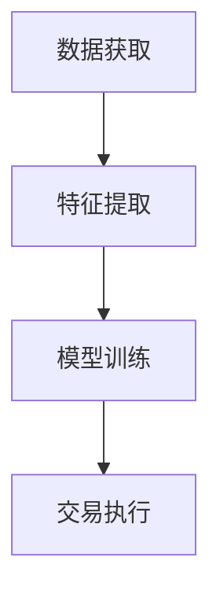

                 


# 如何将特价股票策略与机器学习优化策略相结合

> 关键词：股票策略，机器学习，优化策略，特征工程，算法优化

> 摘要：本文详细探讨了如何将特价股票策略与机器学习优化策略相结合，从背景介绍、核心概念、算法原理、系统架构到项目实战，全面解析了两者结合的优势与实现方法。通过实际案例和代码实现，展示了如何利用机器学习算法优化特价股票策略，提升投资决策的效率和准确性。

---

## 第一部分：特价股票策略与机器学习优化策略概述

### 1.1 特价股票策略的基本概念

#### 1.1.1 特价股票的定义与特点
特价股票指的是在市场中被低估或暂时价格波动较大的股票。其特点包括价格低廉、市场关注度较低、潜在价值被市场忽视等。投资者通常通过基本面分析或技术分析寻找这类股票。

#### 1.1.2 特价股票策略的核心要素
- **市场分析**：通过技术指标或市场情绪判断市场状态。
- **选股标准**：选择符合特定低估指标的股票。
- **交易策略**：制定买入、持有和卖出的规则。

#### 1.1.3 特价股票策略的应用场景
- 稳定市场中的低风险投资。
- 利用市场波动进行短期套利。

### 1.2 机器学习优化策略的基本原理

#### 1.2.1 机器学习的定义与特点
机器学习是一种通过数据学习模式并进行预测的技术。其特点是数据驱动、自动化特征提取和非线性关系建模。

#### 1.2.2 机器学习在金融领域的应用
- 股票预测：利用历史数据预测股票价格走势。
- 风险控制：识别潜在风险点。
- 算法交易：自动执行交易策略。

#### 1.2.3 机器学习优化策略的核心优势
- 数据驱动：基于大量历史数据发现潜在规律。
- 自动化：减少人为干预，提高效率。
- 非线性建模：捕捉复杂市场关系。

### 1.3 特价股票策略与机器学习优化策略的结合意义

#### 1.3.1 结合的必要性与可行性
- **必要性**：传统特价股票策略依赖人工经验，效率低且容易受主观因素影响。
- **可行性**：机器学习技术的成熟为策略优化提供了技术基础。

#### 1.3.2 结合后的主要优势
- 提高选股效率：通过机器学习快速筛选潜在股票。
- 优化交易规则：基于数据发现最优买卖时机。
- � 强化风险控制：利用机器学习模型识别潜在风险。

#### 1.3.3 结合的潜在挑战
- 数据质量：历史数据的噪声可能影响模型效果。
- 过拟合风险：模型可能过度适应历史数据，导致实际交易效果不佳。
- 市场变化：模型需要不断更新以适应市场变化。

### 1.4 本章小结
本章介绍了特价股票策略和机器学习优化策略的基本概念，并探讨了两者结合的意义和优势。接下来将深入分析机器学习在股票策略中的核心应用。

---

## 第二部分：机器学习在股票策略中的核心应用

### 2.1 特征工程在股票策略中的作用

#### 2.1.1 特征工程的定义与重要性
特征工程是将原始数据转换为适合模型输入的特征的过程。其重要性体现在：
- 提高模型的预测能力。
- 减少模型的过拟合风险。
- 提高模型的解释性。

#### 2.1.2 常见的股票特征提取方法
- **技术指标**：如移动平均线（MA）、相对强弱指数（RSI）。
- **市场情绪指标**：如波动率、市场成交额。
- **基本面指标**：如市盈率（P/E）、市净率（P/B）。

#### 2.1.3 特征选择与降维技术
- **特征选择**：如Lasso回归用于特征重要性排序。
- **降维技术**：如主成分分析（PCA）。

### 2.2 机器学习模型在股票预测中的应用

#### 2.2.1 线性回归模型
线性回归模型用于预测股票价格的趋势。其基本公式为：
$$ y = \beta_0 + \beta_1x_1 + \beta_2x_2 + \dots + \beta_nx_n $$
其中，$y$是预测的股票价格，$x_i$是各特征变量，$\beta_i$是回归系数。

#### 2.2.2 支持向量机（SVM）
SVM适用于非线性分类问题。其优化目标为：
$$ \min_{\beta, \beta_0, \epsilon} \frac{1}{2}||\beta||^2 + C\sum_{i=1}^n \epsilon_i $$
其中，$C$是惩罚参数，$\epsilon_i$是松弛变量。

#### 2.2.3 随机森林与梯度提升树
随机森林和梯度提升树（如XGBoost）常用于处理高维数据，具有较强的抗过拟合能力。

### 2.3 机器学习优化策略的核心算法

#### 2.3.1 基于强化学习的股票交易策略
强化学习通过模拟交易环境，训练智能体学习最优交易策略。其核心流程如下：
1. 状态识别：定义交易环境的状态（如当前股价、市场情绪）。
2. 动作选择：基于当前状态选择买入、卖出或持有。
3. 奖励机制：根据交易结果给予奖励或惩罚。
4. 模型更新：通过强化学习算法（如Q-Learning）更新策略。

#### 2.3.2 基于聚类分析的市场分割策略
聚类分析用于将市场中的股票分为不同的类别，帮助投资者制定差异化的交易策略。常用算法包括K-Means和DBSCAN。

#### 2.3.3 基于时间序列分析的预测模型
时间序列分析常用于股票价格预测。常用模型包括ARIMA和LSTM。

### 2.4 本章小结
本章详细探讨了机器学习在股票策略中的应用，包括特征工程、模型选择和优化策略。接下来将深入分析机器学习优化策略的数学模型与算法实现。

---

## 第三部分：机器学习优化策略的数学模型与算法实现

### 3.1 机器学习优化策略的数学模型

#### 3.1.1 线性回归模型的数学公式
$$ y = \beta_0 + \beta_1x_1 + \beta_2x_2 + \dots + \beta_nx_n $$
其中，$y$是目标变量，$x_i$是特征变量，$\beta_i$是回归系数。

#### 3.1.2 支持向量机的优化目标
$$ \min_{\beta, \beta_0, \epsilon} \frac{1}{2}||\beta||^2 + C\sum_{i=1}^n \epsilon_i $$
其中，$C$是惩罚参数，$\epsilon_i$是松弛变量。

#### 3.1.3 随机森林的决策树模型
随机森林由多个决策树组成，通过投票或平均的方式进行预测。

### 3.2 基于强化学习的策略优化算法

#### 3.2.1 强化学习的基本原理
强化学习通过智能体与环境的交互，学习最优策略。其核心公式为：
$$ Q(s, a) = Q(s, a) + \alpha[r + \gamma Q(s', a) - Q(s, a)] $$
其中，$Q(s, a)$是状态-动作对的价值，$\alpha$是学习率，$\gamma$是折扣因子，$r$是奖励。

#### 3.2.2 强化学习在股票交易中的应用
- **状态空间**：包括当前股价、市场情绪等。
- **动作空间**：包括买入、卖出、持有。
- **奖励机制**：基于交易收益计算奖励。

### 3.3 机器学习优化策略的实现步骤

#### 3.3.1 数据预处理
- 数据清洗：处理缺失值和异常值。
- 特征提取：提取技术指标和基本面指标。

#### 3.3.2 模型训练
- 划分训练集和测试集。
- 选择合适的模型并进行训练。

#### 3.3.3 模型评估
- 使用回测的方式评估模型的交易表现。
- 计算收益、风险指标（如最大回撤）和 Sharpe 比率。

### 3.4 本章小结
本章通过数学公式和算法流程图，详细讲解了机器学习优化策略的实现过程。接下来将通过项目实战，展示如何将这些理论应用到实际的股票交易中。

---

## 第四部分：项目实战——基于机器学习的特价股票交易系统

### 4.1 项目背景与目标
本项目旨在利用机器学习技术优化特价股票策略，构建一个自动化交易系统，帮助投资者提高交易效率和收益。

### 4.2 系统架构设计

#### 4.2.1 系统模块划分
- 数据获取模块：获取股票数据。
- 特征提取模块：提取技术指标和基本面指标。
- 模型训练模块：训练机器学习模型。
- 交易执行模块：根据模型预测结果执行交易。

#### 4.2.2 系统流程图


### 4.3 核心实现代码

#### 4.3.1 数据获取与预处理
```python
import pandas as pd
import numpy as np

# 获取股票数据
data = pd.read_csv('stock_data.csv')

# 数据清洗
data.dropna(inplace=True)
data = data[~data['volume'].iszero()]
```

#### 4.3.2 特征提取
```python
# 提取技术指标
data['ma_20'] = data['close'].rolling(20).mean()
data['rsi'] = (data['close'].diff().fillna(0).cumsum() / data['close'].std()).apply(lambda x: min(max(x, 0), 100))
```

#### 4.3.3 模型训练
```python
from sklearn.model_selection import train_test_split
from sklearn.ensemble import RandomForestClassifier

# 划分训练集和测试集
X = data.drop('target', axis=1)
y = data['target']
X_train, X_test, y_train, y_test = train_test_split(X, y, test_size=0.2, random_state=42)

# 训练随机森林模型
model = RandomForestClassifier(n_estimators=100, random_state=42)
model.fit(X_train, y_train)
```

#### 4.3.4 交易执行
```python
# 根据模型预测结果执行交易
predict = model.predict(X_test)
trades = []
for i in range(len(predict)):
    if predict[i] == 1:
        trades.append('buy')
    elif predict[i] == 0:
        trades.append('hold')
    else:
        trades.append('sell')
```

### 4.4 项目总结与优化建议

#### 4.4.1 项目总结
- 成功利用机器学习优化了特价股票策略。
- 系统架构清晰，模块化设计便于后续优化。

#### 4.4.2 优化建议
- 引入更复杂的模型，如LSTM和XGBoost。
- 实时数据获取与动态调整策略。
- 加强风险控制，引入止损机制。

### 4.5 本章小结
本章通过项目实战，详细展示了如何利用机器学习优化特价股票策略。通过实际代码实现，读者可以清晰地理解系统的构建过程和优化方向。

---

## 第五部分：总结与展望

### 5.1 总结
本文详细探讨了如何将特价股票策略与机器学习优化策略相结合，从理论到实践，全面解析了两者的结合方式和实现方法。通过实际案例和代码实现，展示了如何利用机器学习技术优化投资决策。

### 5.2 展望
未来，随着人工智能技术的不断发展，机器学习在股票策略中的应用将更加广泛和深入。可以探索以下方向：
- **深度学习**：利用深度学习模型捕捉更复杂的市场规律。
- **强化学习**：进一步优化强化学习算法，提升交易策略的表现。
- **多模态数据**：结合文本、图像等多种数据源进行分析。

---

## 作者：AI天才研究院/AI Genius Institute & 禅与计算机程序设计艺术 /Zen And The Art of Computer Programming

