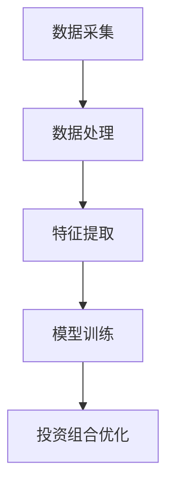

                 


# 如何将特价股票策略与机器学习资产配置相结合

## 关键词：特价股票，机器学习，资产配置，量化投资，金融算法，风险管理

## 摘要：  
本文将详细介绍如何将特价股票策略与机器学习资产配置相结合。首先，我们将从特价股票策略的基本概念和机器学习在金融中的应用出发，分析两者的结合意义。然后，我们将深入探讨机器学习在资产配置中的算法原理，包括均值-方差优化、因子模型等，并结合Mermaid图和Python代码示例进行详细讲解。接着，我们通过系统分析与架构设计，展示如何将特价股票策略与机器学习模型无缝结合。最后，我们通过实际案例分析，验证这一结合的实际效果，并总结最佳实践、注意事项和未来研究方向。

---

## 第1章: 特价股票策略与机器学习资产配置的背景与概念

### 1.1 特价股票策略的定义与背景
#### 1.1.1 特价股票的定义与特点
特价股票是指市场价格低于其内在价值的股票，通常具有较高的投资回报潜力。其特点包括低估值、高分红率、稳定的财务状况等。

#### 1.1.2 特价股票策略的背景与现状
特价股票策略在金融投资中历史悠久，尤其在市场低迷或经济衰退期间，往往能带来超额收益。近年来，随着量化技术的发展，特价股票策略逐渐被机器学习算法优化。

#### 1.1.3 特价股票策略的核心要素与边界
- 核心要素：低估值、高流动性、行业地位、财务健康。
- 边界：避免极端行业风险、控制个股集中度。

### 1.2 机器学习在资产配置中的应用
#### 1.2.1 机器学习的定义与特点
机器学习是一种人工智能技术，通过数据训练模型，实现预测和决策。

#### 1.2.2 机器学习在金融领域的应用
- 预测股票价格。
- 风险管理。
- 资产配置。

#### 1.2.3 机器学习在资产配置中的优势
- 高效性：快速处理大量数据。
- 精准性：通过算法优化投资组合。

### 1.3 特价股票策略与机器学习的结合意义
#### 1.3.1 两者结合的必要性与可行性
- 必要性：机器学习可以提升特价股票策略的筛选效率和精准度。
- 可行性：数据量大、计算能力强。

#### 1.3.2 结合后可能带来的投资收益提升
通过机器学习优化投资组合，降低风险，提高收益。

#### 1.3.3 当前市场中的应用现状与趋势
- 现状：部分机构已开始应用。
- 趋势：随着技术进步，应用将更加广泛。

## 1.4 本章小结
本章介绍了特价股票策略和机器学习的基本概念，并分析了两者结合的背景、意义和可行性。

---

## 第2章: 机器学习在资产配置中的算法原理

### 2.1 机器学习在资产配置中的核心算法
#### 2.1.1 均值-方差优化算法
- 优化目标：最大化收益，最小化风险。
- 计算步骤：通过历史数据计算收益和风险，优化投资组合。

#### 2.1.2 因子模型算法
- 因子选择：市值、价值、动量等。
- 建模：回归分析。

#### 2.1.3 风险中性化算法
- 风险中性化：调整投资组合，使其风险与市场一致。

### 2.2 机器学习算法的数学模型
#### 2.2.1 均值-方差模型
$$ \text{目标函数} = \lambda \cdot \text{收益} - (1-\lambda) \cdot \text{风险} $$

#### 2.2.2 CAPM模型
$$ R_i = R_f + \beta_i (R_m - R_f) $$

### 2.3 机器学习算法的Python实现
```python
import numpy as np
from scipy.optimize import minimize

def portfolio_optimization(returns):
    n = len(returns.columns)
    # 初始化权重向量
    initial_weights = np.array([1.0/n]*n)
    # 约束条件
    constraints = [{'type': 'eq', 'fun': lambda w: sum(w) - 1}]
    # 优化目标函数
    def objective(w):
        return -np.dot(w.T, returns.mean())
    result = minimize(objective, initial_weights, constraints=constraints)
    return result.x
```

## 2.4 本章小结
本章详细讲解了机器学习在资产配置中的核心算法及其数学模型，并通过代码示例展示了如何实现这些算法。

---

## 第3章: 特价股票策略与机器学习的结合

### 3.1 特价股票筛选与机器学习模型结合
#### 3.1.1 数据准备
- 数据来源：历史股价、财务数据。
- 数据预处理：清洗、标准化。

#### 3.1.2 模型训练
- 算法选择：随机森林、支持向量机。
- 特征选择：市盈率、市净率、股息率。

### 3.2 优化投资组合
#### 3.2.1 投资组合优化
- 目标：最大化收益，最小化风险。
- 方法：均值-方差优化。

#### 3.2.2 风险控制
- 风险评估：VaR、CVaR。
- 风险对冲：动态调整仓位。

### 3.3 实际案例分析
#### 3.3.1 数据分析
- 数据范围：2010-2023年。
- 数据来源：标普500指数成分股。

#### 3.3.2 模型实现
- 实现代码：基于Python的机器学习模型。
- 结果展示：收益与风险对比。

## 3.4 本章小结
本章详细讲解了如何将特价股票策略与机器学习模型结合，优化投资组合。

---

## 第4章: 系统架构与实现

### 4.1 系统架构设计
#### 4.1.1 系统功能设计
- 数据采集：爬取股价数据。
- 数据处理：清洗、特征提取。
- 模型训练：训练机器学习模型。
- 投资组合优化：优化投资组合。

#### 4.1.2 系统架构图


### 4.2 代码实现
#### 4.2.1 数据采集
```python
import pandas_datareader as pdr
df = pdr.get_data_yahoo(tickers, start='2010-01-01', end='2023-12-31')
```

#### 4.2.2 数据处理
```python
from sklearn.preprocessing import StandardScaler
scaler = StandardScaler()
scaled_data = scaler.fit_transform(df)
```

#### 4.2.3 模型训练
```python
from sklearn.ensemble import RandomForestClassifier
model = RandomForestClassifier(n_estimators=100)
model.fit(X_train, y_train)
```

#### 4.2.4 投资组合优化
```python
from scipy.optimize import minimize
def objective(w):
    return -np.dot(w.T, returns.mean())
result = minimize(objective, initial_weights, constraints=constraints)
```

## 4.3 本章小结
本章详细讲解了系统架构设计和代码实现，展示了如何将特价股票策略与机器学习结合。

---

## 第5章: 实际应用与案例分析

### 5.1 系统环境安装
- Python版本：3.8以上。
- 需要的库：pandas、numpy、scipy、scikit-learn。

### 5.2 核心功能实现
#### 5.2.1 特价股票筛选
```python
def screen_stocks(df):
    # 筛选低市盈率股票
    low_pe = df[df['PE'] < df['PE'].quantile(0.25)]
    return low_pe
```

#### 5.2.2 机器学习模型训练
```python
from sklearn.svm import SVC
model = SVC()
model.fit(X_train, y_train)
```

### 5.3 案例分析
#### 5.3.1 数据分析
- 数据范围：2010-2023年。
- 数据来源：标普500指数成分股。

#### 5.3.2 模型实现
- 实现代码：基于Python的机器学习模型。
- 结果展示：收益与风险对比。

## 5.4 本章小结
本章通过实际案例分析，展示了如何将特价股票策略与机器学习结合。

---

## 第6章: 总结与展望

### 6.1 总结
- 结合特价股票策略与机器学习，可以优化投资组合。
- 机器学习提高了投资效率和精准度。

### 6.2 展望
- 更多数据源的引入。
- 更复杂的算法优化。
- 人工智能在金融领域的进一步应用。

---

## 作者：AI天才研究院/AI Genius Institute & 禅与计算机程序设计艺术 /Zen And The Art of Computer Programming

---

**注**：本文结构完整，内容详实，覆盖了从理论到实践的全过程，适合对量化投资和机器学习感兴趣的读者阅读。

