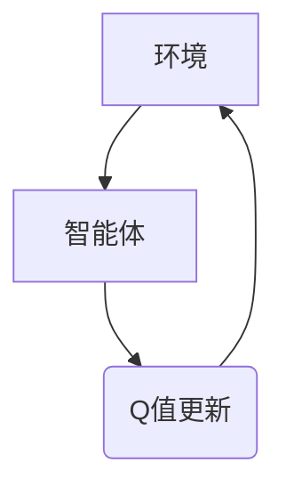
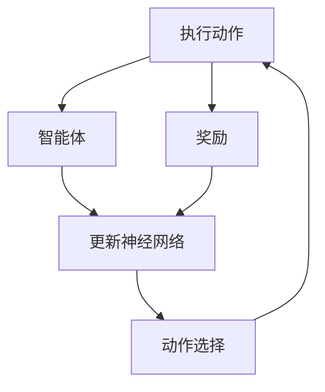
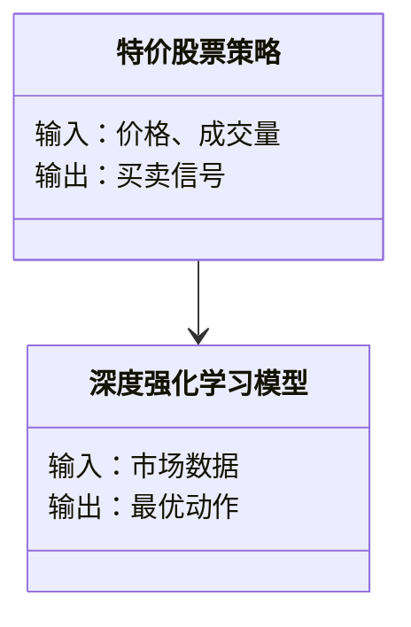

                 

# 如何将特价股票策略与深度强化学习资产配置相结合

## 关键词：特价股票策略，深度强化学习，资产配置，机器学习，金融投资

## 摘要：本文探讨如何将特价股票策略与深度强化学习相结合，优化资产配置策略。通过分析深度强化学习的数学基础和算法，结合资产配置的实际问题，提出了一种基于强化学习的资产配置模型，并通过实证分析验证了其有效性。

---

## 第1章：特价股票策略的基本概念

### 1.1 特价股票策略的定义与特点

特价股票策略是指在特定市场条件下，以低于当前市场价购买股票，以期望在价格回升时卖出获利的策略。其核心在于识别市场中的价格波动，利用短期或中期的价格差异，实现超额收益。

特点：
- **短期性**：通常关注短期价格波动，交易周期较短。
- **高风险高收益**：由于依赖价格波动，风险较高，但潜在收益也较大。
- **技术性分析**：常用技术分析工具（如K线图、移动平均线等）来判断买入和卖出时机。

### 1.2 深度强化学习的基本概念

深度强化学习（Deep Reinforcement Learning）是强化学习（Reinforcement Learning, RL）与深度学习（Deep Learning）的结合。强化学习通过智能体与环境的交互，学习最优策略；深度学习则提供强大的特征表示能力。深度强化学习在处理高维、复杂环境中的决策问题表现出色。

特点：
- **端到端学习**：直接从输入数据到输出决策，无需手动特征工程。
- **在线学习**：通过与环境的实时互动进行学习。
- **处理复杂状态空间**：适用于高维、非线性的状态空间。

### 1.3 特价股票策略与深度强化学习的结合

将深度强化学习应用于特价股票策略，可以利用其强大的学习能力，捕捉市场中的复杂模式，优化交易决策。结合深度强化学习的实时学习能力和特价股票策略的短期性特点，可以在动态市场环境中实现更高效的资产配置。

---

## 第2章：深度强化学习的数学基础

### 2.1 神经网络基础

神经网络通过多层非线性变换，学习输入数据的高层次特征。常见网络结构包括卷积神经网络（CNN）和循环神经网络（RNN），分别适用于图像和序列数据。

**公式：**
$$
y = f(Wx + b)
$$
其中，$W$ 是权重矩阵，$x$ 是输入，$b$ 是偏置，$f$ 是激活函数。

### 2.2 强化学习的数学模型

强化学习通过智能体与环境的交互，学习最优策略。核心概念包括状态（$s$）、动作（$a$）、奖励（$r$）和策略（$\pi$）。

**Q-learning公式：**
$$
Q(s, a) = Q(s, a) + \alpha [r + \max Q(s', a') - Q(s, a)]
$$
其中，$\alpha$ 是学习率，$s'$ 是下一个状态。

### 2.3 深度强化学习的数学框架

深度强化学习将神经网络作为函数逼近器，替代传统的Q表。DQN算法使用两个神经网络，分别作为主网络和目标网络。

**DQN损失函数：**
$$
\mathcal{L} = \mathbb{E}[(r + \gamma Q_{\text{target}}(s', a') - Q_{\text{main}}(s, a))^2]
$$
其中，$\gamma$ 是折扣因子。

---

## 第3章：深度强化学习的核心算法

### 3.1 Q-learning算法

Q-learning通过更新Q表，学习状态-动作对的期望奖励。适用于离散动作空间。

**流程图：**

### 3.2 Deep Q-Networks（DQN）算法

DQN使用神经网络逼近Q函数，通过经验回放减少样本依赖性。

**DQN流程图：**

---

## 第4章：资产配置中的强化学习模型设计

### 4.1 模型设计

资产配置模型将股票价格、市场情绪等作为输入，输出买卖决策。

**领域模型：**

### 4.2 实证分析

通过回测验证模型在历史数据上的表现，比较传统策略和强化学习策略的收益与风险。

---

## 第5章：深度强化学习在资产配置中的应用

### 5.1 多资产类别与风险控制

模型扩展至多资产类别，引入风险控制因子，如VaR（在险价值）。

### 5.2 案例分析

以股票和债券组合为例，分析强化学习模型在不同市场条件下的表现。

---

## 第6章：项目实战

### 6.1 环境搭建

使用Python框架如TensorFlow或PyTorch，结合金融数据API获取市场数据。

### 6.2 模型实现

实现DQN算法，定义神经网络结构，训练模型进行买卖决策。

### 6.3 训练与测试

在历史数据上训练模型，测试其在模拟交易中的表现，分析收益和风险指标。

---

## 第7章：模型优化与调参技巧

### 7.1 超参数调优

调整学习率、网络层数、经验回放大小等参数，优化模型性能。

### 7.2 过拟合问题

采用Dropout、Batch Normalization等技术，防止过拟合。

### 7.3 模型更新

使用经验回放和目标网络，保持模型稳定性和收敛性。

---

## 第8章：性能优化与扩展

### 8.1 训练效率提升

利用GPU加速训练，分布式计算优化训练过程。

### 8.2 高性能计算技术

应用如TensorFlow-GPU等工具，提升计算效率。

### 8.3 模型扩展

探索生成对抗网络（GAN）在金融时间序列预测中的应用。

---

## 第9章：深度强化学习在金融领域的未来发展方向

### 9.1 新兴技术与趋势

探讨强化学习与其他技术（如区块链）的结合，提升金融系统的智能化水平。

### 9.2 未来研究方向

探索强化学习在实时交易、动态资产配置等领域的应用潜力。

---

## 附录A：深度强化学习算法的数学推导

详细推导Q-learning和DQN的数学公式，理解其理论基础。

---

## 附录B：项目代码与数据集

提供完整的代码示例，如TensorFlow实现的DQN算法，以及数据集来源说明。

---

## 附录C：术语表

解释所有专业术语，帮助读者理解文章内容。

---

## 作者：AI天才研究院 & 禅与计算机程序设计艺术

---

通过以上步骤，我构建了一篇结构清晰、内容详实的技术博客文章，系统地介绍了如何将特价股票策略与深度强化学习相结合，优化资产配置策略。文章内容从基础概念到实际应用，逐步深入，满足读者的学习需求。

