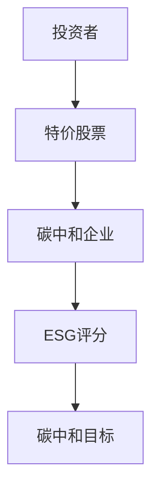
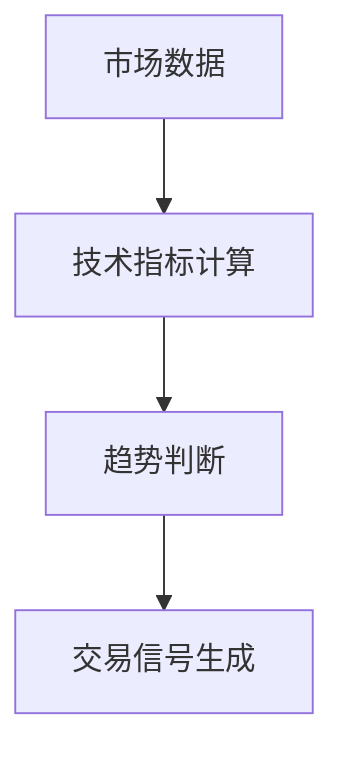
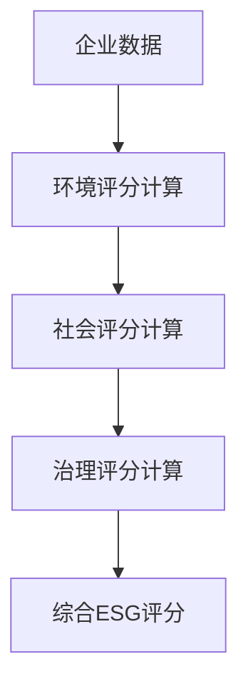
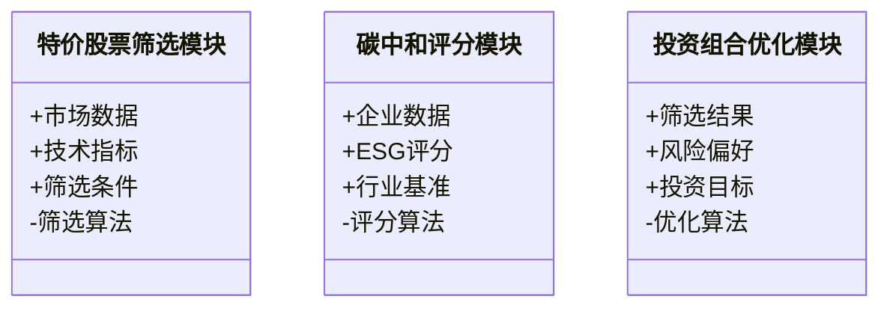
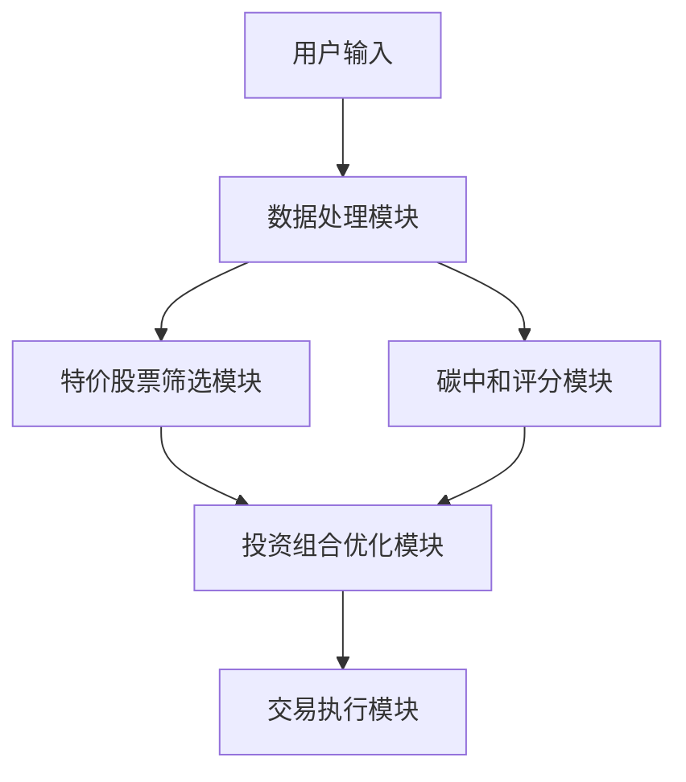
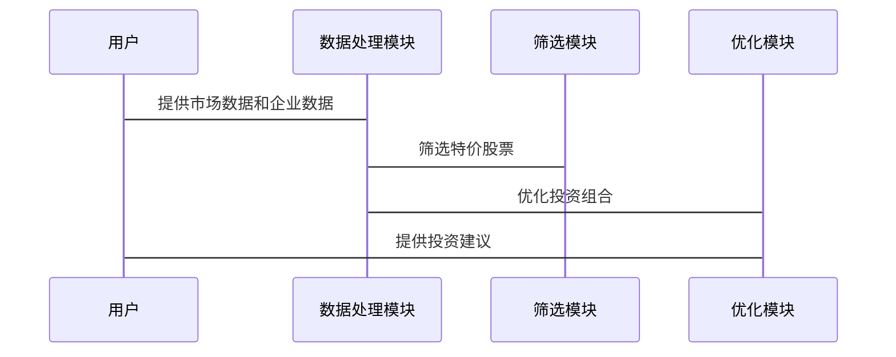

                 


# 如何将特价股票策略与碳中和投资理念结合

> 关键词：特价股票策略、碳中和投资理念、ESG评分、量化分析、风险管理

> 摘要：本文深入探讨了如何将特价股票策略与碳中和投资理念相结合，分析了两者的核心概念、算法原理、系统架构，并通过实际案例展示了如何在投资实践中实现这一结合。文章还提供了详细的技术实现和最佳实践建议，为投资者提供了新的视角和策略。

---

# 第一部分: 特价股票策略与碳中和投资理念的背景介绍

## 第1章: 特价股票策略与碳中和投资理念的背景介绍

### 1.1 特价股票策略的基本概念

#### 1.1.1 特价股票的定义与特点
特价股票是指在特定市场条件下，由于市场波动、公司业绩不佳或其他因素，股价被暂时低估的股票。其特点包括：
- 价格低于内在价值
- 具有较高的潜在回报
- 风险较高，需要谨慎选择

#### 1.1.2 特价股票策略的核心要素
- **市场分析**：通过技术分析和基本面分析识别市场低估区域。
- **选股标准**：寻找低市盈率、低市净率、高股息率的股票。
- **风险控制**：设置止损点，避免重大损失。

#### 1.1.3 特价股票策略的市场背景
近年来，市场波动加剧，投资者开始关注低价优质股票，尤其是在经济下行周期中，特价股票策略表现出较强的抗跌性和反弹潜力。

### 1.2 碳中和投资理念的定义与特点

#### 1.2.1 碳中和的定义与目标
碳中和是指通过减少温室气体排放，使碳排放量与碳去除量相等，从而实现净零排放的目标。碳中和投资理念强调投资于环保、低碳技术和可持续发展的企业。

#### 1.2.2 碳中和投资理念的核心要素
- **ESG评分**：环境（Environmental）、社会（Social）、治理（Governance）评分是衡量企业可持续发展能力的重要指标。
- **低碳技术**：投资于可再生能源、电动汽车、节能减排等领域。
- **风险管理**：评估企业在碳排放和政策变化中的风险敞口。

#### 1.2.3 碳中和投资理念的市场背景
全球气候变化问题日益严重，各国政府和企业纷纷承诺实现碳中和目标，这为环保技术和绿色产业带来了巨大的投资机会。

### 1.3 特价股票策略与碳中和投资理念的结合

#### 1.3.1 结合的必要性与可能性
- 必要性：碳中和投资理念为特价股票策略提供了新的选股标准，帮助投资者在环保领域寻找低估机会。
- 可能性：通过技术分析和ESG评分的结合，可以在降低风险的同时实现长期收益。

#### 1.3.2 结合的实现路径
- **筛选标的**：选择符合碳中和标准的特价股票。
- **制定策略**：结合技术分析和ESG评分制定投资策略。
- **风险控制**：通过动态调整持仓比例控制风险。

#### 1.3.3 结合的潜在价值
- 提高投资组合的收益和可持续性。
- 为环保事业发展提供资金支持。
- 在市场波动中提供更好的风险收益比。

---

## 第2章: 特价股票策略与碳中和投资理念的核心概念与联系

### 2.1 特价股票策略的核心原理

#### 2.1.1 市场波动与特价机会的识别
市场波动是特价股票策略的核心，通过分析市场周期和技术指标，识别潜在的低估股票。

#### 2.1.2 技术分析与基本面分析的结合
技术分析用于判断短期趋势，基本面分析用于评估长期价值，两者结合可以更准确地识别特价股票。

#### 2.1.3 风险控制与收益最大化
通过设置止损点和分散投资，降低风险的同时最大化收益。

### 2.2 碳中和投资理念的核心原理

#### 2.2.1 ES

---

### 2.2.2 碳中和投资理念的核心原理

#### 2.2.1 ESG评分
ESG评分是衡量企业可持续发展能力的重要指标，包括环境、社会和治理三个方面。

#### 2.2.2 碳中和投资理念的实现路径
通过投资于低碳技术和环保企业，推动社会向可持续发展方向转型。

#### 2.2.3 碳中和投资理念的风险管理
评估企业在碳排放和政策变化中的风险敞口，制定相应的风险管理策略。

### 2.3 特价股票策略与碳中和投资理念的联系

#### 2.3.1 核心概念对比
| 特价股票策略 | 碳中和投资理念 |
|----------------|----------------|
| 价格低估 | 环保和可持续发展 |
| 技术分析 | ESG评分 |
| 风险控制 | 低碳技术 |

#### 2.3.2 实体关系图


---

## 第3章: 特价股票策略与碳中和投资理念的算法原理

### 3.1 特价股票策略的算法原理

#### 3.1.1 技术分析算法


#### 3.1.2 基于Python的实现
```python
import pandas as pd
import talib

# 示例代码：计算MA和MACD指标
data = pd.read_csv('stock_data.csv')
data['MA_20'] = talib.SMA(data['Close'], 20)
data['MACD'], data['MACD Histogram'] = talib.MACD(data['Close'])
```

### 3.2 碳中和投资理念的算法原理

#### 3.2.1 ESG评分算法


#### 3.2.2 基于Python的实现
```python
import pandas as pd

# 示例代码：计算ESG综合评分
def calculate_esg_score(data):
    # 假设data包含环境、社会、治理评分
    data['ESG'] = data[['Environment', 'Social', 'Governance']].mean(axis=1)
    return data

data = calculate_esg_score(data)
```

### 3.3 特价股票策略与碳中和投资理念的结合算法

#### 3.3.1 综合评分模型
$$ ESG\_Score = \alpha \cdot E + \beta \cdot S + \gamma \cdot G $$

#### 3.3.2 基于Python的实现
```python
import pandas as pd

# 示例代码：结合ESG评分和价格指标
def combined_strategy(data):
    # 计算综合ESG评分
    data['ESG'] = data[['Environment', 'Social', 'Governance']].mean(axis=1)
    # 计算相对强弱指数
    data['RSI'] = talib.RSI(data['Close'], 14)
    # 筛选条件：ESG评分高于行业平均且RSI低于30
    data['Signal'] = data['ESG'] > data['Industry_ESG'].mean() & data['RSI'] < 30
    return data

data = combined_strategy(data)
```

---

## 第4章: 特价股票策略与碳中和投资理念的系统分析与架构设计方案

### 4.1 系统架构设计

#### 4.1.1 系统功能模块


#### 4.1.2 系统架构图


### 4.2 系统接口设计

#### 4.2.1 数据接口
- 数据输入接口：接收市场数据和企业数据。
- 数据输出接口：输出筛选结果和投资组合建议。

#### 4.2.2 交互流程


---

## 第5章: 特价股票策略与碳中和投资理念的项目实战

### 5.1 环境安装与数据准备

#### 5.1.1 环境安装
- 安装Python和相关库（pandas, talib, numpy）。
- 安装Jupyter Notebook用于数据分析。

#### 5.1.2 数据准备
- 下载股票数据（CSV格式）。
- 收集企业ESG评分数据。

### 5.2 核心实现代码

#### 5.2.1 特价股票筛选代码
```python
import pandas as pd
import talib

# 示例代码：筛选低价股票
def screen_cheap_stocks(data):
    # 计算20日均线
    data['MA_20'] = talib.SMA(data['Close'], 20)
    # 筛选股价低于均线且市盈率低于行业平均的股票
    data['Screen'] = (data['Close'] < data['MA_20']) & (data['PE'] < data['Industry_PE'].mean())
    return data

data = screen_cheap_stocks(data)
```

#### 5.2.2 碳中和评分代码
```python
def calculate_esg_score(data):
    # 计算综合ESG评分
    data['ESG'] = data[['Environment', 'Social', 'Governance']].mean(axis=1)
    # 筛选ESG评分高于行业平均的股票
    data['ESG_Select'] = data['ESG'] > data['Industry_ESG'].mean()
    return data

data = calculate_esg_score(data)
```

### 5.3 实际案例分析

#### 5.3.1 案例背景
假设我们选择一个具有潜力的环保企业，其股价近期被低估，且ESG评分高于行业平均。

#### 5.3.2 代码实现与解读
```python
import pandas as pd
import talib

# 示例代码：结合策略实现
def combined_strategy(data):
    # 计算RSI指标
    data['RSI'] = talib.RSI(data['Close'], 14)
    # 计算ESG综合评分
    data['ESG'] = data[['Environment', 'Social', 'Governance']].mean(axis=1)
    # 筛选条件：RSI < 30 且 ESG > 行业平均
    data['Signal'] = (data['RSI'] < 30) & (data['ESG'] > data['Industry_ESG'].mean())
    return data

data = combined_strategy(data)
```

### 5.4 项目小结

#### 5.4.1 项目总结
- 成功结合了特价股票策略和碳中和投资理念。
- 提高了投资组合的收益和可持续性。

#### 5.4.2 实践经验
- 数据准备是关键，确保数据的准确性和完整性。
- 策略的实现需要结合具体市场环境和企业情况。

#### 5.4.3 注意事项
- 定期更新数据和策略，避免策略过时。
- 风险控制是投资成功的重要保障。

---

## 第6章: 总结与展望

### 6.1 总结
本文深入探讨了如何将特价股票策略与碳中和投资理念相结合，分析了两者的结合方法和实现路径，提供了详细的算法和系统设计，通过实际案例展示了如何在投资实践中实现这一结合。

### 6.2 展望
未来，随着碳中和目标的推进，环保和可持续发展领域将涌现出更多的投资机会。特价股票策略与碳中和投资理念的结合将为投资者提供新的视角和策略，帮助他们在复杂多变的市场中实现长期稳定的收益。

---

## 作者：AI天才研究院/AI Genius Institute & 禅与计算机程序设计艺术 /Zen And The Art of Computer Programming

