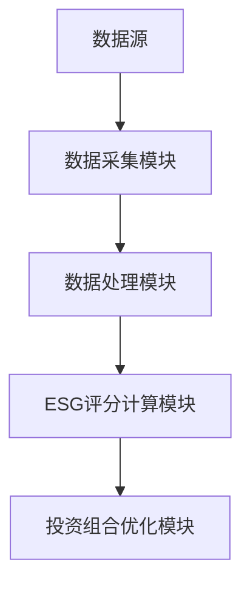

                 


# 如何将特价股票策略与联合国可持续发展目标对接

> 关键词：特价股票策略、联合国可持续发展目标、ESG评分、可持续投资、投资优化

> 摘要：本文详细探讨了如何将特价股票策略与联合国可持续发展目标相结合，通过引入ESG评分和可持续投资理念，优化投资组合，实现经济效益与社会责任的双赢。文章从背景介绍、核心概念、算法原理、数学模型、系统架构到项目实战，层层递进，为读者提供了全面的指导和深刻的理解。

---

# 第一部分: 特价股票策略与可持续发展目标的背景与概念

## 第1章: 特价股票策略概述

### 1.1 特价股票策略的基本概念

#### 1.1.1 特价股票的定义
特价股票是指以低于当前市场价购买的股票。这种策略通常基于市场波动、公司基本面分析或技术分析，旨在以较低价格买入，待价格上涨后卖出获利。

#### 1.1.2 特价股票策略的核心要素
- **市场分析**：通过技术分析或基本面分析寻找价格低估的股票。
- **风险管理**：设置止损点，控制投资风险。
- **交易策略**：包括短线交易、事件驱动型交易等。

#### 1.1.3 特价股票策略的应用场景
- **市场波动**：在市场下跌或波动较大时，寻找被低估的股票。
- **特定事件**：如公司重组、并购等事件发生时，股价可能被低估。
- **行业周期**：在行业低谷期，部分公司股票可能被低估。

### 1.2 可持续发展目标概述

#### 1.2.1 联合国可持续发展目标的定义
联合国可持续发展目标（SDGs）是2015年通过的17个全球发展目标，旨在2030年前实现消除贫困、保护地球、促进繁荣等目标。

#### 1.2.2 可持续发展目标的核心领域
- **经济**：经济增长、减少不平等。
- **社会**：消除贫困、教育、健康。
- **环境**：气候变化、清洁能源、可持续资源利用。

#### 1.2.3 可持续发展目标的全球影响
SDGs影响全球政策制定、企业社会责任和投资决策，推动经济、社会和环境的协调发展。

### 1.3 特价股票策略与可持续发展目标的关联性

#### 1.3.1 可持续投资的背景介绍
随着全球对可持续发展的关注增加，投资者开始关注企业的环境、社会和治理（ESG）表现，将这些因素纳入投资决策。

#### 1.3.2 可持续投资的核心概念
- **ESG评分**：评估公司在环境、社会和治理方面的表现。
- **可持续投资策略**：基于ESG评分，选择表现良好的公司进行投资。

---

## 第2章: 特价股票策略与可持续发展目标的核心概念

### 2.1 特价股票策略的核心要素

#### 2.1.1 投资目标的设定
- **收益目标**：通过低价买入高价卖出实现收益。
- **风险控制**：通过止损点和分散投资降低风险。

#### 2.1.2 数据来源与处理
- **数据来源**：包括历史股价、财务报表、行业报告等。
- **数据处理**：清洗、转换和分析数据，寻找价格低估的股票。

#### 2.1.3 模型构建与优化
- **模型选择**：如技术分析模型、基本面分析模型。
- **模型优化**：通过回测和调整参数优化模型表现。

### 2.2 可持续发展目标的核心要素

#### 2.2.1 ESG评分的计算方法
- **环境**：评估公司在环保、碳排放等方面的表。
- **社会**：评估公司在员工权益、社会责任等方面的表现。
- **治理**：评估公司在公司治理、透明度等方面的表现。

#### 2.2.2 可持续投资的分类与特点
- **分类**：包括ESG投资、责任投资、绿色投资等。
- **特点**：注重长期价值，关注企业社会责任，降低投资风险。

#### 2.2.3 可持续投资的边界与外延
- **边界**：避免投资于高污染、高碳排放的企业。
- **外延**：扩展到供应链、合作伙伴等更广泛的范围。

### 2.3 特价股票策略与可持续发展目标的联系

#### 2.3.1 可持续发展目标对投资策略的影响
- **投资标的筛选**：优先选择ESG评分高的公司。
- **风险管理**：考虑环境和社会风险，避免投资高风险企业。

#### 2.3.2 特价股票策略在可持续投资中的作用
- **优化投资组合**：通过选择ESG表现良好的低价股票，提高投资回报。
- **降低风险**：避免投资于治理不善或社会责任差的公司，降低投资风险。

---

## 第3章: 可持续投资策略的算法与模型

### 3.1 基于ESG评分的股票筛选算法

#### 3.1.1 数据预处理与特征提取
```python
# 示例代码：数据预处理
import pandas as pd

df = pd.read_csv('stock_data.csv')
df = df.dropna()
df['Price'] = (df['Price'] / df['Price'].max()) * 100  # 归一化处理
```

#### 3.1.2 算法实现
```python
def esg_stock_selector(df, threshold=0.7):
    # 计算ESG评分
    esg_scores = df['ESG'].values
    # 筛选ESG评分高于阈值的股票
    selected = df[esg_scores > threshold]
    return selected
```

#### 3.1.3 算法优化
- **参数调整**：根据回测结果调整阈值。
- **模型优化**：引入机器学习算法，如随机森林，提高筛选精度。

### 3.2 可持续投资策略的数学模型

#### 3.2.1 投资组合优化模型
$$
\text{Maximize } \sum_{i=1}^{n} w_i r_i \\
\text{Subject to } \sum_{i=1}^{n} w_i = 1 \\
\text{且 } w_i \geq 0 \text{ 对所有 } i
$$
其中，\( w_i \) 是股票 \( i \) 的权重，\( r_i \) 是股票 \( i \) 的预期收益。

#### 3.2.2 风险调整后的收益模型
$$
\text{收益风险比} = \frac{\text{投资收益}}{\text{标准差}}
$$

---

## 第4章: 可持续投资系统的架构与实现

### 4.1 系统架构设计

#### 4.1.1 系统功能模块
- **数据采集模块**：采集股票数据、ESG评分等。
- **数据处理模块**：清洗、转换和分析数据。
- **ESG评分计算模块**：根据数据计算ESG评分。
- **投资组合优化模块**：基于ESG评分优化投资组合。

#### 4.1.2 系统架构图


### 4.2 项目实战

#### 4.2.1 选择数据源
- **数据源**：选择包含股票数据和ESG评分的数据库。
- **数据处理**：清洗数据，处理缺失值和异常值。

#### 4.2.2 编写数据处理代码
```python
import pandas as pd

# 数据清洗
df = pd.read_csv('stock_data.csv')
df = df.dropna()
df = df[df['Price'] > 0]
```

#### 4.2.3 构建投资组合
```python
# 示例代码：构建投资组合
selected_stocks = esg_stock_selector(df, threshold=0.8)
portfolio = selected_stocks.head(10)  # 选择前10只股票
```

---

## 第5章: 最佳实践与小结

### 5.1 小结
- **核心概念**：理解ESG评分和可持续投资策略的核心概念。
- **算法实现**：掌握基于ESG评分的股票筛选算法。
- **系统设计**：了解可持续投资系统的架构设计。

### 5.2 注意事项
- **数据质量**：确保数据来源可靠，处理准确。
- **模型优化**：根据回测结果不断优化模型参数。
- **风险管理**：设置止损点，分散投资降低风险。

### 5.3 拓展阅读
- **书籍**：《可持续投资：理论与实践》。
- **网站**：UN Sustainable Development Goals官网。

---

作者：AI天才研究院/AI Genius Institute & 禅与计算机程序设计艺术 /Zen And The Art of Computer Programming

