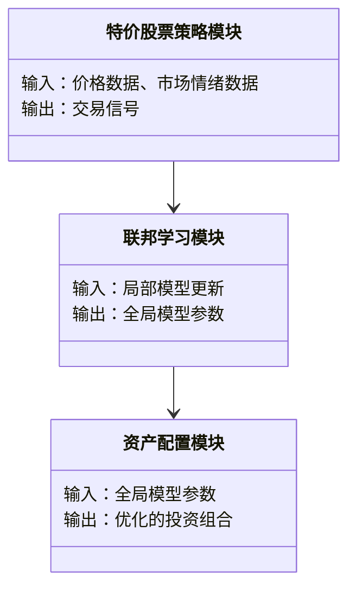

                 


# 如何将特价股票策略与联邦学习资产配置相结合

> **关键词**：特价股票策略，联邦学习，资产配置，机器学习，股票投资

> **摘要**：  
> 在股票投资领域，特价股票策略是一种基于价格波动、市场情绪和技术指标的交易策略。随着人工智能技术的快速发展，联邦学习作为一种新兴的分布式机器学习技术，为资产配置提供了新的可能性。本文将详细探讨如何将特价股票策略与联邦学习相结合，利用联邦学习的隐私保护和分布式计算优势，提升资产配置的效率和准确性。文章从背景、核心概念、算法原理、系统架构、项目实战到最佳实践，全面解析这一结合的实现方法和实际应用。

---

## 第一部分：特价股票策略与联邦学习概述

### 第1章：特价股票策略与联邦学习的背景与概念

#### 1.1 特价股票策略的背景与特点
- **1.1.1 什么是特价股票策略**  
  特价股票策略是一种基于市场价差和交易机会的股票交易策略，通常关注低买高卖的价格波动。其核心在于捕捉市场中的短期价格波动，通过高频交易或套利策略实现收益。

- **1.1.2 特价股票策略的核心目标**  
  特价股票策略的目标是通过预测股票价格的变化，优化买入和卖出时机，从而在短期内实现超额收益。

- **1.1.3 特价股票策略的市场现状与挑战**  
  特价股票策略在金融市场上广泛应用，但其挑战在于市场的不确定性和高频交易的复杂性，需要依赖先进的技术手段来提高预测精度和交易效率。

#### 1.2 联邦学习的背景与核心概念
- **1.2.1 联邦学习的定义与特点**  
  联邦学习（Federated Learning）是一种分布式机器学习技术，允许多个参与方在不共享原始数据的情况下，协作训练模型。其特点包括数据隐私保护、分布式计算和模型共享。

- **1.2.2 联邦学习的核心优势**  
  联邦学习的优势在于保护数据隐私，同时充分利用分布式数据源进行模型训练，提升模型的泛化能力和适用性。

- **1.2.3 联邦学习与传统数据共享的区别**  
  传统数据共享需要集中数据，而联邦学习通过加密通信和模型更新，在不共享数据的情况下完成模型训练。

#### 1.3 特价股票策略与联邦学习的结合
- **1.3.1 特价股票策略与联邦学习的结合背景**  
  特价股票策略依赖于高频交易和精准预测，而联邦学习可以通过分布式数据源和隐私保护机制，为策略提供更高效和安全的模型训练环境。

- **1.3.2 为什么联邦学习适合特价股票策略**  
  联邦学习能够利用多个金融机构或投资者的分布式数据，避免数据泄露风险，同时提升模型的泛化能力，适用于复杂的金融市场环境。

- **1.3.3 两者的结合对资产配置的意义**  
  特价股票策略与联邦学习的结合，可以实现更精准的市场预测和资产配置，提升投资收益并降低风险。

---

## 第二部分：特价股票策略的核心算法与数学模型

### 第2章：特价股票策略的核心算法

#### 2.1 特价股票策略的基本算法
- **2.1.1 基于价格波动的算法**  
  通过分析历史价格波动，预测未来的价格走势。常用的技术指标包括移动平均线（MA）、相对强弱指数（RSI）和波动率等。

- **2.1.2 基于市场情绪的算法**  
  利用市场情绪指标（如VIX指数）和新闻情感分析，预测市场走势和价格变化。

- **2.1.3 基于技术指标的算法**  
  结合多种技术指标，如MACD、KDJ等，构建多维度的交易信号。

#### 2.2 算法的优化与改进
- **2.2.1 算法优化的目标**  
  提高预测精度，降低交易成本，增强策略的鲁棒性。

- **2.2.2 算法改进的常见方法**  
  包括参数优化、模型集成和异常处理等。

- **2.2.3 算法优化的数学模型**  
  例如，利用遗传算法优化交易策略的参数，构建最优的交易模型。

#### 2.3 算法的数学模型与公式
- **2.3.1 特价股票策略的数学模型**  
  例如，基于价格差分的预测模型：  
  $$ p_{t+1} = p_t + \alpha \cdot (p_t - p_{t-1}) + \beta \cdot (p_t - p_{t-2}) $$  
  其中，$\alpha$ 和 $\beta$ 是模型的权重参数。

- **2.3.2 算法改进的数学公式**  
  例如，利用回归分析优化模型参数：  
  $$ \theta = \arg \min \sum_{i=1}^{n} (y_i - f(x_i, \theta))^2 $$  

---

### 第3章：联邦学习的核心算法与数学模型

#### 3.1 联邦学习的基本算法
- **3.1.1 联邦学习的通信机制**  
  参与方通过加密通信交换模型更新信息，避免数据泄露。

- **3.1.2 联邦学习的模型更新算法**  
  通过异步更新或同步更新的方式，全局模型参数的更新过程。

- **3.1.3 联邦学习的隐私保护算法**  
  利用同态加密和差分隐私等技术，保护数据隐私。

#### 3.2 联邦学习的数学模型与公式
- **3.2.1 联邦学习的优化目标**  
  全局模型的优化目标可以表示为：  
  $$ \theta = \arg \min \sum_{i=1}^{n} f_i(\theta) $$  
  其中，$f_i$ 是第$i$个参与方的局部目标函数。

- **3.2.2 联邦学习的模型更新公式**  
  全局模型的更新公式为：  
  $$ \theta_{t+1} = \theta_t + \eta \cdot \sum_{i=1}^{n} \nabla f_i(\theta_t) $$  
  其中，$\eta$ 是学习率，$\nabla f_i$ 是局部梯度。

- **3.2.3 联邦学习的隐私保护公式**  
  利用差分隐私保护梯度更新：  
  $$ \tilde{\nabla} f_i(\theta_t) = \nabla f_i(\theta_t) + \epsilon \cdot \text{Laplace}(0, \Delta) $$  

---

## 第三部分：联邦学习在资产配置中的应用

### 第4章：联邦学习在资产配置中的核心应用

#### 4.1 联邦学习在资产配置中的应用场景
- **4.1.1 基于联邦学习的资产分配模型**  
  利用联邦学习构建分布式资产分配模型，优化投资组合的收益与风险比。

- **4.1.2 联邦学习在风险控制中的应用**  
  通过联邦学习实时监控市场风险，动态调整投资策略。

- **4.1.3 联邦学习在市场预测中的应用**  
  利用联邦学习预测不同市场的价格走势，优化资产配置。

#### 4.2 联邦学习在资产配置中的优势
- **4.2.1 联邦学习的隐私保护优势**  
  通过联邦学习，多个金融机构可以在不共享数据的情况下协同训练模型，保护数据隐私。

- **4.2.2 联邦学习的高效性优势**  
  联邦学习通过分布式计算，提高了模型训练的效率，适用于高频交易场景。

- **4.2.3 联邦学习的可扩展性优势**  
  联邦学习可以扩展到更多的参与方和数据源，适用于大规模资产配置场景。

#### 4.3 联邦学习在资产配置中的挑战与解决方案
- **4.3.1 数据异质性问题**  
  不同参与方的数据分布可能不同，影响模型的收敛性和准确性。解决方案包括数据预处理和模型适应性调整。

- **4.3.2 模型收敛速度问题**  
  联邦学习的模型收敛速度可能较慢，解决方案包括优化算法和增加通信频率。

---

## 第四部分：系统分析与架构设计

### 第5章：系统功能设计与架构

#### 5.1 问题场景介绍
- 资产配置系统需要支持多个金融机构的分布式数据源，同时保护数据隐私，实时预测市场走势，优化投资组合。

#### 5.2 系统功能设计
- **5.2.1 领域模型设计**  
  使用mermaid类图描述系统的功能模块和交互关系。



- **5.2.2 系统架构设计**  
  使用mermaid架构图描述系统的整体架构。


---

## 第五部分：项目实战

### 第6章：项目实现与案例分析

#### 6.1 环境安装与配置
- 安装必要的依赖，如TensorFlow Federated、Keras、PyTorch等。

#### 6.2 核心代码实现
- **6.2.1 特价股票策略模块**  
  示例代码：

```python
import numpy as np
import pandas as pd

def stock_price_prediction(data, window_size=10):
    # 数据预处理
    data = data.iloc[-window_size:]
    # 构建特征矩阵
    features = data['price'].values.reshape(-1, 1)
    # 预测价格
    prediction = np.mean(features) + np.std(features)
    return prediction
```

- **6.2.2 联邦学习模块**  
  示例代码：

```python
def federated_learning(participants=5, epochs=10):
    import tensorflow as tf
    from tensorflow_federated import simulate
    # 初始化模型
    model = tf.keras.models.Sequential([
        tf.keras.layers.Dense(64, activation='relu'),
        tf.keras.layers.Dense(1)
    ])
    # 联邦学习模拟
    simulation = simulate.Simulation(
        participants=participants,
        model=model,
        epochs=epochs
    )
    simulation.run()
    return simulation.global_model
```

#### 6.3 案例分析与详细解读
- 通过实际案例分析，展示联邦学习在资产配置中的应用效果，并详细解读代码实现和模型优化过程。

---

## 第六部分：最佳实践与小结

### 第7章：最佳实践与注意事项

#### 7.1 小结
- 特价股票策略与联邦学习的结合，为资产配置提供了新的思路和技术手段。

#### 7.2 注意事项
- 数据隐私保护的重要性，模型优化的挑战，以及系统的可扩展性问题。

#### 7.3 拓展阅读
- 推荐相关的书籍和论文，供读者深入学习和研究。

---

## 作者简介

作者：AI天才研究院/AI Genius Institute & 禅与计算机程序设计艺术 /Zen And The Art of Computer Programming

---

这篇文章详细探讨了如何将特价股票策略与联邦学习资产配置相结合，涵盖了背景、核心概念、算法原理、系统架构、项目实战和最佳实践等多个方面。通过逐步分析和详细解读，为读者提供了一种高效、安全且精准的资产配置方法。

