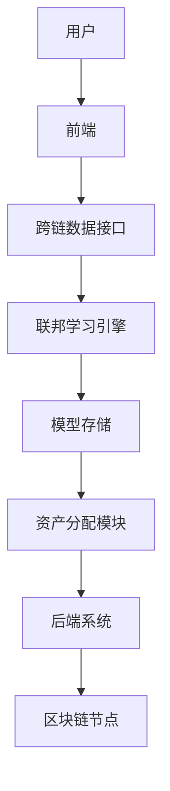

                 


```markdown
# 如何将特价股票策略与联邦学习跨链资产配置相结合

> 关键词：特价股票策略、联邦学习、跨链资产配置、分布式计算、金融建模

> 摘要：本文探讨如何将特价股票策略与联邦学习跨链资产配置相结合，通过分析联邦学习在跨链环境中的应用，结合特价股票策略的特点，提出一种新的资产配置方法。文章详细阐述了联邦学习的基本原理、跨链资产配置的核心概念，以及如何将这些技术应用于实际的股票投资策略中。

---

## 第1章: 特价股票策略概述

### 1.1 特价股票策略的基本概念
#### 1.1.1 什么是特价股票
特价股票是指在特定时间点以低于市场价购买的股票，通常基于市场波动、公司公告或短期事件等信息。特价股票策略旨在通过识别这些短期机会，利用价格差进行套利或短期投资。

#### 1.1.2 特价股票的分类与特点
- **市场波动型**：依赖市场短期波动，如突发事件、市场传闻等。
- **技术分析型**：基于K线图、均线等技术指标，识别超卖或超买信号。
- **套利型**：利用不同市场或平台的价格差异进行套利。

#### 1.1.3 特价股票策略的应用场景
- **短期交易**：适合短线投资者，追求快速收益。
- **市场波动较大时**：如市场下跌或剧烈波动时，寻找被低估的股票。
- **特定事件驱动**：如公司并购、资产重组等事件发生时。

### 1.2 特价股票策略的核心要素
#### 1.2.1 市场分析与预测
- **市场分析**：包括宏观经济指标、行业趋势、公司基本面分析等。
- **预测模型**：使用时间序列分析、机器学习等方法预测股票价格。

#### 1.2.2 技术指标与策略模型
- **技术指标**：如RSI（相对强弱指数）、MACD（移动平均收敛散度）、布林带等。
- **策略模型**：如均线策略、动量策略等。

#### 1.2.3 风险控制与收益优化
- **风险管理**：设置止损点、分散投资、控制仓位等。
- **收益优化**：通过组合投资、杠杆交易等方法提高收益。

### 1.3 特价股票策略的实现方法
#### 1.3.1 数据收集与处理
- **数据源**：包括股票价格数据、市场新闻、财务报表等。
- **数据清洗**：处理缺失值、异常值，确保数据质量。

#### 1.3.2 策略开发与回测
- **策略开发**：根据市场分析和预测模型开发具体策略。
- **回测**：使用历史数据验证策略的有效性，计算收益、风险指标等。

#### 1.3.3 策略优化与部署
- **优化方法**：如参数优化、策略组合优化等。
- **策略部署**：将优化后的策略部署到交易系统中，实时监控和调整。

---

## 第2章: 联邦学习与跨链技术概述

### 2.1 联邦学习的基本原理
#### 2.1.1 联邦学习的定义
联邦学习是一种分布式机器学习技术，允许多个参与方在不共享原始数据的情况下共同训练模型。数据保留在各自的本地服务器中，仅交换加密的梯度或模型参数。

#### 2.1.2 联邦学习的核心概念
- **参与方**：多个数据拥有者，如金融机构、交易所等。
- **模型更新**：通过交换模型参数更新全局模型，同时保护数据隐私。

#### 2.1.3 联邦学习的优缺点
- **优点**：保护数据隐私，减少数据传输成本。
- **缺点**：通信开销大，模型收敛速度慢。

### 2.2 跨链技术的核心概念
#### 2.2.1 跨链技术的定义
跨链技术允许不同区块链之间进行资产转移和信息交互，通过区块链桥接技术实现跨链操作。

#### 2.2.2 跨链技术的实现方式
- **侧链/中继链**：通过中继链连接不同的区块链。
- **哈希时间锁**：通过时间锁和哈希值确保跨链交易的原子性。

#### 2.2.3 跨链技术的应用场景
- **资产转移**：在不同区块链之间转移资产。
- **数据共享**：在不同区块链之间共享数据。

### 2.3 联邦学习在跨链环境中的应用
#### 2.3.1 跨链环境中的数据隐私保护
通过联邦学习技术，多个区块链可以在不共享原始数据的情况下共同训练模型，保护数据隐私。

#### 2.3.2 联邦学习在跨链资产配置中的优势
- **数据分散**：多个区块链上的数据可以被整合到一个模型中。
- **去中心化**：避免单点故障，提高系统的鲁棒性。

---

## 第3章: 特价股票策略与联邦学习跨链资产配置的结合

### 3.1 跨链资产配置的基本原理
#### 3.1.1 跨链资产配置的定义
跨链资产配置是指在多个区块链上分配资产，以优化整体收益和风险。

#### 3.1.2 跨链资产配置的核心要素
- **资产分配**：根据各区块链的特性和风险，分配合适的资产比例。
- **风险控制**：通过分散投资降低风险。

### 3.2 联邦学习在跨链资产配置中的应用
#### 3.2.1 联邦学习用于跨链数据建模
通过联邦学习技术，可以在不共享原始数据的情况下，构建跨链资产配置模型。

#### 3.2.2 联邦学习模型的设计与实现
- **模型选择**：选择适合跨链数据的模型，如线性回归、随机森林等。
- **模型训练**：通过联邦学习算法，分布式训练模型。

### 3.3 特价股票策略在跨链资产配置中的应用
#### 3.3.1 特价股票策略的跨链实现
在多个区块链上实施特价股票策略，利用跨链技术进行资产分配和风险控制。

#### 3.3.2 联邦学习优化特价股票策略
通过联邦学习技术，优化特价股票策略的预测模型和风险控制。

---

## 第4章: 联邦学习跨链资产配置的系统架构设计

### 4.1 系统架构概述
#### 4.1.1 系统功能设计
- **数据采集**：收集各区块链上的股票价格、交易数据等。
- **模型训练**：使用联邦学习算法训练跨链资产配置模型。
- **资产分配**：根据模型结果分配资产。

#### 4.1.2 系统架构设计


### 4.2 系统接口设计
#### 4.2.1 跨链数据接口
- **数据查询接口**：获取各区块链上的股票数据。
- **跨链交易接口**：执行跨链资产转移。

#### 4.2.2 联邦学习接口
- **模型训练接口**：启动联邦学习模型的训练过程。
- **模型更新接口**：同步各参与方的模型参数。

### 4.3 系统交互流程
#### 4.3.1 资产分配流程
1. 用户提交资产分配请求。
2. 系统通过联邦学习引擎训练模型。
3. 根据模型结果分配资产到不同区块链。

#### 4.3.2 跨链交易流程
1. 用户发起跨链交易请求。
2. 系统通过跨链数据接口查询相关数据。
3. 执行跨链交易，完成资产转移。

---

## 第5章: 联邦学习跨链资产配置的实现与案例分析

### 5.1 系统实现
#### 5.1.1 环境配置
- **区块链环境**：搭建多个区块链节点，如Ethereum、Polkadot等。
- **联邦学习框架**：选择或开发联邦学习框架，如FederatedAI。

#### 5.1.2 核心代码实现
```python
def fed_avg(global_model, local_models):
    # 计算全局模型的平均值
    avg_model = {}
    for key in global_model.keys():
        avg = np.mean([model[key] for model in local_models], axis=0)
        avg_model[key] = avg
    return avg_model
```

### 5.2 案例分析
#### 5.2.1 跨链资产分配案例
- **案例背景**：用户希望将资产分配到多个区块链上，以分散风险。
- **案例实施**：通过联邦学习训练模型，优化资产分配比例。

#### 5.2.2 特价股票策略优化案例
- **案例背景**：利用跨链数据和联邦学习优化特价股票预测模型。
- **案例实施**：通过跨链数据训练模型，提升预测准确率。

### 5.3 案例小结
通过联邦学习跨链资产配置技术，用户可以在保护数据隐私的前提下，优化资产分配和特价股票策略，实现更高的投资收益。

---

## 第6章: 联邦学习跨链资产配置的最佳实践与总结

### 6.1 最佳实践
#### 6.1.1 数据隐私保护
确保数据在联邦学习过程中的隐私保护，避免数据泄露。

#### 6.1.2 系统性能优化
优化系统架构，减少通信开销，提高模型训练效率。

#### 6.1.3 风险控制
通过多样化投资、设置止损点等方法，降低投资风险。

### 6.2 总结
通过将特价股票策略与联邦学习跨链资产配置相结合，投资者可以在保护数据隐私的前提下，优化资产配置和股票交易策略，实现更高效的投资收益。

---

## 第7章: 未来展望与挑战

### 7.1 未来展望
- **技术发展**：随着区块链和人工智能技术的不断发展，联邦学习跨链资产配置将更加智能化和高效化。
- **应用场景扩展**：联邦学习技术可以应用于更多金融领域，如风险管理、信用评估等。

### 7.2 挑战
- **技术挑战**：如何进一步优化联邦学习算法，提高模型训练效率。
- **监管挑战**：如何在保护数据隐私的前提下，满足金融监管要求。

---

## 作者简介

作者：AI天才研究院/AI Genius Institute & 禅与计算机程序设计艺术 /Zen And The Art of Computer Programming

```

