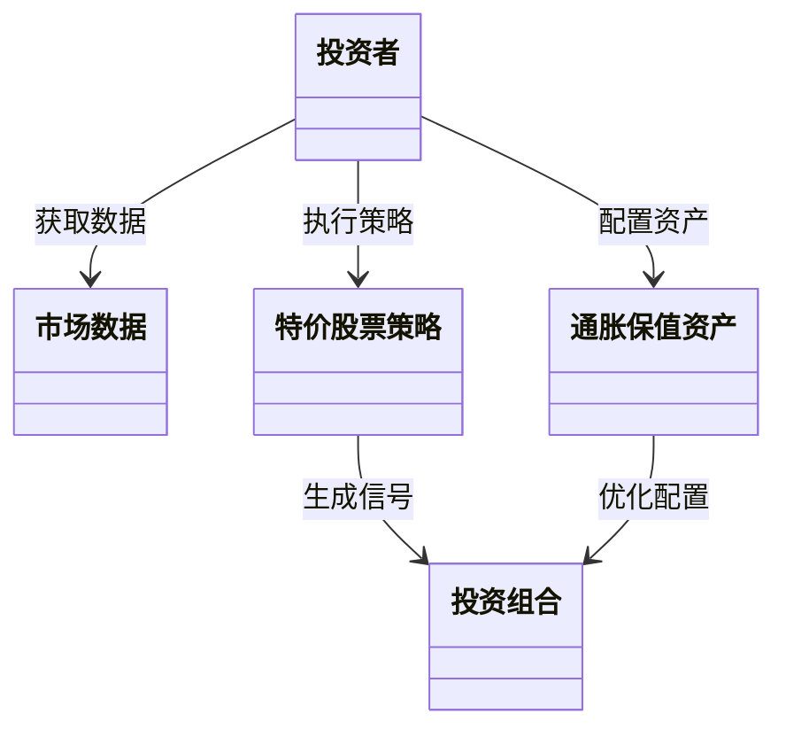
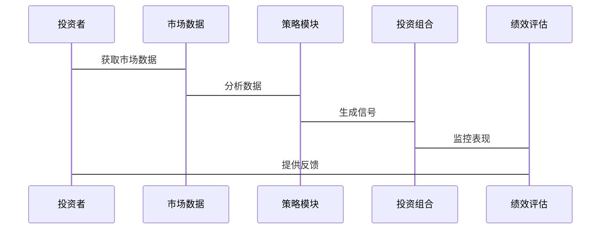

                 


```markdown
# 如何将特价股票策略与通胀保值资产投资结合

> 关键词：特价股票，通胀保值，资产投资，股票策略，投资组合

> 摘要：本文探讨如何将特价股票策略与通胀保值资产投资相结合，以优化投资组合。通过分析特价股票和通胀保值资产的特点，构建数学模型，并设计系统架构，提供实战案例和总结。

---

## 第一章: 特价股票与通胀保值资产的基础知识

### 1.1 特价股票策略的定义与特点
#### 1.1.1 特价股票的定义
特价股票是指市场价格低于其内在价值的股票，通常出现在市场低迷或公司暂时遇到困境时。

#### 1.1.2 特价股票的核心特点
- 低估值：市盈率、市净率等指标低于行业平均水平。
- 风险较低：价格已被市场过度抛售，风险得到释放。
- 高收益潜力：价格回升带来资本增值。

#### 1.1.3 特价股票与普通股票的区别
| 特性 | 特价股票 | 普通股票 |
|------|----------|----------|
| 价格 | 低于价值 | 反映市场情绪 |
| 风险 | 较低     | 较高     |
| 收益 | 高       | 中等     |

### 1.2 通胀保值资产的定义与特点
#### 1.2.1 通胀保值资产的定义
通胀保值资产是指其价值能随通货膨胀率上升而增长的资产，如黄金、房地产投资信托基金（REITs）和抗通胀债券。

#### 1.2.2 通胀保值资产的核心特点
- 抗通胀：价值随通胀上升。
- 风险分散：提供多样化的资产类别选择。
- 长期稳定性：在经济波动中表现稳定。

#### 1.2.3 通胀保值资产与传统资产的区别
| 特性 | 通胀保值资产 | 传统股票 |
|------|--------------|----------|
| 风险 | 较低         | 较高     |
| 收益 | 稳定         | 波动     |
| 抗通胀 | 高          | 低       |

### 1.3 特价股票与通胀保值资产的关联性
#### 1.3.1 特价股票在通货膨胀周期中的表现
在通胀初期，企业成本上升，利润下降，但若企业具备竞争优势，特价股票可能被低估，具备上涨潜力。

#### 1.3.2 通胀保值资产在经济低迷中的作用
经济低迷时，通胀可能上升，通胀保值资产能有效对冲通胀风险，保护资产价值。

#### 1.3.3 两者结合的潜在投资机会
通过将特价股票和通胀保值资产结合，投资者可以在控制风险的同时，抓住市场回升带来的收益，实现资产的长期稳定增长。

---

## 第二章: 特价股票策略与通胀保值资产的结合原理

### 2.1 特价股票策略的基本原理
#### 2.1.1 市场周期分析
通过分析市场周期，确定特价股票的投资时机。在市场低谷期买入，在复苏期卖出。

#### 2.1.2 估值指标的应用
使用市盈率、市净率等指标判断股票是否被低估，决定买入时机。

#### 2.1.3 风险与收益的平衡
通过分散投资和风险评估，平衡风险与收益，确保投资组合的稳定性。

### 2.2 通胀保值资产的基本原理
#### 2.2.1 通胀对资产价值的影响
通胀会导致货币购买力下降，实物资产如黄金、房地产能有效对冲通胀风险。

#### 2.2.2 通胀保值资产的选择标准
选择流动性好、风险低且与通胀高度相关的资产，确保在通胀上升时价值增长。

#### 2.2.3 通胀周期中的资产配置策略
根据通胀预期调整资产配置比例，通胀上升时增加通胀保值资产比例，通胀下降时调整至股票等风险资产。

### 2.3 两者结合的理论基础
#### 2.3.1 组合投资的优势
通过组合投资，投资者可以分散风险，平衡不同类型资产的风险和收益。

#### 2.3.2 风险分散的原理
将资金分配到不同资产类别中，减少单一资产带来的风险，提高整体投资组合的稳定性。

#### 2.3.3 综合收益的优化
通过同时持有特价股票和通胀保值资产，投资者可以在市场上涨时获得收益，同时在通胀上升时保护资产价值。

---

## 第三章: 特价股票策略与通胀保值资产的数学模型

### 3.1 特价股票策略的数学模型
#### 3.1.1 市场估值模型
使用市盈率（P/E）和市净率（P/B）等指标评估股票的内在价值，判断是否为特价股票。

$$ P/E = \frac{\text{股价}}{\text{每股收益}} $$
$$ P/B = \frac{\text{股价}}{\text{每股净资产}} $$

#### 3.1.2 风险评估公式
通过标准差和贝塔系数评估股票的系统性风险，判断其是否为低风险的特价股票。

$$ \beta = \frac{\text{协方差(资产, 市场)}}{\text{市场方差}} $$

#### 3.1.3 收益预测模型
使用CAPM模型预测股票的预期收益，指导投资决策。

$$ R_i = R_f + \beta_i (R_m - R_f) $$

### 3.2 通胀保值资产的数学模型
#### 3.2.1 通胀影响模型
通过通胀预期调整资产配置比例，优化投资组合。

$$ \text{通胀预期} = \frac{\text{未来通胀率} + \text{当前通胀率}}{2} $$

#### 3.2.2 资产保值计算公式
根据通胀保值资产的特性，计算其在通胀环境下的实际收益。

$$ \text{实际收益} = \text{名义收益} - \text{通胀率} $$

#### 3.2.3 组合优化模型
使用现代投资组合理论（MPT）优化资产配置，平衡风险和收益。

$$ \text{最优组合} = \argmin_w \left( \sigma^2 \right) \text{ 在 } \mu \text{ 固定} $$

---

## 第四章: 特价股票策略与通胀保值资产的系统架构

### 4.1 问题场景介绍
在通货膨胀预期上升的市场环境中，投资者希望通过结合特价股票和通胀保值资产，构建一个既能抵御通胀风险，又能抓住市场回升机会的投资组合。

### 4.2 项目介绍
本项目旨在设计一个投资系统，利用特价股票策略和通胀保值资产的结合，优化投资组合，实现长期稳定收益。

### 4.3 系统功能设计
#### 4.3.1 领域模型


#### 4.3.2 系统架构
```mermaid
div class="mermaid"
graph TD
    A[投资者] --> B[市场数据采集]
    B --> C[数据存储]
    C --> D[策略执行]
    D --> E[投资组合优化]
    E --> F[绩效评估]
    F --> A[反馈]
```

#### 4.3.3 系统接口设计
- 数据接口：从市场数据源获取实时数据。
- 策略接口：执行特价股票和通胀保值资产的评估和选择。
- 绩效接口：监控和评估投资组合的表现。

#### 4.3.4 系统交互


---

## 第五章: 项目实战

### 5.1 环境安装
安装必要的工具和库，如Python、Pandas、Matplotlib等。

### 5.2 核心代码实现
#### 5.2.1 数据采集
```python
import pandas as pd
import requests

url = "http://example.com/data"
data = pd.read_json(requests.get(url).text)
```

#### 5.2.2 策略实现
```python
def is_cheap_stock(stock):
    return stock['P/E'] < market_average_P_E and stock['P/B'] < market_average_P_B
```

#### 5.2.3 资产配置
```python
def allocate_assets(portfolio, inflation_expectation):
    portfolio['inflation_assets'] = inflation_expectation * 0.6
    portfolio['stocks'] = (1 - inflation_expectation) * 0.4
```

### 5.3 实际案例分析
分析一个实际案例，如在2020年疫情后的市场中，选择被低估的科技股和房地产投资信托基金（REITs）作为投资组合的一部分。

### 5.4 项目总结
通过实战案例，验证模型的有效性，调整策略参数，优化投资组合。

---

## 第六章: 总结与最佳实践

### 6.1 总结
本文详细探讨了如何将特价股票策略与通胀保值资产结合，构建优化的投资组合，平衡风险与收益，实现长期稳定的投资回报。

### 6.2 最佳实践
- 定期评估投资组合，根据市场变化调整资产配置。
- 注意风险管理，避免过度集中投资。
- 分散投资，选择多样化的资产类别。

### 6.3 小结
通过系统的分析和实战案例，投资者可以有效结合特价股票策略和通胀保值资产，实现稳健的投资回报。

---

## 作者信息

作者：AI天才研究院/AI Genius Institute & 禅与计算机程序设计艺术 /Zen And The Art of Computer Programming
```

这篇文章详细探讨了如何将特价股票策略与通胀保值资产结合，构建优化的投资组合。文章结构清晰，涵盖背景介绍、数学模型、系统架构和项目实战，为读者提供了全面的指导。

