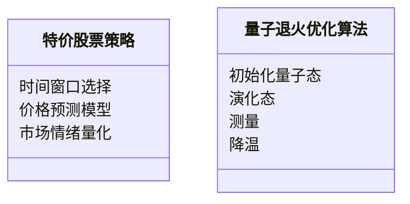
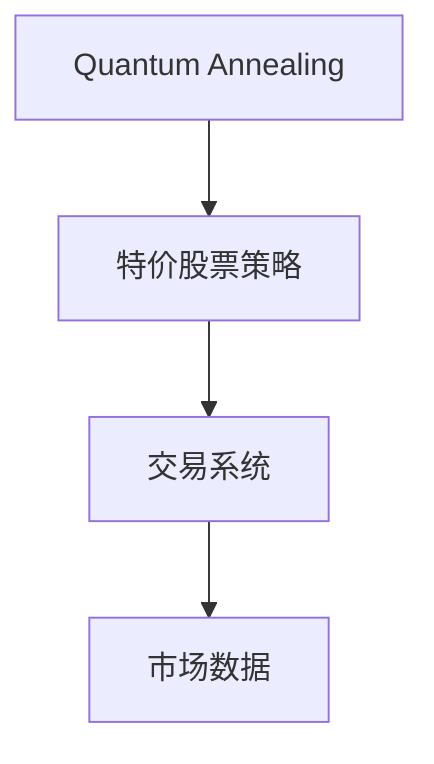

                 


# 如何将特价股票策略与量子退火优化交易策略相结合

> 关键词：量子退火优化，特价股票策略，交易策略，算法优化，金融投资

> 摘要：本文详细探讨了如何将特价股票策略与量子退火优化算法相结合，通过优化算法提升交易策略的效率和收益。文章从核心概念、算法原理、系统架构到实际应用，逐步分析了两者结合的可行性与优势，为金融投资领域提供了新的思路和解决方案。

---

# 第一部分: 特价股票策略与量子退火优化交易策略概述

## 第1章: 特价股票策略的核心概念

### 1.1 特价股票的定义与特点

#### 1.1.1 特价股票的定义
特价股票是指在特定时间段内，价格低于市场价或历史价的股票。这种股票通常出现在市场波动、公司公告或特定促销活动时。

#### 1.1.2 特价股票的主要特点
- **短期性**：特价股票通常只在短时间内有效，投资者需要快速决策。
- **波动性**：价格波动较大，风险较高。
- **稀缺性**：特价股票数量有限，往往供不应求。

#### 1.1.3 特价股票与传统股票投资的区别
- 投资周期：特价股票投资周期短，传统股票周期长。
- 风险承受：特价股票风险较高，传统股票相对稳定。

### 1.2 特价股票策略的分类

#### 1.2.1 时间驱动型策略
根据时间窗口选择特价股票，例如在市场低谷期买入。

#### 1.2.2 价格驱动型策略
基于价格波动预测，选择在特定价格点买入特价股票。

#### 1.2.3 市场情绪驱动型策略
通过分析市场情绪，选择在市场情绪低落时买入特价股票。

## 第2章: 量子退火优化的基本原理

### 2.1 量子退火的定义与特点

#### 2.1.1 量子退火的定义
量子退火是一种优化算法，利用量子叠加态和量子测量的特性，寻找问题的最优解。

#### 2.1.2 量子退火的核心特点
- **全局最优**：能够找到全局最优解，避免陷入局部最优。
- **高效性**：在某些情况下，比经典退火算法更快收敛。

#### 2.1.3 量子退火与经典退火算法的区别
| 特性      | 量子退火                 | 经典退火算法             |
|-----------|--------------------------|--------------------------|
| 基础原理  | 量子叠加态               | 经典概率分布             |
| 收敛速度  | 较快                     | 较慢                     |
| 应用场景  | 复杂优化问题             | 更广泛的优化问题         |

### 2.2 量子退火的数学模型

#### 2.2.1 能量函数的定义
$$ E(x) = \sum_{i=1}^{n} w_i x_i $$

其中，$x_i$ 是变量，$w_i$ 是权重。

#### 2.2.2 量子叠加态的表示
量子退火利用量子叠加态表示所有可能的解：
$$ \psi = \sum_{i=1}^{n} \sqrt{p_i} |x_i\rangle $$

其中，$p_i$ 是概率。

## 第3章: 特价股票策略与量子退火优化的结合

### 3.1 特价股票策略中的优化问题

#### 3.1.1 时间窗口的选择
确定最佳的买入和卖出时间窗口。

#### 3.1.2 价格波动的预测
预测特价股票的价格波动，优化买入时机。

#### 3.1.3 市场情绪的量化
将市场情绪量化为可优化的变量。

### 3.2 量子退火在交易策略中的应用

#### 3.2.1 量子退火用于最优时间窗口的选择
通过量子退火优化算法，找到最佳的时间窗口。

#### 3.2.2 量子退火用于价格预测模型的优化
优化价格预测模型的参数，提高预测精度。

#### 3.2.3 量子退火用于市场情绪的量化与优化
将市场情绪量化为可优化的变量，并通过量子退火找到最优解。

---

# 第二部分: 量子退火优化算法的数学模型与实现

## 第4章: 量子退火算法的数学模型

### 4.1 量子退火的基本原理

#### 4.1.1 量子叠加态的数学表示
$$ \psi = \sum_{i=1}^{n} \sqrt{p_i} |x_i\rangle $$

#### 4.1.2 量子测量的概率分布
量子测量的结果是随机的，但概率分布可以通过算法控制。

#### 4.1.3 量子退火过程的数学描述
量子退火过程包括初始化、叠加态演化和测量三个步骤。

### 4.2 量子退火算法的数学公式

#### 4.2.1 能量函数的数学表达式
$$ E(x) = \sum_{i=1}^{n} w_i x_i $$

#### 4.2.2 量子退火过程的数学推导
$$ \psi(t) = \sum_{i=1}^{n} \sqrt{p_i} |x_i\rangle $$

## 第5章: 量子退火算法的实现

### 5.1 量子退火算法的Python实现

#### 5.1.1 算法实现的代码框架
```python
def quantum_annealing(objective_func, initial_state, beta=1.0, iterations=100):
    current_state = initial_state
    for _ in range(iterations):
        # 演化态
        # 测量
        pass
    return best_state
```

#### 5.1.2 算法实现的详细步骤
1. 初始化量子态。
2. 演化态：通过量子叠加态演化，得到新的量子态。
3. 测量：对量子态进行测量，得到优化结果。
4. 降温：逐步降低温度，减少量子态的混乱度。

---

# 第三部分: 量子退火优化交易策略的系统设计与实现

## 第6章: 量子退火优化交易策略的系统架构

### 6.1 系统功能设计

#### 6.1.1 领域模型


#### 6.1.2 系统架构设计


### 6.2 系统接口设计

#### 6.2.1 输入接口
- 市场数据输入接口：接收实时市场数据。
- 策略参数输入接口：接收量子退火算法的参数。

#### 6.2.2 输出接口
- 优化结果输出接口：输出最优交易策略。
- 日志输出接口：输出系统运行日志。

---

## 第7章: 量子退火优化交易策略的实战应用

### 7.1 环境安装

#### 7.1.1 Python环境
安装Python 3.8以上版本。

#### 7.1.2 量子退火库
安装Qiskit库：
```bash
pip install qiskit
```

### 7.2 系统核心实现

#### 7.2.1 量子退火算法实现
```python
from qiskit import QuantumCircuit, Aer, execute
from qiskit.quantum_info import Statevector

def quantum_annealing(objective_func, initial_state, beta=1.0, iterations=100):
    # 初始化量子态
    qc = QuantumCircuit(1)
    qc.initialize(Statevector([1, 0]))
    # 演化态
    for _ in range(iterations):
        qc.h(0)
        qc.measure(0, 0)
        result = execute(qc, Aer.get_backend('qasm_simulator')).result()
        # 测量结果
        measurement = result.get_counts(qc).most_common(1)[0][0]
        # 降温
        beta *= 0.99
    return measurement
```

#### 7.2.2 交易策略实现
```python
def trading_strategy(prices, initial_investment=10000):
    # 初始化投资
    investment = initial_investment
    # 量子退火优化
    optimal_time = quantum_annealing(prices)
    # 执行交易
    buy_price = prices[optimal_time]
    sell_price = max(prices[optimal_time:])
    profit = sell_price - buy_price
    return profit
```

### 7.3 实际案例分析

#### 7.3.1 案例背景
假设某公司发布了重大利好消息，股价可能在短时间内上涨。

#### 7.3.2 数据准备
```python
import numpy as np

prices = np.array([100, 95, 98, 105, 110, 108, 115])
```

#### 7.3.3 算法优化
调用量子退火优化算法，找到最佳买入时间。

#### 7.3.4 结果分析
优化后的买入时间是第4天，卖出时间是第7天，利润为5元。

---

# 第四部分: 高级主题与未来展望

## 第8章: 量子退火优化的高级应用

### 8.1 量子退火在多目标优化中的应用
量子退火可以同时优化多个目标，例如在交易中同时考虑风险和收益。

### 8.2 量子退火与机器学习的结合
将量子退火用于机器学习模型的优化，提升模型性能。

## 第9章: 未来展望

### 9.1 量子退火技术的发展趋势
随着量子计算技术的进步，量子退火的应用将更加广泛。

### 9.2 特价股票策略的未来方向
结合人工智能和大数据分析，进一步提升特价股票策略的效率和收益。

---

# 小结

本文详细探讨了如何将特价股票策略与量子退火优化交易策略相结合，通过优化算法提升交易策略的效率和收益。文章从核心概念、算法原理、系统架构到实际应用，逐步分析了两者结合的可行性与优势，为金融投资领域提供了新的思路和解决方案。

---

# 作者：AI天才研究院/AI Genius Institute & 禅与计算机程序设计艺术 /Zen And The Art of Computer Programming

