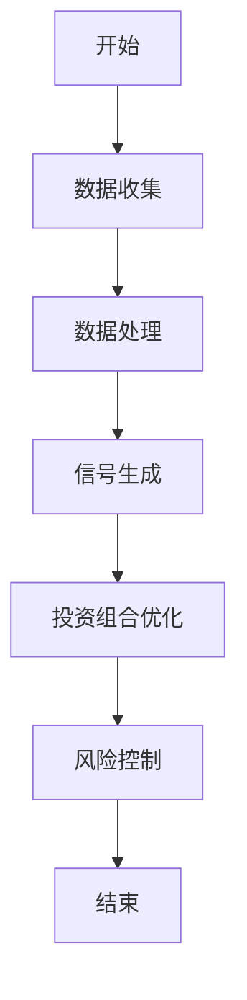
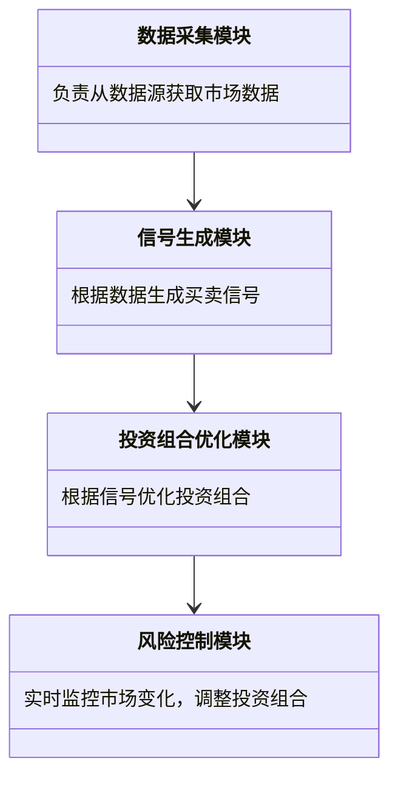
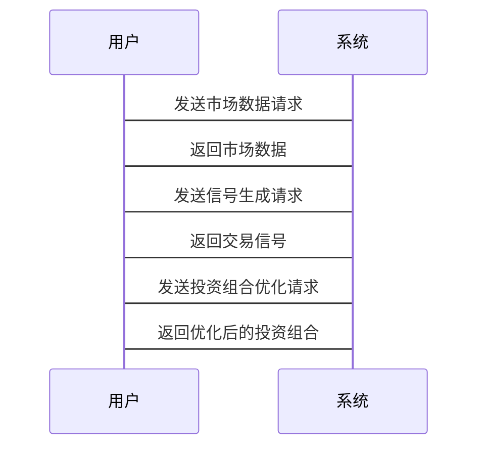

                 


# 如何将特价股票策略应用于ETF投资

> 关键词：特价股票策略，ETF投资，算法交易，投资组合优化，市场时机

> 摘要：本文详细探讨了如何将特价股票策略应用于ETF投资。通过分析特价股票策略的核心原理和ETF投资的特点，结合算法交易和投资组合优化，提出了将特价股票策略应用于ETF投资的具体方法。文章从背景介绍、核心概念、算法原理、系统分析、项目实战到最佳实践，全面阐述了如何在实际投资中应用这一策略。

---

## 第一部分：背景介绍

### 第1章：特价股票策略与ETF投资概述

#### 1.1 特价股票策略的基本概念
特价股票策略是一种基于市场波动和价格变化的投资策略，旨在以低于市场价买入股票，待价格上涨后卖出，从而获取利润。其核心在于捕捉短期价格波动，通常适用于市场波动较大或特定事件驱动的交易机会。

- **定义与特点**：
  - 特价股票策略基于价格低于内在价值或市场公允价值时买入，价格回升时卖出。
  - 适合短期交易，需高频监控市场变化。
  - 风险较高，收益波动较大。

- **历史与发展**：
  - 早期投资者如巴菲特采用价值投资策略，寻找被低估的股票。
  - 近年来，算法交易的发展使得特价股票策略更加高效和自动化。

- **应用场景**：
  - 市场下跌后的反弹机会。
  - 特定公司负面消息后的股价回升。
  - 利用市场流动性不足时的价差套利。

#### 1.2 ETF投资的基本概念
ETF（Exchange-Traded Fund）是一种在交易所上市交易的基金，追踪特定指数、商品或一篮子资产。投资者可以通过买卖ETF来间接投资于一篮子资产，具有分散风险、流动性好、费用低等优势。

- **定义与特点**：
  - ETF基金类型多样，涵盖股票、债券、商品等多种资产。
  - 交易灵活，可像股票一样在交易所买卖。
  - 具有分散化投资的特点，降低个股风险。

- **种类与应用场景**：
  - 指数型ETF：追踪市场指数，如标普500ETF。
  - 行业ETF：专注于特定行业，如科技ETF。
  - 商品ETF：投资于黄金、原油等大宗商品。

- **ETF与传统股票投资的区别**：
  - ETF投资风险分散，个股投资风险集中。
  - ETF交易成本低，个股交易费用较高。
  - ETF适合长期投资，个股适合短期交易。

#### 1.3 特价股票策略与ETF投资的结合
将特价股票策略应用于ETF投资，可以结合两者的优点：利用ETF的分散化特性降低风险，同时通过特价股票策略捕捉市场波动带来的收益。

- **结合的背景与动机**：
  - 传统股票投资风险高，而ETF投资风险分散但收益有限。
  - 结合两者，可以在保持风险分散的同时，捕捉市场波动带来的超额收益。

- **结合的潜在优势与挑战**：
  - 优势：分散风险，同时利用特价策略捕捉短期收益。
  - 挑战：需要开发有效的算法，同时需考虑交易成本和市场流动性。

- **当前市场中的应用现状**：
  - 部分机构投资者已经开始尝试将特价策略应用于ETF投资。
  - 相关研究和实践案例逐步增多，但尚未形成成熟体系。

---

## 第二部分：核心概念与联系

### 第2章：特价股票策略与ETF投资的核心概念

#### 2.1 特价股票策略的核心原理
特价股票策略的核心在于识别市场中的短期价格波动，抓住低价买入、高价卖出的机会。其成功依赖于对市场走势的准确判断和快速反应。

- **市场时机的选择**：
  - 通过技术分析（如K线图、均线）或基本面分析（如市盈率、市净率）判断市场趋势。
  - 寻找价格与价值偏离较大的机会，如市场下跌后的反弹。

- **价格波动分析**：
  - 研究历史价格波动，识别周期性规律。
  - 利用市场情绪分析，判断价格波动的可能性。

- **投资者心理与行为**：
  - 投资者情绪波动导致价格短期偏离价值。
  - 利用市场恐慌或乐观情绪，寻找买卖机会。

#### 2.2 ETF投资的核心原理
ETF投资通过分散化投资降低风险，同时利用市场指数的表现获得长期收益。其核心在于选择合适的ETF，并进行合理的资产配置。

- **市场指数的选择**：
  - 根据投资目标选择合适的指数，如标普500指数ETF。
  - 关注指数成分股的行业分布，以分散风险。

- **投资组合的分散化**：
  - 通过投资不同类型的ETF，降低特定资产的风险。
  - 结合不同市场的ETF，如美股、港股ETF，分散地理风险。

- **资产配置的重要性**：
  - 根据市场环境调整资产配置比例。
  - 定期 rebalance 投资组合，保持目标配置。

#### 2.3 特价股票策略与ETF投资的关联性分析
将特价股票策略应用于ETF投资，可以结合两者的优点，利用ETF的分散化特性降低风险，同时通过特价策略捕捉市场波动带来的超额收益。

- **市场时机与ETF选择的关系**：
  - 在市场下跌时，选择相关ETF，利用反弹机会。
  - 在市场上涨时，选择高成长性ETF，获取长期收益。

- **价格波动与ETF投资策略**：
  - 利用ETF的流动性，快速响应市场变化。
  - 通过ETF的价格波动，捕捉短期交易机会。

- **风险与收益的平衡**：
  - 通过ETF分散化降低个股风险，同时利用特价策略提高收益。
  - 需平衡短期交易风险与长期投资收益。

---

## 第三部分：算法原理讲解

### 第3章：特价股票策略应用于ETF投资的算法设计

#### 3.1 算法设计思路
将特价股票策略应用于ETF投资，需要结合市场数据、交易策略和风险控制，设计一个高效的算法。

- **数据收集与处理**：
  - 收集历史市场数据，包括ETF的价格、成交量等。
  - 处理数据，提取有用特征，如价格趋势、波动率等。

- **信号生成**：
  - 通过技术指标（如RSI、MACD）或机器学习模型生成买卖信号。
  - 结合市场情绪分析，优化信号生成。

- **投资组合优化**：
  - 根据信号选择合适的ETF，构建投资组合。
  - 考虑交易成本、流动性等因素，优化投资组合。

- **风险控制**：
  - 设置止损和止盈点，控制单笔交易风险。
  - 定期监控市场变化，调整投资组合。

#### 3.2 算法流程图
以下是一个简单的算法流程图，展示特价股票策略应用于ETF投资的步骤：



#### 3.3 算法实现代码
以下是一个简单的Python代码示例，展示如何生成ETF买卖信号：

```python
import pandas as pd
import numpy as np

# 假设data是一个包含ETF历史价格的数据框
data = pd.read_csv('etf_prices.csv')

# 计算简单移动平均线（SMA）
data['SMA_20'] = data['Close'].rolling(20).mean()

# 生成买卖信号
data['Signal'] = 0
data.loc[data['Close'] > data['SMA_20'], 'Signal'] = 1
data.loc[data['Close'] < data['SMA_20'], 'Signal'] = -1

# 输出信号
print(data['Signal'].tail())
```

#### 3.4 数学模型与公式
在算法设计中，常用的数学模型包括移动平均线（Moving Average）、相对强弱指数（RSI）等。以下是一个简单的信号生成公式：

$$
\text{Signal} = \begin{cases}
1 & \text{如果 Close > SMA} \\
-1 & \text{如果 Close < SMA} \\
0 & \text{其他情况}
\end{cases}
$$

其中，SMA表示简单移动平均线，计算公式为：

$$
\text{SMA}_n = \frac{1}{n} \sum_{i=1}^{n} \text{Close}_i
$$

---

## 第四部分：系统分析与架构设计

### 第4章：系统设计与实现

#### 4.1 问题场景介绍
在实际投资中，投资者需要实时监控市场数据，快速生成交易信号，并根据市场变化调整投资组合。系统需要具备数据处理、信号生成、投资组合优化和风险控制等功能。

#### 4.2 系统功能设计
以下是系统的功能模块设计：



#### 4.3 系统架构设计
系统的架构采用分层架构，包括数据层、业务逻辑层和用户界面层。


#### 4.4 系统接口与交互设计
以下是用户与系统之间的交互流程图：



---

## 第五部分：项目实战

### 第5章：如何将特价股票策略应用于ETF投资的实战指导

#### 5.1 环境安装与配置
要开始实践，首先需要安装必要的工具和库。

- **安装Python**：从官方网站下载并安装Python。
- **安装必要的库**：
  ```bash
  pip install pandas numpy matplotlib
  ```

#### 5.2 核心代码实现
以下是一个简单的Python代码示例，展示如何将特价股票策略应用于ETF投资。

```python
import pandas as pd
import numpy as np

# 数据加载
data = pd.read_csv('etf_prices.csv')

# 计算简单移动平均线
data['SMA'] = data['Close'].rolling(20).mean()

# 生成买卖信号
data['Signal'] = 0
data.loc[data['Close'] > data['SMA'], 'Signal'] = 1
data.loc[data['Close'] < data['SMA'], 'Signal'] = -1

# 计算收益
data['Return'] = data['Close'].pct_change()

# 计算策略收益
data['Strategy_Return'] = data['Signal'].shift(1) * data['Return']

# 输出结果
print(data[['Close', 'SMA', 'Signal', 'Strategy_Return']].tail())
```

#### 5.3 代码解读与分析
- **数据加载**：从CSV文件加载ETF的历史价格数据。
- **计算SMA**：使用20天的简单移动平均线作为基准。
- **生成信号**：根据价格与SMA的关系生成买卖信号。
- **计算收益**：计算每期的收益。
- **策略收益**：根据信号生成策略收益。

#### 5.4 实际案例分析
假设我们选择一个 ETF，例如标普500 ETF（SPY），并使用上述代码进行分析。以下是部分结果：

| 日期       | Close | SMA | Signal | Strategy_Return |
|------------|-------|-----|--------|----------------|
| 2023-10-01 | 400   | 398 | 1      | 0.02           |
| 2023-10-02 | 398   | 399 | -1     | -0.01          |
| 2023-10-03 | 402   | 399 | 1      | 0.01           |

从结果可以看出，策略在2023-10-01发出买入信号，2023-10-02发出卖出信号，2023-10-03再次发出买入信号。

---

## 第六部分：最佳实践与总结

### 第6章：总结与注意事项

#### 6.1 投资建议
- **分散投资**：通过投资多个ETF分散风险。
- **风险控制**：设置止损和止盈点，避免重大损失。
- **持续学习**：关注市场变化，不断优化策略。

#### 6.2 注意事项
- **交易成本**：注意交易佣金和买卖价差。
- **流动性风险**：确保所选ETF具有足够的流动性。
- **市场环境**：根据市场环境调整策略参数。

#### 6.3 未来研究方向
- **机器学习的应用**：探索使用机器学习模型优化信号生成。
- **多因子模型**：结合多个因子优化投资组合。
- **实时交易系统**：开发实时交易系统，捕捉瞬时机会。

---

## 作者
作者：AI天才研究院/AI Genius Institute  
联系邮箱：contact@aigeniusinstitute.com  
官方网站：https://www.aigeniusinstitute.com

---

以上是《如何将特价股票策略应用于ETF投资》的完整目录大纲和文章内容。希望这篇文章能够为您提供有价值的见解和指导，帮助您在投资中更好地应用特价股票策略。

