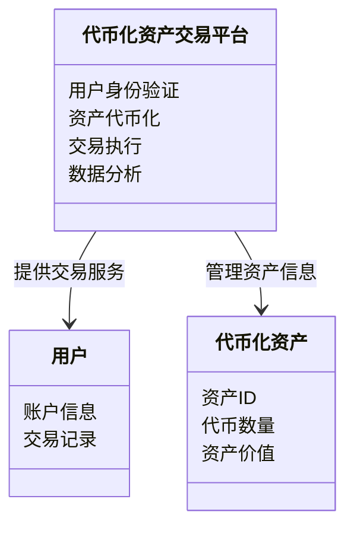
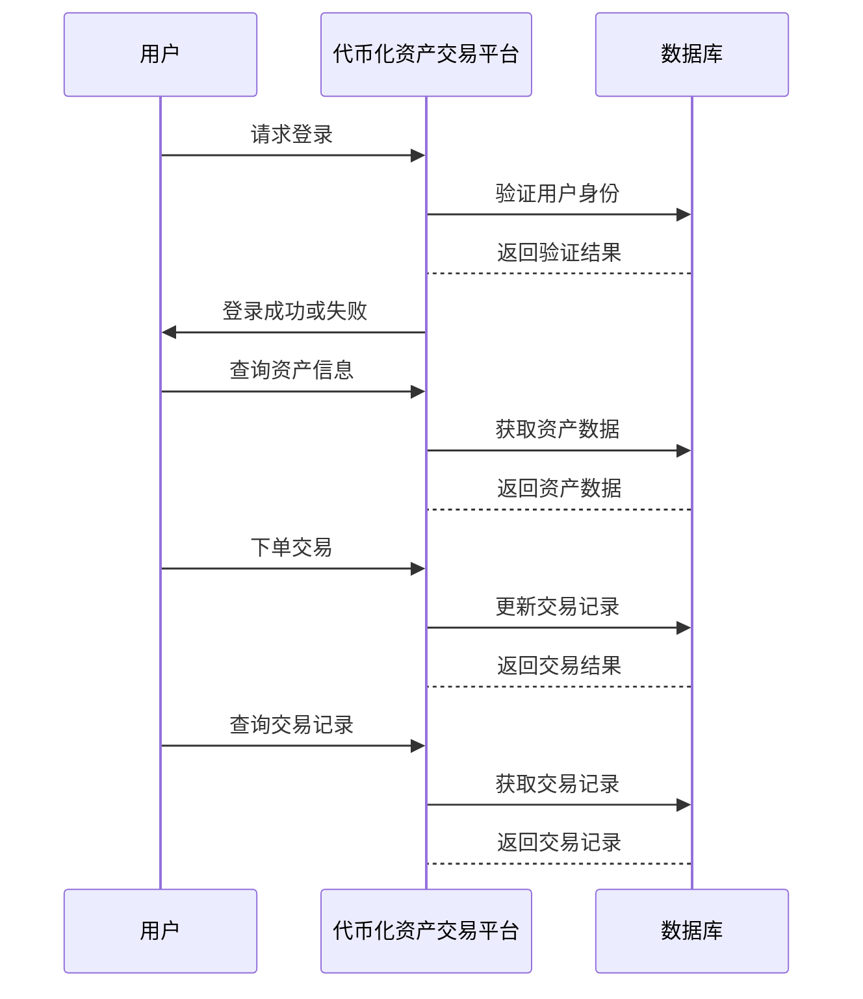

                 


# 如何将特价股票策略应用于代币化资产投资

---

## 关键词

- 特价股票策略
- 代币化资产
- 投资策略
- 区块链技术
- 数学模型
- 算法实现

---

## 摘要

本文详细探讨如何将特价股票策略应用于代币化资产投资中。通过分析代币化资产的特点、优势以及与传统股票的差异，结合特价股票策略的核心原理，构建数学模型和算法，设计代币化资产交易平台，并通过具体案例展示策略的实际应用。本文还将介绍系统架构设计、项目实战、风险管理及心理因素等关键内容，为读者提供全面的指导和见解。

---

## 第一部分：特价股票策略与代币化资产投资基础

### 第1章：特价股票策略概述

#### 1.1 特价股票策略的定义与特点

##### 1.1.1 特价股票的定义
特价股票是指在特定时间内以低于市场价出售的股票，通常用于吸引投资者或清理库存。其特点包括价格优势、短期性以及较高的市场波动性。

##### 1.1.2 特价股票策略的核心特点
- **价格优势**：特价股票通常价格较低，吸引投资者。
- **短期性**：特价股票往往限时提供，促使投资者迅速决策。
- **市场波动性**：特价股票的供应量有限，可能导致价格波动。

##### 1.1.3 特价股票策略的适用场景
- **市场低迷期**：投资者可能利用特价股票策略在市场低迷时低价买入。
- **市场波动期**：在市场波动较大时，特价股票策略可以帮助投资者快速调整仓位。

#### 1.2 代币化资产投资的基本概念

##### 1.2.1 代币化资产的定义
代币化资产是指通过区块链技术将传统资产（如股票、房地产等）转化为数字代币，具有可分割性、可编程性和透明性。

##### 1.2.2 代币化资产与传统资产的区别
| 特性 | 代币化资产 | 传统资产 |
|------|------------|-----------|
| 可分割性 | 高 | 低 |
| 可编程性 | 高 | 低 |
| 透明性 | 高 | 低 |
| 交易效率 | 高 | 低 |

##### 1.2.3 代币化资产投资的优势与挑战
- **优势**：高效性、透明性、可编程性。
- **挑战**：市场波动大、监管不确定性、技术风险。

#### 1.3 特价股票策略与代币化资产投资的结合

##### 1.3.1 特价股票策略在代币化资产投资中的应用
通过代币化技术，特价股票可以更高效地流通和交易，投资者可以更灵活地进行资产配置。

##### 1.3.2 代币化资产投资中的特价股票策略特点
- **高效性**：代币化资产的交易效率高，适合快速执行特价股票策略。
- **透明性**：区块链技术确保交易透明，便于投资者监控和调整策略。

##### 1.3.3 代币化资产投资中的策略优化
通过数据分析和算法优化，可以进一步提升特价股票策略的执行效率和收益。

---

## 第二部分：特价股票策略在代币化资产投资中的应用

### 第3章：特价股票策略的数学模型与算法

#### 3.1 特价股票策略的数学模型

##### 3.1.1 特价股票策略的基本假设
- 市场存在短期价格波动，投资者可以通过低价买入高价卖出获利。
- 代币化资产的流动性较高，适合快速交易。

##### 3.1.2 特价股票策略的数学公式
$$
\text{收益} = \text{卖出价格} - \text{买入价格}
$$

##### 3.1.3 特价股票策略的优化与改进
通过动态调整买入和卖出价格，可以进一步提高策略的收益。

#### 3.2 特价股票策略的算法实现

##### 3.2.1 算法的步骤分解
1. 数据获取：收集代币化资产的价格数据。
2. 策略触发：当价格低于某一阈值时，执行买入操作。
3. 策略执行：持有代币化资产直到价格回升，然后卖出获利。

##### 3.2.2 算法实现的代码示例

```python
import pandas as pd
import numpy as np

# 示例数据
data = pd.DataFrame({
    'price': [100, 98, 95, 102, 105],
    'time': [1, 2, 3, 4, 5]
})

# 确定买入阈值
buy_threshold = 95

# 执行策略
buy_prices = data[data['price'] <= buy_threshold]
sell_prices = data[data['price'] > buy_threshold]

# 计算收益
if not buy_prices.empty and not sell_prices.empty:
    buy_price = buy_prices.iloc[0]['price']
    sell_price = sell_prices.iloc[0]['price']
    profit = sell_price - buy_price
else:
    profit = 0

print(f"买入价格：{buy_price}, 卖出价格：{sell_price}, 收益：{profit}")
```

---

### 第4章：代币化资产交易系统的架构设计

#### 4.1 项目介绍
代币化资产交易系统旨在提供一个高效、透明的交易平台，支持投资者执行特价股票策略。

#### 4.2 系统功能设计

##### 4.2.1 领域模型


#### 4.3 系统架构设计

##### 4.3.1 系统架构图
```mermaid
container 代币化资产交易平台 {
    component 用户界面 {
        登录/注册
        资产浏览
        交易执行
    }
    component 后端服务 {
        用户认证
        资产管理
        交易处理
    }
    component 数据库 {
        用户数据
        资产数据
        交易记录
    }
}
```

#### 4.4 系统接口设计

##### 4.4.1 API 接口
- `/api/login`：用户登录
- `/api/assets`：获取代币化资产信息
- `/api/trade`：执行交易

#### 4.5 系统交互设计



---

## 第五部分：项目实战与总结

### 第5章：项目实战

#### 5.1 环境安装

##### 5.1.1 安装 Python 环境
```bash
python -m pip install --upgrade pip
pip install pandas numpy matplotlib
```

#### 5.2 系统核心实现

##### 5.2.1 数据获取与处理
```python
import pandas as pd
import numpy as np

# 获取代币化资产价格数据
data = pd.read_csv('tokenized_assets.csv')

# 数据清洗与预处理
data.dropna(inplace=True)
data['price'] = data['price'].astype(float)
```

##### 5.2.2 策略实现
```python
# 定义特价股票策略函数
def execute_strategy(data, buy_threshold):
    buy_signal = data['price'] <= buy_threshold
    sell_signal = data['price'].shift(-1) > data['price']
    
    buy_price = data[buy_signal]['price'].iloc[0]
    sell_price = data[sell_signal]['price'].iloc[0]
    
    return sell_price - buy_price

# 执行策略并计算收益
profit = execute_strategy(data, 95)
print(f"策略收益：{profit}")
```

#### 5.3 案例分析

##### 5.3.1 案例背景
假设我们有一个代币化资产的价格数据，希望通过特价股票策略进行投资。

##### 5.3.2 数据分析与策略执行
```python
# 分析数据并执行策略
data = pd.DataFrame({
    'price': [100, 98, 95, 102, 105],
    'time': [1, 2, 3, 4, 5]
})

profit = execute_strategy(data, 95)
print(f"策略收益：{profit}")
```

##### 5.3.3 结果解读
策略在数据点3（价格95）买入，在数据点4（价格102）卖出，获得收益7。

---

### 第6章：高级话题与最佳实践

#### 6.1 风险管理

##### 6.1.1 风险管理的重要性
在代币化资产投资中，风险管理是确保策略稳健的关键。

##### 6.1.2 风险管理的具体措施
- 设置止损点
- 分散投资
- 定期评估策略

#### 6.2 心理因素

##### 6.2.1 投资者心理与策略执行
投资者的心理因素如贪婪和恐惧会影响策略执行。

##### 6.2.2 应对市场情绪的方法
- 保持冷静
- 遵循策略
- 定期复盘

#### 6.3 法律与合规性

##### 6.3.1 代币化资产的法律环境
了解当地的法律法规，确保投资活动的合规性。

##### 6.3.2 合规性的重要性
合规性是长期投资的基础，避免法律风险。

---

## 第七部分：总结与展望

### 第7章：总结与展望

#### 7.1 核心内容回顾
本文详细探讨了如何将特价股票策略应用于代币化资产投资，从理论到实践，提供了全面的指导。

#### 7.2 未来展望
随着区块链技术的发展，代币化资产投资将更加普及，特价股票策略的应用也将更加广泛。

---

## 附录

### 附录 A：术语表

| 术语 | 定义 |
|------|------|
| 代币化资产 | 通过区块链技术将传统资产转化为数字代币 |
| 特价股票 | 在特定时间内以低于市场价出售的股票 |

---

## 作者

作者：AI天才研究院/AI Genius Institute & 禅与计算机程序设计艺术 /Zen And The Art of Computer Programming

