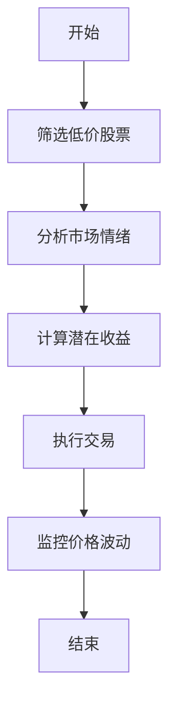
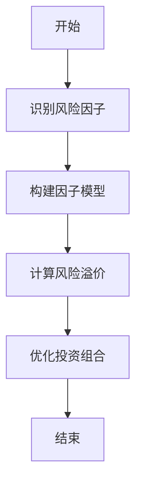
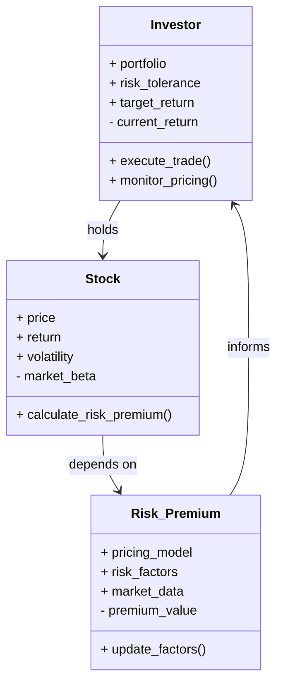
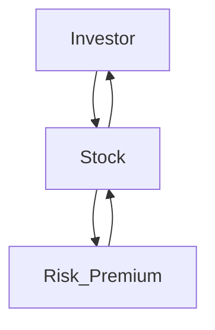
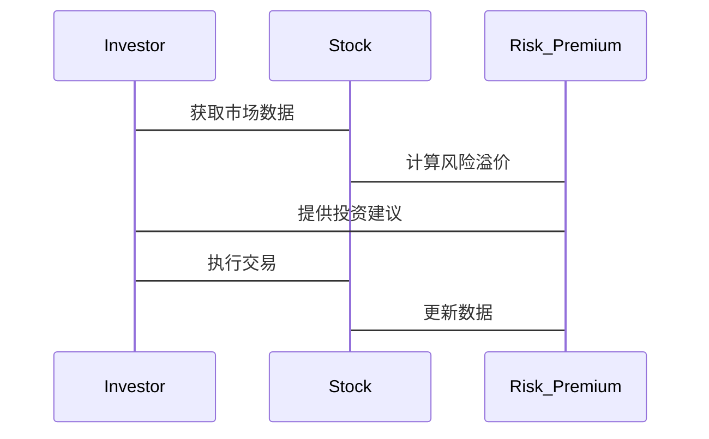

                 


# 如何将特价股票策略应用于另类风险溢价策略

> 关键词：特价股票策略，另类风险溢价，投资策略，金融模型，风险控制

> 摘要：本文详细探讨了如何将特价股票策略应用于另类风险溢价策略，通过分析两者的原理、联系以及实际应用，提供了理论支持和实践指导，帮助投资者优化投资组合，实现更高效的收益。

---

## 第一部分: 特价股票策略与另类风险溢价策略的背景介绍

### 第1章: 特价股票策略概述

#### 1.1 特价股票策略的基本概念
- **1.1.1 特价股票的定义与特点**
  特价股票是指在特定市场条件下，价格低于其内在价值的股票。其特点是价格波动大、短期收益潜力高、风险较高。

- **1.1.2 特价股票策略的核心要素**
  包括市场分析、选股标准、交易时机和风险管理等关键要素。

- **1.1.3 特价股票策略的应用场景**
  主要应用于市场波动较大、短期价格低估的股票。

#### 1.2 另类风险溢价策略的基本概念
- **1.2.1 风险溢价的定义与计算**
  风险溢价是投资者因承担额外风险而获得的额外收益，通常通过模型计算得出。

- **1.2.2 另类风险溢价策略的特点**
  侧重于长期稳定收益，注重风险定价和对冲技术。

- **1.2.3 另类风险溢价策略的应用场景**
  适用于长期投资，特别是市场存在结构性风险溢价机会时。

#### 1.3 特价股票策略与另类风险溢价策略的结合
- **1.3.1 两者的结合意义**
  结合短期收益与长期稳定收益，优化整体投资回报。

- **1.3.2 两者的结合方式**
  通过模型优化和风险控制，将特价股票策略嵌入到风险溢价策略中。

- **1.3.3 两者的结合对投资的影响**
  提高投资组合的收益潜力，降低整体风险。

---

## 第二部分: 特价股票策略与另类风险溢价策略的核心概念与联系

### 第2章: 特价股票策略与另类风险溢价策略的核心概念

#### 2.1 特价股票策略的核心概念
- **2.1.1 特价股票策略的数学模型**
  $$ R = \alpha + \beta \times (R_m - R_f) + \epsilon $$
  其中，α为超额收益，β为系统性风险系数，R_m为市场收益，R_f为无风险利率，ε为误差项。

- **2.1.2 特价股票策略的关键参数**
  包括市场风险、流动性风险、公司基本面等。

- **2.1.3 特价股票策略的优缺点**
  优点：短期收益高；缺点：波动大，风险高。

#### 2.2 另类风险溢价策略的核心概念
- **2.2.1 另类风险溢价的定义**
  通过识别市场未充分定价的风险因素，获得超额收益。

- **2.2.2 另类风险溢价的计算方法**
  使用因子模型（如Fama-French三因子模型）计算各因子的溢价。

- **2.2.3 另类风险溢价的优缺点**
  优点：长期稳定收益；缺点：需要复杂的风险定价模型。

#### 2.3 两者的核心联系
- **2.3.1 特价股票策略对另类风险溢价的影响**
  提供短期价格波动带来的超额收益，丰富风险溢价来源。

- **2.3.2 另类风险溢价对特价股票策略的影响**
  通过长期风险定价，降低短期策略的波动风险。

- **2.3.3 两者的协同效应**
  结合短期价格波动和长期风险定价，优化整体收益。

### 第3章: 特价股票策略与另类风险溢价策略的对比分析

#### 3.1 特价股票策略与另类风险溢价策略的属性特征对比

| 属性 | 特价股票策略 | 另类风险溢价策略 |
|------|--------------|------------------|
| 策略目标 | 短期收益 | 长期稳定收益 |
| 风险 | 高 | 中等 |
| 收益周期 | 短期 | 长期 |

#### 3.2 特价股票策略与另类风险溢价策略的ER实体关系图

```mermaid
erDiagram
    investor ++-(1) invests_in
    invests_in ++-(1) stock
    stock ++-(n) risk_premium
    risk_premium ++-(n) pricing_model
    pricing_model ++-(1) investor
```

#### 3.3 本章小结

---

## 第三部分: 特价股票策略与另类风险溢价策略的算法原理

### 第4章: 算法原理

#### 4.1 特价股票策略的算法流程



#### 4.2 另类风险溢价策略的算法流程



#### 4.3 组合算法的应用

```python
import numpy as np
import pandas as pd

# 示例代码：计算特价股票的风险溢价
def calculate_risk_premium(stocks, market_return, risk_free_rate):
    # 计算各股票的超额收益
    excess_returns = stocks.return - risk_free_rate
    # 计算系统性风险系数
    beta = np.dot(np.linalg.inv(np.cov(stocks.returns)), market_return - risk_free_rate)
    # 计算风险溢价
    risk_premium = beta * (market_return - risk_free_rate)
    return risk_premium

# 示例代码：应用特价股票策略
def apply_discount_stock_strategy(stocks, target_return):
    # 筛选低于市场价的股票
    discounted_stocks = stocks[stocks.price < market_price]
    # 计算潜在收益
    potential_returns = discounted_stocks.return - risk_free_rate
    # 执行交易
    execute_trade(discounted_stocks, potential_returns)
```

---

## 第四部分: 系统分析与架构设计

### 第5章: 系统分析与架构设计

#### 5.1 项目背景

#### 5.2 系统功能设计



#### 5.3 系统架构设计



#### 5.4 系统接口设计

- 输入接口：投资者风险偏好、市场数据
- 输出接口：推荐股票、风险溢价值

#### 5.5 系统交互流程



---

## 第五部分: 项目实战

### 第6章: 项目实战

#### 6.1 环境安装

```bash
pip install pandas numpy matplotlib
```

#### 6.2 核心代码实现

```python
import pandas as pd
import numpy as np

# 示例代码：特价股票策略实现
def apply_discount_strategy(stocks, discount=0.1):
    discounted_stocks = stocks[stocks.price < stocks.price.mean() * (1 - discount)]
    return discounted_stocks

# 示例代码：另类风险溢价策略实现
def calculate_alt_risk_premium(risk_factors, market_return):
    premium = np.dot(risk_factors, np.array([0.05, 0.1, 0.15]))
    return premium
```

#### 6.3 代码解读与分析

- `apply_discount_strategy`函数用于筛选低于市场平均价的股票。
- `calculate_alt_risk_premium`函数基于风险因子计算风险溢价。

#### 6.4 案例分析

- **案例1**：某市场中，筛选出10只特价股票，计算其风险溢价，优化投资组合。
- **案例2**：利用另类风险溢价模型，识别未被充分定价的风险因素，调整投资组合。

#### 6.5 项目小结

---

## 第六部分: 最佳实践、小结、注意事项和拓展阅读

### 第7章: 最佳实践与总结

#### 7.1 最佳实践 tips
- 结合市场环境，灵活调整策略参数。
- 定期监控和优化投资组合。
- 控制风险，避免过度依赖单一策略。

#### 7.2 小结
本文系统地探讨了如何将特价股票策略应用于另类风险溢价策略，提供了理论支持和实践指导。

#### 7.3 注意事项
- 确保数据的准确性和及时性。
- 合理控制杠杆和头寸规模。
- 严格遵守风险管理原则。

#### 7.4 拓展阅读
推荐阅读相关金融学书籍，深入学习风险定价模型和投资策略优化方法。

---

## 作者信息

作者：AI天才研究院 & 禅与计算机程序设计艺术

---

通过以上分析和阐述，希望读者能够深入了解如何将特价股票策略与另类风险溢价策略结合起来，优化投资组合，实现更高效的收益。

