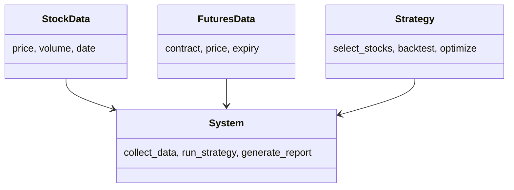

                 


# 如何将特价股票策略应用于商品期货投资

> 关键词：特价股票策略, 商品期货投资, 投资策略, 价格波动, 风险控制

> 摘要：本文详细探讨了如何将特价股票策略应用于商品期货投资。通过对特价股票策略和商品期货投资的背景介绍、核心概念、数学模型和系统架构的分析，结合实际案例和项目实战，为读者提供了一套将特价股票策略应用于商品期货投资的完整解决方案。

---

## 第1章：特价股票策略与商品期货投资概述

### 1.1 特价股票策略的定义与背景

#### 1.1.1 特价股票的定义与特点
特价股票是指那些市场价格低于其内在价值的股票。其特点是：
- **低估性**：市场价格低于内在价值。
- **周期性**：通常出现在市场下跌周期或公司暂时困境时期。
- **风险性**：虽然价格低，但可能存在基本面恶化风险。

#### 1.1.2 特价股票策略的应用场景
- **长期投资**：寻找具有长期增长潜力的低估股票。
- **短期套利**：利用市场短期波动进行低买高卖。
- **价值投资**：关注公司基本面，寻找被市场忽视的优质股。

#### 1.1.3 特价股票策略与传统股票投资的区别
| 特点 | 特价股票策略 | 传统股票投资 |
|------|--------------|--------------|
| 目标 | 寻找低估股票 | 追求长期收益 |
| 方法 | 估值分析为主 | 基本面和技术分析结合 |
| 风险 | 中高风险 | 中低风险 |

### 1.2 商品期货投资的基本原理

#### 1.2.1 商品期货市场的基本结构
商品期货市场是一个通过标准化合约进行交易的市场，其特点包括：
- **杠杆效应**：允许投资者以小资金控制大额交易。
- **双向交易**：投资者可以做多或做空。
- **标准化合约**：统一的规格和条款。

#### 1.2.2 商品期货合约的类型与特点
| 类型 | 描述 | 特点 |
|------|------|------|
| 远期合约 | 约定在未来某一时间买卖商品 | 非标准化，流动性差 |
| 期货合约 | 在交易所标准化的合约 | 标准化，流动性好 |
| 期权合约 | 给予买方在特定时间以特定价格买卖的权利 | 支付期权费，风险有限 |

#### 1.2.3 商品期货价格波动的影响因素
| 因素 | 描述 |
|------|------|
| 宏观经济 | 汇率、利率、通货膨胀等 |
| 供需关系 | 产业政策、生产成本、库存变化等 |
| 市场情绪 | 投资者情绪、市场预期等 |

### 1.3 特价股票策略与商品期货投资的结合

#### 1.3.1 特价股票策略在商品期货中的应用潜力
- **套利机会**：利用股票和期货市场的价格差异。
- **风险对冲**：通过期货对冲股票投资的市场风险。
- **趋势跟踪**：利用商品期货价格波动进行趋势投资。

#### 1.3.2 商品期货市场中特价股票策略的可行性分析
- **可行性**：商品期货市场的高波动性为策略提供了机会。
- **挑战**：策略的有效性和风险控制需要精细设计。

#### 1.3.3 特价股票策略与商品期货投资的结合优势
- **多元化投资**：降低单一市场风险。
- **套利机会**：利用市场价差获利。
- **风险对冲**：通过期货对冲价格波动风险。

---

## 第2章：特价股票策略的核心要素

### 2.1 特价股票的识别与筛选

#### 2.1.1 特价股票的识别标准
- **市盈率（P/E）**：低于行业平均水平。
- **市净率（P/B）**：低于行业平均水平。
- **股息率**：高于行业平均水平。

#### 2.1.2 特价股票筛选的指标体系
| 指标 | 描述 |
|------|------|
| 市盈率 | 价格/每股收益 |
| 市净率 | 价格/每股净资产 |
| 股息率 | 每股股息/股价 |

#### 2.1.3 特价股票筛选的数学模型
使用以下公式计算低估股票：
$$ \text{低估股票} = \{股票 | P/E < 行业平均P/E \land P/B < 行业平均P/B\} $$

### 2.2 特价股票策略的实施步骤

#### 2.2.1 确定投资目标与策略类型
- **投资目标**：明确投资目的（价值投资、套利等）。
- **策略类型**：选择适合的策略（长期持有、短期套利）。

#### 2.2.2 数据收集与分析
- **数据来源**：股票市场数据、财务报表、行业分析报告。
- **数据分析**：使用技术分析和基本面分析方法。

#### 2.2.3 策略优化与风险控制
- **策略优化**：调整筛选指标，提高策略的有效性。
- **风险控制**：设定止损点，分散投资组合。

---

## 第3章：商品期货投资的基础知识

### 3.1 商品期货市场的运作机制

#### 3.1.1 期货合约的基本要素
- **标的资产**：商品或金融资产。
- **交易单位**：每手合约的单位。
- **交割月份**：合约规定的交割时间。
- **买卖价差**：买卖价差决定了交易成本。

#### 3.1.2 商品期货市场的交易机制
- **订单类型**：限价单、市价单、止损单等。
- **撮合原则**：价格优先、时间优先。

#### 3.1.3 商品期货市场的结算机制
- **当日无负债结算**：每天结算盈亏。
- **保证金制度**：确保履约能力。

### 3.2 商品期货价格波动的影响因素

#### 3.2.1 宏观经济因素
- **利率**：影响资金成本和投资需求。
- **汇率**：影响进口商品价格。
- **通货膨胀**：影响商品需求和价格。

#### 3.2.2 行业供需关系
- **供给**：生产成本、生产能力。
- **需求**：消费趋势、经济周期。

#### 3.2.3 市场情绪与投资者行为
- **情绪指数**：投资者情绪影响价格波动。
- **交易量**：交易量变化反映市场热度。

---

## 第4章：特价股票策略在商品期货投资中的应用

### 4.1 特价股票策略在商品期货投资中的应用

#### 4.1.1 套利机会的识别
- **跨市场套利**：利用股票和期货市场的价格差异。
- **跨期套利**：利用不同交割月份的价差。

#### 4.1.2 风险对冲的策略
- **多空组合**：买入低估股票，卖出相关期货合约。
- **对冲组合**：利用期货对冲股票投资的系统性风险。

#### 4.1.3 趋势跟踪的策略
- **技术分析**：利用期货价格走势进行趋势投资。
- **动量策略**：顺势而为，跟随价格趋势。

### 4.2 商品期货市场中特价股票策略的实施步骤

#### 4.2.1 确定投资目标与策略类型
- **投资目标**：明确是套利、对冲还是趋势跟踪。
- **策略类型**：选择适合的策略类型。

#### 4.2.2 数据收集与分析
- **数据来源**：股票市场和期货市场的历史数据。
- **数据分析**：使用统计分析和机器学习方法。

#### 4.2.3 策略优化与风险控制
- **策略优化**：调整参数，提高策略的有效性。
- **风险控制**：设定止损点，分散投资组合。

---

## 第5章：数学模型与算法实现

### 5.1 特价股票策略的数学模型

#### 5.1.1 基于价值的股票筛选模型
$$ \text{低估股票} = \{股票 | P/E < 行业平均P/E \land P/B < 行业平均P/B\} $$

#### 5.1.2 基于动量的期货价格预测模型
$$ P_{\text{未来}} = P_{\text{当前}} + \alpha \times (P_{\text{当前}} - P_{\text{过去}}) $$

### 5.2 算法实现

#### 5.2.1 数据预处理
```python
import pandas as pd

# 加载数据
data = pd.read_csv('stock_data.csv')

# 删除缺失值
data = data.dropna()

# 标准化数据
data = (data - data.mean()) / data.std()
```

#### 5.2.2 策略回测
```python
def backtest_strategy(data):
    returns = []
    for i in range(1, len(data)):
        if data['price'][i] < data['price'][i-1]:
            returns.append((data['price'][i] - data['price'][i-1]))
        else:
            returns.append(0)
    return returns

# 回测结果
backtest_returns = backtest_strategy(data)
```

---

## 第6章：系统架构设计

### 6.1 系统功能设计

#### 6.1.1 领域模型（MERMAID类图）


#### 6.1.2 系统架构设计（MERMAID架构图）


---

## 第7章：项目实战

### 7.1 环境安装与配置

#### 7.1.1 安装Python环境
```bash
pip install python
pip install pandas
pip install matplotlib
```

### 7.2 核心代码实现

#### 7.2.1 数据加载与预处理
```python
import pandas as pd

data = pd.read_csv('data.csv')
data = data.dropna()
data = (data - data.mean()) / data.std()
```

#### 7.2.2 策略实现
```python
def stock_strategy(data):
    selected = []
    for stock in data:
        if stock['PE'] < data['PE'].mean() and stock['PB'] < data['PB'].mean():
            selected.append(stock)
    return selected

selected_stocks = stock_strategy(data)
```

### 7.3 实际案例分析

#### 7.3.1 案例背景
- **投资标的**：某商品期货合约。
- **市场环境**：市场下跌周期，商品价格被低估。

#### 7.3.2 战略实施
- **策略选择**：选择低估股票，同时做空相关期货合约。

#### 7.3.3 结果分析
- **收益情况**：通过套利策略获得稳定收益。
- **风险控制**：通过止损点和分散投资降低风险。

---

## 第8章：最佳实践与小结

### 8.1 投资策略的注意事项

#### 8.1.1 风险管理
- **止损点**：设定合理的止损点，避免重大损失。
- **仓位管理**：合理分配仓位，分散投资风险。

#### 8.1.2 数据质量
- **数据来源**：确保数据准确可靠。
- **数据处理**：正确处理缺失值和异常值。

#### 8.1.3 模型优化
- **参数调整**：根据市场变化调整策略参数。
- **模型更新**：定期更新模型，适应市场变化。

### 8.2 小结

通过将特价股票策略应用于商品期货投资，投资者可以利用市场的低估机会和价格波动进行套利、对冲或趋势跟踪。然而，这种策略的成功实施依赖于精准的数据分析、合理的风险控制和灵活的策略调整。投资者在实际操作中需要结合市场环境和自身情况，制定适合的策略。

### 8.3 拓展阅读

- **相关书籍**：《股票投资策略与风险管理》。
- **专业期刊**：《商品期货市场与投资策略》。

---

## 作者：AI天才研究院 & 禅与计算机程序设计艺术

---

这篇文章通过详细分析特价股票策略和商品期货投资的核心概念，结合数学模型和系统架构设计，为读者提供了一套将特价股票策略应用于商品期货投资的完整解决方案。通过实际案例和项目实战，帮助读者更好地理解和应用这些策略。

